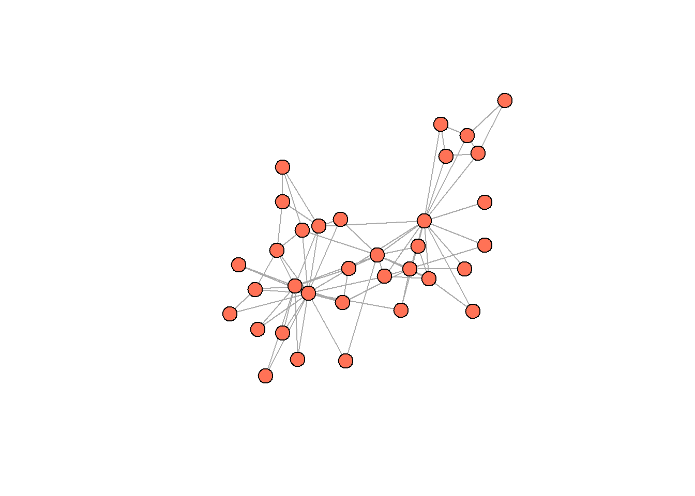
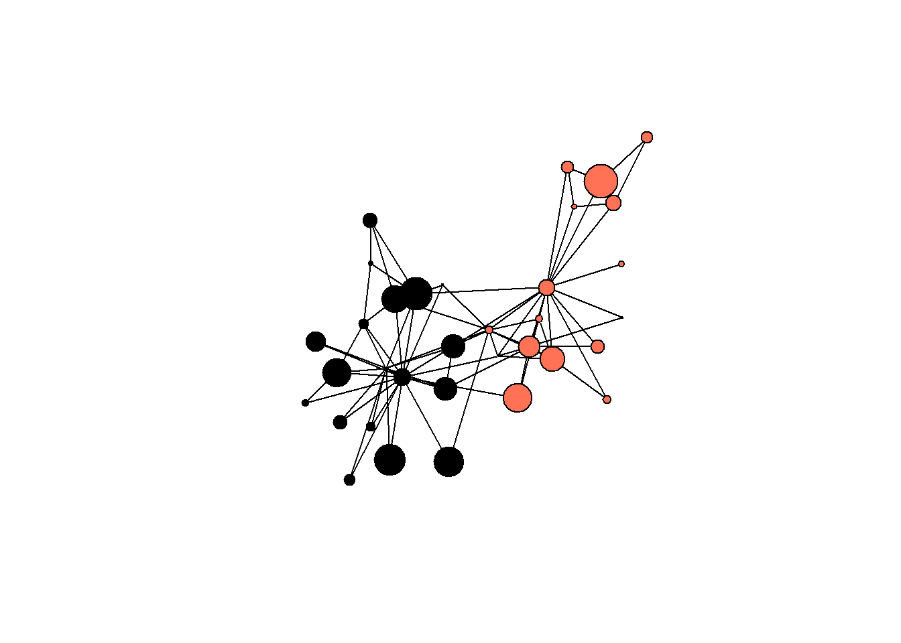
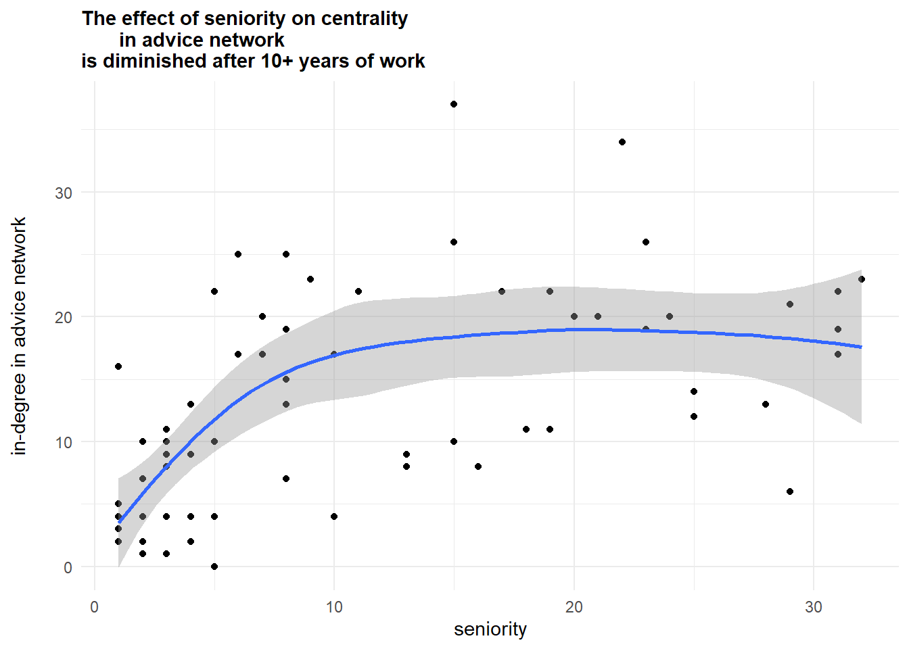

# (PART\*) **Seminars** {-}


# **1 - Intro** {-}


The notes below accompany the first lecture of the course. It might be a good idea to consult the [lecture slides]{style="color: red;"} as well, as some technical details and examples are discussed there.


During today's meeting we are going to cover the very basics of doing network analysis in R. Relying on commonly used `igraph` package for data manipulation, we would learn about typical network data formats (edgelists, nodelists, and matrices) and how to convert them to (and from) typical tabular formats, and ways to manipulate and refer to edges and nodes of the constructed networks. We will also make our first attempts at analysis of the two exemplar datasets. After this session, you will be prepared for more concrete discussions of the network-related topics.


## **Libraries** {-}


The main library we would rely on throughout the course is `igraph`. It provides the functions to create, visualize, and analyze network data. The complete documentation for `igraph` is available via [its official webpage](https://igraph.org/){style="color: blue;"} and the section devoted to the [R implementation](https://igraph.org/r/html/1.2.6/){style="color: blue;"}.


``` r
# load missing packages:
#install.packages("igraph")
#install.packages("intergraph")
#install.packages("manynet")

library(tidyverse)    ## general framework to work in R
library(igraph)       ## general package for network analysis
library(intergraph)   ## convert from df to graph-objects and vice versa;
                      ## also helpful to convert "igraph" to "network" format
library(manynet)      ## datasets
```


## **Common data structures and procedures** {-}


Networks are typically represented using two primary data formats. The first is an **adjacency matrix**, a square matrix where rows and columns represent nodes, and the cell values indicate the presence or weight of a tie between them. The second common format is an **edgelist**, which is a simple two-column list recording each connection as a pair of node identifiers. Often, an edgelist is accompanied by a separate **nodelist** that contains additional attributes for each node, such as names, gender, age, affiliations, etc. Matrices are efficient for dense, small networks and mathematical operations, while edgelists are more intuitive and memory-efficient for storing large, sparse networks. Altough we would not use matrices a lot, it is still important to think of such representations of your data during our further workshops (e.g., when we would discuss blockmodels).


Below is an image of the network obtained from Zachary's (1977) study (we will get to constructing such network objects and visualizations later, for now it is useful just to see this image). Here is the data description as given in the `manynet` package:

> The network was observed in a university Karate club in 1977. The network describes association patterns among 34 members and maps out allegiance patterns between members and either Mr. Hi, the instructor, or the John A. the club president after an argument about hiking the price for lessons. The allegiance of each node is listed in the obc argument which takes the value 1 if the individual sided with Mr. Hi after the fight and 2 if the individual sided with John A.


Now, let's look at the ways of representing this data. The `igraph` package provides simple functions to convert its network objects into standard data formats. You can transform a network to a matrix using the `as_adjacency_matrix()` function, which will create a square matrix representation. Each row/column here represents the person who sends the ties to the others (ties either exist, 1, or not, 0). Note that the diagonal of these matrix is filled with empty values, - it is common for network analysis that we do not want to record self-references, as they do not make sense (alhough there are cases when it is useful).


The `as_adj()` function also works.


``` r
## the object `ison_karateka` is available via "manynet" package,
## and it is just an "igraph" object representing a network.
## we will discuss it below, just focus on data formats for now:

## matrix:
ison_karateka %>% 
  as_adjacency_matrix()
#> 34 x 34 sparse Matrix of class "dgCMatrix"
#>   [[ suppressing 34 column names 'Mr Hi', '2', '3' ... ]]
#>                                                           
#> Mr Hi  . 1 1 1 1 1 1 1 1 . 1 1 1 1 . . . 1 . 1 . 1 . . . .
#> 2      1 . 1 1 . . . 1 . . . . . 1 . . . 1 . 1 . 1 . . . .
#> 3      1 1 . 1 . . . 1 1 1 . . . 1 . . . . . . . . . . . .
#> 4      1 1 1 . . . . 1 . . . . 1 1 . . . . . . . . . . . .
#> 5      1 . . . . . 1 . . . 1 . . . . . . . . . . . . . . .
#> 6      1 . . . . . 1 . . . 1 . . . . . 1 . . . . . . . . .
#> 7      1 . . . 1 1 . . . . . . . . . . 1 . . . . . . . . .
#> 8      1 1 1 1 . . . . . . . . . . . . . . . . . . . . . .
#> 9      1 . 1 . . . . . . . . . . . . . . . . . . . . . . .
#> 10     . . 1 . . . . . . . . . . . . . . . . . . . . . . .
#> 11     1 . . . 1 1 . . . . . . . . . . . . . . . . . . . .
#> 12     1 . . . . . . . . . . . . . . . . . . . . . . . . .
#> 13     1 . . 1 . . . . . . . . . . . . . . . . . . . . . .
#> 14     1 1 1 1 . . . . . . . . . . . . . . . . . . . . . .
#> 15     . . . . . . . . . . . . . . . . . . . . . . . . . .
#> 16     . . . . . . . . . . . . . . . . . . . . . . . . . .
#> 17     . . . . . 1 1 . . . . . . . . . . . . . . . . . . .
#> 18     1 1 . . . . . . . . . . . . . . . . . . . . . . . .
#> 19     . . . . . . . . . . . . . . . . . . . . . . . . . .
#> 20     1 1 . . . . . . . . . . . . . . . . . . . . . . . .
#> 21     . . . . . . . . . . . . . . . . . . . . . . . . . .
#> 22     1 1 . . . . . . . . . . . . . . . . . . . . . . . .
#> 23     . . . . . . . . . . . . . . . . . . . . . . . . . .
#> 24     . . . . . . . . . . . . . . . . . . . . . . . . . 1
#> 25     . . . . . . . . . . . . . . . . . . . . . . . . . 1
#> 26     . . . . . . . . . . . . . . . . . . . . . . . 1 1 .
#> 27     . . . . . . . . . . . . . . . . . . . . . . . . . .
#> 28     . . 1 . . . . . . . . . . . . . . . . . . . . 1 1 .
#> 29     . . 1 . . . . . . . . . . . . . . . . . . . . . . .
#> 30     . . . . . . . . . . . . . . . . . . . . . . . 1 . .
#> 31     . 1 . . . . . . 1 . . . . . . . . . . . . . . . . .
#> 32     1 . . . . . . . . . . . . . . . . . . . . . . . 1 1
#> 33     . . 1 . . . . . 1 . . . . . 1 1 . . 1 . 1 . 1 1 . .
#> John A . . . . . . . . 1 1 . . . 1 1 1 . . 1 1 1 . 1 1 . .
#>                       
#> Mr Hi  . . . . . 1 . .
#> 2      . . . . 1 . . .
#> 3      . 1 1 . . . 1 .
#> 4      . . . . . . . .
#> 5      . . . . . . . .
#> 6      . . . . . . . .
#> 7      . . . . . . . .
#> 8      . . . . . . . .
#> 9      . . . . 1 . 1 1
#> 10     . . . . . . . 1
#> 11     . . . . . . . .
#> 12     . . . . . . . .
#> 13     . . . . . . . .
#> 14     . . . . . . . 1
#> 15     . . . . . . 1 1
#> 16     . . . . . . 1 1
#> 17     . . . . . . . .
#> 18     . . . . . . . .
#> 19     . . . . . . 1 1
#> 20     . . . . . . . 1
#> 21     . . . . . . 1 1
#> 22     . . . . . . . .
#> 23     . . . . . . 1 1
#> 24     . 1 . 1 . . 1 1
#> 25     . 1 . . . 1 . .
#> 26     . . . . . 1 . .
#> 27     . . . 1 . . . 1
#> 28     . . . . . . . 1
#> 29     . . . . . 1 . 1
#> 30     1 . . . . . 1 1
#> 31     . . . . . . 1 1
#> 32     . . 1 . . . 1 1
#> 33     . . . 1 1 1 . 1
#> John A 1 1 1 1 1 1 1 .

#ison_karateka %>% 
#  as_adj()
```


To get an edgelist, you can use the `as_edgelist()` function, which returns a table with two columns. Variable `from` refers to the sender of the tie, and `to` refers to the tie receiver. `weight` stands for the strength of the relations among the two persons.


``` r
## edgelist:
ison_karateka %>% 
  as_edgelist()
#> # A tibble: 78 × 3
#>    from  to    weight
#>    <chr> <chr>  <dbl>
#>  1 Mr Hi 2          4
#>  2 Mr Hi 3          5
#>  3 2     3          6
#>  4 Mr Hi 4          3
#>  5 2     4          3
#>  6 3     4          3
#>  7 Mr Hi 5          3
#>  8 Mr Hi 6          3
#>  9 Mr Hi 7          3
#> 10 5     7          2
#> # ℹ 68 more rows
```


For the nodelist, `igraph` is of little help, as it does not have a function for retreiving the data in this format. Though, we can use the function `as_nodelist()` from the `manynet` package. The "name" attribute corresponds to the ids of your nodes from the edgelist, and the "allegiance" is the only additional attribute associated with the nodes.


``` r
## nodelist:
ison_karateka %>% 
  as_nodelist() ## from "manynet"
#> # A tibble: 34 × 2
#>    name  allegiance
#>    <chr>      <dbl>
#>  1 Mr Hi          1
#>  2 2              1
#>  3 3              1
#>  4 4              1
#>  5 5              1
#>  6 6              1
#>  7 7              1
#>  8 8              1
#>  9 9              2
#> 10 10             2
#> # ℹ 24 more rows
```


Another package that allows converting existing "igraph" objects to tabular data formats is `intergraph`. It is achieved via function `asDF()` - the function returns two objects, an edgelist and a nodelist. You can refer to them using $ sign after the function.


``` r
# intergraph::asDF(ison_karateka)

## intergraph::asDF(ison_karateka)$edges
## intergraph::asDF(ison_karateka)$vertex
```


Network objects in `igraph` are complex data structures that encapsulate all network information. In the chunk below, we save the network as an object in our working environment (and call it "karate"). Using `class()` confirms the object's type ("igraph", but you see that it is also suitable for other applications), while `str()` reveals its internal structure, which includes slots for edges, nodes, and their attributes. This specialized class (a list of vectors, in fact) is designed for efficient network computations.


``` r
## load network:
karate <- ison_karateka

class(ison_karateka)
#> [1] "mnet"      "tbl_graph" "igraph"
str(ison_karateka)
#> Classes 'mnet', 'tbl_graph', 'igraph'  hidden list of 10
#>  $ : num 34
#>  $ : logi FALSE
#>  $ : num [1:78] 1 2 2 3 3 3 4 5 6 6 ...
#>  $ : num [1:78] 0 0 1 0 1 2 0 0 0 4 ...
#>  $ : NULL
#>  $ : NULL
#>  $ : NULL
#>  $ : NULL
#>  $ :List of 4
#>   ..$ : num [1:3] 1 0 1
#>   ..$ :List of 4
#>   .. ..$ name : chr "Zachary's karate club network"
#>   .. ..$ nodes: chr "club members"
#>   .. ..$ ties : chr "association"
#>   .. ..$ year : num 1977
#>   ..$ :List of 2
#>   .. ..$ name      : chr [1:34] "Mr Hi" "2" "3" "4" ...
#>   .. ..$ allegiance: num [1:34] 1 1 1 1 1 1 1 1 2 2 ...
#>   ..$ :List of 1
#>   .. ..$ weight: num [1:78] 4 5 6 3 3 3 3 3 3 2 ...
#>  $ :<environment: 0x00000253619060d8> 
#>  - attr(*, "active")= chr "nodes"
```

Next, we use the aforementioned `asDF()` function to deconstruct a network object into two standard data frames: one for edges and one for nodes. You can re-assemble these data frames into a new igraph object using the `graph_from_data_frame()` function from `igraph`.


``` r
## convert to data frames
karate_edges <- (karate %>%
  asDF())$edge

karate_nodes <- (karate %>%
  asDF())$vertex

## igraph output after graph creation:
karate_recreated <- karate_edges %>% 
  graph_from_data_frame(directed = T)

## class(karate_recreated)
## now, as it is pure igraph, network is "printed" in a standard igraph-way:

karate_recreated
#> IGRAPH 5d9277f DNW- 34 78 -- 
#> + attr: name (v/c), weight (e/n)
#> + edges from 5d9277f (vertex names):
#>  [1] 1 ->2  1 ->3  2 ->3  1 ->4  2 ->4  3 ->4  1 ->5  1 ->6 
#>  [9] 1 ->7  5 ->7  6 ->7  1 ->8  2 ->8  3 ->8  4 ->8  1 ->9 
#> [17] 3 ->9  3 ->10 1 ->11 5 ->11 6 ->11 1 ->12 1 ->13 4 ->13
#> [25] 1 ->14 2 ->14 3 ->14 4 ->14 6 ->17 7 ->17 1 ->18 2 ->18
#> [33] 1 ->20 2 ->20 1 ->22 2 ->22 24->26 25->26 3 ->28 24->28
#> [41] 25->28 3 ->29 24->30 27->30 2 ->31 9 ->31 1 ->32 25->32
#> [49] 26->32 29->32 3 ->33 9 ->33 15->33 16->33 19->33 21->33
#> [57] 23->33 24->33 30->33 31->33 32->33 9 ->34 10->34 14->34
#> + ... omitted several edges
```


The critical argument of `graph_from_data_frame()` is "vertices=", which allows you to provide the nodelist, ensuring that all node attributes are correctly reinstated into the new network object:


``` r
## add vertices info:
karate_recreated <- karate_edges %>% 
  graph_from_data_frame(directed = T,
                        vertices = karate_nodes)

karate_recreated
#> IGRAPH 5d97983 DNW- 34 78 -- 
#> + attr: name (v/c), allegiance (v/n), weight (e/n)
#> + edges from 5d97983 (vertex names):
#>  [1] Mr Hi->2  Mr Hi->3  2    ->3  Mr Hi->4  2    ->4 
#>  [6] 3    ->4  Mr Hi->5  Mr Hi->6  Mr Hi->7  5    ->7 
#> [11] 6    ->7  Mr Hi->8  2    ->8  3    ->8  4    ->8 
#> [16] Mr Hi->9  3    ->9  3    ->10 Mr Hi->11 5    ->11
#> [21] 6    ->11 Mr Hi->12 Mr Hi->13 4    ->13 Mr Hi->14
#> [26] 2    ->14 3    ->14 4    ->14 6    ->17 7    ->17
#> [31] Mr Hi->18 2    ->18 Mr Hi->20 2    ->20 Mr Hi->22
#> [36] 2    ->22 24   ->26 25   ->26 3    ->28 24   ->28
#> + ... omitted several edges
```

You can directly access the sets of edges and vertices within a network using the `E()` and `V()` functions, respectively. These functions are primarily used to assign or query attributes associated with the network's elements. For example, the syntax ```{r}V(g)$attribute <- values``` is the standard way to add a new vertex attribute to a network "g". In the next chunk, we assign random values to the "strength" attribute:


``` r
## referring to:
E(karate) ## edges
#> + 78/78 edges from 9e17774 (vertex names):
#>  [1] Mr Hi--2  Mr Hi--3  2    --3  Mr Hi--4  2    --4 
#>  [6] 3    --4  Mr Hi--5  Mr Hi--6  Mr Hi--7  5    --7 
#> [11] 6    --7  Mr Hi--8  2    --8  3    --8  4    --8 
#> [16] Mr Hi--9  3    --9  3    --10 Mr Hi--11 5    --11
#> [21] 6    --11 Mr Hi--12 Mr Hi--13 4    --13 Mr Hi--14
#> [26] 2    --14 3    --14 4    --14 6    --17 7    --17
#> [31] Mr Hi--18 2    --18 Mr Hi--20 2    --20 Mr Hi--22
#> [36] 2    --22 24   --26 25   --26 3    --28 24   --28
#> [41] 25   --28 3    --29 24   --30 27   --30 2    --31
#> [46] 9    --31 Mr Hi--32 25   --32 26   --32 29   --32
#> + ... omitted several edges
V(karate) ## nodes
#> + 34/34 vertices, named, from 9e17774:
#>  [1] Mr Hi  2      3      4      5      6      7      8     
#>  [9] 9      10     11     12     13     14     15     16    
#> [17] 17     18     19     20     21     22     23     24    
#> [25] 25     26     27     28     29     30     31     32    
#> [33] 33     John A

## assign random values:
set.seed(42) ## reproducibility
V(karate)$strength = sample(c(1:100), 34)
```


The command `plot()` generates the most basic network visualization. It uses "igraph"'s default settings to render the graph, which provides a quick, unmodified view of the network structure. This is useful for an immediate visual inspection but offers no customization. The output always includes node labels and a layout determined by a built-in algorithm. Note that for large network objects, I might take time to draw such pictures, and it is probably recommended to move to specialized packages or softwares like Gephi (we would talk about it specifically and network visualizations in general during our third meeting).


``` r
## include this to keep the nodes' positions stable
## when running it for the second time
set.seed(42) 

karate %>% 
  plot()
```


The next piece of code demonstrates how to customize the plot by overriding default arguments within the `plot()` function. Here, node labels are removed ("vertex.label = NA"), and all nodes are given a uniform color (via "vertex.color") and size (via "vertex.size"). In my opinion, even these changes improve on the previous viz a lot.


``` r
set.seed(42) 

karate %>% 
  plot(vertex.label = NA,
       vertex.color = "coral1",
       vertex.size = 11)
```




We can proceed to even more complex request to `plot()` function, and refer to nodes' (or edges!) attributes which are already "in" our "igraph" object. The syntax is somewhat bizarre, but you will get used to it. The idea is to use `V()` and `E()` functions to refer to either vertices (nodes) or edges from a given network, and then, using $ sign, refer to specific attributes. In the code below, the node size is scaled based on the "strength" attribute (we randomly assigned these values earlier), and node color is conditionally assigned based on the "allegiance" attribute. 

Visualizations are super important in network analysis. This steps transform the plot from a simple structural diagram into a rich visual analysis tool.


``` r
set.seed(42)

#V(karate)$strength = sample(c(1:100), 34) ## attribute construction

karate %>% 
  plot(vertex.label = NA,
       
       ## randeom strength, assigned earlier,
       ##  we divide values by 5 to get better picture:
       vertex.size = V(karate)$strength/5,
       
       ## conflict sides:
       vertex.color = ifelse(V(karate)$allegiance == 1,
                             "coral1",
                             "black"),
       
       edge.color = "black")
```




Here is an example of an attribute which is not random and derived exactly from network structure. This code calculates the so called degree centrality, a measure which counts the number of connections each node has (we will cover this in more details next time). The `degree()` function from `igraph` computes this, and the result is stored directly as a new vertex attribute (`V(karate)$degree`), permanently attaching this metric to each node in the network object:


``` r
V(karate)$degree = igraph::degree(karate, mode = "in")

(asDF(karate))$vertex %>% 
  head()
#>   intergraph_id  name allegiance strength degree
#> 1             1 Mr Hi          1       49     16
#> 2             2     2          1       65      9
#> 3             3     3          1       25     10
#> 4             4     4          1       74      6
#> 5             5     5          1       18      3
#> 6             6     6          1      100      4
```


We now can work with these values in a more typical way. For example, we can plot a histogram of the degree values, which reveals the overall connectivity pattern within the network. This sort of visualizations shows the frequency of different degree levels, allowing you to see if the network is centralized around a few highly connected nodes or if connections are more evenly distributed among the participants. The former is the case for our network.


``` r
(asDF(karate))$vertex %>% ## get the data
  
  ggplot(aes(degree)) + ## standard ggplot2 routine
  geom_histogram() +
  theme_minimal() +
  scale_x_continuous(breaks = seq(0, 17, 1)) +
  labs(title = "degree centrality distribution in karate network",
       y = "# of karate students") +
  theme(plot.title = element_text(face="bold"))
#> `stat_bin()` using `bins = 30`. Pick better value
#> `binwidth`.
```


By grouping the nodes by their "allegiance" attribute, we can calculate summary statistics like the mean degree for each group (remember, "strength" is a made-up variable):


``` r
(asDF(karate))$vertex %>% 
  group_by(allegiance) %>% 
  summarise(mean_degree = round(mean(degree),2),
            mean_strength = round(mean(strength),2))
#> # A tibble: 2 × 3
#>   allegiance mean_degree mean_strength
#>        <dbl>       <dbl>         <dbl>
#> 1          1        4.75          41.1
#> 2          2        4.44          50.7
```


The accompanying boxplot provides a visual comparison of the distribution of degree centrality within each group, highlighting differences in their connection patterns and allowing us to see which group's members are more central in the network:


``` r
(asDF(karate))$vertex %>%
  mutate(allegiance = as.character(allegiance)) %>%
  
  mutate(caption = ifelse(name %in% c("Mr Hi", "John A"),
                          str_c("\n", name),
                          "")) %>% 
  
  ggplot(aes(allegiance, degree)) +
  geom_boxplot() +
  #geom_jitter() +
  theme_minimal() +
  scale_x_discrete(labels = c("Mr. Hi group", "John A group")) +
  labs(title = "degree centrality distribution in karate network",
       y = "degree",
       x = "") +
  theme(plot.title = element_text(face="bold")) +
  
  geom_text(aes(label = caption))
```


Given this visualization and two leading degree figures in the "allegiance" groups, it seems to be indeed a story about two confronting groups of actors consolidating about Mr. Hi and John A.


The next section repeats what we've done already, and shows you how to work with different sorts of connections.


## **Working through another example** {-}


In the most common scenario, we make some calculations on networks (calculate degrees, determine the community structure, etc.) and then get these values as a data frame suitable for the further analysis (basic statistics, distributions, regressions, and so on).


In the following code, I shortly illustrate this flow using the data from Lazega (2001). Here is the data description as given in the `manynet` package:

> One-mode network dataset collected by Lazega (2001) on the relations between partners in a corporate law firm called SG&R in New England 1988-1991. This particular subset includes the 36 partners among the 71 attorneys of this firm. Nodal attributes include seniority, formal status, office in which they work, gender, lawschool they attended, their age, and how many years they had been at the firm.


First, let's load the data (`ison_lawfirm` is a function from `manynet` package which loads the data we are interested in):


``` r
## load:
lawfirm <- ison_lawfirm

## look what is inside:
lawfirm %>% 
  #as_igraph() %>% 
  str()
#> Classes 'mnet', 'tbl_graph', 'igraph'  hidden list of 10
#>  $ : num 71
#>  $ : logi TRUE
#>  $ : num [1:2571] 0 0 0 0 0 0 0 0 0 0 ...
#>  $ : num [1:2571] 1 1 3 7 16 16 16 19 38 39 ...
#>  $ : NULL
#>  $ : NULL
#>  $ : NULL
#>  $ : NULL
#>  $ :List of 4
#>   ..$ : num [1:3] 1 0 1
#>   ..$ :List of 3
#>   .. ..$ name : chr "Lazega's Lawyers"
#>   .. ..$ grand: NULL
#>   .. ..$ nodes: chr "attorneys"
#>   ..$ :List of 7
#>   .. ..$ status   : chr [1:71] "partner" "partner" "partner" "partner" ...
#>   .. ..$ gender   : chr [1:71] "man" "man" "man" "man" ...
#>   .. ..$ office   : chr [1:71] "Boston" "Boston" "Hartford" "Boston" ...
#>   .. ..$ seniority: num [1:71] 31 32 13 31 31 29 29 28 25 25 ...
#>   .. ..$ age      : num [1:71] 64 62 67 59 59 55 63 53 53 53 ...
#>   .. ..$ practice : chr [1:71] "litigation" "corporate" "litigation" "corporate" ...
#>   .. ..$ school   : chr [1:71] "Harvard/Yale" "Harvard/Yale" "Harvard/Yale" "Other" ...
#>   ..$ :List of 1
#>   .. ..$ type: chr [1:2571] "friends" "advice" "friends" "friends" ...
#>  $ :<environment: 0x000002535731a098> 
#>  - attr(*, "active")= chr "nodes"
```


As you can see, the laoded object is already a network. Note how the data is structured:

  
  (1) in total, there are 71 nodes and 2571 edges. It should be noted that the network as it is now combines multiple types of ties (during the class we discussed that it is not a good idea), though we should be careful with interpreting the output like this.

  
  (2) vertex attributes (there are many of them),
  
  
  (3) edges are also differentiated (this is the only edge attribute; it is the only "attr" containing "(e/c)" caption),
  
  
  (4) the ties are directed and unweighted, - so, people in the network might have chosen each other asymetrically, but all the ties were treated equally.


Below, we dissolve this network into nodelist and edgelist just to recreate the graph again. This procedure is for the learning purposes only: I want to remind you how (1) to get nodelist/edgelist from the "igraph" object and (2) to create it using these same types of data.


``` r
## if you do not remember the output of the `asDF()` function
## or struggle to understand the code below, run:

## ison_lawfirm %>%
##  asDF()

## it brings you
##  (1) edgelist and
##  (2) vertex list; below we refer to them immideately after the convertion:

## nodelist:
nodelist <- (lawfirm %>% 
  asDF())$vertexes

## edgelist:
edgelist <- (lawfirm %>% 
  asDF())$edge

## remember about the alternative igraph functions to create the graph.
## Here are some of them:

# graph_from_adj_list()
# graph_from_edgelist()
# graph_from_adjacency_matrix()

lawfirm2 <- graph_from_data_frame(
  edgelist, ## (first 2 columns are taken as "edges")
  vertices = nodelist, ## (first column taken as id)
  directed = T ## it is directed by default, though.
               ## we need to specify this argument (differently)
               ## when we work with undirected networks
  )

lawfirm2
#> IGRAPH 5e63658 DN-- 71 2571 -- 
#> + attr: name (v/c), status (v/c), gender (v/c),
#> | office (v/c), seniority (v/n), age (v/n), practice
#> | (v/c), school (v/c), type (e/c)
#> + edges from 5e63658 (vertex names):
#>  [1] 1->2  1->2  1->4  1->8  1->17 1->17 1->17 1->20 1->39
#> [10] 1->40 1->41 1->56 1->57 2->1  2->6  2->7  2->10 2->16
#> [19] 2->16 2->17 2->17 2->17 2->20 2->22 2->22 2->22 2->24
#> [28] 2->26 2->26 2->26 2->29 2->34 2->44 2->45 2->53 2->62
#> [37] 2->64 3->2  3->6  3->14 3->14 3->17 3->18 3->18 3->25
#> [46] 3->28 3->28 3->30 3->30 3->35 4->1  4->2  4->2  4->3 
#> + ... omitted several edges
```


Let's now split the existing network into multiple networks with the respective types of ties. First, here are these types (we can take a look at them, as we already have the edgelist):


``` r
edgelist %>% 
  count(type)
#>      type    n
#> 1  advice  892
#> 2  cowork 1104
#> 3 friends  575
```


This result is already telling: there are twice more coworking ties among the studied colleagues than friendship ties. Next, we can create separate networks for each type of ties:


``` r
## advice network:
g.advice <- edgelist %>% 
  filter(type == "advice") %>%
  
  ## we can also write these lines as a first argument inside
  ## `graph_from_data_frame()`
  
  graph_from_data_frame(vertices = nodelist,
                        directed = T)

## cowork network:
g.cowork <- edgelist %>% 
  filter(type == "cowork") %>%
  graph_from_data_frame(vertices = nodelist,
                        directed = T)

## friendship network:
g.friends <- edgelist %>% 
  filter(type == "friends") %>%
  graph_from_data_frame(vertices = nodelist,
                        directed = T)
```


Note the naming for the "igraph" objects: it usually (in tutorials from online, for example) use "g" for graphs = networks. In our case, we also differentiate using the ties used in them.


Now it is legitimate to build these networks - once again, we do not want to mix the ties in our analysis to be sure about the real micro-/macro- consequences of the particular types of ties. So, let's look at these networks. 


One fancy procedure is done here that we did not cover yet - to plot the networks, I calculate the network centralities for all the nodes in each network. Degree centrality is the number of ties a node has; in the context of directred networks it might specifically calculate incoming our outgoing ties. Here, we calculate the incoming degree centrality, i.e. the number of ties a node receive.


Also, to make the pictures more interesting and remind you the way to use node attributes, I color the nodes using the `office` variable from the nodelist.


``` r
## degree centralities calculation:
V(g.advice)$degree = degree(g.advice, mode = "in")
V(g.cowork)$degree = degree(g.cowork, mode = "in")
V(g.friends)$degree = degree(g.friends, mode = "in")

set.seed(42)
## below is a large code which:
# 1. makes 3 networks
# 2. ties them together
## feel free to tear it apart to figure out what happens
## (change values, colors, variables, etc.)
## --> that is a great way to learn network analysis!

# (the comments regarding the plotting are given for the first network)

par(mfrow = c(1,3))

## advice network:
par(mar=c(0,0,0,0)) ## better to include when plotting, increase image size
g.advice %>% 
  plot(vertex.label = NA, ## labels are almost always messy
       
       ## one of the ways to match values to colors;
       ## otherwise, assign colors to a nodelist column and use it directly
       vertex.color = ifelse(V(g.advice)$office == "Boston", 
                             "lightblue",
                             ifelse(V(g.advice)$office == "Hartford",
                             "coral1",
                             "lightgreen")),
       
       ## use degree calculated earlier + decrease sizes using division by 2
       vertex.size = V(g.advice)$degree / 2,
       
       edge.color = "grey70", ## just the color for edges
       edge.arrow.width = 0.2, ## size of the arrow
       
       ## igraph is sensitive to new lines - by using it,
       ## we can arrange the titles for graphs nicely
       ## (and include some descriptions there as well)
       main = "\n\n\nadvice\n(892 ties)")

## cowork network:
par(mar=c(0,0,0,0))
g.cowork %>% 
  plot(vertex.label = NA,
       vertex.color = ifelse(V(g.cowork)$office == "Boston",
                             "lightblue",
                             ifelse(V(g.cowork)$office == "Hartford",
                             "coral1",
                             "lightgreen")),
       vertex.size = V(g.cowork)$degree / 2,
       edge.width = seq(0.5, 0.08),
       edge.color = "grey70",
       edge.arrow.width = 0.2,
       main = "\n\n\ncowork\n(1104 ties)")

## friends network:
par(mar=c(0,0,0,0))
g.friends %>% 
  plot(vertex.label = NA,
       vertex.color = ifelse(V(g.friends)$office == "Boston",
                             "lightblue",
                             ifelse(V(g.friends)$office == "Hartford",
                             "coral1",
                             "lightgreen")),
       vertex.size = V(g.friends)$degree,
       edge.width = seq(0.5, 0.08),
       edge.color = "grey70",
       edge.arrow.width = 0.2,
       main = "\n\n\nfriends\n(575 ties)")

legend(
  "bottomright",
  pch = 21,
  legend = c("Boston", "Hartford", "Providence"),
  pt.cex = 1.5,
  pt.bg = c("lightblue", "coral1", "palegreen3"),
  col = "black",
  bty = "n")
```


Although the pictures are useful & engaging, some articles on networks do not include them at all. In our case, they provide little insight to the actual differences among the networks. To finish this set of analysis, we will just return to the nodelists once again and compare the average numbers of degrees across the offices (mean highest degree centralities).


``` r
(g.advice %>% 
  asDF())$vertex %>% ## get nodelist
  select(intergraph_id, office, degree) %>% 
  ## (we need intergraph_id to further join with other nodelists)
  rename(degree_advice = degree) %>% 
  
  left_join((g.cowork %>%
               asDF())$vertex %>%
              select(intergraph_id, office, degree) %>%
              rename(degree_cowork = degree)) %>% 
    
    left_join((g.friends %>%
                 asDF())$vertex %>%
                select(intergraph_id, office, degree) %>%
                rename(degree_friends = degree)) %>% 
  
  group_by(office) %>% 
  summarise(n_employees = n(),
            average_advice = round(mean(degree_advice),2),
            average_cowork = round(mean(degree_cowork),2),
            average_friends = round(mean(degree_friends),2))
#> Joining with `by = join_by(intergraph_id, office)`
#> Joining with `by = join_by(intergraph_id, office)`
#> # A tibble: 3 × 5
#>   office     n_employees average_advice average_cowork
#>   <chr>            <int>          <dbl>          <dbl>
#> 1 Boston              48          13.6            16.5
#> 2 Hartford            19          11.3            14.4
#> 3 Providence           4           6.25           10.2
#> # ℹ 1 more variable: average_friends <dbl>
```


It is hard to interpret the table straightforwardly as far as the different numbers of people are involved in each office. Still, we see that the average degree values are higher for Boston than Hartford, and Providence employees are excluded from the friendship network almost entirely. Sad but not that surprising given their office size.


Likewise, we can calculate the more specific stories, like the average number of people who ask women employees for advice. It is interesting that females are not discriminated (in this pure basic mathematical metrics) in friendship network:


``` r
(g.advice %>% 
  asDF())$vertex %>% 
  group_by(gender) %>% 
  summarise(n_employees = n(),
            mean_advice = round(mean(degree),2)) %>% 
  
  left_join((g.friends %>%
               asDF())$vertex %>%
              group_by(gender) %>%
              summarise(mean_friends = round(mean(degree),2)))
#> Joining with `by = join_by(gender)`
#> # A tibble: 2 × 4
#>   gender n_employees mean_advice mean_friends
#>   <chr>        <int>       <dbl>        <dbl>
#> 1 man             53       14.0          8.06
#> 2 woman           18        8.28         8.22
```


As a final example, we can plot seniority (years of experience in a company) against the number of advices an employee provided:


``` r
(g.advice %>% 
  asDF())$vertex %>% 
  
  ggplot(aes(seniority, degree)) +
  geom_point() +
  geom_smooth() +
  labs(y = "in-degree in advice network\n",
       subtitle = "The effect of seniority on centrality 
       in advice network \nis diminished after 10+ years of work") +
  theme_minimal() +
  theme(plot.subtitle = element_text(face='bold'))
```




## **Conclusion** {-}


You are now familiar with a basic network analysis routine as it looks in R. Keep in mind (1) data formats: matrices and edgelists/nodelists, as well as conversions from one format to another, and (2) the possibilities of "regular" descriptive/statistical work with the indicators derived from your networks.


Articles mentioned in the text:


  - Lazega, E. (2001). The collegial phenomenon: The social mechanisms of cooperation among peers in a corporate law partnership. Oxford University Press, USA.
  
  
  - Zachary, W. W. (1977). An information flow model for conflict and fission in small groups. Journal of anthropological research, 33(4), 452-473.


