--- 
title: "yet another SNA coursebook"
author: "Arthur Pecherskikh"
date: "2025-11-24"
site: bookdown::bookdown_site
documentclass: book
bibliography: [book.bib, packages.bib]
# url: your book url like https://bookdown.org/yihui/bookdown
description: |
  This is a supporting page for the short course "Social Network Analysis" delivered to the HSE master students in 2025 (November-December).
biblio-style: apalike
csl: chicago-fullnote-bibliography.csl
---


# **About** {-}


Arthur Pecherskikh ([apecherskikh\@eu.spb.ru](aapecherskikh\@eu.spb.ru){style="color: blue;"} | [aapecherskikh\@hse.ru](aapecherskikh\@hse.ru){style="color: blue;"})\
*last update:* 2025-11-24


The network metaphor has become a prevalent part of contemporary societies. Ideas that have been developed in the social sciences over decades are now widely accepted by the general public. We frequently discuss the importance of "networking", someone's "connections", or "social capital". The daily presence of social media platforms (e.g., Telegram, VK, Twitter) in our lives – where we observe others' numbers of friends and are often surprised when two seemingly distant acquaintances turn out to be connected – makes the subject of this course self-evident on the surface. However, the social network analysis (SNA) is much more than just a common metaphor; it is a powerful and well-formalized set of methods used to study complex real-world phenomena, from the spread of rumors or diseases (as seen recently with COVID-19) to global trade networks and the rise and fall of creativity in cultural industries.


SNA is an analysis-heavy subfield, meaning (1) it is challenging to come up with a general theory of social networks due to their diversity and complexity (viewing social reality relationally is one of the few unifying principles), and (2) it is difficult to grasp without hands-on experience with data. For these reasons, this course will focus on teaching you (1) how to develop researchable ideas and (2) how to test these ideas using available statistical software. The general goal of this course is thus to provide participants with essential insights into social networks and to equip them with the skills to analyze networks computationally.


## **About me** {-}


<div style="display: flex; align-items: flex-start; gap: 20px; margin: 30px 0;"> 

<div style="flex: 1;"> 
My name is Arthur Pecherskikh, I am a second-year PhD student at European University at St. Petersburg (sociology program) and researcher at the [Center for Institutional Analysis of Science & Education](https://ciase.ru/){style="color: blue;"}. I am also a [visiting lecturer](https://www.hse.ru/org/persons/225568011){style="color: blue;"} at the Higher School of Economics (St. Petersburg). My research interests include social network analysis, sociology of science, artistic consecration, sociology of sociology, and computational text analysis.

</div> 


<div style="flex: 1;">

</div>

</div>


This is the second time I teach networks at the master program "Data Analytics for Business and Economics" (Higher School of Economics, St. Petersburg). The last-year course page at HSE website is available [here](https://spb.hse.ru/en/ma/data-analytics/courses/904345939.html){style="color: #0000EE;"}. The organization and structure of this course have been heavily influenced by [Maria Safonova eponymous lectures](https://www.hse.ru/en/edu/courses/339501077){style="color: #0000EE;"} I took some years ago. In developing the course, I also consulted the syllabi created by Nadya Sokolova (2023, delivered at Eurpean University at St. Petersburg), [John Levi Martin (2008)](https://home.uchicago.edu/jlmartin/Syllabus%20for%20social%20networks%20290.pdf){style="color: #0000EE;"}, [Paul McLean (2021)](https://sociology.rutgers.edu/images/syllabi/573_Social_Networks_Analysis_S2021.pdf){style="color: #0000EE;"}, Mark Mizruchi (2008), [Chris Smith (2022)](https://www.sociology.utoronto.ca/sites/sociology.utoronto.ca/files/SOC6108-2022-C.-Smith.pdf){style="color: #0000EE;"}, and [Steve Borgatti (2004)](http://www.analytictech.com/mb814/schedule.htm){style="color: #0000EE;"}.


Whatever question about the course you have, please, contact me via corporate email ([aapecherskikh\@hse.ru](aapecherskikh\@hse.ru){style="color: blue;"}) or telegram (my nickname is [\@archibard]{style="color: blue;"}).


<!--chapter:end:index.Rmd-->

# **Formalities** {-}


The course consists of six meetings held on Mondays or Tuesdays (depending on your study group, check the schedule [here](https://spb.hse.ru/ma/data-analytics/timetable?fromdate=2025.10.27&todate=2025.11.01&groupoid=41180&receiverType=3&timetable-courses=1&timetable-groups=41180){style="color: #0000EE;"}) at 18:10 on Kantemirovskaya. Each session includes a lecture followed by a practical coding workshop. Students are expected to attend classes, participate actively in discussions, and engage in coding activities. The content of the final meeting (on December 8th or 16th, the gap is due to the holiday on November 4th) is flexible and can be adjusted based on student requests.


Your mark for the course consists of:


  **-	homework assignments:** 60% (5 assignments in total; the average of 3 highest scores)
  
  
  **-	final exam:** 40% (individual or group project)


All assignments and projects should be submitted via email to ensure timely review and feedback. The sections below outline the details of both grading components.


## **Home assignments** {-}


There will be 5 homework assignments throughout the course, but only your best 3 scores will be used to calculate your final grade. This means you can choose to complete all the homework or just 3 without it affecting your final mark. For the homework component, I will simply average your 3 highest grades. However, I strongly recommend reviewing each assignment, as completing them will better prepare you for the final project.


Homework assignments are due before the start of the next class (**the exact time is 18:10, either Monday or Tuesday,** each week). If you submit an assignment within the following week, you can still earn up to 8 points.


## **Exam** {-}


The exam can be completed either individually or in groups of up to 4 students. Your task is to conduct a small research project and report your findings in a paper of approximately 4–5 pages (including visualizations, tables, and bibliography). These length guidelines are flexible, so feel free to write more or less if needed. The exam will consist of the following elements:


  **1.	Collect network data**
  
  You are free to choose your context — whether it’s networks of friends, Hollywood actors, or another topic of interest. If you are working individually, you may use pre-existing datasets from GitHub or other data archives. However, ensure you don’t simply copy someone else's work entirely. Replicating a study (without access to the original code) can be a good approach, though. I would not decrease the mark for analyzing already collected data, though you can get additional 2 points if you do collect the data yourself.


  **2.	Describe your data**
  
Provide a brief overview of your dataset and highlight its key aspects. Include a readable visualization of the network you are analyzing and compute and discuss its descriptive properties (e.g., density, diameter). Be sure to consider the context of your data: how ties are formed, how actors are selected, and any other relevant details.


  **3.	Pose research questions**

Formulate 2–3 research questions (preferably interconnected) and explain why these questions are important. If you have any hypothesEs and supporting literature, include them in your report. Note that a larger team need either more questions or questions which are difficult to work with alone.


  **4.	Describe your workflow**

  Discuss the materials you consulted, any ideas that came to you during the course, and how long the analysis took. Include methodological considerations and reflections on the choices you made throughout the project.


  **5.	Present and discuss the results**
  
  Present your findings — for example, this could be in the form of a table with network values. However, it is important to also provide interpretations of these results, explaining what they mean in the context of your research.


Don’t hesitate to explore and experiment with the tools, as the goal is to learn through hands-on experience. Feel free to change the structure (e.g., data collection and description, research questions, methodology/inspiration/etc., results) if you feel it does not align with the type of work you are doing. The project format is flexible to suit different research interests and approaches.


In an ideal scenario, you should start thinking about your final project around the second meeting. Having ideas early will allow you to benefit more from class discussions and ask questions that specifically relate to your project.


The main purpose of the exam is to assess whether you are familiar with the basic logic of network analysis and whether you can apply some of the methods covered in the course. While the quality of your analysis is important, the focus will also be on your effort, reflection, and interpretation. Even if your technical analysis is not perfect, what matters most is your understanding of the principles of network analysis and your ability to critically reflect on your process. Network analysis can be challenging, and working with real data often presents unexpected difficulties, so the evaluation will not be overly strict. **The deadline for the exam report is 19th December (by the end of the day) for both groups.**


**Important note:** last year some students decided to present their work during the last seminar, and I freed from writing this report (they got their exam marks for their in-class presentation). If there would be any volunteers, we can arrange similar activities during the final sessions this year.


## **Evaluation** {-}


The following grading criteria apply to both homework assignments and the final exam:


  **-	“Excellent” (9–10)**
  
  
The student demonstrates deep knowledge and advanced skills, exceeding the materials discussed in the class and/or incorporating additional relevant resources. Coding procedures are thoroughly commented on, all tasks are completed without errors, and the work is properly structured.


  **-	“Excellent” (8)**


The student shows a strong understanding of the topic. While minor mistakes may be present, they do not significantly affect the results or interpretations. The work is well-structured and includes detailed explanations of the analytical procedures.


  **-	“Good” (6–7)**
  
  
The student responds correctly to most tasks but may provide some misleading interpretations and/or occasional errors that affect the results and interpretations. The work is clearly structured with appropriate comments.


  **-	“Satisfactory” (4–5)**

The student addresses about half of the assigned tasks and/or makes significant errors. Results and interpretations lack depth, and the work is not detailed enough to fully explain the analysis. Formatting is unclear.


  **-	“Fail” (0–3)**

The student fails to demonstrate knowledge of the relevant topics. Most tasks are either incorrect or not completed, and interpretations are brief or missing, with little to no reference to appropriate concepts or methods.


## **Extensions and late submissions** {-}


If you are unable to submit a homework assignment or take the exam on time due to a valid reason (e.g., illness, conference participation, or other extenuating circumstances), please notify me as soon as possible. You may receive up to 2 additional weeks to submit a homework assignment after the general deadline, and up to 1 additional week to complete the exam.


Documentation (e.g., a medical certificate) is required to confirm the reason for the delay. Please ensure to communicate any issues before the deadline whenever possible.


## **Software requirements** {-}


The primary tool for this course will be R and RStudio. R offers excellent packages for social network analysis, and it arguably provides better coverage of these methods compared to Python. I will guide you through learning how to effectively use these packages.


While R is powerful for analysis, it’s not the most intuitive tool for producing network visualizations. Due to that, we will explore [Gephi](https://gephi.org/) during our third meeting, as it is a highly effective tool for vizualization. Additionally, I encourage you to explore online tools like [Cosmograph](https://cosmograph.app/) and [GraphCommons](https://graphcommons.com/) for inspiration; these platforms also allow you to create visually appealing graphs.


<!--chapter:end:formalities.Rmd-->

# **Course outline** {-}


The table below contains an approximate outline for our activities in this module. For the last meeting, we will see if there are participants who want to present a solo/group project as their exam work (and if so, they will give us a talk), or I would prepare some materials on topics not yet covered in the course.


| date/topic | lecture | seminar |
| :---- | :------- | :------- |
| 3.11.2025 or 11.11.2025<br><br>**Introduction** | The metaphor and theory behind the set of methods. Basic definitions: nodes and edges, directed and undirected ties, weighted ties. Micro / meso / macro levels of analysis. Triads & exchange theory (briefly). A very short history of network analysis. Examples from the range of disciplines (e.g., history, political sciences, etc.). Examples of more interest for management students. | Ways to collect network data (secondary data, questionnaires, etc.). Software overview (beyond R). A very short intro to web-scraping. Data organization: matrix and edgelist. Loading data to R. |
| 10.11.2025 or 18.18.2025<br><br>**Centrality measures and network positions** | Overview of the centrality measures. Degree centrality vs. betweennesss centrality. Problems with the most common centrality measures. Brokerage and Burt's constraint. Weak ties and – good ideas, job search, etc. | Practical session: from data loading to metrics' computation. We will work with a number of networks from various contexts (educational, corporate, criminal, and so on) to check if the observed measures of centrality are universal and to learn how to choose them correctly. Finally, we will take the network measures to run simple regression models. |
| 17.11.2025 or 25.11.2025<br><br>**Topology and network structures** | Network descriptive statistics: number of ties/nodes, diameter, shortest paths, etc. Density, reciprocity, clustering coefficient. Homophily. Community detection algorithms (briefly). Core/periphery strcture. "Small world" networks. Cultural and organizational consequences of different structures. | Network visualizaions (R and other softwares: Gephi, Pajek, Cosmograph, etc.) and how to use them properly in storytelling. Computing network measures. Community detecton practice. Testing the empirical network structure against network compositions discussed in class. |
| 24.11.2025 or 2.12.2025<br><br>**2-mode networks** | Towards the theory of n-mode networks. Affiliation networks. Network projections and the "dual perspective". Vizualizations and analytical tips. Dimensionality reduction techniques for 2-mode data. Examples from the American corporate elite and the company's interlocking. | Workshop on 2-mode networks. During this class, we will go through the typical workflow for the 2-mode networks and revise the previous topics (e.g., apply the community detection algorithms to the network projections or find the most important nodes in one of them). |
| 1.12.2025 or 9.12.2025<br><br>**Structural equivalence** | Classical structuralist approaches to network analysis and why do we need them. Positions, blocks, roles. Network structures and blockmodeling. | Practical session on blockmodeling. We will learn these techniques by looking at networks of different relations among the company employees. We will also discuss why we might need multiple types of relations when doing social network analysis. |
| 8.12.2025 or 16.12.2025<br><br>**Course overview and new directions** | Course participants may suggest the topics they are interested in for this class. My suggestions are temporal networks and/or ERGM. We can also consider a particular phenomenon (job search, corporate interlocking, etc.) or concept (negative ties, 2-mode networks, etc.) in more details. | <font color="red">TBA</font> |


<!--chapter:end:course-outline.Rmd-->

# (PART\*) **Seminars** {-}


# **1 - Intro** {-}


The notes below accompany the first lecture of the course. It might be a good idea to consult the [lecture slides](https://docs.google.com/presentation/d/1oyyUwEo9PstlD5-2DGyFILB-6poT0IdSI2AG3y592OU/edit?usp=drive_link){style="color: blue;"} as well, as some technical details and examples are discussed there.


During today's meeting we are going to cover the very basics of doing network analysis in R. Relying on commonly used `igraph` package for data manipulation, we would learn about typical network data formats (edgelists, nodelists, and matrices) and how to convert them to (and from) typical tabular formats, and ways to manipulate and refer to edges and nodes of the constructed networks. We will also make our first attempts at analysis of the two exemplar datasets. After this session, you will be prepared for more concrete discussions of the network-related topics.


## **Libraries** {-}


The main library we would rely on throughout the course is `igraph`. It provides the functions to create, visualize, and analyze network data. The complete documentation for `igraph` is available via [its official webpage](https://igraph.org/){style="color: blue;"} and the section devoted to the [R implementation](https://igraph.org/r/html/1.2.6/){style="color: blue;"}.


``` r
# load missing packages:
#install.packages("igraph")
#install.packages("intergraph")
#install.packages("manynet")

library(tidyverse)    ## general framework to work in R
library(igraph)       ## general package for network analysis
library(intergraph)   ## convert from df to graph-objects and vice versa;
                      ## also helpful to convert "igraph" to "network" format
library(manynet)      ## datasets
```


## **Common data structures and procedures** {-}


Networks are typically represented using two primary data formats. The first is an **adjacency matrix**, a square matrix where rows and columns represent nodes, and the cell values indicate the presence or weight of a tie between them. The second common format is an **edgelist**, which is a simple two-column list recording each connection as a pair of node identifiers. Often, an edgelist is accompanied by a separate **nodelist** that contains additional attributes for each node, such as names, gender, age, affiliations, etc. Matrices are efficient for dense, small networks and mathematical operations, while edgelists are more intuitive and memory-efficient for storing large, sparse networks. Altough we would not use matrices a lot, it is still important to think of such representations of your data during our further workshops (e.g., when we would discuss blockmodels).


Below is an image of the network obtained from Zachary's (1977) study (we will get to constructing such network objects and visualizations later, for now it is useful just to see this image). Here is the data description as given in the `manynet` package:

> The network was observed in a university Karate club in 1977. The network describes association patterns among 34 members and maps out allegiance patterns between members and either Mr. Hi, the instructor, or the John A. the club president after an argument about hiking the price for lessons. The allegiance of each node is listed in the obc argument which takes the value 1 if the individual sided with Mr. Hi after the fight and 2 if the individual sided with John A.


Now, let's look at the ways of representing this data. The `igraph` package provides simple functions to convert its network objects into standard data formats. You can transform a network to a matrix using the `as_adjacency_matrix()` function, which will create a square matrix representation. Each row/column here represents the person who sends the ties to the others (ties either exist, 1, or not, 0). Note that the diagonal of these matrix is filled with empty values, - it is common for network analysis that we do not want to record self-references, as they do not make sense (alhough there are cases when it is useful).


The `as_adj()` function also works.


``` r
## the object `ison_karateka` is available via "manynet" package,
## and it is just an "igraph" object representing a network.
## we will discuss it below, just focus on data formats for now:

## matrix:
ison_karateka %>% 
  as_adjacency_matrix()
#> 34 x 34 sparse Matrix of class "dgCMatrix"
#>   [[ suppressing 34 column names 'Mr Hi', '2', '3' ... ]]
#>                                                           
#> Mr Hi  . 1 1 1 1 1 1 1 1 . 1 1 1 1 . . . 1 . 1 . 1 . . . .
#> 2      1 . 1 1 . . . 1 . . . . . 1 . . . 1 . 1 . 1 . . . .
#> 3      1 1 . 1 . . . 1 1 1 . . . 1 . . . . . . . . . . . .
#> 4      1 1 1 . . . . 1 . . . . 1 1 . . . . . . . . . . . .
#> 5      1 . . . . . 1 . . . 1 . . . . . . . . . . . . . . .
#> 6      1 . . . . . 1 . . . 1 . . . . . 1 . . . . . . . . .
#> 7      1 . . . 1 1 . . . . . . . . . . 1 . . . . . . . . .
#> 8      1 1 1 1 . . . . . . . . . . . . . . . . . . . . . .
#> 9      1 . 1 . . . . . . . . . . . . . . . . . . . . . . .
#> 10     . . 1 . . . . . . . . . . . . . . . . . . . . . . .
#> 11     1 . . . 1 1 . . . . . . . . . . . . . . . . . . . .
#> 12     1 . . . . . . . . . . . . . . . . . . . . . . . . .
#> 13     1 . . 1 . . . . . . . . . . . . . . . . . . . . . .
#> 14     1 1 1 1 . . . . . . . . . . . . . . . . . . . . . .
#> 15     . . . . . . . . . . . . . . . . . . . . . . . . . .
#> 16     . . . . . . . . . . . . . . . . . . . . . . . . . .
#> 17     . . . . . 1 1 . . . . . . . . . . . . . . . . . . .
#> 18     1 1 . . . . . . . . . . . . . . . . . . . . . . . .
#> 19     . . . . . . . . . . . . . . . . . . . . . . . . . .
#> 20     1 1 . . . . . . . . . . . . . . . . . . . . . . . .
#> 21     . . . . . . . . . . . . . . . . . . . . . . . . . .
#> 22     1 1 . . . . . . . . . . . . . . . . . . . . . . . .
#> 23     . . . . . . . . . . . . . . . . . . . . . . . . . .
#> 24     . . . . . . . . . . . . . . . . . . . . . . . . . 1
#> 25     . . . . . . . . . . . . . . . . . . . . . . . . . 1
#> 26     . . . . . . . . . . . . . . . . . . . . . . . 1 1 .
#> 27     . . . . . . . . . . . . . . . . . . . . . . . . . .
#> 28     . . 1 . . . . . . . . . . . . . . . . . . . . 1 1 .
#> 29     . . 1 . . . . . . . . . . . . . . . . . . . . . . .
#> 30     . . . . . . . . . . . . . . . . . . . . . . . 1 . .
#> 31     . 1 . . . . . . 1 . . . . . . . . . . . . . . . . .
#> 32     1 . . . . . . . . . . . . . . . . . . . . . . . 1 1
#> 33     . . 1 . . . . . 1 . . . . . 1 1 . . 1 . 1 . 1 1 . .
#> John A . . . . . . . . 1 1 . . . 1 1 1 . . 1 1 1 . 1 1 . .
#>                       
#> Mr Hi  . . . . . 1 . .
#> 2      . . . . 1 . . .
#> 3      . 1 1 . . . 1 .
#> 4      . . . . . . . .
#> 5      . . . . . . . .
#> 6      . . . . . . . .
#> 7      . . . . . . . .
#> 8      . . . . . . . .
#> 9      . . . . 1 . 1 1
#> 10     . . . . . . . 1
#> 11     . . . . . . . .
#> 12     . . . . . . . .
#> 13     . . . . . . . .
#> 14     . . . . . . . 1
#> 15     . . . . . . 1 1
#> 16     . . . . . . 1 1
#> 17     . . . . . . . .
#> 18     . . . . . . . .
#> 19     . . . . . . 1 1
#> 20     . . . . . . . 1
#> 21     . . . . . . 1 1
#> 22     . . . . . . . .
#> 23     . . . . . . 1 1
#> 24     . 1 . 1 . . 1 1
#> 25     . 1 . . . 1 . .
#> 26     . . . . . 1 . .
#> 27     . . . 1 . . . 1
#> 28     . . . . . . . 1
#> 29     . . . . . 1 . 1
#> 30     1 . . . . . 1 1
#> 31     . . . . . . 1 1
#> 32     . . 1 . . . 1 1
#> 33     . . . 1 1 1 . 1
#> John A 1 1 1 1 1 1 1 .

#ison_karateka %>% 
#  as_adj()
```


To get an edgelist, you can use the `as_edgelist()` function, which returns a table with two columns. Variable `from` refers to the sender of the tie, and `to` refers to the tie receiver. `weight` stands for the strength of the relations among the two persons.


``` r
## edgelist:
ison_karateka %>% 
  as_edgelist()
#> # A tibble: 78 × 3
#>    from  to    weight
#>    <chr> <chr>  <dbl>
#>  1 Mr Hi 2          4
#>  2 Mr Hi 3          5
#>  3 2     3          6
#>  4 Mr Hi 4          3
#>  5 2     4          3
#>  6 3     4          3
#>  7 Mr Hi 5          3
#>  8 Mr Hi 6          3
#>  9 Mr Hi 7          3
#> 10 5     7          2
#> # ℹ 68 more rows
```


For the nodelist, `igraph` is of little help, as it does not have a function for retreiving the data in this format. Though, we can use the function `as_nodelist()` from the `manynet` package. The "name" attribute corresponds to the ids of your nodes from the edgelist, and the "allegiance" is the only additional attribute associated with the nodes.


``` r
## nodelist:
ison_karateka %>% 
  as_nodelist() ## from "manynet"
#> # A tibble: 34 × 2
#>    name  allegiance
#>    <chr>      <dbl>
#>  1 Mr Hi          1
#>  2 2              1
#>  3 3              1
#>  4 4              1
#>  5 5              1
#>  6 6              1
#>  7 7              1
#>  8 8              1
#>  9 9              2
#> 10 10             2
#> # ℹ 24 more rows
```


Another package that allows converting existing "igraph" objects to tabular data formats is `intergraph`. It is achieved via function `asDF()` - the function returns two objects, an edgelist and a nodelist. You can refer to them using $ sign after the function.


``` r
# intergraph::asDF(ison_karateka)

## intergraph::asDF(ison_karateka)$edges
## intergraph::asDF(ison_karateka)$vertex
```


Network objects in `igraph` are complex data structures that encapsulate all network information. In the chunk below, we save the network as an object in our working environment (and call it "karate"). Using `class()` confirms the object's type ("igraph", but you see that it is also suitable for other applications), while `str()` reveals its internal structure, which includes slots for edges, nodes, and their attributes. This specialized class (a list of vectors, in fact) is designed for efficient network computations.


``` r
## load network:
karate <- ison_karateka

class(ison_karateka)
#> [1] "mnet"      "tbl_graph" "igraph"
str(ison_karateka)
#> Classes 'mnet', 'tbl_graph', 'igraph'  hidden list of 10
#>  $ : num 34
#>  $ : logi FALSE
#>  $ : num [1:78] 1 2 2 3 3 3 4 5 6 6 ...
#>  $ : num [1:78] 0 0 1 0 1 2 0 0 0 4 ...
#>  $ : NULL
#>  $ : NULL
#>  $ : NULL
#>  $ : NULL
#>  $ :List of 4
#>   ..$ : num [1:3] 1 0 1
#>   ..$ :List of 4
#>   .. ..$ name : chr "Zachary's karate club network"
#>   .. ..$ nodes: chr "club members"
#>   .. ..$ ties : chr "association"
#>   .. ..$ year : num 1977
#>   ..$ :List of 2
#>   .. ..$ name      : chr [1:34] "Mr Hi" "2" "3" "4" ...
#>   .. ..$ allegiance: num [1:34] 1 1 1 1 1 1 1 1 2 2 ...
#>   ..$ :List of 1
#>   .. ..$ weight: num [1:78] 4 5 6 3 3 3 3 3 3 2 ...
#>  $ :<environment: 0x00000199c7513bc0> 
#>  - attr(*, "active")= chr "nodes"
```

Next, we use the aforementioned `asDF()` function to deconstruct a network object into two standard data frames: one for edges and one for nodes. You can re-assemble these data frames into a new igraph object using the `graph_from_data_frame()` function from `igraph`.


``` r
## convert to data frames
karate_edges <- (karate %>%
  asDF())$edge

karate_nodes <- (karate %>%
  asDF())$vertex

## igraph output after graph creation:
karate_recreated <- karate_edges %>% 
  graph_from_data_frame(directed = T)

## class(karate_recreated)
## now, as it is pure igraph, network is "printed" in a standard igraph-way:

karate_recreated
#> IGRAPH ab09ca4 DNW- 34 78 -- 
#> + attr: name (v/c), weight (e/n)
#> + edges from ab09ca4 (vertex names):
#>  [1] 1 ->2  1 ->3  2 ->3  1 ->4  2 ->4  3 ->4  1 ->5  1 ->6 
#>  [9] 1 ->7  5 ->7  6 ->7  1 ->8  2 ->8  3 ->8  4 ->8  1 ->9 
#> [17] 3 ->9  3 ->10 1 ->11 5 ->11 6 ->11 1 ->12 1 ->13 4 ->13
#> [25] 1 ->14 2 ->14 3 ->14 4 ->14 6 ->17 7 ->17 1 ->18 2 ->18
#> [33] 1 ->20 2 ->20 1 ->22 2 ->22 24->26 25->26 3 ->28 24->28
#> [41] 25->28 3 ->29 24->30 27->30 2 ->31 9 ->31 1 ->32 25->32
#> [49] 26->32 29->32 3 ->33 9 ->33 15->33 16->33 19->33 21->33
#> [57] 23->33 24->33 30->33 31->33 32->33 9 ->34 10->34 14->34
#> + ... omitted several edges
```


The critical argument of `graph_from_data_frame()` is "vertices=", which allows you to provide the nodelist, ensuring that all node attributes are correctly reinstated into the new network object:


``` r
## add vertices info:
karate_recreated <- karate_edges %>% 
  graph_from_data_frame(directed = T,
                        vertices = karate_nodes)

karate_recreated
#> IGRAPH ab0ee43 DNW- 34 78 -- 
#> + attr: name (v/c), allegiance (v/n), weight (e/n)
#> + edges from ab0ee43 (vertex names):
#>  [1] Mr Hi->2  Mr Hi->3  2    ->3  Mr Hi->4  2    ->4 
#>  [6] 3    ->4  Mr Hi->5  Mr Hi->6  Mr Hi->7  5    ->7 
#> [11] 6    ->7  Mr Hi->8  2    ->8  3    ->8  4    ->8 
#> [16] Mr Hi->9  3    ->9  3    ->10 Mr Hi->11 5    ->11
#> [21] 6    ->11 Mr Hi->12 Mr Hi->13 4    ->13 Mr Hi->14
#> [26] 2    ->14 3    ->14 4    ->14 6    ->17 7    ->17
#> [31] Mr Hi->18 2    ->18 Mr Hi->20 2    ->20 Mr Hi->22
#> [36] 2    ->22 24   ->26 25   ->26 3    ->28 24   ->28
#> + ... omitted several edges
```

You can directly access the sets of edges and vertices within a network using the `E()` and `V()` functions, respectively. These functions are primarily used to assign or query attributes associated with the network's elements. For example, the syntax ```{r}V(g)$attribute <- values``` is the standard way to add a new vertex attribute to a network "g". In the next chunk, we assign random values to the "strength" attribute:


``` r
## referring to:
E(karate) ## edges
#> + 78/78 edges from 9e17774 (vertex names):
#>  [1] Mr Hi--2  Mr Hi--3  2    --3  Mr Hi--4  2    --4 
#>  [6] 3    --4  Mr Hi--5  Mr Hi--6  Mr Hi--7  5    --7 
#> [11] 6    --7  Mr Hi--8  2    --8  3    --8  4    --8 
#> [16] Mr Hi--9  3    --9  3    --10 Mr Hi--11 5    --11
#> [21] 6    --11 Mr Hi--12 Mr Hi--13 4    --13 Mr Hi--14
#> [26] 2    --14 3    --14 4    --14 6    --17 7    --17
#> [31] Mr Hi--18 2    --18 Mr Hi--20 2    --20 Mr Hi--22
#> [36] 2    --22 24   --26 25   --26 3    --28 24   --28
#> [41] 25   --28 3    --29 24   --30 27   --30 2    --31
#> [46] 9    --31 Mr Hi--32 25   --32 26   --32 29   --32
#> + ... omitted several edges
V(karate) ## nodes
#> + 34/34 vertices, named, from 9e17774:
#>  [1] Mr Hi  2      3      4      5      6      7      8     
#>  [9] 9      10     11     12     13     14     15     16    
#> [17] 17     18     19     20     21     22     23     24    
#> [25] 25     26     27     28     29     30     31     32    
#> [33] 33     John A

## assign random values:
set.seed(42) ## reproducibility
V(karate)$strength = sample(c(1:100), 34)
```


The command `plot()` generates the most basic network visualization. It uses "igraph"'s default settings to render the graph, which provides a quick, unmodified view of the network structure. This is useful for an immediate visual inspection but offers no customization. The output always includes node labels and a layout determined by a built-in algorithm. Note that for large network objects, I might take time to draw such pictures, and it is probably recommended to move to specialized packages or softwares like Gephi (we would talk about it specifically and network visualizations in general during our third meeting).


``` r
## include this to keep the nodes' positions stable
## when running it for the second time
set.seed(42) 

karate %>% 
  plot()
```


The next piece of code demonstrates how to customize the plot by overriding default arguments within the `plot()` function. Here, node labels are removed ("vertex.label = NA"), and all nodes are given a uniform color (via "vertex.color") and size (via "vertex.size"). In my opinion, even these changes improve on the previous viz a lot.


``` r
set.seed(42) 

karate %>% 
  plot(vertex.label = NA,
       vertex.color = "coral1",
       vertex.size = 11)
```


We can proceed to even more complex request to `plot()` function, and refer to nodes' (or edges!) attributes which are already "in" our "igraph" object. The syntax is somewhat bizarre, but you will get used to it. The idea is to use `V()` and `E()` functions to refer to either vertices (nodes) or edges from a given network, and then, using $ sign, refer to specific attributes. In the code below, the node size is scaled based on the "strength" attribute (we randomly assigned these values earlier), and node color is conditionally assigned based on the "allegiance" attribute. 

Visualizations are super important in network analysis. This steps transform the plot from a simple structural diagram into a rich visual analysis tool.


``` r
set.seed(42)

#V(karate)$strength = sample(c(1:100), 34) ## attribute construction

karate %>% 
  plot(vertex.label = NA,
       
       ## randeom strength, assigned earlier,
       ##  we divide values by 5 to get better picture:
       vertex.size = V(karate)$strength/5,
       
       ## conflict sides:
       vertex.color = ifelse(V(karate)$allegiance == 1,
                             "coral1",
                             "black"),
       
       edge.color = "black")
```


Here is an example of an attribute which is not random and derived exactly from network structure. This code calculates the so called degree centrality, a measure which counts the number of connections each node has (we will cover this in more details next time). The `degree()` function from `igraph` computes this, and the result is stored directly as a new vertex attribute (`V(karate)$degree`), permanently attaching this metric to each node in the network object:


``` r
V(karate)$degree = igraph::degree(karate, mode = "in")

(asDF(karate))$vertex %>% 
  head()
#>   intergraph_id  name allegiance strength degree
#> 1             1 Mr Hi          1       49     16
#> 2             2     2          1       65      9
#> 3             3     3          1       25     10
#> 4             4     4          1       74      6
#> 5             5     5          1       18      3
#> 6             6     6          1      100      4
```


We now can work with these values in a more typical way. For example, we can plot a histogram of the degree values, which reveals the overall connectivity pattern within the network. This sort of visualizations shows the frequency of different degree levels, allowing you to see if the network is centralized around a few highly connected nodes or if connections are more evenly distributed among the participants. The former is the case for our network.


``` r
(asDF(karate))$vertex %>% ## get the data
  
  ggplot(aes(degree)) + ## standard ggplot2 routine
  geom_histogram() +
  theme_minimal() +
  scale_x_continuous(breaks = seq(0, 17, 1)) +
  labs(title = "degree centrality distribution in karate network",
       y = "# of karate students") +
  theme(plot.title = element_text(face="bold"))
#> `stat_bin()` using `bins = 30`. Pick better value
#> `binwidth`.
```


By grouping the nodes by their "allegiance" attribute, we can calculate summary statistics like the mean degree for each group (remember, "strength" is a made-up variable):


``` r
(asDF(karate))$vertex %>% 
  group_by(allegiance) %>% 
  summarise(mean_degree = round(mean(degree),2),
            mean_strength = round(mean(strength),2))
#> # A tibble: 2 × 3
#>   allegiance mean_degree mean_strength
#>        <dbl>       <dbl>         <dbl>
#> 1          1        4.75          41.1
#> 2          2        4.44          50.7
```


The accompanying boxplot provides a visual comparison of the distribution of degree centrality within each group, highlighting differences in their connection patterns and allowing us to see which group's members are more central in the network:


``` r
(asDF(karate))$vertex %>%
  mutate(allegiance = as.character(allegiance)) %>%
  
  mutate(caption = ifelse(name %in% c("Mr Hi", "John A"),
                          str_c("\n", name),
                          "")) %>% 
  
  ggplot(aes(allegiance, degree)) +
  geom_boxplot() +
  #geom_jitter() +
  theme_minimal() +
  scale_x_discrete(labels = c("Mr. Hi group", "John A group")) +
  labs(title = "degree centrality distribution in karate network",
       y = "degree",
       x = "") +
  theme(plot.title = element_text(face="bold")) +
  
  geom_text(aes(label = caption))
```


Given this visualization and two leading degree figures in the "allegiance" groups, it seems to be indeed a story about two confronting groups of actors consolidating about Mr. Hi and John A.


The next section repeats what we've done already, and shows you how to work with different sorts of connections.


## **Working through another example** {-}


In the most common scenario, we make some calculations on networks (calculate degrees, determine the community structure, etc.) and then get these values as a data frame suitable for the further analysis (basic statistics, distributions, regressions, and so on).


In the following code, I shortly illustrate this flow using the data from Lazega (2001). Here is the data description as given in the `manynet` package:

> One-mode network dataset collected by Lazega (2001) on the relations between partners in a corporate law firm called SG&R in New England 1988-1991. This particular subset includes the 36 partners among the 71 attorneys of this firm. Nodal attributes include seniority, formal status, office in which they work, gender, lawschool they attended, their age, and how many years they had been at the firm.


First, let's load the data (`ison_lawfirm` is a function from `manynet` package which loads the data we are interested in):


``` r
## load:
lawfirm <- ison_lawfirm

## look what is inside:
lawfirm %>% 
  #as_igraph() %>% 
  str()
#> Classes 'mnet', 'tbl_graph', 'igraph'  hidden list of 10
#>  $ : num 71
#>  $ : logi TRUE
#>  $ : num [1:2571] 0 0 0 0 0 0 0 0 0 0 ...
#>  $ : num [1:2571] 1 1 3 7 16 16 16 19 38 39 ...
#>  $ : NULL
#>  $ : NULL
#>  $ : NULL
#>  $ : NULL
#>  $ :List of 4
#>   ..$ : num [1:3] 1 0 1
#>   ..$ :List of 3
#>   .. ..$ name : chr "Lazega's Lawyers"
#>   .. ..$ grand: NULL
#>   .. ..$ nodes: chr "attorneys"
#>   ..$ :List of 7
#>   .. ..$ status   : chr [1:71] "partner" "partner" "partner" "partner" ...
#>   .. ..$ gender   : chr [1:71] "man" "man" "man" "man" ...
#>   .. ..$ office   : chr [1:71] "Boston" "Boston" "Hartford" "Boston" ...
#>   .. ..$ seniority: num [1:71] 31 32 13 31 31 29 29 28 25 25 ...
#>   .. ..$ age      : num [1:71] 64 62 67 59 59 55 63 53 53 53 ...
#>   .. ..$ practice : chr [1:71] "litigation" "corporate" "litigation" "corporate" ...
#>   .. ..$ school   : chr [1:71] "Harvard/Yale" "Harvard/Yale" "Harvard/Yale" "Other" ...
#>   ..$ :List of 1
#>   .. ..$ type: chr [1:2571] "friends" "advice" "friends" "friends" ...
#>  $ :<environment: 0x00000199bd5187d0> 
#>  - attr(*, "active")= chr "nodes"
```


As you can see, the laoded object is already a network. Note how the data is structured:

  
  (1) in total, there are 71 nodes and 2571 edges. It should be noted that the network as it is now combines multiple types of ties (during the class we discussed that it is not a good idea), though we should be careful with interpreting the output like this.

  
  (2) vertex attributes (there are many of them),
  
  
  (3) edges are also differentiated (this is the only edge attribute; it is the only "attr" containing "(e/c)" caption),
  
  
  (4) the ties are directed and unweighted, - so, people in the network might have chosen each other asymetrically, but all the ties were treated equally.


Below, we dissolve this network into nodelist and edgelist just to recreate the graph again. This procedure is for the learning purposes only: I want to remind you how (1) to get nodelist/edgelist from the "igraph" object and (2) to create it using these same types of data.


``` r
## if you do not remember the output of the `asDF()` function
## or struggle to understand the code below, run:

## ison_lawfirm %>%
##  asDF()

## it brings you
##  (1) edgelist and
##  (2) vertex list; below we refer to them immideately after the convertion:

## nodelist:
nodelist <- (lawfirm %>% 
  asDF())$vertexes

## edgelist:
edgelist <- (lawfirm %>% 
  asDF())$edge

## remember about the alternative igraph functions to create the graph.
## Here are some of them:

# graph_from_adj_list()
# graph_from_edgelist()
# graph_from_adjacency_matrix()

lawfirm2 <- graph_from_data_frame(
  edgelist, ## (first 2 columns are taken as "edges")
  vertices = nodelist, ## (first column taken as id)
  directed = T ## it is directed by default, though.
               ## we need to specify this argument (differently)
               ## when we work with undirected networks
  )

lawfirm2
#> IGRAPH abcad99 DN-- 71 2571 -- 
#> + attr: name (v/c), status (v/c), gender (v/c),
#> | office (v/c), seniority (v/n), age (v/n), practice
#> | (v/c), school (v/c), type (e/c)
#> + edges from abcad99 (vertex names):
#>  [1] 1->2  1->2  1->4  1->8  1->17 1->17 1->17 1->20 1->39
#> [10] 1->40 1->41 1->56 1->57 2->1  2->6  2->7  2->10 2->16
#> [19] 2->16 2->17 2->17 2->17 2->20 2->22 2->22 2->22 2->24
#> [28] 2->26 2->26 2->26 2->29 2->34 2->44 2->45 2->53 2->62
#> [37] 2->64 3->2  3->6  3->14 3->14 3->17 3->18 3->18 3->25
#> [46] 3->28 3->28 3->30 3->30 3->35 4->1  4->2  4->2  4->3 
#> + ... omitted several edges
```


Let's now split the existing network into multiple networks with the respective types of ties. First, here are these types (we can take a look at them, as we already have the edgelist):


``` r
edgelist %>% 
  count(type)
#>      type    n
#> 1  advice  892
#> 2  cowork 1104
#> 3 friends  575
```


This result is already telling: there are twice more coworking ties among the studied colleagues than friendship ties. Next, we can create separate networks for each type of ties:


``` r
## advice network:
g.advice <- edgelist %>% 
  filter(type == "advice") %>%
  
  ## we can also write these lines as a first argument inside
  ## `graph_from_data_frame()`
  
  graph_from_data_frame(vertices = nodelist,
                        directed = T)

## cowork network:
g.cowork <- edgelist %>% 
  filter(type == "cowork") %>%
  graph_from_data_frame(vertices = nodelist,
                        directed = T)

## friendship network:
g.friends <- edgelist %>% 
  filter(type == "friends") %>%
  graph_from_data_frame(vertices = nodelist,
                        directed = T)
```


Note the naming for the "igraph" objects: it usually (in tutorials from online, for example) use "g" for graphs = networks. In our case, we also differentiate using the ties used in them.


Now it is legitimate to build these networks - once again, we do not want to mix the ties in our analysis to be sure about the real micro-/macro- consequences of the particular types of ties. So, let's look at these networks. 


One fancy procedure is done here that we did not cover yet - to plot the networks, I calculate the network centralities for all the nodes in each network. Degree centrality is the number of ties a node has; in the context of directred networks it might specifically calculate incoming our outgoing ties. Here, we calculate the incoming degree centrality, i.e. the number of ties a node receive.


Also, to make the pictures more interesting and remind you the way to use node attributes, I color the nodes using the `office` variable from the nodelist.


``` r
## degree centralities calculation:
V(g.advice)$degree = degree(g.advice, mode = "in")
V(g.cowork)$degree = degree(g.cowork, mode = "in")
V(g.friends)$degree = degree(g.friends, mode = "in")

set.seed(42)
## below is a large code which:
# 1. makes 3 networks
# 2. ties them together
## feel free to tear it apart to figure out what happens
## (change values, colors, variables, etc.)
## --> that is a great way to learn network analysis!

# (the comments regarding the plotting are given for the first network)

par(mfrow = c(1,3))

## advice network:
par(mar=c(0,0,0,0)) ## better to include when plotting, increase image size
g.advice %>% 
  plot(vertex.label = NA, ## labels are almost always messy
       
       ## one of the ways to match values to colors;
       ## otherwise, assign colors to a nodelist column and use it directly
       vertex.color = ifelse(V(g.advice)$office == "Boston", 
                             "lightblue",
                             ifelse(V(g.advice)$office == "Hartford",
                             "coral1",
                             "lightgreen")),
       
       ## use degree calculated earlier + decrease sizes using division by 2
       vertex.size = V(g.advice)$degree / 2,
       
       edge.color = "grey70", ## just the color for edges
       edge.arrow.width = 0.2, ## size of the arrow
       
       ## igraph is sensitive to new lines - by using it,
       ## we can arrange the titles for graphs nicely
       ## (and include some descriptions there as well)
       main = "\n\n\nadvice\n(892 ties)")

## cowork network:
par(mar=c(0,0,0,0))
g.cowork %>% 
  plot(vertex.label = NA,
       vertex.color = ifelse(V(g.cowork)$office == "Boston",
                             "lightblue",
                             ifelse(V(g.cowork)$office == "Hartford",
                             "coral1",
                             "lightgreen")),
       vertex.size = V(g.cowork)$degree / 2,
       edge.width = seq(0.5, 0.08),
       edge.color = "grey70",
       edge.arrow.width = 0.2,
       main = "\n\n\ncowork\n(1104 ties)")

## friends network:
par(mar=c(0,0,0,0))
g.friends %>% 
  plot(vertex.label = NA,
       vertex.color = ifelse(V(g.friends)$office == "Boston",
                             "lightblue",
                             ifelse(V(g.friends)$office == "Hartford",
                             "coral1",
                             "lightgreen")),
       vertex.size = V(g.friends)$degree,
       edge.width = seq(0.5, 0.08),
       edge.color = "grey70",
       edge.arrow.width = 0.2,
       main = "\n\n\nfriends\n(575 ties)")

legend(
  "bottomright",
  pch = 21,
  legend = c("Boston", "Hartford", "Providence"),
  pt.cex = 1.5,
  pt.bg = c("lightblue", "coral1", "palegreen3"),
  col = "black",
  bty = "n")
```


Although the pictures are useful & engaging, some articles on networks do not include them at all. In our case, they provide little insight to the actual differences among the networks. To finish this set of analysis, we will just return to the nodelists once again and compare the average numbers of degrees across the offices (mean highest degree centralities).


``` r
(g.advice %>% 
  asDF())$vertex %>% ## get nodelist
  select(intergraph_id, office, degree) %>% 
  ## (we need intergraph_id to further join with other nodelists)
  rename(degree_advice = degree) %>% 
  
  left_join((g.cowork %>%
               asDF())$vertex %>%
              select(intergraph_id, office, degree) %>%
              rename(degree_cowork = degree)) %>% 
    
    left_join((g.friends %>%
                 asDF())$vertex %>%
                select(intergraph_id, office, degree) %>%
                rename(degree_friends = degree)) %>% 
  
  group_by(office) %>% 
  summarise(n_employees = n(),
            average_advice = round(mean(degree_advice),2),
            average_cowork = round(mean(degree_cowork),2),
            average_friends = round(mean(degree_friends),2))
#> Joining with `by = join_by(intergraph_id, office)`
#> Joining with `by = join_by(intergraph_id, office)`
#> # A tibble: 3 × 5
#>   office     n_employees average_advice average_cowork
#>   <chr>            <int>          <dbl>          <dbl>
#> 1 Boston              48          13.6            16.5
#> 2 Hartford            19          11.3            14.4
#> 3 Providence           4           6.25           10.2
#> # ℹ 1 more variable: average_friends <dbl>
```


It is hard to interpret the table straightforwardly as far as the different numbers of people are involved in each office. Still, we see that the average degree values are higher for Boston than Hartford, and Providence employees are excluded from the friendship network almost entirely. Sad but not that surprising given their office size.


Likewise, we can calculate the more specific stories, like the average number of people who ask women employees for advice. It is interesting that females are not discriminated (in this pure basic mathematical metrics) in friendship network:


``` r
(g.advice %>% 
  asDF())$vertex %>% 
  group_by(gender) %>% 
  summarise(n_employees = n(),
            mean_advice = round(mean(degree),2)) %>% 
  
  left_join((g.friends %>%
               asDF())$vertex %>%
              group_by(gender) %>%
              summarise(mean_friends = round(mean(degree),2)))
#> Joining with `by = join_by(gender)`
#> # A tibble: 2 × 4
#>   gender n_employees mean_advice mean_friends
#>   <chr>        <int>       <dbl>        <dbl>
#> 1 man             53       14.0          8.06
#> 2 woman           18        8.28         8.22
```


As a final example, we can plot seniority (years of experience in a company) against the number of advices an employee provided:


``` r
(g.advice %>% 
  asDF())$vertex %>% 
  
  ggplot(aes(seniority, degree)) +
  geom_point() +
  geom_smooth() +
  labs(y = "in-degree in advice network\n",
       subtitle = "The effect of seniority on centrality 
       in advice network \nis diminished after 10+ years of work") +
  theme_minimal() +
  theme(plot.subtitle = element_text(face='bold'))
```


## **Conclusion** {-}


You are now familiar with a basic network analysis routine as it looks in R. Keep in mind (1) data formats: matrices and edgelists/nodelists, as well as conversions from one format to another, and (2) the possibilities of "regular" descriptive/statistical work with the indicators derived from your networks.


Articles mentioned in the text:


  - Lazega, E. (2001). The collegial phenomenon: The social mechanisms of cooperation among peers in a corporate law partnership. Oxford University Press, USA.
  
  
  - Zachary, W. W. (1977). An information flow model for conflict and fission in small groups. Journal of anthropological research, 33(4), 452-473.


## **Home assignment 1** {-}


You need to write 0.5 page (preferably, in word) about hypothetical network research. Choose the topic of your interest (your master thesis idea, work routine, classroom routine, trade networks, etc.) and briefly discuss:
  
  - who are the actors,
  
  
  - what are the relations (you may discuss multiple types of ties),
  
  
  - what kinds of actors’ attributes you may need, 
  
  
  - sampling,
  
  
  - how to collect this data? (questionnaire, web scraping, etc.).


Deadline - before your next class. 


<!--chapter:end:chapter1.Rmd-->

# **2 - Centrality measures** {-}


The notes below accompany the second lecture of the course. It might be a good idea to consult the [lecture slides](https://docs.google.com/presentation/d/1BN5NF57s3NlGqgtJPWgfsODK1aDe5_iPbMvSIrN56Os/edit?usp=sharing){style="color: blue;"} as well, as some technical details and examples are discussed there.


## **Definitions of centrality measures & how to calculate them**  {-}


Although there is [a large variety of centrality measures out there](http://www.centiserver.org/){style="color: blue;"}, today we will focus on 4 core measures we have covered in class. These are:


  1. degree centrality,
    
    
  2. betweenness centrality,


  3. closeness centrality,
  
  
  4. eigenvector centrality.
  
  
The definitions are embedded in the following text as well.

The picture below borrowed form [here](https://bookdown.org/jdholster1/idsr/network-analysis.html){style="color: blue;"} summarizes the differences between these measures:


<p align="center">
   
</p>


  

Towards the end of the last seminar, we worked with 3 types of relations among lawyers. Below, I illustrate all 4 centrality measures on these graphs. The next section covers a potentially interesting source of bibliometric (thus network) data and applications of today's material to its analysis.

 
First, we need to load the libraries:


``` r
library(tidyverse)  ## general R workflow
library(igraph)     ## general network workflow
library(intergraph) ## converse from igraph to dfs
library(manynet)    ## source of lawyers' data

library(openalexR)  ## to query openalex
library(ggpmisc)    ## plotting
library(plotly)     ## interactive plotting
```


Second, we need to construct the lawyers' networks (advice, friendship, and coworking) as we did it last time:


``` r
## load:
lawfirm <- manynet::ison_lawfirm

## nodelist:
nodelist <- (lawfirm %>% 
  asDF())$vertexes

## edgelist:
edgelist <- (lawfirm %>% 
  asDF())$edge

## divide into three networks:

## 1. advice network:
g.advice <- edgelist %>% 
  filter(type == "advice") %>% 
  graph_from_data_frame(vertices = nodelist,
                        directed = T)

## 2. cowork network:
g.cowork <- edgelist %>% 
  filter(type == "cowork") %>%
  graph_from_data_frame(vertices = nodelist,
                        directed = T)

## 3. friendship network:
g.friends <- edgelist %>% 
  filter(type == "friends") %>%
  graph_from_data_frame(vertices = nodelist,
                        directed = T)
```


Now, we can calculate the centrality measures.


**Degree centrality** stands for the number of ties that involve a given node. It is particularly meaningful for identifying popular or well-connected actors. There are various adjustments to this simple definition depending on the type of edges in your network:


  1. total degree centrality (for undirected networks),
  
  
  2. in-degree and out-degree centrality (for directed networks, the sum of received and sent ties respectively),
  
  
  3. weighted degree centrality (the sum of weights of the involved ties; can be applied to the directed networks as well).


Here, as we are dealing with directed networks (ties are not necessary symmetric), we would calculate (1) in-degree and (2) out-degree centrality values. For educational purposes, I also compute (3) total degree.


The type of measure you want to get is specified via "mode" argument in `degree()` function from `igraph` package. The computations in the chunk below are done for all 3 networks.


For weighted degree centrality, use `strength()` function from `igraph`.


``` r
## in-degree:
V(g.advice)$indegree = degree(g.advice, mode = "in")
V(g.cowork)$indegree = degree(g.cowork, mode = "in")
V(g.friends)$indegree = degree(g.friends, mode = "in")

## out-degree:
V(g.advice)$outdegree = degree(g.advice, mode = "out")
V(g.cowork)$outdegree = degree(g.cowork, mode = "out")
V(g.friends)$outdegree = degree(g.friends, mode = "out")

## total-degree
## (the sum of two; for undirected networks, the argument is ignored)
V(g.advice)$totaldegree = degree(g.advice, mode = "total")
V(g.cowork)$totaldegree = degree(g.cowork, mode = "total")
V(g.friends)$totaldegree = degree(g.friends, mode = "total")

#?degree() ## read more about this measure

## head of the vertex table from friendship network:
(g.friends %>% 
  asDF())$vertex %>% 
  head() %>% 
  select(status, gender, age, indegree, outdegree, totaldegree)
#>    status gender age indegree outdegree totaldegree
#> 1 partner    man  64        5         4           9
#> 2 partner    man  62       10         4          14
#> 3 partner    man  67        4         0           4
#> 4 partner    man  59       14        15          29
#> 5 partner    man  59        5         3           8
#> 6 partner    man  55        2         0           2
```


The table above contains the 3 different degree values for 6 individuals from the friendship network. Note that indegree and outdegree values might be severely different from each other.

The graph below depicts these relations:


``` r
(g.friends %>% 
  asDF())$vertex %>% 
  ggplot(aes(indegree, outdegree)) +
  geom_point() +
  geom_abline() +
  labs(x = "indegree\n(mentioned as friend)",
       y = "outdegrgee\n(mentions as friends)",
       title = "Friendship relations in the law firm (Lazega 2001)") +
  annotate(geom = "text",
           x = 5,
           y = 19,
           label = "named more people as friends
           than they were themselves named") +
  annotate(geom = "text",
           x = 18,
           y = 3,
           label = "named less people as friends
           than they were themselves named") +
  theme(plot.title = element_text(face="bold"))
```


Next, let's calculate the **closeness centrality**, i.e. the length of the average shortest path between a node and all other nodes in the network. In other words, it measures how quickly a node can reach all other nodes in the network. It can be valuable for identifying nodes that can rapidly disseminate information, like central offices in corporate structures.


Note that `igraph` offers you the normalized and inverted values, so, we need to interpret those values as the inverse of the mean distance of each node to all other nodes that the focal node can reach.
Also, in directed graphs, we need to specify the `mode = "out"` argument to get the desired values.


Isolates are assigned an NA value.


``` r
V(g.advice)$closeness.centrality = closeness(g.advice,
                                             mode = "out",
                                             normalized = T)
V(g.cowork)$closeness.centrality = closeness(g.cowork,
                                             mode = "out",
                                             normalized = T)
V(g.friends)$closeness.centrality = closeness(g.friends,
                                             mode = "out",
                                             normalized = T)

#?closeness() ## read more about this measure

(g.friends %>% 
  asDF())$vertex %>% 
  select(status, gender, age, totaldegree, closeness.centrality) %>% 
  arrange(desc(closeness.centrality)) %>% 
  head() 
#>      status gender age totaldegree closeness.centrality
#> 1 associate    man  28          30            0.5641026
#> 2   partner    man  34          40            0.5546218
#> 3   partner    man  44          40            0.5322581
#> 4 associate    man  43          19            0.5238095
#> 5   partner    man  50          41            0.4962406
#> 6 associate    man  31          24            0.4962406
```


In the table above, I have filtered the data to show the lawyers with the largest values of closeness centrality. These people have extreme values of total degree centrality, so, it is relatively easy for these people to get to others.


Finally, here are the computations for **betweenness centrality** and **eigenvector centrality**. The former measures how often a node lies on the shortest paths between other nodes, indicating its potential for controlling information flow. Calculated with `igraph::betweenness()`, it identifies bridges or brokers in networks (e.g., think of transportation hubs or third parties managing negotiations). The eigenvector centrality, instead, assesses a node's influence based on both its connections and the importance of those connections, capturing the concept that connecting to well-connected others benefits one's needs. Notice that for `igraph::eigen_centrality()` we need to refer to `vector` element from the output to get the values.


``` r
## betweenness:
V(g.advice)$betweenness.centrality = betweenness(g.advice)
V(g.cowork)$betweenness.centrality = betweenness(g.cowork)
V(g.friends)$betweenness.centrality = betweenness(g.friends)

## eigenvector:
V(g.advice)$eigen.centrality = eigen_centrality(g.advice)$vector
V(g.cowork)$eigen.centrality = eigen_centrality(g.cowork)$vector
V(g.friends)$eigen.centrality = eigen_centrality(g.friends)$vector
```


Now we can compare different values of centrality. First, we need to get the full dataset with the computed values.


``` r
nodelist.advice <- (g.advice %>% 
  asDF())$vertex
nodelist.friends <- (g.friends %>% 
  asDF())$vertex
nodelist.cowork <- (g.cowork %>% 
  asDF())$vertex

head(nodelist.advice) %>% 
  select(-intergraph_id, -name)
#>    status gender   office seniority age   practice
#> 1 partner    man   Boston        31  64 litigation
#> 2 partner    man   Boston        32  62  corporate
#> 3 partner    man Hartford        13  67 litigation
#> 4 partner    man   Boston        31  59  corporate
#> 5 partner    man Hartford        31  59 litigation
#> 6 partner    man Hartford        29  55 litigation
#>         school indegree outdegree totaldegree
#> 1 Harvard/Yale       22         3          25
#> 2 Harvard/Yale       23         7          30
#> 3 Harvard/Yale        8         7          15
#> 4        Other       19        17          36
#> 5        UConn       17         4          21
#> 6 Harvard/Yale       21         0          21
#>   closeness.centrality betweenness.centrality
#> 1            0.3571429               42.66664
#> 2            0.4062500               48.74555
#> 3            0.4193548               24.02323
#> 4            0.4779412               64.64551
#> 5            0.3080569               21.42334
#> 6                  NaN                0.00000
#>   eigen.centrality
#> 1        0.4422204
#> 2        0.5168263
#> 3        0.2371035
#> 4        0.6679828
#> 5        0.2657700
#> 6        0.3304243
```


Let's proceed with checking the correlations among the computed measures in one of the networks:


``` r
#install.packages("corrplot")
library(corrplot)

## alternatively, use `Hmsic` library to get p-values
## for our correlation scores. That would be more accurate.

nodelist.advice %>% 
  select(indegree, outdegree,
         totaldegree, closeness.centrality,
         betweenness.centrality, eigen.centrality) %>% 
  cor(use = "complete.obs") %>% ## the argument ignores NAs 
  round(2) %>%
  corrplot(.,
           type = "upper", 
           method="number",
           order = "hclust",
           tl.col = "black",
           tl.srt = 45)
```


The graph shows that almost all values are highly correlated. That is to be expected when we work with the majority of networks.


The next example of analysis comes from the previous code I shared with you:


``` r
nodelist.advice %>% 
  
  ggplot(aes(seniority, indegree)) +
  geom_point() +
  geom_smooth() +
  labs(y = "in-degree in advice network\n",
       subtitle = "The effect of seniority on centrality in advice network
       is diminished after 10+ years of work") +
  theme_minimal() +
  theme(plot.subtitle = element_text(face='bold'))
```


Further, let's compare the top-10 lists according to indegree and betweenness centralities in coworkers' network:


``` r
nodelist.cowork %>% 
  arrange(desc(totaldegree)) %>% 
  top_n(10, totaldegree) %>% 
  mutate(totaldegree_top = str_c(name, " (", totaldegree, ")")) %>% 
  select(totaldegree_top) %>% 
  
  bind_cols(nodelist.cowork %>% 
  arrange(desc(betweenness.centrality)) %>% 
  top_n(10, betweenness.centrality) %>% 
  select(name, status, age, betweenness.centrality) %>% 
  mutate(betweenness_top = str_c(name,
                                 " (",
                                 round(betweenness.centrality, 2),
                                 ")")) %>% 
  select(betweenness_top)) %>% 
  mutate(top = c(1:10)) %>% 
  select(top, totaldegree_top, betweenness_top)
#>    top totaldegree_top betweenness_top
#> 1    1         26 (70)     22 (296.09)
#> 2    2         22 (64)     16 (265.89)
#> 3    3         24 (63)     26 (259.44)
#> 4    4         16 (58)     24 (244.36)
#> 5    5         19 (57)     19 (210.35)
#> 6    6         15 (56)     28 (205.24)
#> 7    7         17 (53)     15 (200.38)
#> 8    8         28 (52)     31 (185.29)
#> 9    9         31 (51)     17 (165.92)
#> 10  10          4 (48)     13 (150.21)
```


Though the majority of actors occur in both lists (26, 22, 24, 16, 19, 15, 17, 28, 31), there node "13" seems to possess some gatekeeping potential. Finally, we can visualize these networks.

To avoid dealing with arrows, I convert the networks to undirected mode (this procedure is purely for plotting purposes).


``` r
par(mfrow = c(2,2))
set.seed(31)
par(mar=c(0,0,1,0))
g.cowork %>%
  as_undirected() %>% 
  plot(vertex.color = "lightblue",
       vertex.size = V(g.cowork)$betweenness.centrality/15,
       vertex.label = NA,
       edge.size = 1,
       edge.color = "black",
       main = "nodesize/distribution of betweenness",
       vertex.label.color = "black")

set.seed(31)
par(mar=c(0,0,1,0))
g.cowork %>%
  as_undirected() %>% 
  plot(vertex.color = "coral1",
       vertex.size = V(g.cowork)$totaldegree/5,
       vertex.label = NA,
       edge.size = 1,
       edge.color = "black",
       main = "nodesize/distribution of degree",
       vertex.label.color = "black")


par(mar=c(3,3,3,3))

(g.cowork %>% 
  asDF())$vertex %>% 
  pull(betweenness.centrality) %>% 
  hist(main = NULL, col = "lightblue")


par(mar=c(3,3,3,3))

#windows(width = 4, height = 3)
(g.cowork %>% 
  asDF())$vertex %>% 
  pull(totaldegree) %>% 
  hist(main = NULL, col = "coral1")
```

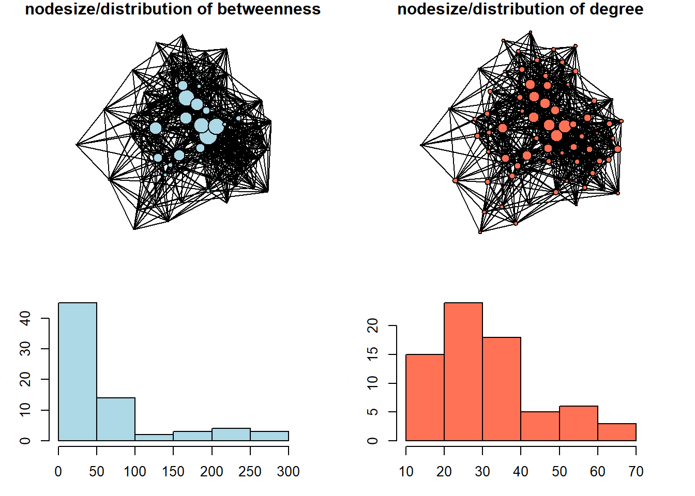


We can see here that betweenness centrality is a way more discriminating measure: most of the nodes in this network do not occur on the shortest paths between other nodes very often. In the network with size equal to degree centrality, we can see that the distribution is less severe. 


``` r
rm(list = ls())
```


## **Working through bibliometric example from OpenAlex data**  {-}


As the topic of centrality measures is relatively straightforward, I thought it might be of some interest for you if we pick a bibliometric database for the next example, so that you would (1) get your hands on freely available scientific literature metadata, suggested by [OpenAlex project](https://openalex.org/){style="color: blue;"}, and (2) relate the ideas on centrality to bibliometric analysis. Though there are many options for the literature search nowadays, ranging from simplistic google.scholar search field to the fancy AI-tools, it might be a good idea in concrete scenarios to study the literature formally with network analysis tools. It mostly applies to clustering / community detection techniques, which we are going to covert next week, but nothing prevents us from computing centrality measures on this sorts of data as well. Obviously, there are many specialized programs developed specifically for science mapping / literature reviews (e.g. [VOSviewer](https://www.vosviewer.com/){style="color: blue;"}, [CitNetExplorer](https://www.citnetexplorer.nl/){style="color: blue;"}, etc.), but loading, cleaning, and exploring the entire subset of literature you are interested in from R can be useful.


Currently, it is hard to access Scopus/Web of Science data (these are commonly used sources of data for scientometric studies) from Russia due to restrictions from these companies (although you still can get some metadata if you create [an API key for Scopus](https://dev.elsevier.com/){style="color: blue;"} and utilize tools like `rscopus` package (read documentation [here](https://cran.r-project.org/web/packages/rscopus/rscopus.pdf){style="color: blue;"}), - but, remember, the output would be limited, and the speed/limits are present for this option). For this reason, we would rely on OpenAlex, - a comprehensive, freely accessible database of the global scholarly system, including millions of journal articles, authors, institutions, and research concepts. Its major advantage is that it provides a straightforward way to access and analyze citation networks and research trends for free, making it ideal for bibliometric analysis.


For our ease, there is a wonderful package called `openalexR` ([documentation](https://docs.ropensci.org/openalexR/index.html){style="color: blue;"}). If you are interested in the topic, you can dive into [the filters' specifications](https://docs.ropensci.org/openalexR/articles/Filters.html){style="color: blue;"}, or just follow the example suggested below. To put this simply, we need to make a search query by using multiple arguments of the function `oa_fetch()`, check whether we are satisfied with the output lengths, adjust our request if needed, and finally download the data. 


For example, we can search for the "works" (papers, books, reviews, etc.) that contain the phrase "Sustainable Business Models" in their titles, and request just the overall number of found publications by setting the "count_only" argument to TRUE:


``` r
oa_fetch(entity = "works",
         output = "dataframe",
         display_name.search = 'Sustainable Business Models',
         count_only = T)
#>      count db_response_time_ms page per_page
#> [1,]  3812                  14    1        1
```


The output means that there are almost 4 thousands of works related to our query in OpenAlex. Let's reduce this number by setting the "cited_by_count" argument to be more than 10, meaning that only works cited more than 10 times would be returned. It is our data for this demonstration.


``` r
oa_sustainable <- oa_fetch(entity = "works",
         output = "dataframe",
         display_name.search = 'Sustainable Business Models',
         cited_by_count = ">10",
         verbose = T) ## takes around 20 seconds with my internet connection
```

The returned data frame contains 897 rows (articles, books, etc.) and 38 columns (data on our works, ranging from titles and publication years to cited references, which is of primary interest to us as network analysts). Below is the complete list of variables exported from OpenAlex:


``` r
oa_sustainable %>% 
  colnames()
#>  [1] "id"                         
#>  [2] "title"                      
#>  [3] "display_name"               
#>  [4] "author"                     
#>  [5] "ab"                         
#>  [6] "publication_date"           
#>  [7] "relevance_score"            
#>  [8] "so"                         
#>  [9] "so_id"                      
#> [10] "host_organization"          
#> [11] "issn_l"                     
#> [12] "url"                        
#> [13] "pdf_url"                    
#> [14] "license"                    
#> [15] "version"                    
#> [16] "first_page"                 
#> [17] "last_page"                  
#> [18] "volume"                     
#> [19] "issue"                      
#> [20] "is_oa"                      
#> [21] "is_oa_anywhere"             
#> [22] "oa_status"                  
#> [23] "oa_url"                     
#> [24] "any_repository_has_fulltext"
#> [25] "language"                   
#> [26] "grants"                     
#> [27] "cited_by_count"             
#> [28] "counts_by_year"             
#> [29] "publication_year"           
#> [30] "ids"                        
#> [31] "doi"                        
#> [32] "type"                       
#> [33] "referenced_works"           
#> [34] "related_works"              
#> [35] "is_paratext"                
#> [36] "is_retracted"               
#> [37] "concepts"                   
#> [38] "topics"
```


We can start by taking a look at the time distribution of our articles:


``` r
oa_sustainable %>% 
  ggplot(aes(publication_year)) +
  geom_histogram(bins = 20) +
  theme_minimal() +
  labs(title = '**OpenAlex works (*897*) on "Sustainable Business Models"**',
       subtitle = "works with > 10 citations are retained") +
  theme(plot.title = ggtext::element_markdown())
```

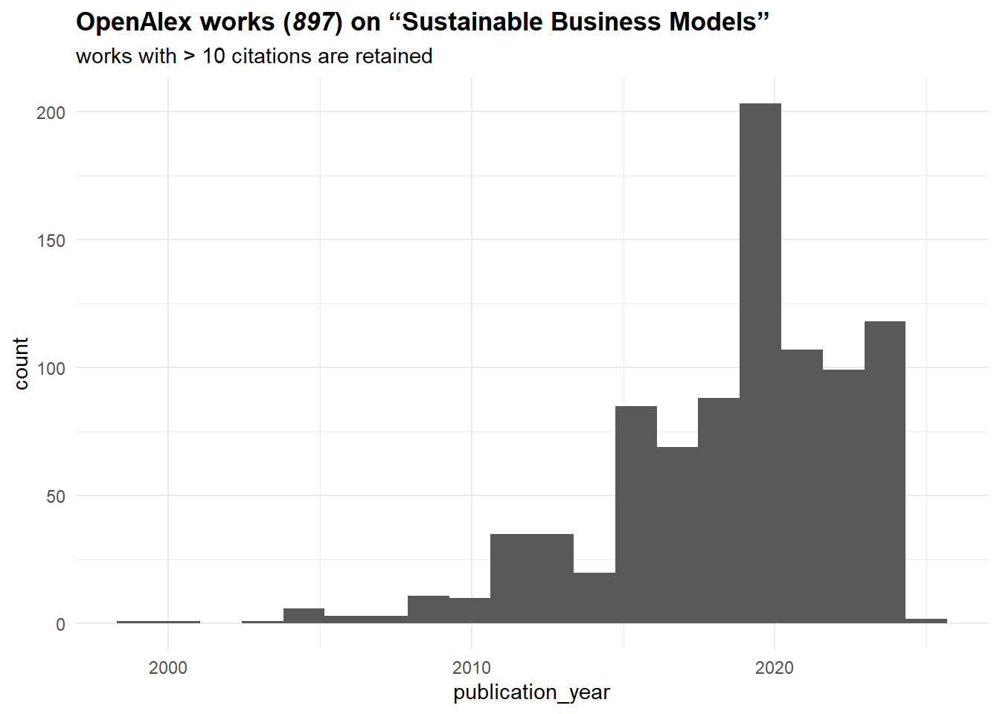


It seems that the topic is on the rise since the mid-2010s. Let's construct now a citation network from these sources. To do that, we need to work with "referenced_works" column, which basically lists sources referenced by a given work. Surely, it might not be ideal for all works (e.g., Russian sources are often poorly represented (in terms of metadata) in OpenAlex), but it should be fine for our purposes.


We start by getting an edgelist of citations. Note that we limit our sample to just those works covered by our search query, meaning that "cited_by_count" values (number of documents citing a work) should not match the in-degree centrality values that we are going to compute. To exclude all external (not from our sample) works, we can filter the "referenced_works" by "id" column:


``` r
oa_edges <- oa_sustainable %>% 
  select(id, referenced_works) %>% 
  unnest(referenced_works) %>% 
  mutate(referenced_works = str_squish(
    str_remove_all(referenced_works,
                   "https\\:\\/\\/openalex\\.org\\/"))) %>% 

  filter(referenced_works %in% str_squish(
    str_remove_all(oa_sustainable$id,
                   "https\\:\\/\\/openalex\\.org\\/"))) %>%
  
  mutate(id = str_squish(
    str_remove_all(id,
                   "https\\:\\/\\/openalex\\.org\\/"))) %>%
  `colnames<-`(c("from", "to"))

oa_edges %>% 
  head()
#> # A tibble: 6 × 2
#>   from        to         
#>   <chr>       <chr>      
#> 1 W1966481002 W1998953777
#> 2 W1966481002 W2021655427
#> 3 W1966481002 W2056268536
#> 4 W1966481002 W1568766594
#> 5 W1966481002 W1510372480
#> 6 W1966481002 W2145720744
```


We proceed by constructing a network and producing an initial visualization:


``` r
oa_g <- oa_edges %>% 
  graph_from_data_frame(directed = T) %>% 
  simplify()

set.seed(32)
par(mar=c(0,0,0,0))
oa_g %>% 
  plot(vertex.label = NA,
       vertex.size = 3,
       vertex.color = "coral1",
       edge.color = "black",
       edge.size = 1)
```


As you can see from this image, there is no single network, - instead, there are some isolated groups of nodes, with one of these sub-networks including a large proportion of networks' nodes. These sub-networks are called "components". We can get info on the number of components in an igraph object with `components()` function:


``` r
components(oa_g) %>% 
  str()
#> List of 3
#>  $ membership: Named num [1:724] 1 1 1 1 1 1 1 1 1 1 ...
#>   ..- attr(*, "names")= chr [1:724] "W1966481002" "W2810801192" "W2549080287" "W2437319536" ...
#>  $ csize     : num [1:14] 699 3 4 2 3 2 1 2 2 1 ...
#>  $ no        : num 14
```

This output means that:

  (1) there are 724 nodes in our network (this number is below number of rows in "oa_sustainable", the data frame we got from OpenAlex, due to missing values in "referenced_works" column, and the removal of nodes that do not link to other nodes in our literature base),
  
  
  (2) there are 14 components (clusters, sub-graphs, etc.) in our network, with the largest of them including 699 nodes (thus being 96.5% of network nodes).


A usual procedure in such cases in network analysis is to describe the network structure (number of small components, the distribution of nodes among them) and continue by analyzing the largest component in details. Before doing this, we can assign membership attribute to our nodes and plot these sub-networks separately:


``` r
V(oa_g)$component.id = components(oa_g)$membership
components.freq <- asDF(oa_g)$vertex %>% 
  count(component.id) %>% 
  arrange(desc(n))

set.seed(32)
par(mfrow = c(3,5))

for(i in c(1:nrow(components.freq))){
  
  par(mar=c(0,0,0,0))
  induced_subgraph(oa_g,
                   asDF(oa_g)$vertex %>%
                     filter(component.id == components.freq[i,1]) %>%
                     pull(name)) %>% 
    
    plot(vertex.label = NA,
         vertex.color = "coral1",
         edge.color = "black",
         main = str_c("\ncomponent ", i))
  
  box("outer", col="black", lwd = 5)
  
}
```


Let's extract the largest (first) component from the already existing igraph object. To do that, we need to get the list of nodes involved in this component:


``` r
vertices_in_largest_component = asDF(oa_g)$vertex %>%
  filter(component.id == 1) %>% 
  pull(name)

oa_g.biggest <- induced_subgraph(oa_g, vertices_in_largest_component)
oa_g.biggest
#> IGRAPH 6b1cc81 DN-- 699 5476 -- 
#> + attr: name (v/c), component.id (v/n)
#> + edges from 6b1cc81 (vertex names):
#>  [1] W1966481002->W2021655427 W1966481002->W2056268536
#>  [3] W1966481002->W1568766594 W1966481002->W1510372480
#>  [5] W1966481002->W2105843871 W1966481002->W1998953777
#>  [7] W1966481002->W2145720744 W1966481002->W2099913992
#>  [9] W1966481002->W2283181400 W2810801192->W1966481002
#> [11] W2810801192->W2549080287 W2810801192->W2437319536
#> [13] W2810801192->W2021655427 W2810801192->W2149296970
#> [15] W2810801192->W2887423052 W2810801192->W2481733813
#> + ... omitted several edges
```

Finally, this is a network we would analyze from the perspective of centrality measures. It contains 699 nodes (works) and 5,476 edges between them, - and this is a directed network (direction indicates referencing of a previous work). We can start by calculating all the centrality measures: 


``` r
V(oa_g.biggest)$indegree.centrality = degree(oa_g.biggest,
                                   mode = "in")
V(oa_g.biggest)$closeness.centrality = closeness(oa_g.biggest,
                                                 mode = "out",
                                                 normalized = T)
V(oa_g.biggest)$betweenness.centrality = betweenness(oa_g.biggest)
V(oa_g.biggest)$eigen.centrality = eigen_centrality(oa_g.biggest)$vector
```


And binding this values with the data we got from OpenAlex (publication year, total numbers of citations, document types, etc.):


``` r
oa_network_and_biblio <- (oa_g.biggest %>% 
  asDF())$vertex %>% 
  left_join(oa_sustainable %>% 
  select(id, title, ab, so, publication_year,
         first_page, last_page, cited_by_count, type) %>% 
  mutate(id = str_squish(str_remove_all(id,
                             "https\\:\\/\\/openalex\\.org\\/"))) %>% 
  rename(name = id)) %>% 
  select(-intergraph_id, -component.id)
```


The combination of network data with the attributes of the works allows to analyze how the field developed. The picture below shows the same dynamics of yearly publications as before, but it also indicates how published works were cited in this scientific domain. Note that it is different from "cited_by_count" variable, which accounts for the entire referencing (beyond publications falling in our query). When the volume of publications got large enough (and some of them got many citations), "review" appeared as a genre which can accumulate citations as well.


``` r
oa_network_and_biblio %>% 
  mutate(type = ifelse(type == "article",
                       "article",
                       ifelse(type == "review",
                              "review",
                              "other"))) %>% 
  ggplot(aes(publication_year, indegree.centrality, color = as.factor(type))) +
  geom_point() +
  theme_minimal() +
  labs(color = NULL,
       x = "publication year",
       y = "in-degree centrality (# of citations in corpus)",
       title = '**OpenAlex works on "Sustainable Business Models" constituting the largest component (*699*)**',
       subtitle = "works with > 10 citations are retained") +
  theme(plot.title = ggtext::element_markdown())
```

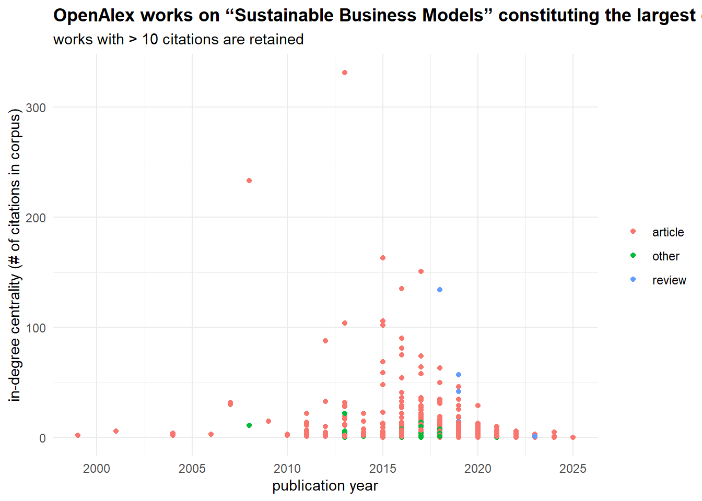


Speaking of `cited_by_count` papers, we can compare these scores to the network centrality metrics we have just calculated:


``` r
oa_network_and_biblio %>% 
  select(name, indegree.centrality, closeness.centrality,
         betweenness.centrality, eigen.centrality,
         cited_by_count) %>% 
  
  pivot_longer(cols = c(indegree.centrality, closeness.centrality,
                        betweenness.centrality, eigen.centrality),
               names_to = "centrality.measure",
               values_to = "centrality.value") %>% 
  
  ggplot(aes(centrality.value, cited_by_count)) +
  
  #stat_poly_line() +
  #stat_poly_eq() +
  geom_point() +
  
  facet_wrap(~centrality.measure,
             scales = "free") +
  geom_smooth()
```


The very high correlation (0.88, p-value < 0.01) between in-degree centrality and cited_by_count is expected because they are essentially measuring the same thing: in-degree is the local citation count within our specific network. This result is expected.


The moderate correlation for eigenvector centrality (0.66, p-value < 0.01) indicates that citations from well-connected, influential papers (rather than just numerous papers) provides an additional, independent boost to a work's total impact. The lower correlation for betweenness (0.56, p-value < 0.01) suggests that while acting as a bridge between research communities can bring some recognition, it is a less direct driver of high citation counts than simply being frequently cited. Finally, the near-zero correlation for closeness (0.13, p-value < 0.01) is common in citation networks; the speed at which a paper can reach others in the network is largely irrelevant—what matters is whether others actually cite it. The relevance of this score is also disrupted by the directed nature of our network.


By relying on centrality measures, we can differentiate locally and globally central nodes (works) and gatekeeping works, here meaning works connecting different topics / lines of research.


``` r
plot_ly(oa_network_and_biblio, 
        x = ~indegree.centrality, 
        y = ~betweenness.centrality,
        type = 'scatter',
        mode = 'markers',
        text = ~paste("<b>Title:</b> ", title, "<br>",
                     "<b>Publication year:</b> ", publication_year, "<br>", 
                     "<b>Journal:</b> ", so, "<br>",
                     "<b>In-degree:</b> ", indegree.centrality, "<br>",
                     "<b>Betweenness:</b> ", round(betweenness.centrality, 1)),
        hoverinfo = 'text') %>%
  layout(title = "<b>Differentiating literature by citation patterns</b>",
         xaxis = list(title = "in-degree centrality"),
         yaxis = list(title = "betweenness centrality"))
```


```{=html}
<div class="plotly html-widget html-fill-item" id="htmlwidget-177224fcd5dda734c025" style="width:672px;height:480px;"></div>
<script type="application/json" data-for="htmlwidget-177224fcd5dda734c025">{"x":{"visdat":{"1d8c36de654":["function () ","plotlyVisDat"]},"cur_data":"1d8c36de654","attrs":{"1d8c36de654":{"x":{},"y":{},"mode":"markers","text":{},"hoverinfo":"text","alpha_stroke":1,"sizes":[10,100],"spans":[1,20],"type":"scatter"}},"layout":{"margin":{"b":40,"l":60,"t":25,"r":10},"title":"<b>Differentiating literature by citation patterns<\/b>","xaxis":{"domain":[0,1],"automargin":true,"title":"in-degree centrality"},"yaxis":{"domain":[0,1],"automargin":true,"title":"betweenness centrality"},"hovermode":"closest","showlegend":false},"source":"A","config":{"modeBarButtonsToAdd":["hoverclosest","hovercompare"],"showSendToCloud":false},"data":[{"x":[331,134,151,135,104,106,42,35,102,36,35,75,29,50,7,63,81,74,64,29,6,4,5,4,14,20,3,33,29,5,33,163,34,14,6,8,7,58,6,12,18,36,29,27,15,14,2,5,35,0,88,16,90,9,19,14,6,5,5,6,9,12,22,57,18,0,13,2,8,9,13,4,22,6,0,0,7,18,46,6,13,0,4,4,3,5,5,8,6,6,1,23,0,1,7,1,6,11,4,0,3,7,12,5,3,2,2,8,2,3,13,5,0,2,15,1,17,3,3,33,7,10,3,12,0,8,3,19,3,3,1,3,2,1,69,0,3,0,8,0,3,5,1,9,3,3,0,59,1,2,4,4,2,3,15,2,3,12,8,17,3,1,6,3,3,2,1,1,5,3,14,2,5,5,0,2,5,1,2,1,12,13,0,41,26,11,54,0,1,1,0,5,6,11,1,3,6,4,8,2,4,1,1,8,1,22,1,27,1,0,48,1,0,0,0,3,0,2,1,0,0,19,0,0,2,2,1,2,4,2,5,1,13,0,0,0,1,1,0,3,0,0,2,0,3,3,0,1,2,3,11,1,0,0,5,4,0,6,11,22,1,0,18,0,2,25,10,0,4,7,0,0,4,2,13,1,0,3,2,14,0,5,1,0,12,0,0,0,0,2,16,0,0,15,6,9,9,13,4,1,0,4,27,7,0,8,3,1,2,9,12,1,0,0,1,4,3,9,0,1,1,7,9,9,13,4,0,2,8,3,0,5,0,2,0,21,2,0,10,5,6,6,0,8,3,1,2,2,14,5,3,0,0,0,6,0,0,5,3,2,2,6,11,1,4,3,3,1,0,0,9,3,0,2,1,0,0,0,4,0,2,6,1,0,0,6,0,4,0,1,0,11,4,3,1,3,0,5,1,0,2,0,6,4,0,1,1,1,0,1,1,2,2,1,0,0,5,12,2,1,6,0,1,5,2,0,0,0,0,0,3,12,1,1,3,2,0,1,0,0,0,3,3,0,0,0,0,0,0,5,0,1,1,0,0,1,0,0,1,0,1,0,0,0,1,2,0,0,3,0,3,1,3,0,2,1,1,0,3,0,2,1,0,2,1,0,0,0,1,2,3,2,0,2,0,2,1,0,0,0,1,0,2,0,1,1,0,0,1,3,0,0,2,1,0,0,0,0,1,0,3,0,0,0,0,0,0,1,0,1,2,0,1,0,2,0,0,0,0,0,1,0,0,0,3,1,0,1,0,0,1,0,0,0,0,0,0,0,0,1,0,0,2,0,2,0,0,0,0,1,0,0,0,0,0,0,32,5,233,4,30,32,11,22,3,28,11,4,5,17,5,11,31,29,17,7,4,8,6,2,2,3,2,2,2,2,6,3,1,2,2,11,10,2,4,5,3,2,4,3,4,2,5,2,6,2,6,2,1,4,6,6,3,7,1,1,1,4,4,1,4,5,2,1,1,2,2,3,1,2,7,2,1,3,1,11,1,2,1,1,2,2,1,3,3,1,6,3,1,1,4,1,1,1,1,3,1,5,1,1,1,1,2,2,1,1,1,1,1,2,1,1,1,1,1,1,1,1,1],"y":[4034.2054781038296,2244.851532254223,1264.6567566227902,112.00520885909904,90.886990792270055,154.07425666963599,2974.1536341773117,952.7882263645929,460.39160063501566,173.08333333333334,286.51113089851043,240.46330406534022,239.91336795218368,968.14016125407852,2.4935897435897436,2266.8356105392413,1216.1367333820981,1337.8561233477826,144.71722547321241,926.20480348103138,168.87164980824483,379.72231886471025,379.7947629746543,1.3976190476190475,264.32793189906187,22.283096544452899,175.53031140235532,4.6857142857142859,925.61275622468395,65.475901875901883,156.49305675100507,1517.9005156045789,842.1416308353655,1026.1066833785735,70.989146240737398,68.029182604096803,44.801820397365731,869.5250799984957,165.88210034852639,552.35155161454611,790.87065136923979,194.03083262121257,860.20240260613377,241.99447722600902,481.58489811353815,32.635684576861046,0.058823529411764705,26.645627705627707,4025.1612607369061,0,457.28828318711646,32.863802383565563,1275.0453333985852,17.208776203953889,17.334591459591454,21.714907005619075,249.63117091449891,20.49808802308802,123.72420634920636,334.31708228882076,275.84537659062778,951.30715746242049,26.019179098606003,5751.3403662410856,93.888906739142541,0,48.028146748335367,9.6361471861471859,16.428700844526684,1499.7907945231507,496.69569526741469,13.754530600118835,99.80203169177679,251.74422828483941,0,0,48.338265923996929,125.56846290963941,655.62164571159292,572.60401081315899,220.97688342598377,0,107.60406284891577,8.7997192421105446,283.90530356318141,12.702306027306026,40.834064908724699,528.36518792080619,89.442943471117772,66.860286665614609,14.396038172353961,147.26120030490742,0,2.67237246607956,234.70817834126657,4,646.53435996001735,29.994986730722026,101.28499000999001,0,375.74838392785614,0.090909090909090912,203.87213708642653,83.266047489027017,29.357176328175374,33,30.060028860028858,162.1784876071641,2.333333333333333,21.404401154401157,61.919251995854168,508.34579109401085,0,4.8428571428571434,0.91666666666666674,35.70604723830531,270.69357576429292,101.79166666666667,271.23261501570323,51.417014687289367,172.52957489793135,11.076833823490308,9.8557289932289933,198.71179165099446,0,315.10457053768113,19.634476802468889,91,250.79971605192193,255.02679005362833,1.1316239316239316,140.36856405171034,60.363054721188348,59.310716914664276,839.21948189187822,0,309.57433487565072,0,1499.3796326934373,0,156.13496570508951,267.90367842941373,0,51.862899008104698,5.3513888888888888,158.76999596295508,0,556.60486090675772,22.164377289377288,19.742950513538752,232.56111111111113,95.548403193394918,59.932998302510498,23.5,14.651131387769317,32.526463813512549,107.278595713933,5.1420283226010772,95.763502429232133,1354.9623728249605,162.84787157287161,0.69005439005439007,65.490828514999521,47.097727606295379,186.5583535054258,122.74522880501141,98.514478576978576,7.8574927670240307,26.721182412358882,1.1054695304695303,22.704081148839219,90.980139202043247,227.54222695070894,279.74104397625229,0,5.1526917526917524,8.0370415102613233,46.990476190476187,6.583333333333333,26.152272727272727,24.508648435785737,176.02170139801717,0,634.23921682762989,550.20399913109532,1.5437623010203656,607.10265928611091,0,13.489944266260055,118.20595238095238,0,739.18556144224249,215.7582541641365,10.55395992895993,43.627871148459398,5.0625541125541123,8.9499379460408868,113.71308870867693,328.31472959066281,12.955911330049261,31.809617882117877,66.430952380952377,2.4239247311827956,213.29854284381582,67.702297661488842,463.3636633340688,1.3469298245614034,584.41103904279589,50.000123610050068,0,480.0801846059569,2.1080659536541888,0,0,0,17.346655855324585,0,19,11.474709501025291,0,0,62.117785494116433,0,0,6.5111780504164116,0,26.427777777777774,60.551076132567005,0.25,39.005656944681334,255.78204057574769,98.299999999999997,239.10555139305134,0,0,0,84.809061107974145,2.2413341044919988,0,12.742063492063492,0,0,248.74877553002554,0,160.12914306556323,0.1497326203208556,0,15.462792527892958,3.4092906061946313,0.66793611793611796,123.32201356815486,103.83147773279356,0,0,200.54148492545252,209.79285714285712,0,1.6881704587586941,15.163690476190476,24.620744763716559,37.133939014202177,0,56.593735227782538,0,195.60513354894161,244.94529648951479,49.935829813461417,0,3.7575757575757573,167.44593683401945,0,0,117.40197049644991,5.7588235294117638,34.809933125247525,158.11505716505715,0,10.634911798727586,3.5647546897546896,17.544893029675638,0,460.67609260627609,1,0,124.31072348703927,0,0,0,0,2.9980681927943591,372.2344950344463,0,0,753.19097985244332,114.34582208726945,772.32585290053294,162.25956006712588,159.69017989804303,266.74194694194694,137.25757298257298,0,7.0671062984143473,115.20350460073564,116.81440212382131,0,21.585002760036843,195.50600045629389,1.9428571428571428,44.333333333333336,55.104604654604657,368.99557052424694,15.947822949996862,0,0,13.372300316007408,92.525739328872305,19.838311688311688,148.15292488984682,0,3.5333333333333332,10.592857142857143,25.899757332086587,185.05696467175267,0.61111111111111116,54.934062139432982,53.508008029346705,0,256.01628050312263,109.860133003572,2.2073934837092737,0,197.14945193695192,0,27.18333333333333,0,346.81381356891245,1.48015873015873,0,684.79945191051206,317.88267378756512,97.194758499282159,936.65773196739838,0,8.1664441838354875,122.86075036075036,4,13.805651574358667,19.176190476190477,570.05204759718799,28.982359307359307,0.4916666666666667,0,0,0,202.15120498308372,0,0,145.93467643467642,0,89.443818681318675,1.6627917833800188,316.53672954849424,105.56657690574808,25,535.66945904972226,133.93340548340547,356.50223475355062,5.0365440115440121,0,0,149.11245453007396,32.912397995149199,0,45.260576351752817,35.863528138528139,0,0,0,28.602266459890295,0,10.619731146046934,534.40001243580343,80.140151515151516,0,0,324.39387702447988,0,154.28516843207245,0,0,0,33.664324972413212,102.25066047360131,252.82024190476554,2,1,0,106.16577713553158,127.2838383838384,0,0,0,111.66632205513783,69.492200854700855,0,4.7000000000000002,24.129004329004328,2,0,0.6607142857142857,4.0047619047619047,1.667900042900043,14.116666666666667,2.583333333333333,0,0,66.330854070250354,150.91573409909384,187.12186147186148,1.8922644420086874,61.210930735930731,0,4.5833333333333339,0,176.69465686274509,0,0,0,0,0,44.445636882274812,30.740287405319858,2.75,1.2023559773559773,39.02612942612943,11.604387448251545,0,173.99999999999997,0,0,0,64.741407203907215,8.7333333333333343,0,0,0,0,0,0,23.416469975037749,0,1.5,18.812337662337661,0,0,6.2753968253968244,0,0,6.3535214785214791,0,12.071809251292208,0,0,0,31.166666666666668,5.2414682539682538,0,0,7.5625258799171844,0,11.631979248186344,110.18803418803419,8.3283730158730176,0,24.235680985680986,24.624999999999996,2.458333333333333,0,96.459176348471672,0,6.2261904761904763,15.828841991341994,0,1.3916666666666666,6.4659090909090908,0,0,0,38.516666666666673,6.0269953958594931,9.3190476190476179,62.56045796308954,0,0,0,13.092777777777778,23.753388278388279,0,0,0,0,0,82.19004884004886,0,3.0095238095238095,49.565236371815324,0,0,87.190938892025841,0.14610983981693365,0,0,1.7492424242424243,0.22222222222222221,0,0,0,0,0,0,16.831826024217328,0,0,0,0,0,0,1.6158119658119658,0,14.501190476190478,14.684523809523808,0,26.058583083583084,0,181.39285714285711,0,0,0,0,0,55.417857142857159,0,0,0,117.97361111111111,3.4255949858742212,0,10.783333333333335,0,0,5.3554695304695308,0,0,0,0,0,0,0,0,40.663997113997119,0,0,0.11655011655011654,0,38,0,0,0,0,7.1428571428571415,0,0,0,0,0,0,0,0,0,0,0,0,0,0,0,0,0,0,0,0,0,0,0,0,0,0,0,0,0,0,0,0,0,0,0,0,0,0,0,0,0,0,0,0,0,0,0,0,0,0,0,0,0,0,0,0,0,0,0,0,0,0,0,0,0,0,0,0,0,0,0,0,0,0,0,0,0,0,0,0,0,0,0,0,0,0,0,0,0,0,0,0,0,0,0,0,0,0,0,0,0,0,0,0,0,0,0,0,0,0,0,0,0,0,0,0,0,0,0,0,0,0,0,0,0,0,0,0,0],"mode":"markers","text":["<b>Title:<\/b>  A literature and practice review to develop sustainable business model archetypes <br> <b>Publication year:<\/b>  2013 <br> <b>Journal:<\/b>  Journal of Cleaner Production <br> <b>In-degree:<\/b>  331 <br> <b>Betweenness:<\/b>  4034.2","<b>Title:<\/b>  Sustainable business model innovation: A review <br> <b>Publication year:<\/b>  2018 <br> <b>Journal:<\/b>  Journal of Cleaner Production <br> <b>In-degree:<\/b>  134 <br> <b>Betweenness:<\/b>  2244.9","<b>Title:<\/b>  Business Model Innovation for Sustainability: Towards a Unified Perspective for Creation of Sustainable Business Models <br> <b>Publication year:<\/b>  2017 <br> <b>Journal:<\/b>  Business Strategy and the Environment <br> <b>In-degree:<\/b>  151 <br> <b>Betweenness:<\/b>  1264.7","<b>Title:<\/b>  The triple layered business model canvas: A tool to design more sustainable business models <br> <b>Publication year:<\/b>  2016 <br> <b>Journal:<\/b>  Journal of Cleaner Production <br> <b>In-degree:<\/b>  135 <br> <b>Betweenness:<\/b>  112","<b>Title:<\/b>  A value mapping tool for sustainable business modelling <br> <b>Publication year:<\/b>  2013 <br> <b>Journal:<\/b>  Corporate Governance <br> <b>In-degree:<\/b>  104 <br> <b>Betweenness:<\/b>  90.9","<b>Title:<\/b>  An Ontology for Strongly Sustainable Business Models <br> <b>Publication year:<\/b>  2015 <br> <b>Journal:<\/b>  Organization & Environment <br> <b>In-degree:<\/b>  106 <br> <b>Betweenness:<\/b>  154.1","<b>Title:<\/b>  Sustainable Business Models: A Review <br> <b>Publication year:<\/b>  2019 <br> <b>Journal:<\/b>  Sustainability <br> <b>In-degree:<\/b>  42 <br> <b>Betweenness:<\/b>  2974.2","<b>Title:<\/b>  Barriers and drivers to sustainable business model innovation: Organization design and dynamic capabilities <br> <b>Publication year:<\/b>  2019 <br> <b>Journal:<\/b>  Long Range Planning <br> <b>In-degree:<\/b>  35 <br> <b>Betweenness:<\/b>  952.8","<b>Title:<\/b>  The triple layered business model canvas: a tool to design more sustainable business models <br> <b>Publication year:<\/b>  2015 <br> <b>Journal:<\/b>  SERVAL (Université de Lausanne) <br> <b>In-degree:<\/b>  102 <br> <b>Betweenness:<\/b>  460.4","<b>Title:<\/b>  Innovative and sustainable business models in the fashion industry: Entrepreneurial drivers, opportunities, and challenges <br> <b>Publication year:<\/b>  2017 <br> <b>Journal:<\/b>  Business Horizons <br> <b>In-degree:<\/b>  36 <br> <b>Betweenness:<\/b>  173.1","<b>Title:<\/b>  Sustainable business model archetypes for the banking industry <br> <b>Publication year:<\/b>  2017 <br> <b>Journal:<\/b>  Journal of Cleaner Production <br> <b>In-degree:<\/b>  35 <br> <b>Betweenness:<\/b>  286.5","<b>Title:<\/b>  Value uncaptured perspective for sustainable business model innovation <br> <b>Publication year:<\/b>  2016 <br> <b>Journal:<\/b>  Journal of Cleaner Production <br> <b>In-degree:<\/b>  75 <br> <b>Betweenness:<\/b>  240.5","<b>Title:<\/b>  Towards a more Circular Economy: Proposing a framework linking sustainable public procurement and sustainable business models <br> <b>Publication year:<\/b>  2016 <br> <b>Journal:<\/b>  Resources Conservation and Recycling <br> <b>In-degree:<\/b>  29 <br> <b>Betweenness:<\/b>  239.9","<b>Title:<\/b>  Sustainable business model experimentation by understanding ecologies of business models <br> <b>Publication year:<\/b>  2018 <br> <b>Journal:<\/b>  Journal of Cleaner Production <br> <b>In-degree:<\/b>  50 <br> <b>Betweenness:<\/b>  968.1","<b>Title:<\/b>  Logistics 4.0 and emerging sustainable business models <br> <b>Publication year:<\/b>  2017 <br> <b>Journal:<\/b>  Advances in Manufacturing <br> <b>In-degree:<\/b>  7 <br> <b>Betweenness:<\/b>  2.5","<b>Title:<\/b>  The sustainable business model pattern taxonomy—45 patterns to support sustainability-oriented business model innovation <br> <b>Publication year:<\/b>  2018 <br> <b>Journal:<\/b>  Sustainable Production and Consumption <br> <b>In-degree:<\/b>  63 <br> <b>Betweenness:<\/b>  2266.8","<b>Title:<\/b>  Design thinking to enhance the sustainable business modelling process – A workshop based on a value mapping process <br> <b>Publication year:<\/b>  2016 <br> <b>Journal:<\/b>  Journal of Cleaner Production <br> <b>In-degree:<\/b>  81 <br> <b>Betweenness:<\/b>  1216.1","<b>Title:<\/b>  Sustainable business model research and practice: Emerging field or passing fancy? <br> <b>Publication year:<\/b>  2017 <br> <b>Journal:<\/b>  Journal of Cleaner Production <br> <b>In-degree:<\/b>  74 <br> <b>Betweenness:<\/b>  1337.9","<b>Title:<\/b>  Bridging sustainable business model innovation and user-driven innovation: A process for sustainable value proposition design <br> <b>Publication year:<\/b>  2017 <br> <b>Journal:<\/b>  Journal of Cleaner Production <br> <b>In-degree:<\/b>  64 <br> <b>Betweenness:<\/b>  144.7","<b>Title:<\/b>  Anatomy of sustainable business model innovation <br> <b>Publication year:<\/b>  2020 <br> <b>Journal:<\/b>  Journal of Cleaner Production <br> <b>In-degree:<\/b>  29 <br> <b>Betweenness:<\/b>  926.2","<b>Title:<\/b>  Fintech and SMEs sustainable business models: Reflections and considerations for a circular economy <br> <b>Publication year:<\/b>  2020 <br> <b>Journal:<\/b>  Journal of Cleaner Production <br> <b>In-degree:<\/b>  6 <br> <b>Betweenness:<\/b>  168.9","<b>Title:<\/b>  The Impact of COVID-19 on Sustainable Business Models in SMEs <br> <b>Publication year:<\/b>  2021 <br> <b>Journal:<\/b>  Sustainability <br> <b>In-degree:<\/b>  4 <br> <b>Betweenness:<\/b>  379.7","<b>Title:<\/b>  Industry 4.0 and sustainable development: A systematic mapping of triple bottom line, Circular Economy and Sustainable Business Models perspectives <br> <b>Publication year:<\/b>  2021 <br> <b>Journal:<\/b>  Journal of Cleaner Production <br> <b>In-degree:<\/b>  5 <br> <b>Betweenness:<\/b>  379.8","<b>Title:<\/b>  An Industry 4.0 Research Agenda for Sustainable Business Models <br> <b>Publication year:<\/b>  2017 <br> <b>Journal:<\/b>  Procedia CIRP <br> <b>In-degree:<\/b>  4 <br> <b>Betweenness:<\/b>  1.4","<b>Title:<\/b>  Modelling environmental value: An examination of sustainable business models within the fashion industry <br> <b>Publication year:<\/b>  2018 <br> <b>Journal:<\/b>  Journal of Cleaner Production <br> <b>In-degree:<\/b>  14 <br> <b>Betweenness:<\/b>  264.3","<b>Title:<\/b>  Sustainable business models, venture typologies, and entrepreneurial ecosystems: A social network perspective <br> <b>Publication year:<\/b>  2017 <br> <b>Journal:<\/b>  Journal of Cleaner Production <br> <b>In-degree:<\/b>  20 <br> <b>Betweenness:<\/b>  22.3","<b>Title:<\/b>  How digitalization supports a sustainable business model: A literature review <br> <b>Publication year:<\/b>  2022 <br> <b>Journal:<\/b>  Technological Forecasting and Social Change <br> <b>In-degree:<\/b>  3 <br> <b>Betweenness:<\/b>  175.5","<b>Title:<\/b>  Managing stakeholder relations when developing sustainable business models: the case of the Brazilian energy sector <br> <b>Publication year:<\/b>  2012 <br> <b>Journal:<\/b>  Journal of Cleaner Production <br> <b>In-degree:<\/b>  33 <br> <b>Betweenness:<\/b>  4.7","<b>Title:<\/b>  Beyond the purely commercial business model: Organizational value logics and the heterogeneity of sustainability business models <br> <b>Publication year:<\/b>  2017 <br> <b>Journal:<\/b>  Long Range Planning <br> <b>In-degree:<\/b>  29 <br> <b>Betweenness:<\/b>  925.6","<b>Title:<\/b>  Artificial Intelligence in the Agri-Food System: Rethinking Sustainable Business Models in the COVID-19 Scenario <br> <b>Publication year:<\/b>  2020 <br> <b>Journal:<\/b>  Sustainability <br> <b>In-degree:<\/b>  5 <br> <b>Betweenness:<\/b>  65.5","<b>Title:<\/b>  Sustainable business models: Providing a more holistic perspective <br> <b>Publication year:<\/b>  2018 <br> <b>Journal:<\/b>  Business Strategy and the Environment <br> <b>In-degree:<\/b>  33 <br> <b>Betweenness:<\/b>  156.5","<b>Title:<\/b>  Business Models for Sustainability <br> <b>Publication year:<\/b>  2015 <br> <b>Journal:<\/b>  Organization & Environment <br> <b>In-degree:<\/b>  163 <br> <b>Betweenness:<\/b>  1517.9","<b>Title:<\/b>  Transforming sustainability challenges into competitive advantage: Multiple case studies kaleidoscope converging into sustainable business models <br> <b>Publication year:<\/b>  2017 <br> <b>Journal:<\/b>  Journal of Cleaner Production <br> <b>In-degree:<\/b>  34 <br> <b>Betweenness:<\/b>  842.1","<b>Title:<\/b>  Sustainable Business Models: A Review <br> <b>Publication year:<\/b>  2019 <br> <b>Journal:<\/b>  Preprints.org <br> <b>In-degree:<\/b>  14 <br> <b>Betweenness:<\/b>  1026.1","<b>Title:<\/b>  Frugal innovation and sustainable business models <br> <b>Publication year:<\/b>  2021 <br> <b>Journal:<\/b>  Technology in Society <br> <b>In-degree:<\/b>  6 <br> <b>Betweenness:<\/b>  71","<b>Title:<\/b>  Sustainable business models <br> <b>Publication year:<\/b>  2014 <br> <b>Journal:<\/b>  Baltic Journal of Management <br> <b>In-degree:<\/b>  8 <br> <b>Betweenness:<\/b>  68","<b>Title:<\/b>  The blockchain as a sustainable business model innovation <br> <b>Publication year:<\/b>  2020 <br> <b>Journal:<\/b>  Management Decision <br> <b>In-degree:<\/b>  7 <br> <b>Betweenness:<\/b>  44.8","<b>Title:<\/b>  Sustainable business model adoption among S&amp;P 500 firms: A longitudinal content analysis study <br> <b>Publication year:<\/b>  2017 <br> <b>Journal:<\/b>  Journal of Cleaner Production <br> <b>In-degree:<\/b>  58 <br> <b>Betweenness:<\/b>  869.5","<b>Title:<\/b>  Towards sustainable business models for electric vehicle battery second use: A critical review <br> <b>Publication year:<\/b>  2019 <br> <b>Journal:<\/b>  Journal of Environmental Management <br> <b>In-degree:<\/b>  6 <br> <b>Betweenness:<\/b>  165.9","<b>Title:<\/b>  Sustainable business model: A review and framework development <br> <b>Publication year:<\/b>  2020 <br> <b>Journal:<\/b>  Clean Technologies and Environmental Policy <br> <b>In-degree:<\/b>  12 <br> <b>Betweenness:<\/b>  552.4","<b>Title:<\/b>  Dynamic business modeling for sustainability: Exploring a system dynamics perspective to develop sustainable business models <br> <b>Publication year:<\/b>  2019 <br> <b>Journal:<\/b>  Business Strategy and the Environment <br> <b>In-degree:<\/b>  18 <br> <b>Betweenness:<\/b>  790.9","<b>Title:<\/b>  Relational leadership for strategic sustainability: practices and capabilities to advance the design and assessment of sustainable business models <br> <b>Publication year:<\/b>  2016 <br> <b>Journal:<\/b>  Journal of Cleaner Production <br> <b>In-degree:<\/b>  36 <br> <b>Betweenness:<\/b>  194","<b>Title:<\/b>  Sustainable business model innovation: The role of boundary work for multi-stakeholder alignment <br> <b>Publication year:<\/b>  2019 <br> <b>Journal:<\/b>  Journal of Cleaner Production <br> <b>In-degree:<\/b>  29 <br> <b>Betweenness:<\/b>  860.2","<b>Title:<\/b>  Sustainable business models as boundary-spanning systems of value transfers <br> <b>Publication year:<\/b>  2017 <br> <b>Journal:<\/b>  Journal of Cleaner Production <br> <b>In-degree:<\/b>  27 <br> <b>Betweenness:<\/b>  242","<b>Title:<\/b>  Sustainable business models: a literature review <br> <b>Publication year:<\/b>  2019 <br> <b>Journal:<\/b>  Benchmarking An International Journal <br> <b>In-degree:<\/b>  15 <br> <b>Betweenness:<\/b>  481.6","<b>Title:<\/b>  A Definition and Theoretical Review of the Circular Economy, Value Creation, and Sustainable Business Models: Where Are We Now and Where Should Research Move in the Future? <br> <b>Publication year:<\/b>  2018 <br> <b>Journal:<\/b>  Sustainability <br> <b>In-degree:<\/b>  14 <br> <b>Betweenness:<\/b>  32.6","<b>Title:<\/b>  Digitalization and new technologies for sustainable business models at the ship–port interface: a bibliometric analysis <br> <b>Publication year:<\/b>  2021 <br> <b>Journal:<\/b>  Maritime Policy & Management <br> <b>In-degree:<\/b>  2 <br> <b>Betweenness:<\/b>  0.1","<b>Title:<\/b>  Impact Assessment of Additive Manufacturing on Sustainable Business Models in Industry 4.0 Context <br> <b>Publication year:<\/b>  2020 <br> <b>Journal:<\/b>  Sustainability <br> <b>In-degree:<\/b>  5 <br> <b>Betweenness:<\/b>  26.6","<b>Title:<\/b>  Embracing the variety of sustainable business models: A prolific field of research and a future research agenda <br> <b>Publication year:<\/b>  2018 <br> <b>Journal:<\/b>  Journal of Cleaner Production <br> <b>In-degree:<\/b>  35 <br> <b>Betweenness:<\/b>  4025.2","<b>Title:<\/b>  Sustainable business models for innovation and success: bibliometric analysis <br> <b>Publication year:<\/b>  2020 <br> <b>Journal:<\/b>  E3S Web of Conferences <br> <b>In-degree:<\/b>  0 <br> <b>Betweenness:<\/b>  0","<b>Title:<\/b>  Sustainable innovation, business models and economic performance: an overview <br> <b>Publication year:<\/b>  2012 <br> <b>Journal:<\/b>  Journal of Cleaner Production <br> <b>In-degree:<\/b>  88 <br> <b>Betweenness:<\/b>  457.3","<b>Title:<\/b>  Managing tensions in sustainable business models: Exploring instrumental and integrative strategies <br> <b>Publication year:<\/b>  2018 <br> <b>Journal:<\/b>  Journal of Cleaner Production <br> <b>In-degree:<\/b>  16 <br> <b>Betweenness:<\/b>  32.9","<b>Title:<\/b>  Business Models for Sustainability <br> <b>Publication year:<\/b>  2016 <br> <b>Journal:<\/b>  Organization & Environment <br> <b>In-degree:<\/b>  90 <br> <b>Betweenness:<\/b>  1275","<b>Title:<\/b>  A sustainable business model to fight food waste <br> <b>Publication year:<\/b>  2017 <br> <b>Journal:<\/b>  Journal of Cleaner Production <br> <b>In-degree:<\/b>  9 <br> <b>Betweenness:<\/b>  17.2","<b>Title:<\/b>  Sustainable business models and the automotive industry: A commentary <br> <b>Publication year:<\/b>  2013 <br> <b>Journal:<\/b>  IIMB Management Review <br> <b>In-degree:<\/b>  19 <br> <b>Betweenness:<\/b>  17.3","<b>Title:<\/b>  Characterising B Corps as a sustainable business model: An exploratory study of B Corps in Australia <br> <b>Publication year:<\/b>  2016 <br> <b>Journal:<\/b>  Journal of Cleaner Production <br> <b>In-degree:<\/b>  14 <br> <b>Betweenness:<\/b>  21.7","<b>Title:<\/b>  Transformative Sustainable Business Models in the Light of the Digital Imperative—A Global Business Economics Perspective <br> <b>Publication year:<\/b>  2018 <br> <b>Journal:<\/b>  Sustainability <br> <b>In-degree:<\/b>  6 <br> <b>Betweenness:<\/b>  249.6","<b>Title:<\/b>  Sustainable Business Models through Service Design <br> <b>Publication year:<\/b>  2017 <br> <b>Journal:<\/b>  Procedia Manufacturing <br> <b>In-degree:<\/b>  5 <br> <b>Betweenness:<\/b>  20.5","<b>Title:<\/b>  Sustainable business models for inclusive growth: Towards a conceptual foundation of inclusive business <br> <b>Publication year:<\/b>  2020 <br> <b>Journal:<\/b>  Journal of Cleaner Production <br> <b>In-degree:<\/b>  5 <br> <b>Betweenness:<\/b>  123.7","<b>Title:<\/b>  Sustainable business model innovation literature: a bibliometrics analysis <br> <b>Publication year:<\/b>  2022 <br> <b>Journal:<\/b>  Review of Managerial Science <br> <b>In-degree:<\/b>  6 <br> <b>Betweenness:<\/b>  334.3","<b>Title:<\/b>  Sustainable Business Model Innovation: Exploring Evidences in Sustainability Reporting <br> <b>Publication year:<\/b>  2016 <br> <b>Journal:<\/b>  Procedia CIRP <br> <b>In-degree:<\/b>  9 <br> <b>Betweenness:<\/b>  275.8","<b>Title:<\/b>  A corporate effort towards a sustainable business model <br> <b>Publication year:<\/b>  2011 <br> <b>Journal:<\/b>  European Business Review <br> <b>In-degree:<\/b>  12 <br> <b>Betweenness:<\/b>  951.3","<b>Title:<\/b>  ANALYSING BARRIERS TO SUSTAINABLE BUSINESS MODEL INNOVATIONS: INNOVATION SYSTEMS APPROACH <br> <b>Publication year:<\/b>  2014 <br> <b>Journal:<\/b>  International Journal of Innovation Management <br> <b>In-degree:<\/b>  22 <br> <b>Betweenness:<\/b>  26","<b>Title:<\/b>  Business model innovation for circular economy and sustainability: A review of approaches <br> <b>Publication year:<\/b>  2019 <br> <b>Journal:<\/b>  Journal of Cleaner Production <br> <b>In-degree:<\/b>  57 <br> <b>Betweenness:<\/b>  5751.3","<b>Title:<\/b>  Towards a Conceptual Framework of Sustainable Business Model Innovation in the Agri-Food Sector: A Systematic Literature Review <br> <b>Publication year:<\/b>  2017 <br> <b>Journal:<\/b>  Sustainability <br> <b>In-degree:<\/b>  18 <br> <b>Betweenness:<\/b>  93.9","<b>Title:<\/b>  The link between sustainable business models and Blockchain: A multiple case study approach <br> <b>Publication year:<\/b>  2022 <br> <b>Journal:<\/b>  Business Strategy and the Environment <br> <b>In-degree:<\/b>  0 <br> <b>Betweenness:<\/b>  0","<b>Title:<\/b>  Valuing Value in Innovation Ecosystems: How Cross-Sector Actors Overcome Tensions in Collaborative Sustainable Business Model Development <br> <b>Publication year:<\/b>  2020 <br> <b>Journal:<\/b>  Business & Society <br> <b>In-degree:<\/b>  13 <br> <b>Betweenness:<\/b>  48","<b>Title:<\/b>  “Integrated thinking and reporting” towards sustainable business models: a concise bibliometric analysis <br> <b>Publication year:<\/b>  2020 <br> <b>Journal:<\/b>  Meditari Accountancy Research <br> <b>In-degree:<\/b>  2 <br> <b>Betweenness:<\/b>  9.6","<b>Title:<\/b>  Environmental management practices for sustainable business models in small and medium sized hotel enterprises <br> <b>Publication year:<\/b>  2018 <br> <b>Journal:<\/b>  Journal of Cleaner Production <br> <b>In-degree:<\/b>  8 <br> <b>Betweenness:<\/b>  16.4","<b>Title:<\/b>  Sustainable Business Model Innovation: An Umbrella Review <br> <b>Publication year:<\/b>  2021 <br> <b>Journal:<\/b>  Sustainability <br> <b>In-degree:<\/b>  9 <br> <b>Betweenness:<\/b>  1499.8","<b>Title:<\/b>  Creating value for multiple stakeholders: Sustainable business models at the Base of the Pyramid <br> <b>Publication year:<\/b>  2018 <br> <b>Journal:<\/b>  Journal of Cleaner Production <br> <b>In-degree:<\/b>  13 <br> <b>Betweenness:<\/b>  496.7","<b>Title:<\/b>  Stakeholders' involvement in establishing sustainable business models <br> <b>Publication year:<\/b>  2020 <br> <b>Journal:<\/b>  British Food Journal <br> <b>In-degree:<\/b>  4 <br> <b>Betweenness:<\/b>  13.8","<b>Title:<\/b>  What makes a sustainable business model successful? An empirical comparison of two peer-to-peer goods-sharing platforms <br> <b>Publication year:<\/b>  2017 <br> <b>Journal:<\/b>  Journal of Cleaner Production <br> <b>In-degree:<\/b>  22 <br> <b>Betweenness:<\/b>  99.8","<b>Title:<\/b>  The sustainability performances of sustainable business models <br> <b>Publication year:<\/b>  2021 <br> <b>Journal:<\/b>  Journal of Cleaner Production <br> <b>In-degree:<\/b>  6 <br> <b>Betweenness:<\/b>  251.7","<b>Title:<\/b>  Developing sustainable business models: local knowledge acquisition and tourism lifestyle entrepreneurship <br> <b>Publication year:<\/b>  2020 <br> <b>Journal:<\/b>  Journal of Sustainable Tourism <br> <b>In-degree:<\/b>  0 <br> <b>Betweenness:<\/b>  0","<b>Title:<\/b>  Drivers of sustainable business model innovations. An upper echelon theory perspective <br> <b>Publication year:<\/b>  2023 <br> <b>Journal:<\/b>  Technological Forecasting and Social Change <br> <b>In-degree:<\/b>  0 <br> <b>Betweenness:<\/b>  0","<b>Title:<\/b>  Linking Sustainable Business Models to Socio-Ecological Resilience Through Cross-Sector Partnerships: A Complex Adaptive Systems View <br> <b>Publication year:<\/b>  2020 <br> <b>Journal:<\/b>  Business & Society <br> <b>In-degree:<\/b>  7 <br> <b>Betweenness:<\/b>  48.3","<b>Title:<\/b>  Sustainable business models as an innovation strategy in the water sector: An empirical investigation of a sustainable product-service system <br> <b>Publication year:<\/b>  2016 <br> <b>Journal:<\/b>  Journal of Cleaner Production <br> <b>In-degree:<\/b>  18 <br> <b>Betweenness:<\/b>  125.6","<b>Title:<\/b>  A Stakeholder Theory Perspective on Business Models: Value Creation for Sustainability <br> <b>Publication year:<\/b>  2019 <br> <b>Journal:<\/b>  Journal of Business Ethics <br> <b>In-degree:<\/b>  46 <br> <b>Betweenness:<\/b>  655.6","<b>Title:<\/b>  The role of stakeholder interaction in sustainable business models. A systematic literature review <br> <b>Publication year:<\/b>  2021 <br> <b>Journal:<\/b>  Journal of Cleaner Production <br> <b>In-degree:<\/b>  6 <br> <b>Betweenness:<\/b>  572.6","<b>Title:<\/b>  Addressing the design-implementation gap of sustainable business models by prototyping: A tool for planning and executing small-scale pilots <br> <b>Publication year:<\/b>  2020 <br> <b>Journal:<\/b>  Journal of Cleaner Production <br> <b>In-degree:<\/b>  13 <br> <b>Betweenness:<\/b>  221","<b>Title:<\/b>  Sustainable Business Models: A Review <br> <b>Publication year:<\/b>  2020 <br> <b>Journal:<\/b>  NA <br> <b>In-degree:<\/b>  0 <br> <b>Betweenness:<\/b>  0","<b>Title:<\/b>  Smart contracts to enable sustainable business models. A case study <br> <b>Publication year:<\/b>  2020 <br> <b>Journal:<\/b>  Management Decision <br> <b>In-degree:<\/b>  4 <br> <b>Betweenness:<\/b>  107.6","<b>Title:<\/b>  Sustainable business models and eco-innovation: A life cycle assessment <br> <b>Publication year:<\/b>  2020 <br> <b>Journal:<\/b>  Journal of Cleaner Production <br> <b>In-degree:<\/b>  4 <br> <b>Betweenness:<\/b>  8.8","<b>Title:<\/b>  Innovation and environmental, social, and governance factors influencing sustainable business models - Meta-analysis <br> <b>Publication year:<\/b>  2021 <br> <b>Journal:<\/b>  Journal of Cleaner Production <br> <b>In-degree:<\/b>  3 <br> <b>Betweenness:<\/b>  283.9","<b>Title:<\/b>  Regulatory risk and the resilience of new sustainable business models in the energy sector <br> <b>Publication year:<\/b>  2019 <br> <b>Journal:<\/b>  Journal of Cleaner Production <br> <b>In-degree:<\/b>  5 <br> <b>Betweenness:<\/b>  12.7","<b>Title:<\/b>  The role of linked legitimacy in sustainable business model development <br> <b>Publication year:<\/b>  2019 <br> <b>Journal:<\/b>  Industrial Marketing Management <br> <b>In-degree:<\/b>  5 <br> <b>Betweenness:<\/b>  40.8","<b>Title:<\/b>  Sustainable Business Models of SMEs: Challenges in Yacht Tourism Sector <br> <b>Publication year:<\/b>  2018 <br> <b>Journal:<\/b>  Sustainability <br> <b>In-degree:<\/b>  8 <br> <b>Betweenness:<\/b>  528.4","<b>Title:<\/b>  Sustainable business modeling: The need for innovative design thinking <br> <b>Publication year:<\/b>  2021 <br> <b>Journal:<\/b>  Journal of Cleaner Production <br> <b>In-degree:<\/b>  6 <br> <b>Betweenness:<\/b>  89.4","<b>Title:<\/b>  Collaborative Sustainable Business Models: Understanding Organizations Partnering for Community Sustainability <br> <b>Publication year:<\/b>  2020 <br> <b>Journal:<\/b>  Business & Society <br> <b>In-degree:<\/b>  6 <br> <b>Betweenness:<\/b>  66.9","<b>Title:<\/b>  Digital sustainable business models: Using digital technology to integrate ecological sustainability into the core of business models <br> <b>Publication year:<\/b>  2023 <br> <b>Journal:<\/b>  Information Systems Journal <br> <b>In-degree:<\/b>  1 <br> <b>Betweenness:<\/b>  14.4","<b>Title:<\/b>  Embracing the variety of sustainable business models: social entrepreneurship, corporate intrapreneurship, creativity, innovation, and other approaches to sustainability challenges <br> <b>Publication year:<\/b>  2015 <br> <b>Journal:<\/b>  Journal of Cleaner Production <br> <b>In-degree:<\/b>  23 <br> <b>Betweenness:<\/b>  147.3","<b>Title:<\/b>  Sustainable business models for the creation of mobile financial services in Nigeria <br> <b>Publication year:<\/b>  2019 <br> <b>Journal:<\/b>  Journal of Innovation & Knowledge <br> <b>In-degree:<\/b>  0 <br> <b>Betweenness:<\/b>  0","<b>Title:<\/b>  The usefulness of sustainable business models: Analysis from oil and gas industry <br> <b>Publication year:<\/b>  2021 <br> <b>Journal:<\/b>  Corporate Social Responsibility and Environmental Management <br> <b>In-degree:<\/b>  1 <br> <b>Betweenness:<\/b>  2.7","<b>Title:<\/b>  Artificial intelligence and business models in the sustainable development goals perspective: A systematic literature review <br> <b>Publication year:<\/b>  2020 <br> <b>Journal:<\/b>  Journal of Business Research <br> <b>In-degree:<\/b>  7 <br> <b>Betweenness:<\/b>  234.7","<b>Title:<\/b>  Remanufacturing with upgrade PSS for new sustainable business models <br> <b>Publication year:<\/b>  2018 <br> <b>Journal:<\/b>  CIRP journal of manufacturing science and technology <br> <b>In-degree:<\/b>  1 <br> <b>Betweenness:<\/b>  4","<b>Title:<\/b>  Sustainable business model innovation: Scale development, validation and proof of performance <br> <b>Publication year:<\/b>  2022 <br> <b>Journal:<\/b>  Journal of Innovation & Knowledge <br> <b>In-degree:<\/b>  6 <br> <b>Betweenness:<\/b>  646.5","<b>Title:<\/b>  An overview of sustainable business models for innovation in Swedish agri-food production <br> <b>Publication year:<\/b>  2018 <br> <b>Journal:<\/b>  Journal of Integrative Environmental Sciences <br> <b>In-degree:<\/b>  11 <br> <b>Betweenness:<\/b>  30","<b>Title:<\/b>  Informing sustainable business models with a consumer preference perspective <br> <b>Publication year:<\/b>  2019 <br> <b>Journal:<\/b>  Journal of Cleaner Production <br> <b>In-degree:<\/b>  4 <br> <b>Betweenness:<\/b>  101.3","<b>Title:<\/b>  Sustainable Business Models and Artificial Intelligence: Opportunities and Challenges <br> <b>Publication year:<\/b>  2020 <br> <b>Journal:<\/b>  Contributions to management science <br> <b>In-degree:<\/b>  0 <br> <b>Betweenness:<\/b>  0","<b>Title:<\/b>  Sustainable Business Models: A Bibliometric Performance Analysis <br> <b>Publication year:<\/b>  2020 <br> <b>Journal:<\/b>  Energies <br> <b>In-degree:<\/b>  3 <br> <b>Betweenness:<\/b>  375.7","<b>Title:<\/b>  Scalability of Sustainable Business Models in Hybrid Organizations <br> <b>Publication year:<\/b>  2016 <br> <b>Journal:<\/b>  Sustainability <br> <b>In-degree:<\/b>  7 <br> <b>Betweenness:<\/b>  0.1","<b>Title:<\/b>  Sustainable business model archetypes for the electric vehicle battery second use industry: Towards a conceptual framework <br> <b>Publication year:<\/b>  2020 <br> <b>Journal:<\/b>  Journal of Cleaner Production <br> <b>In-degree:<\/b>  12 <br> <b>Betweenness:<\/b>  203.9","<b>Title:<\/b>  Sustainable Business Models–Canvas for Sustainability, Evaluation Method, and Their Application to Additive Manufacturing in Aircraft Maintenance <br> <b>Publication year:<\/b>  2020 <br> <b>Journal:<\/b>  Sustainability <br> <b>In-degree:<\/b>  5 <br> <b>Betweenness:<\/b>  83.3","<b>Title:<\/b>  Can digitalization favour the emergence of innovative and sustainable business models? A qualitative exploration in the automotive sector <br> <b>Publication year:<\/b>  2021 <br> <b>Journal:<\/b>  Journal of strategy and management <br> <b>In-degree:<\/b>  3 <br> <b>Betweenness:<\/b>  29.4","<b>Title:<\/b>  Blockchain Technology and Sustainable Business Models: A Case Study of Devoleum <br> <b>Publication year:<\/b>  2021 <br> <b>Journal:<\/b>  Sustainability <br> <b>In-degree:<\/b>  2 <br> <b>Betweenness:<\/b>  33","<b>Title:<\/b>  Financial literacy, financial capabilities, and sustainable business model practice among small business owners in Nigeria <br> <b>Publication year:<\/b>  2021 <br> <b>Journal:<\/b>  Journal of Sustainable Finance & Investment <br> <b>In-degree:<\/b>  2 <br> <b>Betweenness:<\/b>  30.1","<b>Title:<\/b>  Alternative food networks: sustainable business models for anti-consumption food cultures <br> <b>Publication year:<\/b>  2018 <br> <b>Journal:<\/b>  British Food Journal <br> <b>In-degree:<\/b>  8 <br> <b>Betweenness:<\/b>  162.2","<b>Title:<\/b>  Business model risk and uncertainty factors: Toward building and maintaining profitable and sustainable business models <br> <b>Publication year:<\/b>  2019 <br> <b>Journal:<\/b>  Business Horizons <br> <b>In-degree:<\/b>  2 <br> <b>Betweenness:<\/b>  2.3","<b>Title:<\/b>  Sustainable business models as successful drivers in equity crowdfunding <br> <b>Publication year:<\/b>  2022 <br> <b>Journal:<\/b>  Business Strategy and the Environment <br> <b>In-degree:<\/b>  3 <br> <b>Betweenness:<\/b>  21.4","<b>Title:<\/b>  Associative Sustainable Business Models: Cases in the bean-to-bar chocolate industry <br> <b>Publication year:<\/b>  2017 <br> <b>Journal:<\/b>  Journal of Cleaner Production <br> <b>In-degree:<\/b>  13 <br> <b>Betweenness:<\/b>  61.9","<b>Title:<\/b>  Sustainable Business Model Based on Digital Twin Platform Network: The Inspiration from Haier’s Case Study in China <br> <b>Publication year:<\/b>  2020 <br> <b>Journal:<\/b>  Sustainability <br> <b>In-degree:<\/b>  5 <br> <b>Betweenness:<\/b>  508.3","<b>Title:<\/b>  CEO characteristics and sustainability business model in financial technologies firms <br> <b>Publication year:<\/b>  2020 <br> <b>Journal:<\/b>  Management Decision <br> <b>In-degree:<\/b>  0 <br> <b>Betweenness:<\/b>  0","<b>Title:<\/b>  Sustainable Business Models <br> <b>Publication year:<\/b>  2018 <br> <b>Journal:<\/b>  Palgrave studies in sustainable business in association with Future Earth <br> <b>In-degree:<\/b>  2 <br> <b>Betweenness:<\/b>  4.8","<b>Title:<\/b>  Built to scale? How sustainable business models can better serve the base of the pyramid <br> <b>Publication year:<\/b>  2017 <br> <b>Journal:<\/b>  Journal of Cleaner Production <br> <b>In-degree:<\/b>  15 <br> <b>Betweenness:<\/b>  0.9","<b>Title:<\/b>  The contribution of manufacturing companies to the achievement of sustainable development goals: An empirical analysis of the operationalization of sustainable business models <br> <b>Publication year:<\/b>  2022 <br> <b>Journal:<\/b>  Business Strategy and the Environment <br> <b>In-degree:<\/b>  1 <br> <b>Betweenness:<\/b>  35.7","<b>Title:<\/b>  User-centred sustainable business model design: The case of energy efficiency services in the Netherlands <br> <b>Publication year:<\/b>  2018 <br> <b>Journal:<\/b>  Journal of Cleaner Production <br> <b>In-degree:<\/b>  17 <br> <b>Betweenness:<\/b>  270.7","<b>Title:<\/b>  Coworking and Sustainable Business Model Innovation in Young Firms <br> <b>Publication year:<\/b>  2019 <br> <b>Journal:<\/b>  Sustainability <br> <b>In-degree:<\/b>  3 <br> <b>Betweenness:<\/b>  101.8","<b>Title:<\/b>  Developing Sustainable Business Models: A Microfoundational Perspective <br> <b>Publication year:<\/b>  2022 <br> <b>Journal:<\/b>  Organization & Environment <br> <b>In-degree:<\/b>  3 <br> <b>Betweenness:<\/b>  271.2","<b>Title:<\/b>  A Framework for Sustainable Circular Business Model Innovation <br> <b>Publication year:<\/b>  2016 <br> <b>Journal:<\/b>  Technology Innovation Management Review <br> <b>In-degree:<\/b>  33 <br> <b>Betweenness:<\/b>  51.4","<b>Title:<\/b>  Linking sustainable business models and supply chains — Toward an integrated value creation framework <br> <b>Publication year:<\/b>  2021 <br> <b>Journal:<\/b>  Business Strategy and the Environment <br> <b>In-degree:<\/b>  7 <br> <b>Betweenness:<\/b>  172.5","<b>Title:<\/b>  Understanding sustainable business model: A framework and a case study of the bike-sharing industry <br> <b>Publication year:<\/b>  2020 <br> <b>Journal:<\/b>  Journal of Cleaner Production <br> <b>In-degree:<\/b>  10 <br> <b>Betweenness:<\/b>  11.1","<b>Title:<\/b>  Characterization of the impact of digitalization on the adoption of sustainable business models in manufacturing <br> <b>Publication year:<\/b>  2019 <br> <b>Journal:<\/b>  Procedia CIRP <br> <b>In-degree:<\/b>  3 <br> <b>Betweenness:<\/b>  9.9","<b>Title:<\/b>  A sustainable business model in services: an assessment and validation <br> <b>Publication year:<\/b>  2015 <br> <b>Journal:<\/b>  International Journal of Quality and Service Sciences <br> <b>In-degree:<\/b>  12 <br> <b>Betweenness:<\/b>  198.7","<b>Title:<\/b>  Digital Transformation and Sustainable Business Models <br> <b>Publication year:<\/b>  2022 <br> <b>Journal:<\/b>  Sustainability <br> <b>In-degree:<\/b>  0 <br> <b>Betweenness:<\/b>  0","<b>Title:<\/b>  Sustainable Business Models through the Lens of Organizational Design: A Systematic Literature Review <br> <b>Publication year:<\/b>  2019 <br> <b>Journal:<\/b>  Sustainability <br> <b>In-degree:<\/b>  8 <br> <b>Betweenness:<\/b>  315.1","<b>Title:<\/b>  Barriers to Sustainable Business Model Innovation in Swedish Agriculture <br> <b>Publication year:<\/b>  2018 <br> <b>Journal:<\/b>  Journal of Entrepreneurship Management and Innovation <br> <b>In-degree:<\/b>  3 <br> <b>Betweenness:<\/b>  19.6","<b>Title:<\/b>  Reviewing Literature on Digitalization, Business Model Innovation, and Sustainable Industry: Past Achievements and Future Promises <br> <b>Publication year:<\/b>  2019 <br> <b>Journal:<\/b>  Sustainability <br> <b>In-degree:<\/b>  19 <br> <b>Betweenness:<\/b>  91","<b>Title:<\/b>  Sustainable business models and innovation strategies to realize them: A review of 87 empirical cases <br> <b>Publication year:<\/b>  2022 <br> <b>Journal:<\/b>  Business Strategy and the Environment <br> <b>In-degree:<\/b>  3 <br> <b>Betweenness:<\/b>  250.8","<b>Title:<\/b>  Towards sustainable business models with a novel life cycle assessment method <br> <b>Publication year:<\/b>  2022 <br> <b>Journal:<\/b>  Business Strategy and the Environment <br> <b>In-degree:<\/b>  3 <br> <b>Betweenness:<\/b>  255","<b>Title:<\/b>  Sustainable Business Models <br> <b>Publication year:<\/b>  2020 <br> <b>Journal:<\/b>  Encyclopedia of the UN sustainable development goals <br> <b>In-degree:<\/b>  1 <br> <b>Betweenness:<\/b>  1.1","<b>Title:<\/b>  A Boundary Tool for Multi-stakeholder Sustainable Business Model Innovation <br> <b>Publication year:<\/b>  2021 <br> <b>Journal:<\/b>  Circular Economy and Sustainability <br> <b>In-degree:<\/b>  3 <br> <b>Betweenness:<\/b>  140.4","<b>Title:<\/b>  Prevailing theoretical approaches predicting sustainable business models: a systematic review <br> <b>Publication year:<\/b>  2021 <br> <b>Journal:<\/b>  International Journal of Productivity and Performance Management <br> <b>In-degree:<\/b>  2 <br> <b>Betweenness:<\/b>  60.4","<b>Title:<\/b>  Research on the mechanism of sustainable business model innovation driven by the digital platform ecosystem <br> <b>Publication year:<\/b>  2023 <br> <b>Journal:<\/b>  Journal of Engineering and Technology Management <br> <b>In-degree:<\/b>  1 <br> <b>Betweenness:<\/b>  59.3","<b>Title:<\/b>  Business Models for Sustainability From a System Dynamics Perspective <br> <b>Publication year:<\/b>  2015 <br> <b>Journal:<\/b>  Organization & Environment <br> <b>In-degree:<\/b>  69 <br> <b>Betweenness:<\/b>  839.2","<b>Title:<\/b>  Sustainable business models of e-marketplaces: An analysis from the consumer perspective <br> <b>Publication year:<\/b>  2023 <br> <b>Journal:<\/b>  Journal of Open Innovation Technology Market and Complexity <br> <b>In-degree:<\/b>  0 <br> <b>Betweenness:<\/b>  0","<b>Title:<\/b>  Value Migration to the Sustainable Business Models of Digital Economy Companies on the Capital Market <br> <b>Publication year:<\/b>  2018 <br> <b>Journal:<\/b>  Sustainability <br> <b>In-degree:<\/b>  3 <br> <b>Betweenness:<\/b>  309.6","<b>Title:<\/b>  Drivers to implement the circular economy in born-sustainable business models: a case study in the fashion industry <br> <b>Publication year:<\/b>  2021 <br> <b>Journal:<\/b>  Revista de Gestão <br> <b>In-degree:<\/b>  0 <br> <b>Betweenness:<\/b>  0","<b>Title:<\/b>  Normative Innovation for Sustainable Business Models in Value Networks <br> <b>Publication year:<\/b>  2014 <br> <b>Journal:<\/b>  SSRN Electronic Journal <br> <b>In-degree:<\/b>  8 <br> <b>Betweenness:<\/b>  1499.4","<b>Title:<\/b>  A systematic review of sustainable business models: Opportunities, challenges, and future research directions <br> <b>Publication year:<\/b>  2023 <br> <b>Journal:<\/b>  Decision Analytics Journal <br> <b>In-degree:<\/b>  0 <br> <b>Betweenness:<\/b>  0","<b>Title:<\/b>  Defining Value in Sustainable Business Models <br> <b>Publication year:<\/b>  2023 <br> <b>Journal:<\/b>  Business & Society <br> <b>In-degree:<\/b>  3 <br> <b>Betweenness:<\/b>  156.1","<b>Title:<\/b>  Crypto‐economy and new sustainable business models: Reflections and projections using a case study analysis <br> <b>Publication year:<\/b>  2020 <br> <b>Journal:<\/b>  Corporate Social Responsibility and Environmental Management <br> <b>In-degree:<\/b>  5 <br> <b>Betweenness:<\/b>  267.9","<b>Title:<\/b>  Towards a Sustainable Business Model for Plastic Shopping Bag Management in Sweden <br> <b>Publication year:<\/b>  2017 <br> <b>Journal:<\/b>  Procedia CIRP <br> <b>In-degree:<\/b>  1 <br> <b>Betweenness:<\/b>  0","<b>Title:<\/b>  Sustainable business model innovation and acceptance of its practices among Spanish entrepreneurs <br> <b>Publication year:<\/b>  2019 <br> <b>Journal:<\/b>  Corporate Social Responsibility and Environmental Management <br> <b>In-degree:<\/b>  9 <br> <b>Betweenness:<\/b>  51.9","<b>Title:<\/b>  UNDERSTANDING SUSTAINABLE BUSINESS MODELS <br> <b>Publication year:<\/b>  2017 <br> <b>Journal:<\/b>  Journal of Positive Management <br> <b>In-degree:<\/b>  3 <br> <b>Betweenness:<\/b>  5.4","<b>Title:<\/b>  Identifying opportunities for sustainable business models in manufacturing: Application of patent analysis and generative topographic mapping <br> <b>Publication year:<\/b>  2021 <br> <b>Journal:<\/b>  Sustainable Production and Consumption <br> <b>In-degree:<\/b>  3 <br> <b>Betweenness:<\/b>  158.8","<b>Title:<\/b>  Sustainable by design: An organizational design tool for sustainable business model innovation <br> <b>Publication year:<\/b>  2023 <br> <b>Journal:<\/b>  Journal of Cleaner Production <br> <b>In-degree:<\/b>  0 <br> <b>Betweenness:<\/b>  0","<b>Title:<\/b>  Journeying Toward Business Models for Sustainability <br> <b>Publication year:<\/b>  2015 <br> <b>Journal:<\/b>  Organization & Environment <br> <b>In-degree:<\/b>  59 <br> <b>Betweenness:<\/b>  556.6","<b>Title:<\/b>  Sustainable business model innovation and scaling through collaboration <br> <b>Publication year:<\/b>  2022 <br> <b>Journal:<\/b>  Environmental Innovation and Societal Transitions <br> <b>In-degree:<\/b>  1 <br> <b>Betweenness:<\/b>  22.2","<b>Title:<\/b>  Towards a conceptual framework for sustainable business models in the food and beverage industry <br> <b>Publication year:<\/b>  2019 <br> <b>Journal:<\/b>  British Food Journal <br> <b>In-degree:<\/b>  2 <br> <b>Betweenness:<\/b>  19.7","<b>Title:<\/b>  Digital Business Model, Digital Transformation, Digital Entrepreneurship: Is There A Sustainable “Digital”? <br> <b>Publication year:<\/b>  2020 <br> <b>Journal:<\/b>  Sustainability <br> <b>In-degree:<\/b>  4 <br> <b>Betweenness:<\/b>  232.6","<b>Title:<\/b>  Spreading Sustainability Innovation through the Co-Evolution of Sustainable Business Models and Partnerships <br> <b>Publication year:<\/b>  2020 <br> <b>Journal:<\/b>  Sustainability <br> <b>In-degree:<\/b>  4 <br> <b>Betweenness:<\/b>  95.5","<b>Title:<\/b>  How to Support Start-Ups in Developing a Sustainable Business Model: The Case of an European Social Impact Accelerator <br> <b>Publication year:<\/b>  2021 <br> <b>Journal:<\/b>  Sustainability <br> <b>In-degree:<\/b>  2 <br> <b>Betweenness:<\/b>  59.9","<b>Title:<\/b>  Commercialization of eHealth innovations in the market of the UK healthcare sector: A framework for a sustainable business model <br> <b>Publication year:<\/b>  2018 <br> <b>Journal:<\/b>  Psychology and Marketing <br> <b>In-degree:<\/b>  3 <br> <b>Betweenness:<\/b>  23.5","<b>Title:<\/b>  Business Model Innovation as Lever of Organizational Sustainability <br> <b>Publication year:<\/b>  2014 <br> <b>Journal:<\/b>  The Journal of Technology Transfer <br> <b>In-degree:<\/b>  15 <br> <b>Betweenness:<\/b>  14.7","<b>Title:<\/b>  Sustainable business model for climate finance. Key drivers for the commercial banking sector <br> <b>Publication year:<\/b>  2022 <br> <b>Journal:<\/b>  Journal of Business Research <br> <b>In-degree:<\/b>  2 <br> <b>Betweenness:<\/b>  32.5","<b>Title:<\/b>  Communicating Sustainable Business Models to Consumers: A Translation Theory Perspective <br> <b>Publication year:<\/b>  2020 <br> <b>Journal:<\/b>  Organization & Environment <br> <b>In-degree:<\/b>  3 <br> <b>Betweenness:<\/b>  107.3","<b>Title:<\/b>  Developing sustainable business models within BOP contexts: mobilizing native capability to cope with government programs <br> <b>Publication year:<\/b>  2016 <br> <b>Journal:<\/b>  Journal of Cleaner Production <br> <b>In-degree:<\/b>  12 <br> <b>Betweenness:<\/b>  5.1","<b>Title:<\/b>  Sharing economy business models for sustainability <br> <b>Publication year:<\/b>  2020 <br> <b>Journal:<\/b>  Journal of Cleaner Production <br> <b>In-degree:<\/b>  8 <br> <b>Betweenness:<\/b>  95.8","<b>Title:<\/b>  From an ideal dream towards reality analysis: Proposing Sustainable Value Exchange Matrix (SVEM) from systematic literature review on sustainable business models and face validation <br> <b>Publication year:<\/b>  2017 <br> <b>Journal:<\/b>  Journal of Cleaner Production <br> <b>In-degree:<\/b>  17 <br> <b>Betweenness:<\/b>  1355","<b>Title:<\/b>  Unpacking sustainable business models in the Swedish agricultural sector– the challenges of technological, social and organisational innovation <br> <b>Publication year:<\/b>  2021 <br> <b>Journal:<\/b>  Journal of Cleaner Production <br> <b>In-degree:<\/b>  3 <br> <b>Betweenness:<\/b>  162.8","<b>Title:<\/b>  Experimenting with sustainable business models in fast moving consumer goods <br> <b>Publication year:<\/b>  2020 <br> <b>Journal:<\/b>  Journal of Cleaner Production <br> <b>In-degree:<\/b>  1 <br> <b>Betweenness:<\/b>  0.7","<b>Title:<\/b>  The social side of sustainable business models: An explorative analysis of the low-cost airline industry <br> <b>Publication year:<\/b>  2019 <br> <b>Journal:<\/b>  Journal of Cleaner Production <br> <b>In-degree:<\/b>  6 <br> <b>Betweenness:<\/b>  65.5","<b>Title:<\/b>  Designing and testing a new sustainable business model tool for multi-actor, multi-level, circular, and collaborative contexts <br> <b>Publication year:<\/b>  2021 <br> <b>Journal:<\/b>  Journal of Cleaner Production <br> <b>In-degree:<\/b>  3 <br> <b>Betweenness:<\/b>  47.1","<b>Title:<\/b>  Integrating Intellectual Property and Sustainable Business Models: The SBM-IP Canvas <br> <b>Publication year:<\/b>  2020 <br> <b>Journal:<\/b>  Sustainability <br> <b>In-degree:<\/b>  3 <br> <b>Betweenness:<\/b>  186.6","<b>Title:<\/b>  Rural Digital Innovation Hubs as a Paradigm for Sustainable Business Models in Europe’s Rural Areas <br> <b>Publication year:<\/b>  2022 <br> <b>Journal:<\/b>  Sustainability <br> <b>In-degree:<\/b>  2 <br> <b>Betweenness:<\/b>  122.7","<b>Title:<\/b>  Industry 4.0 and sustainable business models: An intercontinental sample <br> <b>Publication year:<\/b>  2023 <br> <b>Journal:<\/b>  Business Strategy and the Environment <br> <b>In-degree:<\/b>  1 <br> <b>Betweenness:<\/b>  98.5","<b>Title:<\/b>  The governance of sustainable business model innovation—An Ordonomic Approach <br> <b>Publication year:<\/b>  2022 <br> <b>Journal:<\/b>  Scandinavian Journal of Management <br> <b>In-degree:<\/b>  1 <br> <b>Betweenness:<\/b>  7.9","<b>Title:<\/b>  How smart technologies can support sustainable business models: insights from an air navigation service provider <br> <b>Publication year:<\/b>  2020 <br> <b>Journal:<\/b>  Management Decision <br> <b>In-degree:<\/b>  5 <br> <b>Betweenness:<\/b>  26.7","<b>Title:<\/b>  Sustainable Business Models – What Do Management Theories Say? <br> <b>Publication year:<\/b>  2016 <br> <b>Journal:<\/b>  Vezetéstudomány / Budapest Management Review <br> <b>In-degree:<\/b>  3 <br> <b>Betweenness:<\/b>  1.1","<b>Title:<\/b>  Circular business models: Business approach as driver or obstructer of sustainability transitions? <br> <b>Publication year:<\/b>  2019 <br> <b>Journal:<\/b>  Journal of Cleaner Production <br> <b>In-degree:<\/b>  14 <br> <b>Betweenness:<\/b>  22.7","<b>Title:<\/b>  Sustainable Business Models Innovation and Design Thinking: A Bibliometric Analysis and Systematic Review of Literature <br> <b>Publication year:<\/b>  2023 <br> <b>Journal:<\/b>  Sustainability <br> <b>In-degree:<\/b>  2 <br> <b>Betweenness:<\/b>  91","<b>Title:<\/b>  Educating for the development of sustainable business models: Designing and delivering a course to foster creativity <br> <b>Publication year:<\/b>  2018 <br> <b>Journal:<\/b>  Journal of Cleaner Production <br> <b>In-degree:<\/b>  5 <br> <b>Betweenness:<\/b>  227.5","<b>Title:<\/b>  Research on Sustainable Business Model Patterns: Status quo, Methodological Issues, and a Research Agenda <br> <b>Publication year:<\/b>  2018 <br> <b>Journal:<\/b>  Palgrave studies in sustainable business in association with Future Earth <br> <b>In-degree:<\/b>  5 <br> <b>Betweenness:<\/b>  279.7","<b>Title:<\/b>  A meta-analysis of green and sustainable business models: A comprehensive approach <br> <b>Publication year:<\/b>  2022 <br> <b>Journal:<\/b>  Journal of Cleaner Production <br> <b>In-degree:<\/b>  0 <br> <b>Betweenness:<\/b>  0","<b>Title:<\/b>  Information Asymmetries and the Paradox of Sustainable Business Models: Towards an Integrated Theory of Sustainable Entrepreneurship <br> <b>Publication year:<\/b>  2018 <br> <b>Journal:<\/b>  CSR, sustainability, ethics & governance <br> <b>In-degree:<\/b>  2 <br> <b>Betweenness:<\/b>  5.2","<b>Title:<\/b>  An assessment of the early stages of a sustainable business model in the Canadian fast food industry <br> <b>Publication year:<\/b>  2012 <br> <b>Journal:<\/b>  European Business Review <br> <b>In-degree:<\/b>  5 <br> <b>Betweenness:<\/b>  8","<b>Title:<\/b>  Sustainable business model in food and beverage industry – a case of Western and Central and Eastern European countries <br> <b>Publication year:<\/b>  2020 <br> <b>Journal:<\/b>  British Food Journal <br> <b>In-degree:<\/b>  1 <br> <b>Betweenness:<\/b>  47","<b>Title:<\/b>  Sustainable Business Model Design: 45 Patterns <br> <b>Publication year:<\/b>  2021 <br> <b>Journal:<\/b>  NA <br> <b>In-degree:<\/b>  2 <br> <b>Betweenness:<\/b>  6.6","<b>Title:<\/b>  In the eye of the beholder: Stakeholder perceived value in sustainable business models <br> <b>Publication year:<\/b>  2023 <br> <b>Journal:<\/b>  Long Range Planning <br> <b>In-degree:<\/b>  1 <br> <b>Betweenness:<\/b>  26.2","<b>Title:<\/b>  Business model innovation for sustainable energy: German utilities and renewable energy <br> <b>Publication year:<\/b>  2013 <br> <b>Journal:<\/b>  Energy Policy <br> <b>In-degree:<\/b>  12 <br> <b>Betweenness:<\/b>  24.5","<b>Title:<\/b>  Circular business models for sustainable development: A “waste is food” restorative ecosystem <br> <b>Publication year:<\/b>  2018 <br> <b>Journal:<\/b>  Business Strategy and the Environment <br> <b>In-degree:<\/b>  13 <br> <b>Betweenness:<\/b>  176","<b>Title:<\/b>  SUSTAINABLE BUSINESS MODELS IN SATELLITE TELECOMMUNICATIONS <br> <b>Publication year:<\/b>  2024 <br> <b>Journal:<\/b>  Engineering Science & Technology Journal <br> <b>In-degree:<\/b>  0 <br> <b>Betweenness:<\/b>  0","<b>Title:<\/b>  An approach to business model innovation and design for strategic sustainable development <br> <b>Publication year:<\/b>  2016 <br> <b>Journal:<\/b>  Journal of Cleaner Production <br> <b>In-degree:<\/b>  41 <br> <b>Betweenness:<\/b>  634.2","<b>Title:<\/b>  Sustainable entrepreneurship, innovation, and business models: Integrative framework and propositions for future research <br> <b>Publication year:<\/b>  2019 <br> <b>Journal:<\/b>  Business Strategy and the Environment <br> <b>In-degree:<\/b>  26 <br> <b>Betweenness:<\/b>  550.2","<b>Title:<\/b>  Business models for sustainable consumption in the circular economy: An expert study <br> <b>Publication year:<\/b>  2018 <br> <b>Journal:<\/b>  Journal of Cleaner Production <br> <b>In-degree:<\/b>  11 <br> <b>Betweenness:<\/b>  1.5","<b>Title:<\/b>  Towards a Conceptual Framework of 'Business Models for Sustainability' <br> <b>Publication year:<\/b>  2016 <br> <b>Journal:<\/b>  Research Repository (Delft University of Technology) <br> <b>In-degree:<\/b>  54 <br> <b>Betweenness:<\/b>  607.1","<b>Title:<\/b>  RESTART Sustainable Business Model Innovation <br> <b>Publication year:<\/b>  2018 <br> <b>Journal:<\/b>  Palgrave studies in sustainable business in association with Future Earth <br> <b>In-degree:<\/b>  0 <br> <b>Betweenness:<\/b>  0","<b>Title:<\/b>  Navigating value networks to co‐create sustainable business models: An actionable staging approach <br> <b>Publication year:<\/b>  2022 <br> <b>Journal:<\/b>  Business Strategy and the Environment <br> <b>In-degree:<\/b>  1 <br> <b>Betweenness:<\/b>  13.5","<b>Title:<\/b>  Sustainable Business Models for Deep Energy Retrofitting of Buildings: State-of-the-art and Methodological Approach <br> <b>Publication year:<\/b>  2016 <br> <b>Journal:<\/b>  Energy Procedia <br> <b>In-degree:<\/b>  1 <br> <b>Betweenness:<\/b>  118.2","<b>Title:<\/b>  Sustainable business models for social enterprises in developing countries: a conceptual framework <br> <b>Publication year:<\/b>  2022 <br> <b>Journal:<\/b>  Management Review Quarterly <br> <b>In-degree:<\/b>  0 <br> <b>Betweenness:<\/b>  0","<b>Title:<\/b>  Towards Systematic Sustainable Business Model Innovation: What Can We Learn from Business Model Innovation <br> <b>Publication year:<\/b>  2022 <br> <b>Journal:<\/b>  Sustainability <br> <b>In-degree:<\/b>  5 <br> <b>Betweenness:<\/b>  739.2","<b>Title:<\/b>  Sustainability in the Circular Economy: Insights and Dynamics of Designing Circular Business Models <br> <b>Publication year:<\/b>  2022 <br> <b>Journal:<\/b>  Applied Sciences <br> <b>In-degree:<\/b>  6 <br> <b>Betweenness:<\/b>  215.8","<b>Title:<\/b>  Business models for sustainable innovation – an empirical analysis of frugal products and services <br> <b>Publication year:<\/b>  2016 <br> <b>Journal:<\/b>  Journal of Cleaner Production <br> <b>In-degree:<\/b>  11 <br> <b>Betweenness:<\/b>  10.6","<b>Title:<\/b>  Sustainable business model innovation: Design guidelines for integrating systems thinking principles in tools for early-stage sustainability assessment <br> <b>Publication year:<\/b>  2022 <br> <b>Journal:<\/b>  Journal of Cleaner Production <br> <b>In-degree:<\/b>  1 <br> <b>Betweenness:<\/b>  43.6","<b>Title:<\/b>  Towards sustainability? Forest-based circular bioeconomy business models in Finnish SMEs <br> <b>Publication year:<\/b>  2018 <br> <b>Journal:<\/b>  Forest Policy and Economics <br> <b>In-degree:<\/b>  3 <br> <b>Betweenness:<\/b>  5.1","<b>Title:<\/b>  A system dynamics sustainable business model for Petroleos Mexicanos (Pemex): case based on the Global Reporting Initiative <br> <b>Publication year:<\/b>  2011 <br> <b>Journal:<\/b>  Journal of the Operational Research Society <br> <b>In-degree:<\/b>  6 <br> <b>Betweenness:<\/b>  8.9","<b>Title:<\/b>  Applying a Sustainable Business Model Lens to Mutual Value Creation With Base of the Pyramid Suppliers <br> <b>Publication year:<\/b>  2020 <br> <b>Journal:<\/b>  Business & Society <br> <b>In-degree:<\/b>  4 <br> <b>Betweenness:<\/b>  113.7","<b>Title:<\/b>  The Evolution of Sustainable Business Model Innovation: Evidence from a Sharing Economy Platform in China <br> <b>Publication year:<\/b>  2019 <br> <b>Journal:<\/b>  Sustainability <br> <b>In-degree:<\/b>  8 <br> <b>Betweenness:<\/b>  328.3","<b>Title:<\/b>  A dynamic, network and resource-based approach to the sustainable business model <br> <b>Publication year:<\/b>  2020 <br> <b>Journal:<\/b>  Electronic Markets <br> <b>In-degree:<\/b>  2 <br> <b>Betweenness:<\/b>  13","<b>Title:<\/b>  Demand Side Management within Industry: A Case Study for Sustainable Business Models <br> <b>Publication year:<\/b>  2017 <br> <b>Journal:<\/b>  Procedia Manufacturing <br> <b>In-degree:<\/b>  4 <br> <b>Betweenness:<\/b>  31.8","<b>Title:<\/b>  Sustainable Business Models in Hybrids: A Conceptual Framework for Community Pharmacies’ Business Owners <br> <b>Publication year:<\/b>  2020 <br> <b>Journal:<\/b>  Sustainability <br> <b>In-degree:<\/b>  1 <br> <b>Betweenness:<\/b>  66.4","<b>Title:<\/b>  Sustainable business model innovation. <br> <b>Publication year:<\/b>  2019 <br> <b>Journal:<\/b>  Sinergie Italian Journal of Management <br> <b>In-degree:<\/b>  1 <br> <b>Betweenness:<\/b>  2.4","<b>Title:<\/b>  The potential of sharing economy business models for sustainable value creation <br> <b>Publication year:<\/b>  2020 <br> <b>Journal:<\/b>  Journal of Cleaner Production <br> <b>In-degree:<\/b>  8 <br> <b>Betweenness:<\/b>  213.3","<b>Title:<\/b>  Digital sustainable business model innovation: applying dynamic capabilities approach (DSBMI-DC) <br> <b>Publication year:<\/b>  2022 <br> <b>Journal:<\/b>  foresight <br> <b>In-degree:<\/b>  1 <br> <b>Betweenness:<\/b>  67.7","<b>Title:<\/b>  Governing sustainability transitions through business model innovation: Towards a systems understanding <br> <b>Publication year:<\/b>  2016 <br> <b>Journal:<\/b>  Research Policy <br> <b>In-degree:<\/b>  22 <br> <b>Betweenness:<\/b>  463.4","<b>Title:<\/b>  Identifying Sustainable Business Models Through Sustainable Value Creation <br> <b>Publication year:<\/b>  2018 <br> <b>Journal:<\/b>  Palgrave studies in sustainable business in association with Future Earth <br> <b>In-degree:<\/b>  1 <br> <b>Betweenness:<\/b>  1.3","<b>Title:<\/b>  Exploring the Relationship Between Business Model Innovation, Corporate Sustainability, and Organisational Values within the Fashion Industry <br> <b>Publication year:<\/b>  2016 <br> <b>Journal:<\/b>  Journal of Business Ethics <br> <b>In-degree:<\/b>  27 <br> <b>Betweenness:<\/b>  584.4","<b>Title:<\/b>  Contingency-based analysis of the drivers and obstacles to a successful sustainable business model: Seeking the uncaptured value <br> <b>Publication year:<\/b>  2023 <br> <b>Journal:<\/b>  Technological Forecasting and Social Change <br> <b>In-degree:<\/b>  1 <br> <b>Betweenness:<\/b>  50","<b>Title:<\/b>  Sustainable business models to create sustainable competitive advantages: strategic approach to overcoming COVID-19 crisis and improve financial performance <br> <b>Publication year:<\/b>  2021 <br> <b>Journal:<\/b>  Competitiveness Review An International Business Journal incorporating Journal of Global Competitiveness <br> <b>In-degree:<\/b>  0 <br> <b>Betweenness:<\/b>  0","<b>Title:<\/b>  Going one's own way: drivers in developing business models for sustainability <br> <b>Publication year:<\/b>  2015 <br> <b>Journal:<\/b>  Journal of Cleaner Production <br> <b>In-degree:<\/b>  48 <br> <b>Betweenness:<\/b>  480.1","<b>Title:<\/b>  Analysis of the growth of the e-learning industry through sustainable business model archetypes: A case study <br> <b>Publication year:<\/b>  2018 <br> <b>Journal:<\/b>  Journal of Cleaner Production <br> <b>In-degree:<\/b>  1 <br> <b>Betweenness:<\/b>  2.1","<b>Title:<\/b>  Determinant factors and business strategy in a sustainable business model: An explorative analysis for the promotion of solid waste recycling technologies <br> <b>Publication year:<\/b>  2022 <br> <b>Journal:<\/b>  Business Strategy and the Environment <br> <b>In-degree:<\/b>  0 <br> <b>Betweenness:<\/b>  0","<b>Title:<\/b>  Green and sustainable business models: historical roots, growth trajectory, conceptual architecture and an agenda for future research—A bibliometric review of green and sustainable business models <br> <b>Publication year:<\/b>  2022 <br> <b>Journal:<\/b>  Scientometrics <br> <b>In-degree:<\/b>  0 <br> <b>Betweenness:<\/b>  0","<b>Title:<\/b>  Sustainable Business Models—Crisis and Rebound Based on Hungarian Research Experience <br> <b>Publication year:<\/b>  2022 <br> <b>Journal:<\/b>  Resources <br> <b>In-degree:<\/b>  0 <br> <b>Betweenness:<\/b>  0","<b>Title:<\/b>  Developing sustainable business model innovation through stakeholder management and dynamic capability: A longitudinal case study <br> <b>Publication year:<\/b>  2022 <br> <b>Journal:<\/b>  Journal of Cleaner Production <br> <b>In-degree:<\/b>  3 <br> <b>Betweenness:<\/b>  17.3","<b>Title:<\/b>  Toward Accelerating Sustainability Transitions through Collaborative Sustainable Business Modeling: A Conceptual Approach <br> <b>Publication year:<\/b>  2022 <br> <b>Journal:<\/b>  Sustainability <br> <b>In-degree:<\/b>  0 <br> <b>Betweenness:<\/b>  0","<b>Title:<\/b>  Connecting people to purpose builds a sustainable business model at Bark House <br> <b>Publication year:<\/b>  2020 <br> <b>Journal:<\/b>  Global Business and Organizational Excellence <br> <b>In-degree:<\/b>  2 <br> <b>Betweenness:<\/b>  19","<b>Title:<\/b>  Barriers and drivers for sustainable business model innovation based on a radical farmland change scenario <br> <b>Publication year:<\/b>  2022 <br> <b>Journal:<\/b>  Environment Development and Sustainability <br> <b>In-degree:<\/b>  1 <br> <b>Betweenness:<\/b>  11.5","<b>Title:<\/b>  Factors behind the Consumer Acceptance of Sustainable Business Models in Pandemic Times <br> <b>Publication year:<\/b>  2022 <br> <b>Journal:<\/b>  Sustainability <br> <b>In-degree:<\/b>  0 <br> <b>Betweenness:<\/b>  0","<b>Title:<\/b>  Entrepreneurship, Digital Capabilities, and Sustainable Business Model Innovation: A Case Study <br> <b>Publication year:<\/b>  2022 <br> <b>Journal:<\/b>  Mobile Information Systems <br> <b>In-degree:<\/b>  0 <br> <b>Betweenness:<\/b>  0","<b>Title:<\/b>  Business model innovation for sustainability: a food start-up case study <br> <b>Publication year:<\/b>  2018 <br> <b>Journal:<\/b>  British Food Journal <br> <b>In-degree:<\/b>  19 <br> <b>Betweenness:<\/b>  62.1","<b>Title:<\/b>  Framework for sustainable value creation: a synthesis of fragmented sustainable business model literature <br> <b>Publication year:<\/b>  2023 <br> <b>Journal:<\/b>  Management Research Review <br> <b>In-degree:<\/b>  0 <br> <b>Betweenness:<\/b>  0","<b>Title:<\/b>  Aligning servitization and circularity: The role of institutional confluence in sustainable business models <br> <b>Publication year:<\/b>  2024 <br> <b>Journal:<\/b>  Journal of Cleaner Production <br> <b>In-degree:<\/b>  0 <br> <b>Betweenness:<\/b>  0","<b>Title:<\/b>  Sustainable Business Models: The Case of the Collaborative Economy <br> <b>Publication year:<\/b>  2018 <br> <b>Journal:<\/b>  CSR, sustainability, ethics & governance <br> <b>In-degree:<\/b>  2 <br> <b>Betweenness:<\/b>  6.5","<b>Title:<\/b>  Including sustainability in business excellence models <br> <b>Publication year:<\/b>  2011 <br> <b>Journal:<\/b>  Total Quality Management & Business Excellence <br> <b>In-degree:<\/b>  2 <br> <b>Betweenness:<\/b>  0","<b>Title:<\/b>  Sustainable Business Models: A Systematic Review of Approaches and Challenges in Manufacturing <br> <b>Publication year:<\/b>  2021 <br> <b>Journal:<\/b>  Revista de Administração Contemporânea <br> <b>In-degree:<\/b>  1 <br> <b>Betweenness:<\/b>  26.4","<b>Title:<\/b>  Sustainable Business Model Innovation: Review, Analysis and Impact on Society <br> <b>Publication year:<\/b>  2021 <br> <b>Journal:<\/b>  Sustainability <br> <b>In-degree:<\/b>  2 <br> <b>Betweenness:<\/b>  60.6","<b>Title:<\/b>  Sustainable business models for wind and solar energy in Romania <br> <b>Publication year:<\/b>  2015 <br> <b>Journal:<\/b>  Management & Marketing <br> <b>In-degree:<\/b>  4 <br> <b>Betweenness:<\/b>  0.2","<b>Title:<\/b>  Materiality Matrix Use in Aligning and Determining a Firm’s Sustainable Business Model Archetype and Triple Bottom Line Impact on Stakeholders <br> <b>Publication year:<\/b>  2021 <br> <b>Journal:<\/b>  Sustainability <br> <b>In-degree:<\/b>  2 <br> <b>Betweenness:<\/b>  39","<b>Title:<\/b>  Performing quantitative analyses towards sustainable business models in building energy renovation projects: Analytic process and case study <br> <b>Publication year:<\/b>  2018 <br> <b>Journal:<\/b>  Journal of Cleaner Production <br> <b>In-degree:<\/b>  5 <br> <b>Betweenness:<\/b>  255.8","<b>Title:<\/b>  Sustainable business models of small and medium‐sized enterprises and the relationships to be established within the supply chain to support these models <br> <b>Publication year:<\/b>  2022 <br> <b>Journal:<\/b>  Corporate Social Responsibility and Environmental Management <br> <b>In-degree:<\/b>  1 <br> <b>Betweenness:<\/b>  98.3","<b>Title:<\/b>  Digital sustainable entrepreneurship: A business model perspective on embedding digital technologies for social and environmental value creation <br> <b>Publication year:<\/b>  2020 <br> <b>Journal:<\/b>  Journal of Cleaner Production <br> <b>In-degree:<\/b>  13 <br> <b>Betweenness:<\/b>  239.1","<b>Title:<\/b>  Small and medium enterprises and sustainable business models: Exploring enabling factors for adoption <br> <b>Publication year:<\/b>  2023 <br> <b>Journal:<\/b>  Journal of Management & Organization <br> <b>In-degree:<\/b>  0 <br> <b>Betweenness:<\/b>  0","<b>Title:<\/b>  Advancing the understanding of sustainable business models through organizational learning <br> <b>Publication year:<\/b>  2024 <br> <b>Journal:<\/b>  Business Strategy and the Environment <br> <b>In-degree:<\/b>  0 <br> <b>Betweenness:<\/b>  0","<b>Title:<\/b>  Case study of Life Cycle Assessment and sustainable business model for sea urchin waste <br> <b>Publication year:<\/b>  2023 <br> <b>Journal:<\/b>  Cleaner Environmental Systems <br> <b>In-degree:<\/b>  0 <br> <b>Betweenness:<\/b>  0","<b>Title:<\/b>  Changing the Economic Paradigm: Towards a Sustainable Business Model <br> <b>Publication year:<\/b>  2020 <br> <b>Journal:<\/b>  International Journal of Sustainable Development and Planning <br> <b>In-degree:<\/b>  1 <br> <b>Betweenness:<\/b>  84.8","<b>Title:<\/b>  Transformative Sustainable Business Models in the Light of the Digital Imperative&amp;mdash;A Global Business Economics Perspective <br> <b>Publication year:<\/b>  2018 <br> <b>Journal:<\/b>  Preprints.org <br> <b>In-degree:<\/b>  1 <br> <b>Betweenness:<\/b>  2.2","<b>Title:<\/b>  A framework for gender influences on sustainable business models in women’s tourism entrepreneurship: doing and re-doing gender <br> <b>Publication year:<\/b>  2023 <br> <b>Journal:<\/b>  Journal of Sustainable Tourism <br> <b>In-degree:<\/b>  0 <br> <b>Betweenness:<\/b>  0","<b>Title:<\/b>  Can the Blockchain lead to new sustainable business models? <br> <b>Publication year:<\/b>  2020 <br> <b>Journal:<\/b>  ARCA (Università Ca' Foscari Venezia) <br> <b>In-degree:<\/b>  3 <br> <b>Betweenness:<\/b>  12.7","<b>Title:<\/b>  Transformation towards Sustainable Business Models in Production <br> <b>Publication year:<\/b>  2020 <br> <b>Journal:<\/b>  Tehnički glasnik <br> <b>In-degree:<\/b>  0 <br> <b>Betweenness:<\/b>  0","<b>Title:<\/b>  How to Innovate the Service Design of Leisure Farms: The Innovation of Sustainable Business Models <br> <b>Publication year:<\/b>  2020 <br> <b>Journal:<\/b>  Journal of Open Innovation Technology Market and Complexity <br> <b>In-degree:<\/b>  0 <br> <b>Betweenness:<\/b>  0","<b>Title:<\/b>  Car subscription services: Automakers' shift towards servitized and sustainable business models <br> <b>Publication year:<\/b>  2023 <br> <b>Journal:<\/b>  Sustainable Production and Consumption <br> <b>In-degree:<\/b>  2 <br> <b>Betweenness:<\/b>  248.7","<b>Title:<\/b>  Sustainable business model of affordable zero energy houses: Upscaling potentials <br> <b>Publication year:<\/b>  2022 <br> <b>Journal:<\/b>  Journal of Cleaner Production <br> <b>In-degree:<\/b>  0 <br> <b>Betweenness:<\/b>  0","<b>Title:<\/b>  A Review of Sustainable Business Models: Past Accomplishments and Future Promises <br> <b>Publication year:<\/b>  2020 <br> <b>Journal:<\/b>  Journal of Sustainability Research <br> <b>In-degree:<\/b>  3 <br> <b>Betweenness:<\/b>  160.1","<b>Title:<\/b>  Sustainable Business Models: An Imperative in the Strategic Management of Companies and Organizations <br> <b>Publication year:<\/b>  2013 <br> <b>Journal:<\/b>  Management Dynamics in the Knowledge Economy <br> <b>In-degree:<\/b>  3 <br> <b>Betweenness:<\/b>  0.1","<b>Title:<\/b>  Green bonds and sustainable business models in Nordic energy companies <br> <b>Publication year:<\/b>  2023 <br> <b>Journal:<\/b>  Current Research in Environmental Sustainability <br> <b>In-degree:<\/b>  0 <br> <b>Betweenness:<\/b>  0","<b>Title:<\/b>  The Sustainable Business Model of Spa Tourism Enterprise—Results of Research Carried Out in Poland <br> <b>Publication year:<\/b>  2021 <br> <b>Journal:<\/b>  Journal of Open Innovation Technology Market and Complexity <br> <b>In-degree:<\/b>  1 <br> <b>Betweenness:<\/b>  15.5","<b>Title:<\/b>  Sustainable Business Model Design: A Review of Tools for Developing Responsible Business Models <br> <b>Publication year:<\/b>  2018 <br> <b>Journal:<\/b>  CSR, sustainability, ethics & governance <br> <b>In-degree:<\/b>  2 <br> <b>Betweenness:<\/b>  3.4","<b>Title:<\/b>  Overcoming the Barriers of Sustainable Business Model Innovations by Integrating Open Innovation <br> <b>Publication year:<\/b>  2016 <br> <b>Journal:<\/b>  Lecture notes in business information processing <br> <b>In-degree:<\/b>  3 <br> <b>Betweenness:<\/b>  0.7","<b>Title:<\/b>  Incumbents and business model innovation for the sharing economy: Implications for sustainability <br> <b>Publication year:<\/b>  2019 <br> <b>Journal:<\/b>  Journal of Cleaner Production <br> <b>In-degree:<\/b>  11 <br> <b>Betweenness:<\/b>  123.3","<b>Title:<\/b>  How sustainable business model innovation and green technology innovation interact to affect sustainable corporate performance <br> <b>Publication year:<\/b>  2023 <br> <b>Journal:<\/b>  Frontiers in Environmental Science <br> <b>In-degree:<\/b>  1 <br> <b>Betweenness:<\/b>  103.8","<b>Title:<\/b>  Does the combination of sustainable business model patterns lead to truly sustainable business models? Critical analysis of existing frameworks and extensions <br> <b>Publication year:<\/b>  2023 <br> <b>Journal:<\/b>  Journal of Business Economics <br> <b>In-degree:<\/b>  0 <br> <b>Betweenness:<\/b>  0","<b>Title:<\/b>  Recognising informal elearning with digital badging: evidence for a sustainable business model <br> <b>Publication year:<\/b>  2015 <br> <b>Journal:<\/b>  Open Praxis <br> <b>In-degree:<\/b>  0 <br> <b>Betweenness:<\/b>  0","<b>Title:<\/b>  Stakeholder engagement in business models for sustainability: The stakeholder value flow model for sustainable development <br> <b>Publication year:<\/b>  2021 <br> <b>Journal:<\/b>  Business Strategy and the Environment <br> <b>In-degree:<\/b>  5 <br> <b>Betweenness:<\/b>  200.5","<b>Title:<\/b>  Circular economy indicators for organizations considering sustainability and business models: Plastic, textile and electro-electronic cases <br> <b>Publication year:<\/b>  2019 <br> <b>Journal:<\/b>  Journal of Cleaner Production <br> <b>In-degree:<\/b>  4 <br> <b>Betweenness:<\/b>  209.8","<b>Title:<\/b>  Sustainable business model innovation: external and internal factors on SMEs <br> <b>Publication year:<\/b>  2023 <br> <b>Journal:<\/b>  International Journal of Innovation Science <br> <b>In-degree:<\/b>  0 <br> <b>Betweenness:<\/b>  0","<b>Title:<\/b>  Degrowth in business: An oxymoron or a viable business model for sustainability? <br> <b>Publication year:<\/b>  2017 <br> <b>Journal:<\/b>  Journal of Cleaner Production <br> <b>In-degree:<\/b>  6 <br> <b>Betweenness:<\/b>  1.7","<b>Title:<\/b>  Product-service system business model archetypes and sustainability <br> <b>Publication year:<\/b>  2019 <br> <b>Journal:<\/b>  Journal of Cleaner Production <br> <b>In-degree:<\/b>  11 <br> <b>Betweenness:<\/b>  15.2","<b>Title:<\/b>  Integrating Sustainability into Firms' Processes: Performance Effects and the Moderating Role of Business Models and Innovation <br> <b>Publication year:<\/b>  2011 <br> <b>Journal:<\/b>  Business Strategy and the Environment <br> <b>In-degree:<\/b>  22 <br> <b>Betweenness:<\/b>  24.6","<b>Title:<\/b>  Sustainable business models of enterprises - actual and declared activities for ensuring corporate sustainability <br> <b>Publication year:<\/b>  2020 <br> <b>Journal:<\/b>  Procedia Computer Science <br> <b>In-degree:<\/b>  1 <br> <b>Betweenness:<\/b>  37.1","<b>Title:<\/b>  Circular economy and cybersecurity: Safeguarding information and resources in sustainable business models <br> <b>Publication year:<\/b>  2024 <br> <b>Journal:<\/b>  Finance & Accounting Research Journal <br> <b>In-degree:<\/b>  0 <br> <b>Betweenness:<\/b>  0","<b>Title:<\/b>  Integrating hybridity and business model theory in sustainable entrepreneurship <br> <b>Publication year:<\/b>  2017 <br> <b>Journal:<\/b>  Journal of Cleaner Production <br> <b>In-degree:<\/b>  18 <br> <b>Betweenness:<\/b>  56.6","<b>Title:<\/b>  Achieving the circular economy through environmental policies: Packaging strategies for more sustainable business models in the wine industry <br> <b>Publication year:<\/b>  2023 <br> <b>Journal:<\/b>  Business Strategy and the Environment <br> <b>In-degree:<\/b>  0 <br> <b>Betweenness:<\/b>  0","<b>Title:<\/b>  Sustainable Business Models: Literature Review of Main Contributions and Themes <br> <b>Publication year:<\/b>  2020 <br> <b>Journal:<\/b>  International Journal of Business and Management <br> <b>In-degree:<\/b>  2 <br> <b>Betweenness:<\/b>  195.6","<b>Title:<\/b>  Business model innovation for sustainability: exploring evolutionary and radical approaches through dynamic capabilities <br> <b>Publication year:<\/b>  2017 <br> <b>Journal:<\/b>  Industry and Innovation <br> <b>In-degree:<\/b>  25 <br> <b>Betweenness:<\/b>  244.9","<b>Title:<\/b>  A business sustainability model: a European case study <br> <b>Publication year:<\/b>  2012 <br> <b>Journal:<\/b>  Journal of Business and Industrial Marketing <br> <b>In-degree:<\/b>  10 <br> <b>Betweenness:<\/b>  49.9","<b>Title:<\/b>  Sustainable Business Model and Corporate Performance: The Mediating Role of Sustainable Orientation and Management Accounting Control in the United Arab Emirates <br> <b>Publication year:<\/b>  2021 <br> <b>Journal:<\/b>  Sustainability <br> <b>In-degree:<\/b>  0 <br> <b>Betweenness:<\/b>  0","<b>Title:<\/b>  Business Model Innovation as Antecedent of Sustainable Enterprise Excellence and Resilience <br> <b>Publication year:<\/b>  2014 <br> <b>Journal:<\/b>  Journal of the Knowledge Economy <br> <b>In-degree:<\/b>  4 <br> <b>Betweenness:<\/b>  3.8","<b>Title:<\/b>  Business models and sustainable plastic management: A systematic review of the literature <br> <b>Publication year:<\/b>  2020 <br> <b>Journal:<\/b>  Journal of Cleaner Production <br> <b>In-degree:<\/b>  7 <br> <b>Betweenness:<\/b>  167.4","<b>Title:<\/b>  Business research for sustainable development: How does sustainable business model research reflect doughnut economics? <br> <b>Publication year:<\/b>  2022 <br> <b>Journal:<\/b>  Business Strategy and the Environment <br> <b>In-degree:<\/b>  0 <br> <b>Betweenness:<\/b>  0","<b>Title:<\/b>  Assessing the Maturity of Sustainable Business Model and Strategy Reporting under the CSRD Shadow <br> <b>Publication year:<\/b>  2023 <br> <b>Journal:<\/b>  Journal of risk and financial management <br> <b>In-degree:<\/b>  0 <br> <b>Betweenness:<\/b>  0","<b>Title:<\/b>  Toward Collaborative Cross-Sector Business Models for Sustainability <br> <b>Publication year:<\/b>  2020 <br> <b>Journal:<\/b>  Business & Society <br> <b>In-degree:<\/b>  4 <br> <b>Betweenness:<\/b>  117.4","<b>Title:<\/b>  Organizational characteristics explaining participation in sustainable business models in the sharing economy: Evidence from the fashion industry using conjoint analysis <br> <b>Publication year:<\/b>  2020 <br> <b>Journal:<\/b>  Business Strategy and the Environment <br> <b>In-degree:<\/b>  2 <br> <b>Betweenness:<\/b>  5.8","<b>Title:<\/b>  Business Models for Sustainability <br> <b>Publication year:<\/b>  2015 <br> <b>Journal:<\/b>  Organization & Environment <br> <b>In-degree:<\/b>  13 <br> <b>Betweenness:<\/b>  34.8","<b>Title:<\/b>  Two-Lenses Model to Unfold Sustainability Innovations: A Tool Proposal from Sustainable Business Model and Performance Constructs <br> <b>Publication year:<\/b>  2022 <br> <b>Journal:<\/b>  Sustainability <br> <b>In-degree:<\/b>  1 <br> <b>Betweenness:<\/b>  158.1","<b>Title:<\/b>  Reducing food loss through sustainable business models and agricultural innovation systems <br> <b>Publication year:<\/b>  2024 <br> <b>Journal:<\/b>  Supply Chain Management An International Journal <br> <b>In-degree:<\/b>  0 <br> <b>Betweenness:<\/b>  0","<b>Title:<\/b>  Sustainability within Fashion Business Models: A Systematic Literature Review <br> <b>Publication year:<\/b>  2019 <br> <b>Journal:<\/b>  Sustainability <br> <b>In-degree:<\/b>  3 <br> <b>Betweenness:<\/b>  10.6","<b>Title:<\/b>  A Framework for Sustainable Circular Business Model Innovation <br> <b>Publication year:<\/b>  2016 <br> <b>Journal:<\/b>  Technology Innovation Management Review <br> <b>In-degree:<\/b>  2 <br> <b>Betweenness:<\/b>  3.6","<b>Title:<\/b>  Business Cases for Sustainability and the Role of Business Model Innovation: Developing a Conceptual Framework <br> <b>Publication year:<\/b>  2011 <br> <b>Journal:<\/b>  SSRN Electronic Journal <br> <b>In-degree:<\/b>  14 <br> <b>Betweenness:<\/b>  17.5","<b>Title:<\/b>  Open and sustainable business model innovation: An intention-based perspective from the Spanish cultural firms <br> <b>Publication year:<\/b>  2023 <br> <b>Journal:<\/b>  Journal of Open Innovation Technology Market and Complexity <br> <b>In-degree:<\/b>  0 <br> <b>Betweenness:<\/b>  0","<b>Title:<\/b>  Business models for sustainable innovation: state-of-the-art and steps towards a research agenda <br> <b>Publication year:<\/b>  2012 <br> <b>Journal:<\/b>  Journal of Cleaner Production <br> <b>In-degree:<\/b>  5 <br> <b>Betweenness:<\/b>  460.7","<b>Title:<\/b>  Sustainable Business Model in the Product-Service System: Analysis of Global Research and Associated EU Legislation <br> <b>Publication year:<\/b>  2021 <br> <b>Journal:<\/b>  International Journal of Environmental Research and Public Health <br> <b>In-degree:<\/b>  1 <br> <b>Betweenness:<\/b>  1","<b>Title:<\/b>  Leveraging generative artificial intelligence for sustainable business model innovation in production systems <br> <b>Publication year:<\/b>  2025 <br> <b>Journal:<\/b>  International Journal of Production Research <br> <b>In-degree:<\/b>  0 <br> <b>Betweenness:<\/b>  0","<b>Title:<\/b>  Business model design in sustainable entrepreneurship: Illuminating the commercial logic of hybrid businesses <br> <b>Publication year:<\/b>  2017 <br> <b>Journal:<\/b>  Journal of Cleaner Production <br> <b>In-degree:<\/b>  12 <br> <b>Betweenness:<\/b>  124.3","<b>Title:<\/b>  A Step-by-Step Process towards an Evolutionary Policy Encouraging the Adoption of Sustainable Business Models <br> <b>Publication year:<\/b>  2021 <br> <b>Journal:<\/b>  Sustainability <br> <b>In-degree:<\/b>  0 <br> <b>Betweenness:<\/b>  0","<b>Title:<\/b>  The Transition of Dutch Social Housing Corporations to Sustainable Business Models for New Buildings and Retrofits <br> <b>Publication year:<\/b>  2021 <br> <b>Journal:<\/b>  Energies <br> <b>In-degree:<\/b>  0 <br> <b>Betweenness:<\/b>  0","<b>Title:<\/b>  Sustainable business models: Researchers as design thinkers for <scp>problem‐driven<\/scp> research <br> <b>Publication year:<\/b>  2024 <br> <b>Journal:<\/b>  Strategic Change <br> <b>In-degree:<\/b>  0 <br> <b>Betweenness:<\/b>  0","<b>Title:<\/b>  Fiction or reality? Hotel leaders’ perception on climate action and sustainable business models <br> <b>Publication year:<\/b>  2020 <br> <b>Journal:<\/b>  Worldwide Hospitality and Tourism Themes <br> <b>In-degree:<\/b>  0 <br> <b>Betweenness:<\/b>  0","<b>Title:<\/b>  Digital servitization and sustainability through networking: Some evidences from IoT-based business models <br> <b>Publication year:<\/b>  2021 <br> <b>Journal:<\/b>  Journal of Business Research <br> <b>In-degree:<\/b>  2 <br> <b>Betweenness:<\/b>  3","<b>Title:<\/b>  Critical success factors for the transition to business models for sustainability in the food and beverage industry in the Netherlands <br> <b>Publication year:<\/b>  2017 <br> <b>Journal:<\/b>  Journal of Cleaner Production <br> <b>In-degree:<\/b>  16 <br> <b>Betweenness:<\/b>  372.2","<b>Title:<\/b>  Can linking executive compensation to sustainability performance lead to a sustainable business model? Evidence of implementation from enterprises around the world <br> <b>Publication year:<\/b>  2018 <br> <b>Journal:<\/b>  Strategic Change <br> <b>In-degree:<\/b>  0 <br> <b>Betweenness:<\/b>  0","<b>Title:<\/b>  Stakeholder integration in sustainable business models to enhance value delivery for a broader range of stakeholders <br> <b>Publication year:<\/b>  2024 <br> <b>Journal:<\/b>  Business Strategy and the Environment <br> <b>In-degree:<\/b>  0 <br> <b>Betweenness:<\/b>  0","<b>Title:<\/b>  Business Model Concepts in Corporate Sustainability Contexts: From Rhetoric to a Generic Template for 'Business Models for Sustainability' <br> <b>Publication year:<\/b>  2009 <br> <b>Journal:<\/b>  SSRN Electronic Journal <br> <b>In-degree:<\/b>  15 <br> <b>Betweenness:<\/b>  753.2","<b>Title:<\/b>  Business model innovation for sustainability: a new framework <br> <b>Publication year:<\/b>  2022 <br> <b>Journal:<\/b>  Innovation & Management Review <br> <b>In-degree:<\/b>  6 <br> <b>Betweenness:<\/b>  114.3","<b>Title:<\/b>  Sustainability Transition in Industry 4.0 and Smart Manufacturing with the Triple-Layered Business Model Canvas <br> <b>Publication year:<\/b>  2020 <br> <b>Journal:<\/b>  Sustainability <br> <b>In-degree:<\/b>  9 <br> <b>Betweenness:<\/b>  772.3","<b>Title:<\/b>  The effect of sustainability in the adoption of technological, service, and business model innovations <br> <b>Publication year:<\/b>  2017 <br> <b>Journal:<\/b>  Journal of Cleaner Production <br> <b>In-degree:<\/b>  9 <br> <b>Betweenness:<\/b>  162.3","<b>Title:<\/b>  Strategies, practices, and tensions in managing business model innovation for sustainability: The case of an Australian BCorp <br> <b>Publication year:<\/b>  2019 <br> <b>Journal:<\/b>  Corporate Social Responsibility and Environmental Management <br> <b>In-degree:<\/b>  13 <br> <b>Betweenness:<\/b>  159.7","<b>Title:<\/b>  Sustainability Factors for PSS Business Models <br> <b>Publication year:<\/b>  2016 <br> <b>Journal:<\/b>  Procedia CIRP <br> <b>In-degree:<\/b>  4 <br> <b>Betweenness:<\/b>  266.7","<b>Title:<\/b>  Sustainable Business Model Design: A Multi-Case Approach Exploring Generic Strategies and Dynamic Capabilities on the Example of German Wine Estates <br> <b>Publication year:<\/b>  2023 <br> <b>Journal:<\/b>  Sustainability <br> <b>In-degree:<\/b>  1 <br> <b>Betweenness:<\/b>  137.3","<b>Title:<\/b>  The responsible business model canvas: designing and assessing a sustainable business modeling tool for students and start-up entrepreneurs <br> <b>Publication year:<\/b>  2023 <br> <b>Journal:<\/b>  International Journal of Sustainability in Higher Education <br> <b>In-degree:<\/b>  0 <br> <b>Betweenness:<\/b>  0","<b>Title:<\/b>  Efforts toward Creating a Sustainable Business Model: An Empirical Investigation of Small-Scale Certified Forestry Firms in Taiwan <br> <b>Publication year:<\/b>  2019 <br> <b>Journal:<\/b>  Sustainability <br> <b>In-degree:<\/b>  4 <br> <b>Betweenness:<\/b>  7.1","<b>Title:<\/b>  An eco-critical perspective on business models: The value triangle as an approach to closing the sustainability gap <br> <b>Publication year:<\/b>  2017 <br> <b>Journal:<\/b>  Journal of Cleaner Production <br> <b>In-degree:<\/b>  27 <br> <b>Betweenness:<\/b>  115.2","<b>Title:<\/b>  Business Models for Sustainability: Choices and Consequences <br> <b>Publication year:<\/b>  2019 <br> <b>Journal:<\/b>  Organization & Environment <br> <b>In-degree:<\/b>  7 <br> <b>Betweenness:<\/b>  116.8","<b>Title:<\/b>  Towards sustainability: Digital capability, sustainable business model innovation, and corporate environmental responsibility of high‐performing enterprises in an emerging market <br> <b>Publication year:<\/b>  2024 <br> <b>Journal:<\/b>  Business Strategy and the Environment <br> <b>In-degree:<\/b>  0 <br> <b>Betweenness:<\/b>  0","<b>Title:<\/b>  Can environmental, social, and governance rating agencies favor business models that promote a more sustainable development? <br> <b>Publication year:<\/b>  2018 <br> <b>Journal:<\/b>  Corporate Social Responsibility and Environmental Management <br> <b>In-degree:<\/b>  8 <br> <b>Betweenness:<\/b>  21.6","<b>Title:<\/b>  The Business Model in Sustainability Transitions: A Conceptualization <br> <b>Publication year:<\/b>  2021 <br> <b>Journal:<\/b>  Sustainability <br> <b>In-degree:<\/b>  3 <br> <b>Betweenness:<\/b>  195.5","<b>Title:<\/b>  Business model development for sustainable apparel consumption <br> <b>Publication year:<\/b>  2019 <br> <b>Journal:<\/b>  Journal of strategy and management <br> <b>In-degree:<\/b>  1 <br> <b>Betweenness:<\/b>  1.9","<b>Title:<\/b>  Facilitating business model innovation: The influence of sustainability and the mediating role of strategic orientations <br> <b>Publication year:<\/b>  2021 <br> <b>Journal:<\/b>  Journal of Product Innovation Management <br> <b>In-degree:<\/b>  2 <br> <b>Betweenness:<\/b>  44.3","<b>Title:<\/b>  Pay-per-use business models as a driver for sustainable consumption: Evidence from the case of HOMIE <br> <b>Publication year:<\/b>  2018 <br> <b>Journal:<\/b>  Journal of Cleaner Production <br> <b>In-degree:<\/b>  9 <br> <b>Betweenness:<\/b>  55.1","<b>Title:<\/b>  Scalability and robustness of business models for sustainability: A simulation experiment <br> <b>Publication year:<\/b>  2017 <br> <b>Journal:<\/b>  Journal of Cleaner Production <br> <b>In-degree:<\/b>  12 <br> <b>Betweenness:<\/b>  369","<b>Title:<\/b>  Sustainable Banking; Evaluation of the European Business Models <br> <b>Publication year:<\/b>  2020 <br> <b>Journal:<\/b>  Sustainability <br> <b>In-degree:<\/b>  1 <br> <b>Betweenness:<\/b>  15.9","<b>Title:<\/b>  Role of sustainable business model, Industry 4.0, crowdfunding, and stakeholders' pressure toward firm's sustainability: A SEM‐ANN approach <br> <b>Publication year:<\/b>  2024 <br> <b>Journal:<\/b>  Business Strategy and the Environment <br> <b>In-degree:<\/b>  0 <br> <b>Betweenness:<\/b>  0","<b>Title:<\/b>  Eco-Innovation, Sustainability and Business Model Innovation by Open Innovation Dynamics <br> <b>Publication year:<\/b>  2021 <br> <b>Journal:<\/b>  Journal of Open Innovation Technology Market and Complexity <br> <b>In-degree:<\/b>  0 <br> <b>Betweenness:<\/b>  0","<b>Title:<\/b>  Firm Size and the Business Model for Sustainable Innovation <br> <b>Publication year:<\/b>  2018 <br> <b>Journal:<\/b>  Sustainability <br> <b>In-degree:<\/b>  1 <br> <b>Betweenness:<\/b>  13.4","<b>Title:<\/b>  Material reuse in buildings: Implications of a circular business model for sustainable value creation <br> <b>Publication year:<\/b>  2019 <br> <b>Journal:<\/b>  Journal of Cleaner Production <br> <b>In-degree:<\/b>  4 <br> <b>Betweenness:<\/b>  92.5","<b>Title:<\/b>  The business model and sustainability in the Spanish wine sector <br> <b>Publication year:<\/b>  2021 <br> <b>Journal:<\/b>  Journal of Cleaner Production <br> <b>In-degree:<\/b>  3 <br> <b>Betweenness:<\/b>  19.8","<b>Title:<\/b>  A framework to explore the functioning and sustainability of business models <br> <b>Publication year:<\/b>  2019 <br> <b>Journal:<\/b>  Sustainable Production and Consumption <br> <b>In-degree:<\/b>  9 <br> <b>Betweenness:<\/b>  148.2","<b>Title:<\/b>  Circular economy e-business model portfolio development for e-business applications: Impacts on ESG and sustainability performance <br> <b>Publication year:<\/b>  2023 <br> <b>Journal:<\/b>  Journal of Cleaner Production <br> <b>In-degree:<\/b>  0 <br> <b>Betweenness:<\/b>  0","<b>Title:<\/b>  Exploring the nature of digital transformation in the fashion industry: opportunities for supply chains, business models, and sustainability-oriented innovations <br> <b>Publication year:<\/b>  2022 <br> <b>Journal:<\/b>  Sustainability Science Practice and Policy <br> <b>In-degree:<\/b>  1 <br> <b>Betweenness:<\/b>  3.5","<b>Title:<\/b>  Sustainability in family business: Mechanisms, technologies and business models for achieving economic prosperity, environmental quality and social equity <br> <b>Publication year:<\/b>  2021 <br> <b>Journal:<\/b>  Technological Forecasting and Social Change <br> <b>In-degree:<\/b>  1 <br> <b>Betweenness:<\/b>  10.6","<b>Title:<\/b>  Business model innovation and the global ecosystem for sustainable development <br> <b>Publication year:<\/b>  2019 <br> <b>Journal:<\/b>  Journal of Cleaner Production <br> <b>In-degree:<\/b>  7 <br> <b>Betweenness:<\/b>  25.9","<b>Title:<\/b>  Sustainability as a driver for value creation: A business model analysis of small and medium entreprises in the Italian wine sector <br> <b>Publication year:<\/b>  2020 <br> <b>Journal:<\/b>  Journal of Cleaner Production <br> <b>In-degree:<\/b>  9 <br> <b>Betweenness:<\/b>  185.1","<b>Title:<\/b>  Environmental sustainability in industrial manufacturing: re-examining the greening of Interface's business model <br> <b>Publication year:<\/b>  2015 <br> <b>Journal:<\/b>  Journal of Cleaner Production <br> <b>In-degree:<\/b>  9 <br> <b>Betweenness:<\/b>  0.6","<b>Title:<\/b>  Network impact on business models for sustainability: Case study in the energy sector <br> <b>Publication year:<\/b>  2018 <br> <b>Journal:<\/b>  Journal of Cleaner Production <br> <b>In-degree:<\/b>  13 <br> <b>Betweenness:<\/b>  54.9","<b>Title:<\/b>  Fostering business model innovation for sustainability: a dynamic capabilities perspective <br> <b>Publication year:<\/b>  2022 <br> <b>Journal:<\/b>  Management Decision <br> <b>In-degree:<\/b>  4 <br> <b>Betweenness:<\/b>  53.5","<b>Title:<\/b>  Sustainable deployment of an electric vehicle public charging infrastructure network from a city business model perspective <br> <b>Publication year:<\/b>  2021 <br> <b>Journal:<\/b>  Sustainable Cities and Society <br> <b>In-degree:<\/b>  0 <br> <b>Betweenness:<\/b>  0","<b>Title:<\/b>  Business model innovation for the Sustainable Development Goals <br> <b>Publication year:<\/b>  2022 <br> <b>Journal:<\/b>  Business Strategy and the Environment <br> <b>In-degree:<\/b>  2 <br> <b>Betweenness:<\/b>  256","<b>Title:<\/b>  Business model transformation toward sustainability: the impact of legitimation <br> <b>Publication year:<\/b>  2020 <br> <b>Journal:<\/b>  Management Decision <br> <b>In-degree:<\/b>  8 <br> <b>Betweenness:<\/b>  109.9","<b>Title:<\/b>  Education for Sustainable Development: Business modelling for flourishing <br> <b>Publication year:<\/b>  2017 <br> <b>Journal:<\/b>  Journal of Cleaner Production <br> <b>In-degree:<\/b>  3 <br> <b>Betweenness:<\/b>  2.2","<b>Title:<\/b>  Can alternative wine networks foster sustainable business model innovation and value creation? The case of organic and biodynamic wine in Tuscany <br> <b>Publication year:<\/b>  2023 <br> <b>Journal:<\/b>  Frontiers in Sustainable Food Systems <br> <b>In-degree:<\/b>  0 <br> <b>Betweenness:<\/b>  0","<b>Title:<\/b>  Sustainable Qualifying Criteria for Designing Circular Business Models <br> <b>Publication year:<\/b>  2018 <br> <b>Journal:<\/b>  Procedia CIRP <br> <b>In-degree:<\/b>  5 <br> <b>Betweenness:<\/b>  197.1","<b>Title:<\/b>  Impact of green intellectual capital, green organizational culture, and frugal innovation on sustainable business model innovation: Dataset of manufacturing firms in Pakistan <br> <b>Publication year:<\/b>  2024 <br> <b>Journal:<\/b>  Data in Brief <br> <b>In-degree:<\/b>  0 <br> <b>Betweenness:<\/b>  0","<b>Title:<\/b>  Assessing sustainability opportunities for circular business models <br> <b>Publication year:<\/b>  2021 <br> <b>Journal:<\/b>  Business Strategy and the Environment <br> <b>In-degree:<\/b>  2 <br> <b>Betweenness:<\/b>  27.2","<b>Title:<\/b>  Business Models for Sustainable Finance: The Case Study of Social Impact Bonds <br> <b>Publication year:<\/b>  2019 <br> <b>Journal:<\/b>  Sustainability <br> <b>In-degree:<\/b>  0 <br> <b>Betweenness:<\/b>  0","<b>Title:<\/b>  The interaction between network ties and business modeling: Case studies of sustainability-oriented innovations <br> <b>Publication year:<\/b>  2017 <br> <b>Journal:<\/b>  Journal of Cleaner Production <br> <b>In-degree:<\/b>  21 <br> <b>Betweenness:<\/b>  346.8","<b>Title:<\/b>  Business Model Innovation Through the Use of Digital Technologies: Managing Risks and Creating Sustainability <br> <b>Publication year:<\/b>  2020 <br> <b>Journal:<\/b>  Amfiteatru Economic <br> <b>In-degree:<\/b>  2 <br> <b>Betweenness:<\/b>  1.5","<b>Title:<\/b>  Sustainable Design and Business Models in Textile and Fashion Industry <br> <b>Publication year:<\/b>  2016 <br> <b>Journal:<\/b>  Textile science and clothing technology <br> <b>In-degree:<\/b>  0 <br> <b>Betweenness:<\/b>  0","<b>Title:<\/b>  Exploring business models for sustainability: A bibliographic investigation of the literature and future research directions <br> <b>Publication year:<\/b>  2021 <br> <b>Journal:<\/b>  Business Strategy and the Environment <br> <b>In-degree:<\/b>  10 <br> <b>Betweenness:<\/b>  684.8","<b>Title:<\/b>  Business model experimentation for circularity: Driving sustainability in a large international clothing retailer <br> <b>Publication year:<\/b>  2017 <br> <b>Journal:<\/b>  ECONOMICS AND POLICY OF ENERGY AND THE ENVIRONMENT <br> <b>In-degree:<\/b>  5 <br> <b>Betweenness:<\/b>  317.9","<b>Title:<\/b>  How Can Organisations and Business Models Lead to a More Sustainable Society? A Framework from a Systematic Review of the Industry 4.0 <br> <b>Publication year:<\/b>  2019 <br> <b>Journal:<\/b>  Sustainability <br> <b>In-degree:<\/b>  6 <br> <b>Betweenness:<\/b>  97.2","<b>Title:<\/b>  Business models for environmental sustainability: Contemporary shortcomings and some perspectives <br> <b>Publication year:<\/b>  2020 <br> <b>Journal:<\/b>  Business Strategy and the Environment <br> <b>In-degree:<\/b>  6 <br> <b>Betweenness:<\/b>  936.7","<b>Title:<\/b>  Challenges of business models for sustainability in startups <br> <b>Publication year:<\/b>  2022 <br> <b>Journal:<\/b>  RAUSP Management Journal <br> <b>In-degree:<\/b>  0 <br> <b>Betweenness:<\/b>  0","<b>Title:<\/b>  Business Model Experimentation for Sustainability <br> <b>Publication year:<\/b>  2016 <br> <b>Journal:<\/b>  Smart innovation, systems and technologies <br> <b>In-degree:<\/b>  8 <br> <b>Betweenness:<\/b>  8.2","<b>Title:<\/b>  Innovative Circular Business Models in the Olive Oil Sector for Sustainable Mediterranean Agrifood Systems <br> <b>Publication year:<\/b>  2021 <br> <b>Journal:<\/b>  Sustainability <br> <b>In-degree:<\/b>  3 <br> <b>Betweenness:<\/b>  122.9","<b>Title:<\/b>  Business models for sustainable commercialisation of digital healthcare (eHealth) innovations for an increasingly ageing population <br> <b>Publication year:<\/b>  2021 <br> <b>Journal:<\/b>  Technological Forecasting and Social Change <br> <b>In-degree:<\/b>  1 <br> <b>Betweenness:<\/b>  4","<b>Title:<\/b>  Circular economy business models and technology management strategies in the wind industry: Sustainability potential, industrial challenges and opportunities <br> <b>Publication year:<\/b>  2022 <br> <b>Journal:<\/b>  Renewable and Sustainable Energy Reviews <br> <b>In-degree:<\/b>  2 <br> <b>Betweenness:<\/b>  13.8","<b>Title:<\/b>  Social impacts of a circular business model: An approach from a sustainability accounting and reporting perspective <br> <b>Publication year:<\/b>  2021 <br> <b>Journal:<\/b>  Corporate Social Responsibility and Environmental Management <br> <b>In-degree:<\/b>  2 <br> <b>Betweenness:<\/b>  19.2","<b>Title:<\/b>  Sustainability-Oriented Business Model Assessment—A Conceptual Foundation <br> <b>Publication year:<\/b>  2017 <br> <b>Journal:<\/b>  Palgrave Macmillan US eBooks <br> <b>In-degree:<\/b>  14 <br> <b>Betweenness:<\/b>  570.1","<b>Title:<\/b>  Integrating sustainability in business model disclosure: Evidence from the UK mining industry <br> <b>Publication year:<\/b>  2017 <br> <b>Journal:<\/b>  Journal of Cleaner Production <br> <b>In-degree:<\/b>  5 <br> <b>Betweenness:<\/b>  29","<b>Title:<\/b>  Business Models for Sustainability Transitions <br> <b>Publication year:<\/b>  2021 <br> <b>Journal:<\/b>  NA <br> <b>In-degree:<\/b>  3 <br> <b>Betweenness:<\/b>  0.5","<b>Title:<\/b>  Identifying different sustainable practices to help companies to contribute to the sustainable development: Holistic sustainability, sustainable business and operations models <br> <b>Publication year:<\/b>  2022 <br> <b>Journal:<\/b>  Corporate Social Responsibility and Environmental Management <br> <b>In-degree:<\/b>  0 <br> <b>Betweenness:<\/b>  0","<b>Title:<\/b>  Innovative and Sustainable Food Business Models <br> <b>Publication year:<\/b>  2019 <br> <b>Journal:<\/b>  Contributions to management science <br> <b>In-degree:<\/b>  0 <br> <b>Betweenness:<\/b>  0","<b>Title:<\/b>  Exploring the potential of business models for sustainability and big data for food waste reduction <br> <b>Publication year:<\/b>  2022 <br> <b>Journal:<\/b>  Journal of Cleaner Production <br> <b>In-degree:<\/b>  0 <br> <b>Betweenness:<\/b>  0","<b>Title:<\/b>  Towards a holistic framework for sustainable value analysis in business models: A tool for sustainable development <br> <b>Publication year:<\/b>  2021 <br> <b>Journal:<\/b>  Business Strategy and the Environment <br> <b>In-degree:<\/b>  6 <br> <b>Betweenness:<\/b>  202.2","<b>Title:<\/b>  Business model innovation and its impact on corporate sustainability <br> <b>Publication year:<\/b>  2023 <br> <b>Journal:<\/b>  Journal of Business Research <br> <b>In-degree:<\/b>  0 <br> <b>Betweenness:<\/b>  0","<b>Title:<\/b>  Circular business models in the medical device industry: paths towards sustainable healthcare <br> <b>Publication year:<\/b>  2020 <br> <b>Journal:<\/b>  Resources Conservation and Recycling <br> <b>In-degree:<\/b>  0 <br> <b>Betweenness:<\/b>  0","<b>Title:<\/b>  Does Sustainability Push to Reshape Business Models? Evidence from the European Wine Industry <br> <b>Publication year:<\/b>  2020 <br> <b>Journal:<\/b>  Sustainability <br> <b>In-degree:<\/b>  5 <br> <b>Betweenness:<\/b>  145.9","<b>Title:<\/b>  Business models for sustainable biofuel transport: the potential for intermodal transport <br> <b>Publication year:<\/b>  2015 <br> <b>Journal:<\/b>  Journal of Cleaner Production <br> <b>In-degree:<\/b>  3 <br> <b>Betweenness:<\/b>  0","<b>Title:<\/b>  Emergence of Carsharing Business Models and Sustainability Impacts in Swedish Cities <br> <b>Publication year:<\/b>  2020 <br> <b>Journal:<\/b>  Sustainability <br> <b>In-degree:<\/b>  2 <br> <b>Betweenness:<\/b>  89.4","<b>Title:<\/b>  Circular business model: Breaking down barriers towards sustainable development <br> <b>Publication year:<\/b>  2022 <br> <b>Journal:<\/b>  Business Strategy and the Environment <br> <b>In-degree:<\/b>  2 <br> <b>Betweenness:<\/b>  1.7","<b>Title:<\/b>  Business model based on strong sustainability: Insights from an empirical study <br> <b>Publication year:<\/b>  2019 <br> <b>Journal:<\/b>  Business Strategy and the Environment <br> <b>In-degree:<\/b>  6 <br> <b>Betweenness:<\/b>  316.5","<b>Title:<\/b>  Exploring business model innovation for sustainability: an investigation of two product-service systems <br> <b>Publication year:<\/b>  2017 <br> <b>Journal:<\/b>  Total Quality Management & Business Excellence <br> <b>In-degree:<\/b>  11 <br> <b>Betweenness:<\/b>  105.6","<b>Title:<\/b>  Incorporating the Sustainability Concept in the Major Business Excellence Models <br> <b>Publication year:<\/b>  2022 <br> <b>Journal:<\/b>  Sustainability <br> <b>In-degree:<\/b>  1 <br> <b>Betweenness:<\/b>  25","<b>Title:<\/b>  Business sustainability and E‐footprints on Earth's life and ecosystems: generic models <br> <b>Publication year:<\/b>  2012 <br> <b>Journal:<\/b>  European Business Review <br> <b>In-degree:<\/b>  4 <br> <b>Betweenness:<\/b>  535.7","<b>Title:<\/b>  Operationalizing Business Model Innovation through Big Data Analytics for Sustainable Organizations <br> <b>Publication year:<\/b>  2019 <br> <b>Journal:<\/b>  Sustainability <br> <b>In-degree:<\/b>  3 <br> <b>Betweenness:<\/b>  133.9","<b>Title:<\/b>  Business Model Innovation for Sustainability. Highlights from the Tourism and Hospitality Industry <br> <b>Publication year:<\/b>  2019 <br> <b>Journal:<\/b>  Sustainability <br> <b>In-degree:<\/b>  3 <br> <b>Betweenness:<\/b>  356.5","<b>Title:<\/b>  Circular Business Models: Current State and Framework to Achieve Sustainable Buildings <br> <b>Publication year:<\/b>  2021 <br> <b>Journal:<\/b>  Journal of Construction Engineering and Management <br> <b>In-degree:<\/b>  1 <br> <b>Betweenness:<\/b>  5","<b>Title:<\/b>  Experimental networks for business model innovation: A way for incumbents to navigate sustainability transitions? <br> <b>Publication year:<\/b>  2021 <br> <b>Journal:<\/b>  Technovation <br> <b>In-degree:<\/b>  0 <br> <b>Betweenness:<\/b>  0","<b>Title:<\/b>  How can sustainable business models distribute value more equitably in global value chains? Introducing “value chain profit sharing” as an emerging alternative to fair trade, direct trade, or solidarity trade <br> <b>Publication year:<\/b>  2024 <br> <b>Journal:<\/b>  Business Ethics the Environment & Responsibility <br> <b>In-degree:<\/b>  0 <br> <b>Betweenness:<\/b>  0","<b>Title:<\/b>  Business model patterns of sustainability pioneers - Analyzing cases across the smartphone life cycle <br> <b>Publication year:<\/b>  2019 <br> <b>Journal:<\/b>  Journal of Cleaner Production <br> <b>In-degree:<\/b>  9 <br> <b>Betweenness:<\/b>  149.1","<b>Title:<\/b>  Design principles for sustainability assessments in the business model innovation process <br> <b>Publication year:<\/b>  2022 <br> <b>Journal:<\/b>  Journal of Cleaner Production <br> <b>In-degree:<\/b>  3 <br> <b>Betweenness:<\/b>  32.9","<b>Title:<\/b>  Sustainable apparel? Is the innovation in the business model? - The case of IOU Project <br> <b>Publication year:<\/b>  2015 <br> <b>Journal:<\/b>  Textiles and Clothing Sustainability <br> <b>In-degree:<\/b>  0 <br> <b>Betweenness:<\/b>  0","<b>Title:<\/b>  Sustainable energy systems in the making: A study on business model adaptation in incumbent utilities <br> <b>Publication year:<\/b>  2021 <br> <b>Journal:<\/b>  Technological Forecasting and Social Change <br> <b>In-degree:<\/b>  2 <br> <b>Betweenness:<\/b>  45.3","<b>Title:<\/b>  New Business Models from Prescriptive Maintenance Strategies Aligned with Sustainable Development Goals <br> <b>Publication year:<\/b>  2020 <br> <b>Journal:<\/b>  Sustainability <br> <b>In-degree:<\/b>  1 <br> <b>Betweenness:<\/b>  35.9","<b>Title:<\/b>  The Development of Responsible and Sustainable Business Practice: Value, Mind-Sets, Business-Models <br> <b>Publication year:<\/b>  2018 <br> <b>Journal:<\/b>  Journal of Business Ethics <br> <b>In-degree:<\/b>  0 <br> <b>Betweenness:<\/b>  0","<b>Title:<\/b>  Circular economy business models: Towards achieving sustainable development goals in the waste management sector—Empirical evidence and theoretical implications <br> <b>Publication year:<\/b>  2022 <br> <b>Journal:<\/b>  Corporate Social Responsibility and Environmental Management <br> <b>In-degree:<\/b>  0 <br> <b>Betweenness:<\/b>  0","<b>Title:<\/b>  Sustainable development concept and creation of innovative business models by retail chains <br> <b>Publication year:<\/b>  2018 <br> <b>Journal:<\/b>  International Journal of Retail & Distribution Management <br> <b>In-degree:<\/b>  0 <br> <b>Betweenness:<\/b>  0","<b>Title:<\/b>  Fostering sustainability-oriented service innovation (SOSI) through business model renewal: The SOSI tool <br> <b>Publication year:<\/b>  2018 <br> <b>Journal:<\/b>  Journal of Cleaner Production <br> <b>In-degree:<\/b>  4 <br> <b>Betweenness:<\/b>  28.6","<b>Title:<\/b>  Developing an Agile Business Excellence Model for Organizational Sustainability <br> <b>Publication year:<\/b>  2015 <br> <b>Journal:<\/b>  Global Business and Organizational Excellence <br> <b>In-degree:<\/b>  0 <br> <b>Betweenness:<\/b>  0","<b>Title:<\/b>  Integrated business model for sustainability of small and medium-sized enterprises in the food industry <br> <b>Publication year:<\/b>  2020 <br> <b>Journal:<\/b>  British Food Journal <br> <b>In-degree:<\/b>  2 <br> <b>Betweenness:<\/b>  10.6","<b>Title:<\/b>  Business Models and Sustainability in Nature Tourism: A Systematic Review of the Literature <br> <b>Publication year:<\/b>  2018 <br> <b>Journal:<\/b>  Sustainability <br> <b>In-degree:<\/b>  6 <br> <b>Betweenness:<\/b>  534.4","<b>Title:<\/b>  Strategic planning oriented to circular business models: A decision framework to promote sustainable development <br> <b>Publication year:<\/b>  2022 <br> <b>Journal:<\/b>  Business Strategy and the Environment <br> <b>In-degree:<\/b>  1 <br> <b>Betweenness:<\/b>  80.1","<b>Title:<\/b>  What characterises a sustainable MaaS business model? <br> <b>Publication year:<\/b>  2017 <br> <b>Journal:<\/b>  Chalmers Research (Chalmers University of Technology) <br> <b>In-degree:<\/b>  0 <br> <b>Betweenness:<\/b>  0","<b>Title:<\/b>  The imperative of embedding sustainability in business: A model for transformational sustainable development <br> <b>Publication year:<\/b>  2021 <br> <b>Journal:<\/b>  Sustainable Development <br> <b>In-degree:<\/b>  0 <br> <b>Betweenness:<\/b>  0","<b>Title:<\/b>  Cross‐sectoral collaboration in business model innovation for sustainable development: Tensions and compromises <br> <b>Publication year:<\/b>  2021 <br> <b>Journal:<\/b>  Business Strategy and the Environment <br> <b>In-degree:<\/b>  6 <br> <b>Betweenness:<\/b>  324.4","<b>Title:<\/b>  A Strategic Model for Sustainable Business Policy Development <br> <b>Publication year:<\/b>  2020 <br> <b>Journal:<\/b>  Sustainability <br> <b>In-degree:<\/b>  0 <br> <b>Betweenness:<\/b>  0","<b>Title:<\/b>  Business Models’ Innovations to Overcome Hybridity-Related Tensions in Sustainable Entrepreneurship <br> <b>Publication year:<\/b>  2020 <br> <b>Journal:<\/b>  Sustainability <br> <b>In-degree:<\/b>  4 <br> <b>Betweenness:<\/b>  154.3","<b>Title:<\/b>  Can Livestock Farming and Tourism Coexist in Mountain Regions? A New Business Model for Sustainability <br> <b>Publication year:<\/b>  2017 <br> <b>Journal:<\/b>  Sustainability <br> <b>In-degree:<\/b>  0 <br> <b>Betweenness:<\/b>  0","<b>Title:<\/b>  Business Model as a Concept of Sustainability in the Banking Sector <br> <b>Publication year:<\/b>  2019 <br> <b>Journal:<\/b>  Sustainability <br> <b>In-degree:<\/b>  1 <br> <b>Betweenness:<\/b>  0","<b>Title:<\/b>  A multicriteria model on calculating the Sustainable Business Excellence Index of a firm with fuzzy AHP and TOPSIS <br> <b>Publication year:<\/b>  2016 <br> <b>Journal:<\/b>  Benchmarking An International Journal <br> <b>In-degree:<\/b>  0 <br> <b>Betweenness:<\/b>  0","<b>Title:<\/b>  Joint business model innovation for sustainable transformation of industries – A large multinational utility in alliance with a small solar energy company <br> <b>Publication year:<\/b>  2017 <br> <b>Journal:<\/b>  Journal of Cleaner Production <br> <b>In-degree:<\/b>  11 <br> <b>Betweenness:<\/b>  33.7","<b>Title:<\/b>  Towards Sustainable Innovative Business Models <br> <b>Publication year:<\/b>  2021 <br> <b>Journal:<\/b>  Sustainability <br> <b>In-degree:<\/b>  4 <br> <b>Betweenness:<\/b>  102.3","<b>Title:<\/b>  Sustainability-Oriented Business Model Evaluation—A Literature Review <br> <b>Publication year:<\/b>  2021 <br> <b>Journal:<\/b>  Sustainability <br> <b>In-degree:<\/b>  3 <br> <b>Betweenness:<\/b>  252.8","<b>Title:<\/b>  Sustainability Assessment According to the Selected Business Excellence Models <br> <b>Publication year:<\/b>  2018 <br> <b>Journal:<\/b>  Sustainability <br> <b>In-degree:<\/b>  1 <br> <b>Betweenness:<\/b>  2","<b>Title:<\/b>  Siemens’ business excellence model and sustainable development <br> <b>Publication year:<\/b>  2004 <br> <b>Journal:<\/b>  Measuring Business Excellence <br> <b>In-degree:<\/b>  3 <br> <b>Betweenness:<\/b>  1","<b>Title:<\/b>  Explainable Ontology-Based Intelligent Decision Support System for Business Model Design and Sustainability <br> <b>Publication year:<\/b>  2021 <br> <b>Journal:<\/b>  Sustainability <br> <b>In-degree:<\/b>  0 <br> <b>Betweenness:<\/b>  0","<b>Title:<\/b>  Business models and business cases for financial sustainability: Insights on corporate sustainability in the Swedish farm-based biogas industry <br> <b>Publication year:<\/b>  2019 <br> <b>Journal:<\/b>  Sustainable Production and Consumption <br> <b>In-degree:<\/b>  5 <br> <b>Betweenness:<\/b>  106.2","<b>Title:<\/b>  Fashion Digital Transformation: Innovating Business Models toward Circular Economy and Sustainability <br> <b>Publication year:<\/b>  2023 <br> <b>Journal:<\/b>  Sustainability <br> <b>In-degree:<\/b>  1 <br> <b>Betweenness:<\/b>  127.3","<b>Title:<\/b>  Designing business model development tools for sustainability—a design science study <br> <b>Publication year:<\/b>  2021 <br> <b>Journal:<\/b>  Electronic Markets <br> <b>In-degree:<\/b>  0 <br> <b>Betweenness:<\/b>  0","<b>Title:<\/b>  Business models among SMTEs: identifying attitudes to environmental costs and their implications for sustainable tourism <br> <b>Publication year:<\/b>  2016 <br> <b>Journal:<\/b>  Journal of Sustainable Tourism <br> <b>In-degree:<\/b>  2 <br> <b>Betweenness:<\/b>  0","<b>Title:<\/b>  Innovation for a Sustainable Fashion Industry: A Design Focused Approach Toward the Development of New Business Models <br> <b>Publication year:<\/b>  2016 <br> <b>Journal:<\/b>  Environmental footprints and eco-design of products and processes <br> <b>In-degree:<\/b>  0 <br> <b>Betweenness:<\/b>  0","<b>Title:<\/b>  Embedding Sustainability in Business Modelling through Multi-stakeholder Value Innovation <br> <b>Publication year:<\/b>  2013 <br> <b>Journal:<\/b>  IFIP advances in information and communication technology <br> <b>In-degree:<\/b>  6 <br> <b>Betweenness:<\/b>  111.7","<b>Title:<\/b>  Exploring Value Creation in Sustainable Entrepreneurship: Insights from the Institutional Logics Perspective and the Business Model Lens <br> <b>Publication year:<\/b>  2019 <br> <b>Journal:<\/b>  Sustainability <br> <b>In-degree:<\/b>  4 <br> <b>Betweenness:<\/b>  69.5","<b>Title:<\/b>  Sowing the seeds for sustainability: A business model innovation perspective on artificial intelligence in green technology startups <br> <b>Publication year:<\/b>  2024 <br> <b>Journal:<\/b>  Technological Forecasting and Social Change <br> <b>In-degree:<\/b>  0 <br> <b>Betweenness:<\/b>  0","<b>Title:<\/b>  Sustainable Growth Variables by Industry Sectors and Their Influence on Changes in Business Models of SMEs in the Era of Digital Transformation <br> <b>Publication year:<\/b>  2021 <br> <b>Journal:<\/b>  Sustainability <br> <b>In-degree:<\/b>  1 <br> <b>Betweenness:<\/b>  4.7","<b>Title:<\/b>  Sector coupling and business models towards sustainability: The case of the hydrogen vehicle industry <br> <b>Publication year:<\/b>  2022 <br> <b>Journal:<\/b>  Sustainable Technology and Entrepreneurship <br> <b>In-degree:<\/b>  1 <br> <b>Betweenness:<\/b>  24.1","<b>Title:<\/b>  Open Business Model of Eco-Innovation for Sustainability Development: Implications for the Open-Innovation Dynamics of Slovakia <br> <b>Publication year:<\/b>  2022 <br> <b>Journal:<\/b>  Journal of Open Innovation Technology Market and Complexity <br> <b>In-degree:<\/b>  1 <br> <b>Betweenness:<\/b>  2","<b>Title:<\/b>  Business models for the Anthropocene: accelerating sustainability transformations in the private sector <br> <b>Publication year:<\/b>  2021 <br> <b>Journal:<\/b>  Sustainability Science <br> <b>In-degree:<\/b>  0 <br> <b>Betweenness:<\/b>  0","<b>Title:<\/b>  Sustainability assessments and their implementation possibilities within the business models of companies <br> <b>Publication year:<\/b>  2017 <br> <b>Journal:<\/b>  Sustainable Production and Consumption <br> <b>In-degree:<\/b>  1 <br> <b>Betweenness:<\/b>  0.7","<b>Title:<\/b>  Designing Business Models for Sustainable Mass Customization: A Framework Proposal <br> <b>Publication year:<\/b>  2016 <br> <b>Journal:<\/b>  International Journal of Industrial Engineering and Management <br> <b>In-degree:<\/b>  1 <br> <b>Betweenness:<\/b>  4","<b>Title:<\/b>  Business models for integration of sustainability in universities: An explorative analysis of Italian state universities <br> <b>Publication year:<\/b>  2021 <br> <b>Journal:<\/b>  Journal of Cleaner Production <br> <b>In-degree:<\/b>  2 <br> <b>Betweenness:<\/b>  1.7","<b>Title:<\/b>  The Business Model Innovation and Lean Startup Process Supporting Startup Sustainability <br> <b>Publication year:<\/b>  2021 <br> <b>Journal:<\/b>  Procedia Computer Science <br> <b>In-degree:<\/b>  2 <br> <b>Betweenness:<\/b>  14.1","<b>Title:<\/b>  Improving the E-Commerce Business Model in a Sustainable Environment <br> <b>Publication year:<\/b>  2021 <br> <b>Journal:<\/b>  Sustainability <br> <b>In-degree:<\/b>  1 <br> <b>Betweenness:<\/b>  2.6","<b>Title:<\/b>  Energy management to foster circular economy business model for sustainable development in an agricultural SME <br> <b>Publication year:<\/b>  2022 <br> <b>Journal:<\/b>  Journal of Cleaner Production <br> <b>In-degree:<\/b>  0 <br> <b>Betweenness:<\/b>  0","<b>Title:<\/b>  Business Model Innovation in Greece: Its Effect on Organizational Sustainability <br> <b>Publication year:<\/b>  2019 <br> <b>Journal:<\/b>  Journal of the Knowledge Economy <br> <b>In-degree:<\/b>  0 <br> <b>Betweenness:<\/b>  0","<b>Title:<\/b>  Business modelling in farm-based biogas production: towards network-level business models and stakeholder business cases for sustainability <br> <b>Publication year:<\/b>  2018 <br> <b>Journal:<\/b>  Sustainability Science <br> <b>In-degree:<\/b>  5 <br> <b>Betweenness:<\/b>  66.3","<b>Title:<\/b>  Sustainable value and trade‐offs: Exploring situational logics and power relations in a UK brewery's malt supply network business model <br> <b>Publication year:<\/b>  2018 <br> <b>Journal:<\/b>  Business Strategy and the Environment <br> <b>In-degree:<\/b>  12 <br> <b>Betweenness:<\/b>  150.9","<b>Title:<\/b>  A typology of sustainable circular business models with applications in the bioeconomy <br> <b>Publication year:<\/b>  2023 <br> <b>Journal:<\/b>  Frontiers in Sustainable Food Systems <br> <b>In-degree:<\/b>  2 <br> <b>Betweenness:<\/b>  187.1","<b>Title:<\/b>  Circular Business Model Innovation for Sustainable Development <br> <b>Publication year:<\/b>  2019 <br> <b>Journal:<\/b>  Palgrave studies in sustainable business in association with Future Earth <br> <b>In-degree:<\/b>  1 <br> <b>Betweenness:<\/b>  1.9","<b>Title:<\/b>  Transitioning Collaborative Cross-Sector Business Models for Sustainability Innovation: Multilevel Tension Management as a Dynamic Capability <br> <b>Publication year:<\/b>  2020 <br> <b>Journal:<\/b>  Business & Society <br> <b>In-degree:<\/b>  6 <br> <b>Betweenness:<\/b>  61.2","<b>Title:<\/b>  Circular Business Model Strategies Progressing Sustainability in the German Textile Manufacturing Industry <br> <b>Publication year:<\/b>  2023 <br> <b>Journal:<\/b>  Sustainability <br> <b>In-degree:<\/b>  0 <br> <b>Betweenness:<\/b>  0","<b>Title:<\/b>  Life Cycle Assessment to Ensure Sustainability of Circular Business Models in Manufacturing <br> <b>Publication year:<\/b>  2021 <br> <b>Journal:<\/b>  Sustainability <br> <b>In-degree:<\/b>  1 <br> <b>Betweenness:<\/b>  4.6","<b>Title:<\/b>  Study of collaborative PRM business model for sustainability <br> <b>Publication year:<\/b>  2017 <br> <b>Journal:<\/b>  Benchmarking An International Journal <br> <b>In-degree:<\/b>  5 <br> <b>Betweenness:<\/b>  0","<b>Title:<\/b>  Strategic sustainability integration: Merging management tools to support business model decisions <br> <b>Publication year:<\/b>  2022 <br> <b>Journal:<\/b>  Business Strategy and the Environment <br> <b>In-degree:<\/b>  2 <br> <b>Betweenness:<\/b>  176.7","<b>Title:<\/b>  Circular economy and sustainable development goals: Exploring the potentials of reusable modular components in circular economy business model <br> <b>Publication year:<\/b>  2023 <br> <b>Journal:<\/b>  Journal of Cleaner Production <br> <b>In-degree:<\/b>  0 <br> <b>Betweenness:<\/b>  0","<b>Title:<\/b>  Sustainable value creation in event ecosystems – a business models perspective <br> <b>Publication year:<\/b>  2020 <br> <b>Journal:<\/b>  Journal of Sustainable Tourism <br> <b>In-degree:<\/b>  0 <br> <b>Betweenness:<\/b>  0","<b>Title:<\/b>  Social, environmental, and economic value in sustainable fashion business models <br> <b>Publication year:<\/b>  2024 <br> <b>Journal:<\/b>  Journal of Cleaner Production <br> <b>In-degree:<\/b>  0 <br> <b>Betweenness:<\/b>  0","<b>Title:<\/b>  Rethinking 21st-Century Businesses: An Approach to Fourth Sector SMEs in Their Transition to a Sustainable Model Committed to SDGs <br> <b>Publication year:<\/b>  2019 <br> <b>Journal:<\/b>  Sustainability <br> <b>In-degree:<\/b>  0 <br> <b>Betweenness:<\/b>  0","<b>Title:<\/b>  Motivators and barriers of circular economy business model adoption and its impact on sustainable production in Malaysia <br> <b>Publication year:<\/b>  2023 <br> <b>Journal:<\/b>  Environment Development and Sustainability <br> <b>In-degree:<\/b>  0 <br> <b>Betweenness:<\/b>  0","<b>Title:<\/b>  When Is an Innovative Urban Mobility Business Model Sustainable? A Literature Review and Analysis <br> <b>Publication year:<\/b>  2019 <br> <b>Journal:<\/b>  Sustainability <br> <b>In-degree:<\/b>  3 <br> <b>Betweenness:<\/b>  44.4","<b>Title:<\/b>  Early phases of the business model innovation process for sustainability: Addressing the status quo of a Swedish biogas-producing farm cooperative <br> <b>Publication year:<\/b>  2017 <br> <b>Journal:<\/b>  Journal of Cleaner Production <br> <b>In-degree:<\/b>  12 <br> <b>Betweenness:<\/b>  30.7","<b>Title:<\/b>  The Role of Consumer-Citizens and Connectedness to Nature in the Sustainable Transition to Agroecological Food Systems: The Mediation of Innovative Business Models and a Multi-Level Perspective <br> <b>Publication year:<\/b>  2022 <br> <b>Journal:<\/b>  Agriculture <br> <b>In-degree:<\/b>  1 <br> <b>Betweenness:<\/b>  2.8","<b>Title:<\/b>  Policy mixes for business model innovation: The case of off-grid energy for sustainable development in sub-Saharan Africa <br> <b>Publication year:<\/b>  2022 <br> <b>Journal:<\/b>  Research Policy <br> <b>In-degree:<\/b>  1 <br> <b>Betweenness:<\/b>  1.2","<b>Title:<\/b>  AHP-ANP–Fuzzy Integral Integrated Network for Evaluating Performance of Innovative Business Models for Sustainable Building <br> <b>Publication year:<\/b>  2017 <br> <b>Journal:<\/b>  Journal of Construction Engineering and Management <br> <b>In-degree:<\/b>  3 <br> <b>Betweenness:<\/b>  39","<b>Title:<\/b>  Perspective of Business Models and Innovation for Sustainability Transition in Hospitals <br> <b>Publication year:<\/b>  2018 <br> <b>Journal:<\/b>  Sustainability <br> <b>In-degree:<\/b>  2 <br> <b>Betweenness:<\/b>  11.6","<b>Title:<\/b>  Lean business model canvas and sustainable innovation business model based on the industrial synergy of microalgae cultivation <br> <b>Publication year:<\/b>  2021 <br> <b>Journal:<\/b>  Environmental Challenges <br> <b>In-degree:<\/b>  0 <br> <b>Betweenness:<\/b>  0","<b>Title:<\/b>  Modeling the Influence of Information Systems on Sustainable Business Performance and Competitiveness <br> <b>Publication year:<\/b>  2021 <br> <b>Journal:<\/b>  Sustainability <br> <b>In-degree:<\/b>  1 <br> <b>Betweenness:<\/b>  174","<b>Title:<\/b>  From conceptual model to conceptual framework: A sustainable business framework for community water supply businesses <br> <b>Publication year:<\/b>  2022 <br> <b>Journal:<\/b>  Frontiers in Environmental Science <br> <b>In-degree:<\/b>  0 <br> <b>Betweenness:<\/b>  0","<b>Title:<\/b>  An extended Canvas business model: A tool for sustainable technology transfer and adoption <br> <b>Publication year:<\/b>  2022 <br> <b>Journal:<\/b>  Technology in Society <br> <b>In-degree:<\/b>  0 <br> <b>Betweenness:<\/b>  0","<b>Title:<\/b>  Renewing and improving the business model toward sustainability in theory and practice <br> <b>Publication year:<\/b>  2017 <br> <b>Journal:<\/b>  International Journal of Corporate Social Responsibility <br> <b>In-degree:<\/b>  0 <br> <b>Betweenness:<\/b>  0","<b>Title:<\/b>  Critical Factors Influencing Business Model Innovation for Sustainable Buildings <br> <b>Publication year:<\/b>  2017 <br> <b>Journal:<\/b>  Sustainability <br> <b>In-degree:<\/b>  3 <br> <b>Betweenness:<\/b>  64.7","<b>Title:<\/b>  Equipment Maintenance Business Model Innovation for Sustainable Competitive Advantage in the Digitalization Context: Connotation, Types, and Measuring <br> <b>Publication year:<\/b>  2018 <br> <b>Journal:<\/b>  Sustainability <br> <b>In-degree:<\/b>  3 <br> <b>Betweenness:<\/b>  8.7","<b>Title:<\/b>  Circular economy business models as pillars of sustainability: Where are we now, and where are we heading? <br> <b>Publication year:<\/b>  2023 <br> <b>Journal:<\/b>  Business Strategy and the Environment <br> <b>In-degree:<\/b>  0 <br> <b>Betweenness:<\/b>  0","<b>Title:<\/b>  The business models of tech hubs in Africa: implications for viability and sustainability <br> <b>Publication year:<\/b>  2021 <br> <b>Journal:<\/b>  Technology Analysis and Strategic Management <br> <b>In-degree:<\/b>  0 <br> <b>Betweenness:<\/b>  0","<b>Title:<\/b>  A circular business cluster model for sustainable operations management <br> <b>Publication year:<\/b>  2021 <br> <b>Journal:<\/b>  International Journal of Logistics Research and Applications <br> <b>In-degree:<\/b>  0 <br> <b>Betweenness:<\/b>  0","<b>Title:<\/b>  Sustainability in business models in the network economy <br> <b>Publication year:<\/b>  2020 <br> <b>Journal:<\/b>  Electronic Markets <br> <b>In-degree:<\/b>  0 <br> <b>Betweenness:<\/b>  0","<b>Title:<\/b>  Eco-Holonic 4.0 Circular Business Model to Conceptualize Sustainable Value Chain towards Digital Transition <br> <b>Publication year:<\/b>  2020 <br> <b>Journal:<\/b>  Sustainability <br> <b>In-degree:<\/b>  0 <br> <b>Betweenness:<\/b>  0","<b>Title:<\/b>  The Value of IS in Business Model Innovation for Sustainable Mobility Services - The Case of Carsharing <br> <b>Publication year:<\/b>  2015 <br> <b>Journal:<\/b>  AIS Electronic Library (AISeL) (Association for Information Systems) <br> <b>In-degree:<\/b>  0 <br> <b>Betweenness:<\/b>  0","<b>Title:<\/b>  Servitized business model innovation for sustainable transportation: Case study of failure to bridge the design-implementation gap <br> <b>Publication year:<\/b>  2017 <br> <b>Journal:<\/b>  Journal of Cleaner Production <br> <b>In-degree:<\/b>  5 <br> <b>Betweenness:<\/b>  23.4","<b>Title:<\/b>  Recycling Technology Innovation as a Source of Competitive Advantage: The Sustainable and Circular Business Model of a Bicentennial Company <br> <b>Publication year:<\/b>  2021 <br> <b>Journal:<\/b>  Sustainability <br> <b>In-degree:<\/b>  0 <br> <b>Betweenness:<\/b>  0","<b>Title:<\/b>  Implementing Sustainable Product–Service Systems Utilizing Business Model Activities <br> <b>Publication year:<\/b>  2017 <br> <b>Journal:<\/b>  Procedia CIRP <br> <b>In-degree:<\/b>  1 <br> <b>Betweenness:<\/b>  1.5","<b>Title:<\/b>  Innovative Business Models for a Sustainable Circular Bioeconomy in the French Agrifood Domain <br> <b>Publication year:<\/b>  2023 <br> <b>Journal:<\/b>  Sustainability <br> <b>In-degree:<\/b>  1 <br> <b>Betweenness:<\/b>  18.8","<b>Title:<\/b>  Business Model Innovation for Sustainability Through Localism <br> <b>Publication year:<\/b>  2019 <br> <b>Journal:<\/b>  Palgrave studies in sustainable business in association with Future Earth <br> <b>In-degree:<\/b>  0 <br> <b>Betweenness:<\/b>  0","<b>Title:<\/b>  The Role of Digital Technology within the Business Model of Sustainable Entrepreneurship <br> <b>Publication year:<\/b>  2023 <br> <b>Journal:<\/b>  Sustainability <br> <b>In-degree:<\/b>  0 <br> <b>Betweenness:<\/b>  0","<b>Title:<\/b>  Transition towards Sustainable Solutions: Product, Service, Technology, and Business Model <br> <b>Publication year:<\/b>  2018 <br> <b>Journal:<\/b>  Sustainability <br> <b>In-degree:<\/b>  1 <br> <b>Betweenness:<\/b>  6.3","<b>Title:<\/b>  Revolutionizing the road: How sustainable, autonomous, and connected vehicles are changing digital mobility business models <br> <b>Publication year:<\/b>  2023 <br> <b>Journal:<\/b>  European Research on Management and Business Economics <br> <b>In-degree:<\/b>  0 <br> <b>Betweenness:<\/b>  0","<b>Title:<\/b>  Certified B corporations: An approach to tensions of sustainable-driven hybrid business models in an emerging economy <br> <b>Publication year:<\/b>  2021 <br> <b>Journal:<\/b>  Journal of Cleaner Production <br> <b>In-degree:<\/b>  0 <br> <b>Betweenness:<\/b>  0","<b>Title:<\/b>  The engineering of food with sustainable development goals:policies, curriculums, business models, and practices <br> <b>Publication year:<\/b>  2020 <br> <b>Journal:<\/b>  International Journal of Sustainable Engineering <br> <b>In-degree:<\/b>  1 <br> <b>Betweenness:<\/b>  6.4","<b>Title:<\/b>  Digital transformation as the driving force for sustainable business performance: A moderated mediation model of market-driven business model innovation and digital leadership capabilities <br> <b>Publication year:<\/b>  2024 <br> <b>Journal:<\/b>  Heliyon <br> <b>In-degree:<\/b>  0 <br> <b>Betweenness:<\/b>  0","<b>Title:<\/b>  Sustainability-Related Strategic Evaluation of Business Models <br> <b>Publication year:<\/b>  2022 <br> <b>Journal:<\/b>  Sustainability <br> <b>In-degree:<\/b>  1 <br> <b>Betweenness:<\/b>  12.1","<b>Title:<\/b>  The influence of sustainability and digitalisation on business model innovation: The case of a multi-sided platform for food surplus redistribution <br> <b>Publication year:<\/b>  2023 <br> <b>Journal:<\/b>  Industrial Marketing Management <br> <b>In-degree:<\/b>  0 <br> <b>Betweenness:<\/b>  0","<b>Title:<\/b>  Development of a Business Model by Introducing Sustainable and Tailor-Made Value Proposition for SME Clients <br> <b>Publication year:<\/b>  2019 <br> <b>Journal:<\/b>  Sustainability <br> <b>In-degree:<\/b>  0 <br> <b>Betweenness:<\/b>  0","<b>Title:<\/b>  Business Models Innovation for Sustainable Urban Mobility in Small and Medium-Sized European Cities <br> <b>Publication year:<\/b>  2019 <br> <b>Journal:<\/b>  Management & Marketing <br> <b>In-degree:<\/b>  0 <br> <b>Betweenness:<\/b>  0","<b>Title:<\/b>  A community sustainability ecosystem modeling for water supply business in thailand <br> <b>Publication year:<\/b>  2022 <br> <b>Journal:<\/b>  Frontiers in Environmental Science <br> <b>In-degree:<\/b>  1 <br> <b>Betweenness:<\/b>  31.2","<b>Title:<\/b>  Business Models for Sustainability: The Case of Repurposing a Second-Life for Electric Vehicle Batteries <br> <b>Publication year:<\/b>  2017 <br> <b>Journal:<\/b>  Smart innovation, systems and technologies <br> <b>In-degree:<\/b>  2 <br> <b>Betweenness:<\/b>  5.2","<b>Title:<\/b>  Sustainable entrepreneurship on digital platforms and the enactment of digital connectivity through business models <br> <b>Publication year:<\/b>  2023 <br> <b>Journal:<\/b>  Business Strategy and the Environment <br> <b>In-degree:<\/b>  0 <br> <b>Betweenness:<\/b>  0","<b>Title:<\/b>  The Role of Consumers in Business Model Innovations for a Sustainable Circular Bioeconomy <br> <b>Publication year:<\/b>  2023 <br> <b>Journal:<\/b>  Sustainability <br> <b>In-degree:<\/b>  0 <br> <b>Betweenness:<\/b>  0","<b>Title:<\/b>  Co-evolution of innovative business models and sustainability transitions: The case of the Energy Service Company (ESCo) model and the UK energy system <br> <b>Publication year:<\/b>  2016 <br> <b>Journal:<\/b>  White Rose eTheses Online (University of Leeds, The University of Sheffield, University of York) <br> <b>In-degree:<\/b>  3 <br> <b>Betweenness:<\/b>  7.6","<b>Title:<\/b>  Sustainable international business model innovations for a globalizing circular economy: a review and synthesis, integrative framework, and opportunities for future research <br> <b>Publication year:<\/b>  2023 <br> <b>Journal:<\/b>  Journal of International Business Studies <br> <b>In-degree:<\/b>  0 <br> <b>Betweenness:<\/b>  0","<b>Title:<\/b>  Plan A: Analysing Business Model Innovation for Sustainable Consumption in Mass-Market Clothes Retailing <br> <b>Publication year:<\/b>  2015 <br> <b>Journal:<\/b>  Journal of Corporate Citizenship <br> <b>In-degree:<\/b>  3 <br> <b>Betweenness:<\/b>  11.6","<b>Title:<\/b>  Business models for digital sustainability: Framework, microfoundations of value capture, and empirical evidence from 130 smart city services <br> <b>Publication year:<\/b>  2023 <br> <b>Journal:<\/b>  Journal of Business Research <br> <b>In-degree:<\/b>  1 <br> <b>Betweenness:<\/b>  110.2","<b>Title:<\/b>  An Explorative Study for Business Models for Sustainability <br> <b>Publication year:<\/b>  2010 <br> <b>Journal:<\/b>  AIS Electronic Library (AISeL) (Association for Information Systems) <br> <b>In-degree:<\/b>  3 <br> <b>Betweenness:<\/b>  8.3","<b>Title:<\/b>  What Makes a Business Model Sustainable? Activities, Design Themes, and Value Functions <br> <b>Publication year:<\/b>  2024 <br> <b>Journal:<\/b>  Organization & Environment <br> <b>In-degree:<\/b>  0 <br> <b>Betweenness:<\/b>  0","<b>Title:<\/b>  Adding sustainable value in product-service systems business models design: A conceptual review towards a framework proposal <br> <b>Publication year:<\/b>  2022 <br> <b>Journal:<\/b>  Sustainable Production and Consumption <br> <b>In-degree:<\/b>  2 <br> <b>Betweenness:<\/b>  24.2","<b>Title:<\/b>  Business Modelling for Sustainable Manufacturing <br> <b>Publication year:<\/b>  2013 <br> <b>Journal:<\/b>  IFIP advances in information and communication technology <br> <b>In-degree:<\/b>  1 <br> <b>Betweenness:<\/b>  24.6","<b>Title:<\/b>  A Business Sustainability Model for Government Corporations. A Belgian Case Study <br> <b>Publication year:<\/b>  2013 <br> <b>Journal:<\/b>  Business Strategy and the Environment <br> <b>In-degree:<\/b>  1 <br> <b>Betweenness:<\/b>  2.5","<b>Title:<\/b>  Business Models Addressing Sustainability Challenges—Towards a New Research Agenda <br> <b>Publication year:<\/b>  2020 <br> <b>Journal:<\/b>  Sustainability <br> <b>In-degree:<\/b>  0 <br> <b>Betweenness:<\/b>  0","<b>Title:<\/b>  Innovating business models for sustainability: an essential practice for responsible managers <br> <b>Publication year:<\/b>  2020 <br> <b>Journal:<\/b>  Edward Elgar Publishing eBooks <br> <b>In-degree:<\/b>  3 <br> <b>Betweenness:<\/b>  96.5","<b>Title:<\/b>  The company of the future: Integrating sustainability, growth, and profitability in contemporary business models <br> <b>Publication year:<\/b>  2024 <br> <b>Journal:<\/b>  Development and sustainability in economics and finance. <br> <b>In-degree:<\/b>  0 <br> <b>Betweenness:<\/b>  0","<b>Title:<\/b>  Do hybrids impede sustainability? How semantic reorientations and governance reforms can produce and preserve sustainability in sharing business models <br> <b>Publication year:<\/b>  2020 <br> <b>Journal:<\/b>  Journal of Business Research <br> <b>In-degree:<\/b>  2 <br> <b>Betweenness:<\/b>  6.2","<b>Title:<\/b>  Enablers and Barriers: The Conflicting Role of Institutional Logics in Business Model Change for Sustainability <br> <b>Publication year:<\/b>  2023 <br> <b>Journal:<\/b>  Organization & Environment <br> <b>In-degree:<\/b>  1 <br> <b>Betweenness:<\/b>  15.8","<b>Title:<\/b>  A New Conceptual Model for Excellence in Business Towards Sustainable Development <br> <b>Publication year:<\/b>  2023 <br> <b>Journal:<\/b>  Quality Innovation Prosperity <br> <b>In-degree:<\/b>  0 <br> <b>Betweenness:<\/b>  0","<b>Title:<\/b>  Transformative Business Models for Sustainability Transitions <br> <b>Publication year:<\/b>  2018 <br> <b>Journal:<\/b>  CSR, sustainability, ethics & governance <br> <b>In-degree:<\/b>  2 <br> <b>Betweenness:<\/b>  1.4","<b>Title:<\/b>  Alignment of circular economy business models for framing national sustainable economic development <br> <b>Publication year:<\/b>  2022 <br> <b>Journal:<\/b>  Acta Innovations <br> <b>In-degree:<\/b>  1 <br> <b>Betweenness:<\/b>  6.5","<b>Title:<\/b>  Social enterprises towards a sustainable business system: A model of institutional dynamics <br> <b>Publication year:<\/b>  2021 <br> <b>Journal:<\/b>  Environmental Innovation and Societal Transitions <br> <b>In-degree:<\/b>  0 <br> <b>Betweenness:<\/b>  0","<b>Title:<\/b>  Carbon accounting and integrated reporting for net‐zero business models towards sustainable development: A systematic literature review <br> <b>Publication year:<\/b>  2024 <br> <b>Journal:<\/b>  Business Strategy and the Environment <br> <b>In-degree:<\/b>  0 <br> <b>Betweenness:<\/b>  0","<b>Title:<\/b>  Sustainable Circular Business Model for Transparency and Uncertainty Reduction in Supply Chain Management <br> <b>Publication year:<\/b>  2021 <br> <b>Journal:<\/b>  Journal of theoretical and applied electronic commerce research <br> <b>In-degree:<\/b>  0 <br> <b>Betweenness:<\/b>  0","<b>Title:<\/b>  When does it pay off to integrate sustainability in the business model? – A game-theoretic analysis <br> <b>Publication year:<\/b>  2019 <br> <b>Journal:<\/b>  Electronic Markets <br> <b>In-degree:<\/b>  1 <br> <b>Betweenness:<\/b>  38.5","<b>Title:<\/b>  The critical aspects of co‐creating and co‐capturing sustainable value in service business models <br> <b>Publication year:<\/b>  2019 <br> <b>Journal:<\/b>  Creativity and Innovation Management <br> <b>In-degree:<\/b>  2 <br> <b>Betweenness:<\/b>  6","<b>Title:<\/b>  Review of sustainable service-based business models in the Chinese truck sector <br> <b>Publication year:<\/b>  2016 <br> <b>Journal:<\/b>  Sustainable Production and Consumption <br> <b>In-degree:<\/b>  3 <br> <b>Betweenness:<\/b>  9.3","<b>Title:<\/b>  Doing business model innovation for sustainability transitions — Bringing in strategic foresight and human centred design <br> <b>Publication year:<\/b>  2022 <br> <b>Journal:<\/b>  Energy Research & Social Science <br> <b>In-degree:<\/b>  2 <br> <b>Betweenness:<\/b>  62.6","<b>Title:<\/b>  The Relevance of Digital Sharing Business Models for Sustainability <br> <b>Publication year:<\/b>  2020 <br> <b>Journal:<\/b>  NA <br> <b>In-degree:<\/b>  0 <br> <b>Betweenness:<\/b>  0","<b>Title:<\/b>  Knowledge transfer driving community-based business models towards sustainable food-related behaviours: a commons perspective <br> <b>Publication year:<\/b>  2019 <br> <b>Journal:<\/b>  Knowledge Management Research & Practice <br> <b>In-degree:<\/b>  2 <br> <b>Betweenness:<\/b>  0","<b>Title:<\/b>  A multiple criteria approach to map ecological-inclusive business models for sustainable development <br> <b>Publication year:<\/b>  2020 <br> <b>Journal:<\/b>  International Journal of Sustainable Development & World Ecology <br> <b>In-degree:<\/b>  0 <br> <b>Betweenness:<\/b>  0","<b>Title:<\/b>  Sustainability Is All about Values: The Challenges of Considering Moral and Benefit Values in Business Model Decisions <br> <b>Publication year:<\/b>  2021 <br> <b>Journal:<\/b>  Sustainability <br> <b>In-degree:<\/b>  2 <br> <b>Betweenness:<\/b>  13.1","<b>Title:<\/b>  Dynamic capabilities and business model innovation in sustainable family farming <br> <b>Publication year:<\/b>  2022 <br> <b>Journal:<\/b>  Innovation & Management Review <br> <b>In-degree:<\/b>  1 <br> <b>Betweenness:<\/b>  23.8","<b>Title:<\/b>  The Transition Value of Business Models for a Sustainable Energy System: The Case of Virtual Peer-to-Peer Energy Communities <br> <b>Publication year:<\/b>  2020 <br> <b>Journal:<\/b>  Organization & Environment <br> <b>In-degree:<\/b>  0 <br> <b>Betweenness:<\/b>  0","<b>Title:<\/b>  Digitalization and network capability as enablers of business model innovation and sustainability performance: The moderating effect of environmental dynamism <br> <b>Publication year:<\/b>  2023 <br> <b>Journal:<\/b>  Journal of Information Technology <br> <b>In-degree:<\/b>  0 <br> <b>Betweenness:<\/b>  0","<b>Title:<\/b>  Sustainable Transport and Mobility—Oriented Innovative Startups and Business Models <br> <b>Publication year:<\/b>  2022 <br> <b>Journal:<\/b>  Sustainability <br> <b>In-degree:<\/b>  0 <br> <b>Betweenness:<\/b>  0","<b>Title:<\/b>  Business models for sustainable development: a process perspective <br> <b>Publication year:<\/b>  2019 <br> <b>Journal:<\/b>  Econstor (Econstor) <br> <b>In-degree:<\/b>  1 <br> <b>Betweenness:<\/b>  0","<b>Title:<\/b>  Business models of start-ups and their impact on the sustainability of nascent business <br> <b>Publication year:<\/b>  2021 <br> <b>Journal:<\/b>  Journal of Entrepreneurship and Sustainability Issues <br> <b>In-degree:<\/b>  0 <br> <b>Betweenness:<\/b>  0","<b>Title:<\/b>  The Organizational Dynamics of Business Models for Sustainability: Discursive and Cognitive Pathways for Change <br> <b>Publication year:<\/b>  2023 <br> <b>Journal:<\/b>  Organization & Environment <br> <b>In-degree:<\/b>  2 <br> <b>Betweenness:<\/b>  82.2","<b>Title:<\/b>  Sustainable innovation practices and the degree of innovation of business models in Brazilian industrial companies <br> <b>Publication year:<\/b>  2021 <br> <b>Journal:<\/b>  World Journal of Science Technology and Sustainable Development <br> <b>In-degree:<\/b>  0 <br> <b>Betweenness:<\/b>  0","<b>Title:<\/b>  CUSTOMER EXPERIENCE AND ORGANIZATIONAL AGILITY DRIVEN BUSINESS MODEL INNOVATION TO SHAPE SUSTAINABLE DEVELOPMENT <br> <b>Publication year:<\/b>  2019 <br> <b>Journal:<\/b>  Polish Journal of Management Studies <br> <b>In-degree:<\/b>  1 <br> <b>Betweenness:<\/b>  3","<b>Title:<\/b>  Innovation in Start-Up Business Model in Energy-Saving Solutions for Sustainable Development <br> <b>Publication year:<\/b>  2021 <br> <b>Journal:<\/b>  Energies <br> <b>In-degree:<\/b>  1 <br> <b>Betweenness:<\/b>  49.6","<b>Title:<\/b>  Design of a sustainable electric vehicle sharing business model in the Brazilian context <br> <b>Publication year:<\/b>  2023 <br> <b>Journal:<\/b>  International Journal of Industrial Engineering and Management <br> <b>In-degree:<\/b>  0 <br> <b>Betweenness:<\/b>  0","<b>Title:<\/b>  Critical Success Factors for Circular Business Model Innovation from the Perspective of the Sustainable Development Goals <br> <b>Publication year:<\/b>  2022 <br> <b>Journal:<\/b>  Sustainability <br> <b>In-degree:<\/b>  0 <br> <b>Betweenness:<\/b>  0","<b>Title:<\/b>  Sustainable Development of Business with Canvas Business Model Approach: Empirical Study on MSMEs Batik Blora, Indonesia <br> <b>Publication year:<\/b>  2022 <br> <b>Journal:<\/b>  International Journal of Sustainable Development and Planning <br> <b>In-degree:<\/b>  1 <br> <b>Betweenness:<\/b>  87.2","<b>Title:<\/b>  Business model innovation for sustainability: An investigation of consumers’ willingness to adopt product-service systems <br> <b>Publication year:<\/b>  2020 <br> <b>Journal:<\/b>  Journal of Global Scholars of Marketing Science <br> <b>In-degree:<\/b>  3 <br> <b>Betweenness:<\/b>  0.1","<b>Title:<\/b>  A Business Model for Spa Tourism Enterprises: Transformation in a Period of Sustainable Change and Humanitarian Crisis <br> <b>Publication year:<\/b>  2022 <br> <b>Journal:<\/b>  Journal of Open Innovation Technology Market and Complexity <br> <b>In-degree:<\/b>  0 <br> <b>Betweenness:<\/b>  0","<b>Title:<\/b>  How Business Excellence Models Contribute to Project Sustainability and Project Success <br> <b>Publication year:<\/b>  2013 <br> <b>Journal:<\/b>  Practice, progress, and proficiency in sustainability <br> <b>In-degree:<\/b>  0 <br> <b>Betweenness:<\/b>  0","<b>Title:<\/b>  Mainstreaming Business Models for Sustainability in Mature Industries: Leveraging Alternative Institutional Logics for Optimal Distinctiveness <br> <b>Publication year:<\/b>  2022 <br> <b>Journal:<\/b>  Organization & Environment <br> <b>In-degree:<\/b>  2 <br> <b>Betweenness:<\/b>  1.7","<b>Title:<\/b>  (Stop) burning for biogas. Enabling positive sustainability trade-offs with business models for biogas from rice straw <br> <b>Publication year:<\/b>  2020 <br> <b>Journal:<\/b>  Biomass and Bioenergy <br> <b>In-degree:<\/b>  1 <br> <b>Betweenness:<\/b>  0.2","<b>Title:<\/b>  An overview of approaches and methodologies for supporting smallholders: ICT tools, blockchain, business models, sustainability indicators, simulation models <br> <b>Publication year:<\/b>  2023 <br> <b>Journal:<\/b>  Procedia Computer Science <br> <b>In-degree:<\/b>  0 <br> <b>Betweenness:<\/b>  0","<b>Title:<\/b>  Business models for sustainability and firms' external relationships—A systematic literature review with propositions and research agenda <br> <b>Publication year:<\/b>  2023 <br> <b>Journal:<\/b>  Business Strategy and the Environment <br> <b>In-degree:<\/b>  0 <br> <b>Betweenness:<\/b>  0","<b>Title:<\/b>  Are digital servitization-based Circular Economy business models sustainable? A systemic what-if simulation model <br> <b>Publication year:<\/b>  2024 <br> <b>Journal:<\/b>  Journal of Cleaner Production <br> <b>In-degree:<\/b>  0 <br> <b>Betweenness:<\/b>  0","<b>Title:<\/b>  Sustainability and the Contribution of Electric Scooter Sharing Business Models to Urban Mobility <br> <b>Publication year:<\/b>  2021 <br> <b>Journal:<\/b>  Built Environment <br> <b>In-degree:<\/b>  0 <br> <b>Betweenness:<\/b>  0","<b>Title:<\/b>  Business Models for Sustainable Technology: Strategic Re-Framing and Business Model Schema Change in Internal Corporate Venturing <br> <b>Publication year:<\/b>  2022 <br> <b>Journal:<\/b>  Organization & Environment <br> <b>In-degree:<\/b>  1 <br> <b>Betweenness:<\/b>  0","<b>Title:<\/b>  The relationship between banks and company business models - sustainability context <br> <b>Publication year:<\/b>  2020 <br> <b>Journal:<\/b>  Procedia Computer Science <br> <b>In-degree:<\/b>  0 <br> <b>Betweenness:<\/b>  0","<b>Title:<\/b>  Towards a Typology of Approaches for Sustainability-Oriented Business Model Evaluation <br> <b>Publication year:<\/b>  2018 <br> <b>Journal:<\/b>  Lecture notes in business information processing <br> <b>In-degree:<\/b>  3 <br> <b>Betweenness:<\/b>  16.8","<b>Title:<\/b>  Integration of Smart Cities and Building Information Modeling (BIM) for a Sustainability Oriented Business Model to Address Sustainable Development Goals <br> <b>Publication year:<\/b>  2024 <br> <b>Journal:<\/b>  Buildings <br> <b>In-degree:<\/b>  0 <br> <b>Betweenness:<\/b>  0","<b>Title:<\/b>  Evaluating Sustainable Options for Valorization of Rice By-Products in Sri Lanka: An Approach for a Circular Business Model <br> <b>Publication year:<\/b>  2023 <br> <b>Journal:<\/b>  Agronomy <br> <b>In-degree:<\/b>  0 <br> <b>Betweenness:<\/b>  0","<b>Title:<\/b>  Exploring business model innovation for sustainable production: lessons from Swedish manufacturers <br> <b>Publication year:<\/b>  2018 <br> <b>Journal:<\/b>  Procedia Manufacturing <br> <b>In-degree:<\/b>  0 <br> <b>Betweenness:<\/b>  0","<b>Title:<\/b>  The Circular Rebound Tool: A tool to move companies towards more sustainable circular business models <br> <b>Publication year:<\/b>  2023 <br> <b>Journal:<\/b>  Resources Conservation & Recycling Advances <br> <b>In-degree:<\/b>  0 <br> <b>Betweenness:<\/b>  0","<b>Title:<\/b>  Development of a youth entrepreneurship model for sustainable business growth <br> <b>Publication year:<\/b>  2022 <br> <b>Journal:<\/b>  Journal of Engineering Management and Competitiveness <br> <b>In-degree:<\/b>  0 <br> <b>Betweenness:<\/b>  0","<b>Title:<\/b>  Business Model Innovation as a Tool to Establish Corporate Sustainability <br> <b>Publication year:<\/b>  2017 <br> <b>Journal:<\/b>  Visegrad Journal on Bioeconomy and Sustainable Development <br> <b>In-degree:<\/b>  0 <br> <b>Betweenness:<\/b>  0","<b>Title:<\/b>  Sustainable innovation for shared mobility: contextual and consumer factors of an Indian car subscription business model <br> <b>Publication year:<\/b>  2022 <br> <b>Journal:<\/b>  International Journal of Entrepreneurial Behaviour & Research <br> <b>In-degree:<\/b>  1 <br> <b>Betweenness:<\/b>  1.6","<b>Title:<\/b>  A triple-layered one-stop-shop business model canvas for sustainable house renovations <br> <b>Publication year:<\/b>  2020 <br> <b>Journal:<\/b>  IOP Conference Series Earth and Environmental Science <br> <b>In-degree:<\/b>  0 <br> <b>Betweenness:<\/b>  0","<b>Title:<\/b>  The Networked Business Model for Systems Change: Integrating a Systems Perspective in Business Model Development for Sustainability Transitions <br> <b>Publication year:<\/b>  2021 <br> <b>Journal:<\/b>  NA <br> <b>In-degree:<\/b>  1 <br> <b>Betweenness:<\/b>  14.5","<b>Title:<\/b>  Challenges and Opportunities of Business Models in Sustainable Transitions: Evidence from Solar Energy Niche Development in Lebanon <br> <b>Publication year:<\/b>  2020 <br> <b>Journal:<\/b>  Energies <br> <b>In-degree:<\/b>  2 <br> <b>Betweenness:<\/b>  14.7","<b>Title:<\/b>  Aligning sustainable development goals with Industry 4.0 for the design of business model for printing and packaging companies <br> <b>Publication year:<\/b>  2022 <br> <b>Journal:<\/b>  Packaging Technology and Science <br> <b>In-degree:<\/b>  0 <br> <b>Betweenness:<\/b>  0","<b>Title:<\/b>  Redefining business models for the energy transition: Social innovation and sustainable value creation in the European energy system <br> <b>Publication year:<\/b>  2023 <br> <b>Journal:<\/b>  Energy Research & Social Science <br> <b>In-degree:<\/b>  1 <br> <b>Betweenness:<\/b>  26.1","<b>Title:<\/b>  Opportunity Recognition for Entrepreneurs Based on a Business Model for Sustainability: A Systematic Approach and Its Application in the Dutch Dairy Farming Sector <br> <b>Publication year:<\/b>  2021 <br> <b>Journal:<\/b>  IEEE Transactions on Engineering Management <br> <b>In-degree:<\/b>  0 <br> <b>Betweenness:<\/b>  0","<b>Title:<\/b>  Does Business Model Innovation Enhance the Sustainable Development of New Ventures? Understanding an Inverted-U Relationship <br> <b>Publication year:<\/b>  2020 <br> <b>Journal:<\/b>  Sustainability <br> <b>In-degree:<\/b>  2 <br> <b>Betweenness:<\/b>  181.4","<b>Title:<\/b>  A Holistic Perspective Model of Plenary Online Consumer Behaviors for Sustainable Guidelines of the Electronic Business Platforms <br> <b>Publication year:<\/b>  2022 <br> <b>Journal:<\/b>  Sustainability <br> <b>In-degree:<\/b>  0 <br> <b>Betweenness:<\/b>  0","<b>Title:<\/b>  Business models for sustainable food systems: a typology based on a literature review <br> <b>Publication year:<\/b>  2023 <br> <b>Journal:<\/b>  Frontiers in Sustainable Food Systems <br> <b>In-degree:<\/b>  0 <br> <b>Betweenness:<\/b>  0","<b>Title:<\/b>  Circular solutions in developing countries: Coping with sustainability tensions by means of technical functionality and business model relevance <br> <b>Publication year:<\/b>  2022 <br> <b>Journal:<\/b>  Business Strategy & Development <br> <b>In-degree:<\/b>  0 <br> <b>Betweenness:<\/b>  0","<b>Title:<\/b>  Going Digital for SMES: Adapting Business Model and Seizing Opportunities to Achieve Sustainable Business Performance <br> <b>Publication year:<\/b>  2023 <br> <b>Journal:<\/b>  International Journal of Academic Research in Business and Social Sciences <br> <b>In-degree:<\/b>  0 <br> <b>Betweenness:<\/b>  0","<b>Title:<\/b>  A Sustainable Fashion Industry Business Model Revolution Based on the Metaverse: Practices and Reciprocal Processes <br> <b>Publication year:<\/b>  2022 <br> <b>Journal:<\/b>  Highlights in Business Economics and Management <br> <b>In-degree:<\/b>  0 <br> <b>Betweenness:<\/b>  0","<b>Title:<\/b>  Enhancing the circular economy business model towards sustainable business performance: Moderating the role of environmental dynamism <br> <b>Publication year:<\/b>  2024 <br> <b>Journal:<\/b>  Journal of Infrastructure Policy and Development <br> <b>In-degree:<\/b>  1 <br> <b>Betweenness:<\/b>  55.4","<b>Title:<\/b>  Business Model Innovation toward Sustainability and Circularity—A Systematic Review of Innovation Types <br> <b>Publication year:<\/b>  2023 <br> <b>Journal:<\/b>  Sustainability <br> <b>In-degree:<\/b>  0 <br> <b>Betweenness:<\/b>  0","<b>Title:<\/b>  The Hextol Foundation: Building a sustainable social enterprise business model <br> <b>Publication year:<\/b>  2019 <br> <b>Journal:<\/b>  The International Journal of Entrepreneurship and Innovation <br> <b>In-degree:<\/b>  0 <br> <b>Betweenness:<\/b>  0","<b>Title:<\/b>  Fashioning clothing with and for mature women: a small-scale sustainable design business model <br> <b>Publication year:<\/b>  2018 <br> <b>Journal:<\/b>  Management Decision <br> <b>In-degree:<\/b>  0 <br> <b>Betweenness:<\/b>  0","<b>Title:<\/b>  Examining the Business Case and Models for Sustainable Multifunctional Edible Landscaping Enterprises in the Phoenix Metro Area <br> <b>Publication year:<\/b>  2017 <br> <b>Journal:<\/b>  Sustainability <br> <b>In-degree:<\/b>  3 <br> <b>Betweenness:<\/b>  118","<b>Title:<\/b>  On the encroachment of sustainable value propositions: Business model innovation for impact <br> <b>Publication year:<\/b>  2022 <br> <b>Journal:<\/b>  Journal of Cleaner Production <br> <b>In-degree:<\/b>  1 <br> <b>Betweenness:<\/b>  3.4","<b>Title:<\/b>  Business Model Innovation for Sustainable Value Creation in Construction Companies <br> <b>Publication year:<\/b>  2022 <br> <b>Journal:<\/b>  Sustainability <br> <b>In-degree:<\/b>  0 <br> <b>Betweenness:<\/b>  0","<b>Title:<\/b>  Carving out New Business Models in a Small Company through Contextual Ambidexterity: The Case of a Sustainable Company <br> <b>Publication year:<\/b>  2020 <br> <b>Journal:<\/b>  Sustainability <br> <b>In-degree:<\/b>  1 <br> <b>Betweenness:<\/b>  10.8","<b>Title:<\/b>  Introducing sharing-focused business models in the B2B context: comparing interaction and environmental sustainability for selling, renting and sharing on industrial markets <br> <b>Publication year:<\/b>  2021 <br> <b>Journal:<\/b>  Journal of Business and Industrial Marketing <br> <b>In-degree:<\/b>  0 <br> <b>Betweenness:<\/b>  0","<b>Title:<\/b>  Circular Approaches and Business Model Innovations for Social Sustainability in the Textile Industry <br> <b>Publication year:<\/b>  2020 <br> <b>Journal:<\/b>  NA <br> <b>In-degree:<\/b>  0 <br> <b>Betweenness:<\/b>  0","<b>Title:<\/b>  Questioning the business model of sustainable wine production: The case of French “Vallée du Rhône” wine growers <br> <b>Publication year:<\/b>  2023 <br> <b>Journal:<\/b>  Journal of Cleaner Production <br> <b>In-degree:<\/b>  1 <br> <b>Betweenness:<\/b>  5.4","<b>Title:<\/b>  Impact of Business Model Innovation on Sustainable Performance of Processed Marine Food Product SMEs in Thailand—A PLS-SEM Approach <br> <b>Publication year:<\/b>  2022 <br> <b>Journal:<\/b>  Sustainability <br> <b>In-degree:<\/b>  0 <br> <b>Betweenness:<\/b>  0","<b>Title:<\/b>  Agricultural business model and upland sustainability: Evidence from northern Thailand <br> <b>Publication year:<\/b>  2021 <br> <b>Journal:<\/b>  Current Research in Environmental Sustainability <br> <b>In-degree:<\/b>  0 <br> <b>Betweenness:<\/b>  0","<b>Title:<\/b>  Leveraging financial literacy into sustainable business performance: a mediated-moderated model <br> <b>Publication year:<\/b>  2024 <br> <b>Journal:<\/b>  Business Management and Economics Engineering <br> <b>In-degree:<\/b>  0 <br> <b>Betweenness:<\/b>  0","<b>Title:<\/b>  Industry 4.0‐driven business model innovation for supply chain sustainability: An exploratory case study <br> <b>Publication year:<\/b>  2024 <br> <b>Journal:<\/b>  Business Strategy and the Environment <br> <b>In-degree:<\/b>  0 <br> <b>Betweenness:<\/b>  0","<b>Title:<\/b>  Microfoundations of dynamic capabilities enabling scaling pathways of sustainability‐oriented innovation business models <br> <b>Publication year:<\/b>  2024 <br> <b>Journal:<\/b>  Business Strategy and the Environment <br> <b>In-degree:<\/b>  0 <br> <b>Betweenness:<\/b>  0","<b>Title:<\/b>  How Does Corporate Sustainability Increase Financial Performance for Small- and Medium-Sized Fashion Companies: Roles of Organizational Values and Business Model Innovation <br> <b>Publication year:<\/b>  2020 <br> <b>Journal:<\/b>  Sustainability <br> <b>In-degree:<\/b>  0 <br> <b>Betweenness:<\/b>  0","<b>Title:<\/b>  Transforming titans: The role of policy mixes in business model adaptation strategies for sustainability transitions <br> <b>Publication year:<\/b>  2024 <br> <b>Journal:<\/b>  Energy Research & Social Science <br> <b>In-degree:<\/b>  0 <br> <b>Betweenness:<\/b>  0","<b>Title:<\/b>  Strengthening organizational resilience: role of sustainable supply chain, digitalization and business model adaptation <br> <b>Publication year:<\/b>  2024 <br> <b>Journal:<\/b>  Journal of Business and Industrial Marketing <br> <b>In-degree:<\/b>  0 <br> <b>Betweenness:<\/b>  0","<b>Title:<\/b>  Exploring the Intersection Where Business Models, a Circular Economy and Sustainability Meet in the Waste Economy: A Scoping Review <br> <b>Publication year:<\/b>  2022 <br> <b>Journal:<\/b>  Sustainability <br> <b>In-degree:<\/b>  1 <br> <b>Betweenness:<\/b>  40.7","<b>Title:<\/b>  Assessing the Sustainability of NTFP-Based Community Enterprises: A Viable Business Model for Indonesian Rural Forested Areas <br> <b>Publication year:<\/b>  2023 <br> <b>Journal:<\/b>  Forests <br> <b>In-degree:<\/b>  0 <br> <b>Betweenness:<\/b>  0","<b>Title:<\/b>  Institutional Pressures on Sustainability and Green Performance: The Mediating Role of Digital Business Model Innovation <br> <b>Publication year:<\/b>  2023 <br> <b>Journal:<\/b>  Sustainability <br> <b>In-degree:<\/b>  0 <br> <b>Betweenness:<\/b>  0","<b>Title:<\/b>  Sustainable Product Service Systems – From Concept Creation to the Detailing of a Business Model for a Bicycle Sharing System in Berlin <br> <b>Publication year:<\/b>  2016 <br> <b>Journal:<\/b>  Procedia CIRP <br> <b>In-degree:<\/b>  2 <br> <b>Betweenness:<\/b>  0.1","<b>Title:<\/b>  From Waste to Luxury Fashion at Elvis &amp; Kresse: A Business Model for Sustainable and Social Innovation in the Circular Economy <br> <b>Publication year:<\/b>  2022 <br> <b>Journal:<\/b>  Sustainability <br> <b>In-degree:<\/b>  0 <br> <b>Betweenness:<\/b>  0","<b>Title:<\/b>  Can excellence management models encompass “cleaner production” and “sustainable business” revolution? (European Foundation for Quality Management as a case study) <br> <b>Publication year:<\/b>  2016 <br> <b>Journal:<\/b>  International Journal of Environmental Science and Technology <br> <b>In-degree:<\/b>  2 <br> <b>Betweenness:<\/b>  38","<b>Title:<\/b>  Defining a New Business Model for Sustainable Biomass Production from Forestry Residues in Türkiye by Using TRIZ <br> <b>Publication year:<\/b>  2023 <br> <b>Journal:<\/b>  International Journal of Energy Economics and Policy <br> <b>In-degree:<\/b>  0 <br> <b>Betweenness:<\/b>  0","<b>Title:<\/b>  Neutrosophic bipolar fuzzy decision-based approach for developing sustainable circular business model innovation tools <br> <b>Publication year:<\/b>  2024 <br> <b>Journal:<\/b>  Computers & Industrial Engineering <br> <b>In-degree:<\/b>  0 <br> <b>Betweenness:<\/b>  0","<b>Title:<\/b>  A Novel Pythogorean Fuzzy-SWARA-CRITIC-COPRAS Method for Evaluating the Barriers to Developing Business Model Innovation for Sustainability <br> <b>Publication year:<\/b>  2021 <br> <b>Journal:<\/b>  Practice, progress, and proficiency in sustainability <br> <b>In-degree:<\/b>  0 <br> <b>Betweenness:<\/b>  0","<b>Title:<\/b>  Sustainability and women entrepreneurship through new business models: the case of microfranchises in post-peace agreement Colombia <br> <b>Publication year:<\/b>  2023 <br> <b>Journal:<\/b>  Management Research The Journal of the Iberoamerican Academy of Management <br> <b>In-degree:<\/b>  0 <br> <b>Betweenness:<\/b>  0","<b>Title:<\/b>  A State-of-the-Art Review of Sharing Economy Business Models and a Forecast of Future Research Directions for Sustainable Development: A Bibliometric Analysis Approach <br> <b>Publication year:<\/b>  2023 <br> <b>Journal:<\/b>  Sustainability <br> <b>In-degree:<\/b>  1 <br> <b>Betweenness:<\/b>  7.1","<b>Title:<\/b>  Collaborative digitally-enabled business models for a circular economy: Sustaining, managing and protecting value in the UK plastics sector <br> <b>Publication year:<\/b>  2024 <br> <b>Journal:<\/b>  Journal of Cleaner Production <br> <b>In-degree:<\/b>  0 <br> <b>Betweenness:<\/b>  0","<b>Title:<\/b>  Investigating the key success factors within business models that facilitate long‐term value creation for sustainability‐focused start‐ups <br> <b>Publication year:<\/b>  2024 <br> <b>Journal:<\/b>  Business Ethics the Environment & Responsibility <br> <b>In-degree:<\/b>  0 <br> <b>Betweenness:<\/b>  0","<b>Title:<\/b>  Coupled life cycle assessment and business modelling to estimate the sustainability of using regenerated soils in urban forestry as nature-based solutions <br> <b>Publication year:<\/b>  2024 <br> <b>Journal:<\/b>  Urban forestry & urban greening <br> <b>In-degree:<\/b>  0 <br> <b>Betweenness:<\/b>  0","<b>Title:<\/b>  What Hybrid Business Models Can Teach Sustainable Supply Chain Management: The Role of Entrepreneurs’ Social Identity and Social Capabilities <br> <b>Publication year:<\/b>  2017 <br> <b>Journal:<\/b>  Greening of industry networks studies <br> <b>In-degree:<\/b>  0 <br> <b>Betweenness:<\/b>  0","<b>Title:<\/b>  The Impact of the Omnibus Low Cipta Kerja on the Sustainability of MSMEs and Economic Growth by Applying the Canvas Model Business Method and the Use of Financial Technology, Especially Crowdfunding and Microfinance <br> <b>Publication year:<\/b>  2023 <br> <b>Journal:<\/b>  International Journal of Sustainable Development and Planning <br> <b>In-degree:<\/b>  0 <br> <b>Betweenness:<\/b>  0","<b>Title:<\/b>  Managing the COVID-19 Pandemic: Enhancing Sustainable Supply Chain Performance through Management Innovation, Information Processing Capability, Business Model Innovation and Knowledge Management Capability in Pakistan <br> <b>Publication year:<\/b>  2023 <br> <b>Journal:<\/b>  Sustainability <br> <b>In-degree:<\/b>  0 <br> <b>Betweenness:<\/b>  0","<b>Title:<\/b>  New sustainable business models in China <br> <b>Publication year:<\/b>  2007 <br> <b>Journal:<\/b>  Business Strategy and the Environment <br> <b>In-degree:<\/b>  32 <br> <b>Betweenness:<\/b>  0","<b>Title:<\/b>  Improved stoves in India: A study of sustainable business models <br> <b>Publication year:<\/b>  2011 <br> <b>Journal:<\/b>  Energy Policy <br> <b>In-degree:<\/b>  5 <br> <b>Betweenness:<\/b>  0","<b>Title:<\/b>  Conceptualizing a “Sustainability Business Model” <br> <b>Publication year:<\/b>  2008 <br> <b>Journal:<\/b>  Organization & Environment <br> <b>In-degree:<\/b>  233 <br> <b>Betweenness:<\/b>  0","<b>Title:<\/b>  Creating sustainable business models: the case of the automotive industry <br> <b>Publication year:<\/b>  2004 <br> <b>Journal:<\/b>  Spectrum Research Repository (Concordia University) <br> <b>In-degree:<\/b>  4 <br> <b>Betweenness:<\/b>  0","<b>Title:<\/b>  A new business model for sustainable development: an exploratory study using the theory of constraints in Nordic organizations <br> <b>Publication year:<\/b>  2007 <br> <b>Journal:<\/b>  Business Strategy and the Environment <br> <b>In-degree:<\/b>  30 <br> <b>Betweenness:<\/b>  0","<b>Title:<\/b>  <b>OM Forum<\/b>—Business Model Innovation for Sustainability <br> <b>Publication year:<\/b>  2013 <br> <b>Journal:<\/b>  Manufacturing & Service Operations Management <br> <b>In-degree:<\/b>  32 <br> <b>Betweenness:<\/b>  0","<b>Title:<\/b>  Alternative business models for a sustainable automotive industry <br> <b>Publication year:<\/b>  2008 <br> <b>Journal:<\/b>  Greenleaf Publishing eBooks <br> <b>In-degree:<\/b>  11 <br> <b>Betweenness:<\/b>  0","<b>Title:<\/b>  Business Models for Sustainability <br> <b>Publication year:<\/b>  2013 <br> <b>Journal:<\/b>  Edward Elgar Publishing eBooks <br> <b>In-degree:<\/b>  22 <br> <b>Betweenness:<\/b>  0","<b>Title:<\/b>  Design Thinking to Enhance the Sustainable Business Modelling Process <br> <b>Publication year:<\/b>  2016 <br> <b>Journal:<\/b>  NA <br> <b>In-degree:<\/b>  3 <br> <b>Betweenness:<\/b>  0","<b>Title:<\/b>  Sustainable Development and Business Models of Entrepreneurs in the Organic Food Industry <br> <b>Publication year:<\/b>  2013 <br> <b>Journal:<\/b>  Business Strategy and the Environment <br> <b>In-degree:<\/b>  28 <br> <b>Betweenness:<\/b>  0","<b>Title:<\/b>  Towards an Ontology and Canvas for Strongly Sustainable Business Models: A Systemic Design Science Exploration <br> <b>Publication year:<\/b>  2013 <br> <b>Journal:<\/b>  YorkSpace (York University) <br> <b>In-degree:<\/b>  11 <br> <b>Betweenness:<\/b>  0","<b>Title:<\/b>  Advancing the open science movement through sustainable business model development <br> <b>Publication year:<\/b>  2018 <br> <b>Journal:<\/b>  Industry and Higher Education <br> <b>In-degree:<\/b>  4 <br> <b>Betweenness:<\/b>  0","<b>Title:<\/b>  A comparison of sustainable business models between goods and service industries: similarities and differences <br> <b>Publication year:<\/b>  2016 <br> <b>Journal:<\/b>  International Journal of Business Excellence <br> <b>In-degree:<\/b>  5 <br> <b>Betweenness:<\/b>  0","<b>Title:<\/b>  Dynamics of Business Models – Strategizing, Critical Capabilities and Activities for Sustained Value Creation <br> <b>Publication year:<\/b>  2013 <br> <b>Journal:<\/b>  Long Range Planning <br> <b>In-degree:<\/b>  17 <br> <b>Betweenness:<\/b>  0","<b>Title:<\/b>  Life Cycle-Based Generic Business Strategies for Sustainable Business Models <br> <b>Publication year:<\/b>  2013 <br> <b>Journal:<\/b>  Journal of Sustainable Development <br> <b>In-degree:<\/b>  5 <br> <b>Betweenness:<\/b>  0","<b>Title:<\/b>  The Role of Corporate Sustainability in a Low‐Cost Business Model – A Case Study in the Scandinavian Fashion Industry <br> <b>Publication year:<\/b>  2013 <br> <b>Journal:<\/b>  Business Strategy and the Environment <br> <b>In-degree:<\/b>  11 <br> <b>Betweenness:<\/b>  0","<b>Title:<\/b>  Sustainability-oriented business model development: principles, criteria and tools <br> <b>Publication year:<\/b>  2018 <br> <b>Journal:<\/b>  International Journal of Entrepreneurial Venturing <br> <b>In-degree:<\/b>  31 <br> <b>Betweenness:<\/b>  0","<b>Title:<\/b>  Collaborative business modeling for systemic and sustainability innovations <br> <b>Publication year:<\/b>  2013 <br> <b>Journal:<\/b>  Research Portal (King's College London) <br> <b>In-degree:<\/b>  29 <br> <b>Betweenness:<\/b>  0","<b>Title:<\/b>  Sustainability-oriented business model development: principles, criteria and tools <br> <b>Publication year:<\/b>  2018 <br> <b>Journal:<\/b>  International Journal of Entrepreneurial Venturing <br> <b>In-degree:<\/b>  17 <br> <b>Betweenness:<\/b>  0","<b>Title:<\/b>  SUSTAINABILITY IN BUSINESS MODELS – A LITERATURE-REVIEW-BASED DESIGN-SCIENCE-ORIENTED RESEARCH AGENDA <br> <b>Publication year:<\/b>  2016 <br> <b>Journal:<\/b>  European Conference on Information Systems <br> <b>In-degree:<\/b>  7 <br> <b>Betweenness:<\/b>  0","<b>Title:<\/b>  Business models for relocalisation to deliver sustainability <br> <b>Publication year:<\/b>  2017 <br> <b>Journal:<\/b>  NA <br> <b>In-degree:<\/b>  4 <br> <b>Betweenness:<\/b>  0","<b>Title:<\/b>  Business Model Innovations for Sustainability <br> <b>Publication year:<\/b>  2018 <br> <b>Journal:<\/b>  NA <br> <b>In-degree:<\/b>  8 <br> <b>Betweenness:<\/b>  0","<b>Title:<\/b>  SUSTAINABLE BUSINESS MODELS AND STRUCTURES FOR INDUSTRY 4.0 <br> <b>Publication year:<\/b>  2015 <br> <b>Journal:<\/b>  Journal of Security and Sustainability Issues <br> <b>In-degree:<\/b>  6 <br> <b>Betweenness:<\/b>  0","<b>Title:<\/b>  An Emerging Industrial Business Model considering Sustainability Evaluation and using Cyber Physical System Technology and Modelling Techniques <br> <b>Publication year:<\/b>  2016 <br> <b>Journal:<\/b>  IFAC-PapersOnLine <br> <b>In-degree:<\/b>  2 <br> <b>Betweenness:<\/b>  0","<b>Title:<\/b>  Air transport in Africa: toward sustainable business models for African airlines <br> <b>Publication year:<\/b>  2013 <br> <b>Journal:<\/b>  Journal of Transport Geography <br> <b>In-degree:<\/b>  2 <br> <b>Betweenness:<\/b>  0","<b>Title:<\/b>  Applying sustainability indicators to the social enterprise business model <br> <b>Publication year:<\/b>  2006 <br> <b>Journal:<\/b>  International Journal of Social Economics <br> <b>In-degree:<\/b>  3 <br> <b>Betweenness:<\/b>  0","<b>Title:<\/b>  The Contradictions in ‘Alternative’ Service Delivery: Governance, Business Models, and Sustainability in Municipal Water Supply <br> <b>Publication year:<\/b>  2010 <br> <b>Journal:<\/b>  Environment and Planning C Government and Policy <br> <b>In-degree:<\/b>  2 <br> <b>Betweenness:<\/b>  0","<b>Title:<\/b>  A Sustainable Business Model for Public Service Organizations? <br> <b>Publication year:<\/b>  2014 <br> <b>Journal:<\/b>  Public Management Review <br> <b>In-degree:<\/b>  2 <br> <b>Betweenness:<\/b>  0","<b>Title:<\/b>  A Research Model of Sustainable Family Businesses <br> <b>Publication year:<\/b>  1999 <br> <b>Journal:<\/b>  Family Business Review <br> <b>In-degree:<\/b>  2 <br> <b>Betweenness:<\/b>  0","<b>Title:<\/b>  ENTREPRENEURS IN SERVICE OF THE POOR MODELS FOR BUSINESS CONTRIBUTIONS TO SUSTAINABLE DEVELOPMENT <br> <b>Publication year:<\/b>  2004 <br> <b>Journal:<\/b>  NA <br> <b>In-degree:<\/b>  2 <br> <b>Betweenness:<\/b>  0","<b>Title:<\/b>  Business Model Innovation for Sustainability <br> <b>Publication year:<\/b>  2013 <br> <b>Journal:<\/b>  SSRN Electronic Journal <br> <b>In-degree:<\/b>  6 <br> <b>Betweenness:<\/b>  0","<b>Title:<\/b>  Business Models for Sustainability: The Case of Second-life Electric Vehicle Batteries <br> <b>Publication year:<\/b>  2016 <br> <b>Journal:<\/b>  Procedia CIRP <br> <b>In-degree:<\/b>  3 <br> <b>Betweenness:<\/b>  0","<b>Title:<\/b>  A model for sustainable business excellence: implementation and the roadmap <br> <b>Publication year:<\/b>  2013 <br> <b>Journal:<\/b>  The TQM Journal <br> <b>In-degree:<\/b>  1 <br> <b>Betweenness:<\/b>  0","<b>Title:<\/b>  Sustainability of Additive Manufacturing for the South African aerospace industry: A business model for laser technology production, commercialization and market prospects <br> <b>Publication year:<\/b>  2018 <br> <b>Journal:<\/b>  Procedia CIRP <br> <b>In-degree:<\/b>  2 <br> <b>Betweenness:<\/b>  0","<b>Title:<\/b>  New Business Models for Sustainable Spare Parts Logistics: A Case Study <br> <b>Publication year:<\/b>  2020 <br> <b>Journal:<\/b>  Sustainability <br> <b>In-degree:<\/b>  2 <br> <b>Betweenness:<\/b>  0","<b>Title:<\/b>  Introduction to the special issue: integrating sustainability in business models <br> <b>Publication year:<\/b>  2011 <br> <b>Journal:<\/b>  Journal of Management Development <br> <b>In-degree:<\/b>  11 <br> <b>Betweenness:<\/b>  0","<b>Title:<\/b>  Business models for sustainable energy <br> <b>Publication year:<\/b>  2017 <br> <b>Journal:<\/b>  Routledge eBooks <br> <b>In-degree:<\/b>  10 <br> <b>Betweenness:<\/b>  0","<b>Title:<\/b>  Sustainable business model for biofuel industries in Indonesia <br> <b>Publication year:<\/b>  2011 <br> <b>Journal:<\/b>  Sustainability Accounting Management and Policy Journal <br> <b>In-degree:<\/b>  2 <br> <b>Betweenness:<\/b>  0","<b>Title:<\/b>  Sustainable Business Models: Innovation, Implementation and Success <br> <b>Publication year:<\/b>  2018 <br> <b>Journal:<\/b>  NA <br> <b>In-degree:<\/b>  4 <br> <b>Betweenness:<\/b>  0","<b>Title:<\/b>  Customer relationship management: digital transformation and sustainable business model innovation <br> <b>Publication year:<\/b>  2020 <br> <b>Journal:<\/b>  Economic Research-Ekonomska Istraživanja <br> <b>In-degree:<\/b>  5 <br> <b>Betweenness:<\/b>  0","<b>Title:<\/b>  Sustainable Design: Beyond the Innovation‐Driven Business Model <br> <b>Publication year:<\/b>  2011 <br> <b>Journal:<\/b>  Journal of Product Innovation Management <br> <b>In-degree:<\/b>  3 <br> <b>Betweenness:<\/b>  0","<b>Title:<\/b>  Play it forward : A Game-based tool for Sustainable Product and Business Model Innovation in the Fuzzy Front End <br> <b>Publication year:<\/b>  2010 <br> <b>Journal:<\/b>  Ghent University Academic Bibliography (Ghent University) <br> <b>In-degree:<\/b>  2 <br> <b>Betweenness:<\/b>  0","<b>Title:<\/b>  2030 Agenda and sustainable business models in tourism: A bibliometric analysis <br> <b>Publication year:<\/b>  2020 <br> <b>Journal:<\/b>  Ecological Indicators <br> <b>In-degree:<\/b>  4 <br> <b>Betweenness:<\/b>  0","<b>Title:<\/b>  A holistic review and framework for sustainable business models for assisted living technologies and services <br> <b>Publication year:<\/b>  2016 <br> <b>Journal:<\/b>  International Journal of Healthcare Technology and Management <br> <b>In-degree:<\/b>  3 <br> <b>Betweenness:<\/b>  0","<b>Title:<\/b>  Integrative re-use systems as innovative business models for devising sustainable product–service-systems <br> <b>Publication year:<\/b>  2014 <br> <b>Journal:<\/b>  Journal of Cleaner Production <br> <b>In-degree:<\/b>  4 <br> <b>Betweenness:<\/b>  0","<b>Title:<\/b>  Exploring garment rental as a sustainable business model in the fashion industry: Does contamination impact the consumption experience? <br> <b>Publication year:<\/b>  2020 <br> <b>Journal:<\/b>  Journal of Consumer Behaviour <br> <b>In-degree:<\/b>  2 <br> <b>Betweenness:<\/b>  0","<b>Title:<\/b>  Sustainable Value Creation Through Business Models <br> <b>Publication year:<\/b>  2021 <br> <b>Journal:<\/b>  Econstor (Econstor) <br> <b>In-degree:<\/b>  5 <br> <b>Betweenness:<\/b>  0","<b>Title:<\/b>  A Call for Fourth Generation Sustainable Business Models <br> <b>Publication year:<\/b>  2016 <br> <b>Journal:<\/b>  Journal of Corporate Citizenship <br> <b>In-degree:<\/b>  2 <br> <b>Betweenness:<\/b>  0","<b>Title:<\/b>  Low carbon infrastructure investment: extending business models for sustainability <br> <b>Publication year:<\/b>  2015 <br> <b>Journal:<\/b>  Infrastructure Complexity <br> <b>In-degree:<\/b>  6 <br> <b>Betweenness:<\/b>  0","<b>Title:<\/b>  The sustainability syndicate: Shared responsibility in a trans-organizational business model <br> <b>Publication year:<\/b>  2013 <br> <b>Journal:<\/b>  Industrial Marketing Management <br> <b>In-degree:<\/b>  2 <br> <b>Betweenness:<\/b>  0","<b>Title:<\/b>  A hotel sustainability business model: evidence from Slovenia <br> <b>Publication year:<\/b>  2011 <br> <b>Journal:<\/b>  Journal of Sustainable Tourism <br> <b>In-degree:<\/b>  6 <br> <b>Betweenness:<\/b>  0","<b>Title:<\/b>  Remanufacturing with Upgrade PSS for New Sustainable Business Models <br> <b>Publication year:<\/b>  2016 <br> <b>Journal:<\/b>  Procedia CIRP <br> <b>In-degree:<\/b>  2 <br> <b>Betweenness:<\/b>  0","<b>Title:<\/b>  Annexing a smart sustainable business growth model for small and medium enterprises (SMEs) <br> <b>Publication year:<\/b>  2021 <br> <b>Journal:<\/b>  World Journal of Entrepreneurship Management and Sustainable Development <br> <b>In-degree:<\/b>  1 <br> <b>Betweenness:<\/b>  0","<b>Title:<\/b>  Sustainable Production in a Circular Economy: A Business Model for Re-Distributed Manufacturing <br> <b>Publication year:<\/b>  2019 <br> <b>Journal:<\/b>  Sustainability <br> <b>In-degree:<\/b>  4 <br> <b>Betweenness:<\/b>  0","<b>Title:<\/b>  Alternative business models for a sustainable automotive industry <br> <b>Publication year:<\/b>  2013 <br> <b>Journal:<\/b>  NA <br> <b>In-degree:<\/b>  6 <br> <b>Betweenness:<\/b>  0","<b>Title:<\/b>  Business Model Innovation for Sustainable Performance in Retail and Hospitality Industries <br> <b>Publication year:<\/b>  2018 <br> <b>Journal:<\/b>  Sustainability <br> <b>In-degree:<\/b>  6 <br> <b>Betweenness:<\/b>  0","<b>Title:<\/b>  Sustainable business model and supply chain conceptions: Towards an integrated perspective <br> <b>Publication year:<\/b>  2016 <br> <b>Journal:<\/b>  NA <br> <b>In-degree:<\/b>  3 <br> <b>Betweenness:<\/b>  0","<b>Title:<\/b>  A process directed towards sustainable business operations and a model for improving the GWP‐footprint (CO<sub>2e<\/sub>) on Earth <br> <b>Publication year:<\/b>  2011 <br> <b>Journal:<\/b>  Management of Environmental Quality An International Journal <br> <b>In-degree:<\/b>  7 <br> <b>Betweenness:<\/b>  0","<b>Title:<\/b>  Crowdsensing-based transportation services — An analysis from business model and sustainability viewpoints <br> <b>Publication year:<\/b>  2016 <br> <b>Journal:<\/b>  Research in Transportation Business & Management <br> <b>In-degree:<\/b>  1 <br> <b>Betweenness:<\/b>  0","<b>Title:<\/b>  Sustainable business model experimentation practices: evidence from three start-ups <br> <b>Publication year:<\/b>  2017 <br> <b>Journal:<\/b>  Research in design series <br> <b>In-degree:<\/b>  1 <br> <b>Betweenness:<\/b>  0","<b>Title:<\/b>  Sustainable business model and supply chain conceptions <br> <b>Publication year:<\/b>  2017 <br> <b>Journal:<\/b>  NA <br> <b>In-degree:<\/b>  1 <br> <b>Betweenness:<\/b>  0","<b>Title:<\/b>  Business models for sustainable energy <br> <b>Publication year:<\/b>  2013 <br> <b>Journal:<\/b>  NA <br> <b>In-degree:<\/b>  4 <br> <b>Betweenness:<\/b>  0","<b>Title:<\/b>  Business Model, Open Innovation, and Sustainability in Car Sharing Industry—Comparing Three Economies <br> <b>Publication year:<\/b>  2020 <br> <b>Journal:<\/b>  Sustainability <br> <b>In-degree:<\/b>  4 <br> <b>Betweenness:<\/b>  0","<b>Title:<\/b>  Sustainable Business Models for Public Sector Open Data Providers <br> <b>Publication year:<\/b>  2016 <br> <b>Journal:<\/b>  JeDEM - eJournal of eDemocracy and Open Government <br> <b>In-degree:<\/b>  1 <br> <b>Betweenness:<\/b>  0","<b>Title:<\/b>  Evaluating Sustainability of Sharing Economy Business Models <br> <b>Publication year:<\/b>  2015 <br> <b>Journal:<\/b>  Procedia - Social and Behavioral Sciences <br> <b>In-degree:<\/b>  4 <br> <b>Betweenness:<\/b>  0","<b>Title:<\/b>  Business Models for Sustainability Innovation: Conceptual Foundations and the Case of Solar Energy <br> <b>Publication year:<\/b>  2024 <br> <b>Journal:<\/b>  NA <br> <b>In-degree:<\/b>  5 <br> <b>Betweenness:<\/b>  0","<b>Title:<\/b>  An Assessment Approach to Circular Business Models within an Industrial Ecosystem for Sustainable Territorial Development <br> <b>Publication year:<\/b>  2022 <br> <b>Journal:<\/b>  Sustainability <br> <b>In-degree:<\/b>  2 <br> <b>Betweenness:<\/b>  0","<b>Title:<\/b>  State of the art on the Nexus between sustainability, fashion industry and sustainable business model <br> <b>Publication year:<\/b>  2023 <br> <b>Journal:<\/b>  Sustainable Chemistry and Pharmacy <br> <b>In-degree:<\/b>  1 <br> <b>Betweenness:<\/b>  0","<b>Title:<\/b>  Change management in sustainability transformation: A model for business organizations <br> <b>Publication year:<\/b>  2023 <br> <b>Journal:<\/b>  Journal of Environmental Management <br> <b>In-degree:<\/b>  1 <br> <b>Betweenness:<\/b>  0","<b>Title:<\/b>  A Nonprofit Perspective on Business–Nonprofit Partnerships: Extending the Symbiotic Sustainability Model <br> <b>Publication year:<\/b>  2016 <br> <b>Journal:<\/b>  Business & Society <br> <b>In-degree:<\/b>  2 <br> <b>Betweenness:<\/b>  0","<b>Title:<\/b>  Nurses Improving the Care of Healthsystem Elders: Creating a Sustainable Business Model to Improve Care of Hospitalized Older Adults <br> <b>Publication year:<\/b>  2013 <br> <b>Journal:<\/b>  Journal of the American Geriatrics Society <br> <b>In-degree:<\/b>  2 <br> <b>Betweenness:<\/b>  0","<b>Title:<\/b>  Benchmarking sustainability performance: the next step in building sustainable business models <br> <b>Publication year:<\/b>  2016 <br> <b>Journal:<\/b>  Journal of Public Affairs <br> <b>In-degree:<\/b>  3 <br> <b>Betweenness:<\/b>  0","<b>Title:<\/b>  The role of business models for sustainable consumption: A pattern approach <br> <b>Publication year:<\/b>  2019 <br> <b>Journal:<\/b>  Edward Elgar Publishing eBooks <br> <b>In-degree:<\/b>  1 <br> <b>Betweenness:<\/b>  0","<b>Title:<\/b>  Value-added business models: linking professionalism and delivery of sustainability <br> <b>Publication year:<\/b>  2012 <br> <b>Journal:<\/b>  Building Research & Information <br> <b>In-degree:<\/b>  2 <br> <b>Betweenness:<\/b>  0","<b>Title:<\/b>  Can profit and sustainability goals co-exist? New business models for hybrid firms <br> <b>Publication year:<\/b>  2017 <br> <b>Journal:<\/b>  Journal of Business Strategy <br> <b>In-degree:<\/b>  7 <br> <b>Betweenness:<\/b>  0","<b>Title:<\/b>  A Study on the Interrelations of Decision-Making Factors of Information System (IS) Upgrades for Sustainable Business Using Interpretive Structural Modeling and MICMAC Analysis <br> <b>Publication year:<\/b>  2018 <br> <b>Journal:<\/b>  Sustainability <br> <b>In-degree:<\/b>  2 <br> <b>Betweenness:<\/b>  0","<b>Title:<\/b>  Strategies and drivers of sustainable business model innovation <br> <b>Publication year:<\/b>  2019 <br> <b>Journal:<\/b>  Edward Elgar Publishing eBooks <br> <b>In-degree:<\/b>  1 <br> <b>Betweenness:<\/b>  0","<b>Title:<\/b>  Drivers for Sustainable Business Models in Start-Ups: Multiple Case Studies <br> <b>Publication year:<\/b>  2019 <br> <b>Journal:<\/b>  Sustainability <br> <b>In-degree:<\/b>  3 <br> <b>Betweenness:<\/b>  0","<b>Title:<\/b>  Facing a global crisis - how sustainable business models helped firms overcome COVID <br> <b>Publication year:<\/b>  2021 <br> <b>Journal:<\/b>  Corporate Governance <br> <b>In-degree:<\/b>  1 <br> <b>Betweenness:<\/b>  0","<b>Title:<\/b>  Stakeholders, innovative business models for the circular economy and sustainable performance of firms in an emerging economy facing institutional voids <br> <b>Publication year:<\/b>  2020 <br> <b>Journal:<\/b>  Journal of Environmental Management <br> <b>In-degree:<\/b>  11 <br> <b>Betweenness:<\/b>  0","<b>Title:<\/b>  Cloud Services and Pricing Strategies for Sustainable Business Models: Analytical and Numerical Approaches <br> <b>Publication year:<\/b>  2019 <br> <b>Journal:<\/b>  Sustainability <br> <b>In-degree:<\/b>  1 <br> <b>Betweenness:<\/b>  0","<b>Title:<\/b>  Strategies for sustainable business models for open educational resources <br> <b>Publication year:<\/b>  2013 <br> <b>Journal:<\/b>  The International Review of Research in Open and Distributed Learning <br> <b>In-degree:<\/b>  2 <br> <b>Betweenness:<\/b>  0","<b>Title:<\/b>  Social business as a sustainable business model: making capitalism anti-fragile <br> <b>Publication year:<\/b>  2018 <br> <b>Journal:<\/b>  Sustainability Science <br> <b>In-degree:<\/b>  1 <br> <b>Betweenness:<\/b>  0","<b>Title:<\/b>  Designing a sustainable business model for e-governance embedded rural telecentres (EGERT) in India <br> <b>Publication year:<\/b>  2011 <br> <b>Journal:<\/b>  IIMB Management Review <br> <b>In-degree:<\/b>  1 <br> <b>Betweenness:<\/b>  0","<b>Title:<\/b>  Surviving the Energy Transition: Development of a Proposal for Evaluating Sustainable Business Models for Incumbents in Germany’s Electricity Market <br> <b>Publication year:<\/b>  2020 <br> <b>Journal:<\/b>  Energies <br> <b>In-degree:<\/b>  2 <br> <b>Betweenness:<\/b>  0","<b>Title:<\/b>  Designing Sustainable Business Models: Exploring IoT-Enabled Strategies to Drive Sustainable Consumption <br> <b>Publication year:<\/b>  2018 <br> <b>Journal:<\/b>  Palgrave studies in sustainable business in association with Future Earth <br> <b>In-degree:<\/b>  2 <br> <b>Betweenness:<\/b>  0","<b>Title:<\/b>  Sustainable business model innovation for positive societal and environmental impact <br> <b>Publication year:<\/b>  2016 <br> <b>Journal:<\/b>  Research Publications (Maastricht University) <br> <b>In-degree:<\/b>  1 <br> <b>Betweenness:<\/b>  0","<b>Title:<\/b>  Sustainable business model innovation: Process, challenges and implementation <br> <b>Publication year:<\/b>  2019 <br> <b>Journal:<\/b>  Apollo (University of Cambridge) <br> <b>In-degree:<\/b>  3 <br> <b>Betweenness:<\/b>  0","<b>Title:<\/b>  Platform-based sustainable business models: reducing food waste in food services <br> <b>Publication year:<\/b>  2020 <br> <b>Journal:<\/b>  International Journal of Entrepreneurship and Innovation Management <br> <b>In-degree:<\/b>  3 <br> <b>Betweenness:<\/b>  0","<b>Title:<\/b>  How to renew business strategy to achieve sustainability and circularity? A process model of strategic development in incumbent technology companies <br> <b>Publication year:<\/b>  2022 <br> <b>Journal:<\/b>  Business Strategy and the Environment <br> <b>In-degree:<\/b>  1 <br> <b>Betweenness:<\/b>  0","<b>Title:<\/b>  Sustainable development: extending the scope of business excellence models <br> <b>Publication year:<\/b>  2001 <br> <b>Journal:<\/b>  Measuring Business Excellence <br> <b>In-degree:<\/b>  6 <br> <b>Betweenness:<\/b>  0","<b>Title:<\/b>  Sustainable Business Models: Principles, Promise, and Practice <br> <b>Publication year:<\/b>  2018 <br> <b>Journal:<\/b>  NA <br> <b>In-degree:<\/b>  3 <br> <b>Betweenness:<\/b>  0","<b>Title:<\/b>  The Opportunities and Challenges of Persuasive Technology in Creating Sustainable Innovation and Business Model Innovation <br> <b>Publication year:<\/b>  2015 <br> <b>Journal:<\/b>  Wireless Personal Communications <br> <b>In-degree:<\/b>  1 <br> <b>Betweenness:<\/b>  0","<b>Title:<\/b>  Achieving a sustainable cost-efficient business model in banking: The case of European commercial banks <br> <b>Publication year:<\/b>  2020 <br> <b>Journal:<\/b>  European Journal of Operational Research <br> <b>In-degree:<\/b>  1 <br> <b>Betweenness:<\/b>  0","<b>Title:<\/b>  RESTART Sustainable Business Model Innovation <br> <b>Publication year:<\/b>  2018 <br> <b>Journal:<\/b>  NA <br> <b>In-degree:<\/b>  4 <br> <b>Betweenness:<\/b>  0","<b>Title:<\/b>  Developing sustainable business models for institutions’ provision of open educational resources: Learning from OpenLearn users’ motivations and experiences <br> <b>Publication year:<\/b>  2013 <br> <b>Journal:<\/b>  Open Research Online (The Open University) <br> <b>In-degree:<\/b>  1 <br> <b>Betweenness:<\/b>  0","<b>Title:<\/b>  Uber Sub-Saharan Africa: contextual leadership for sustainable business model innovation during COVID-19 <br> <b>Publication year:<\/b>  2020 <br> <b>Journal:<\/b>  Emerald Emerging Markets Case Studies <br> <b>In-degree:<\/b>  1 <br> <b>Betweenness:<\/b>  0","<b>Title:<\/b>  Apparel Manufacturers and the Business Case for Social Sustainability: World Class CSR and Business Model Innovation <br> <b>Publication year:<\/b>  2015 <br> <b>Journal:<\/b>  Journal of Corporate Citizenship <br> <b>In-degree:<\/b>  1 <br> <b>Betweenness:<\/b>  0","<b>Title:<\/b>  The Global Food Industry and “Creative Capitalism”: The Partners in Food Solutions Sustainable Business Model <br> <b>Publication year:<\/b>  2013 <br> <b>Journal:<\/b>  Business and Society Review <br> <b>In-degree:<\/b>  1 <br> <b>Betweenness:<\/b>  0","<b>Title:<\/b>  How to Create Value(s) in the Sharing Economy: Business Models, Scalability, and Sustainability <br> <b>Publication year:<\/b>  2019 <br> <b>Journal:<\/b>  Technology Innovation Management Review <br> <b>In-degree:<\/b>  3 <br> <b>Betweenness:<\/b>  0","<b>Title:<\/b>  Business cases for sustainability: the role of business model innovation for corporate sustainability <br> <b>Publication year:<\/b>  2012 <br> <b>Journal:<\/b>  International Journal of Innovation and Sustainable Development <br> <b>In-degree:<\/b>  1 <br> <b>Betweenness:<\/b>  0","<b>Title:<\/b>  Constructing a sustainable service business model <br> <b>Publication year:<\/b>  2014 <br> <b>Journal:<\/b>  International Journal of Physical Distribution & Logistics Management <br> <b>In-degree:<\/b>  5 <br> <b>Betweenness:<\/b>  0","<b>Title:<\/b>  Knowledge strategy and business model conditions for sustainable growth of SMEs <br> <b>Publication year:<\/b>  2015 <br> <b>Journal:<\/b>  Journal of Science and Technology Policy Management <br> <b>In-degree:<\/b>  1 <br> <b>Betweenness:<\/b>  0","<b>Title:<\/b>  Elements of Sustainable Business Models <br> <b>Publication year:<\/b>  2014 <br> <b>Journal:<\/b>  International Journal of Innovation Science <br> <b>In-degree:<\/b>  1 <br> <b>Betweenness:<\/b>  0","<b>Title:<\/b>  Sustainability and scalability of university spinouts: a business model perspective <br> <b>Publication year:<\/b>  2015 <br> <b>Journal:<\/b>  R and D Management <br> <b>In-degree:<\/b>  1 <br> <b>Betweenness:<\/b>  0","<b>Title:<\/b>  Business model innovation for sustainable energy: how German municipal utilities invest in offshore wind energy <br> <b>Publication year:<\/b>  2013 <br> <b>Journal:<\/b>  International Journal of Technology Management <br> <b>In-degree:<\/b>  1 <br> <b>Betweenness:<\/b>  0","<b>Title:<\/b>  AN INVESTIGATION OF INTERCONNECTION BETWEEN BUSINESS EXCELLENCE MODELS AND CORPORATE SUSTAINABILITY APPROACH <br> <b>Publication year:<\/b>  2018 <br> <b>Journal:<\/b>  European Journal of Sustainable Development <br> <b>In-degree:<\/b>  2 <br> <b>Betweenness:<\/b>  0","<b>Title:<\/b>  Systematic assessment of triticale‐based biorefinery strategies: investment decisions for sustainable biorefinery business models <br> <b>Publication year:<\/b>  2018 <br> <b>Journal:<\/b>  Biofuels Bioproducts and Biorefining <br> <b>In-degree:<\/b>  2 <br> <b>Betweenness:<\/b>  0","<b>Title:<\/b>  How machine learning activates data network effects in business models: Theory advancement through an industrial case of promoting ecological sustainability <br> <b>Publication year:<\/b>  2021 <br> <b>Journal:<\/b>  Journal of Business Research <br> <b>In-degree:<\/b>  1 <br> <b>Betweenness:<\/b>  0","<b>Title:<\/b>  Is Sustainable Mass Customization an Oxymoron? An Empirical Study to Analyze the Environmental Impacts of a MC Business Model <br> <b>Publication year:<\/b>  2014 <br> <b>Journal:<\/b>  Lecture notes in production engineering <br> <b>In-degree:<\/b>  1 <br> <b>Betweenness:<\/b>  0","<b>Title:<\/b>  An assessment of biogas as a domestic energy source in rural Kenya: Developing a sustainable business model <br> <b>Publication year:<\/b>  2018 <br> <b>Journal:<\/b>  Renewable Energy <br> <b>In-degree:<\/b>  1 <br> <b>Betweenness:<\/b>  0","<b>Title:<\/b>  Conceptualising innovative business models for sustainable sport tourism <br> <b>Publication year:<\/b>  2016 <br> <b>Journal:<\/b>  International Journal of Sustainable Development and Planning <br> <b>In-degree:<\/b>  1 <br> <b>Betweenness:<\/b>  0","<b>Title:<\/b>  Business Models for Sustainable Innovation in Industry 4.0: Smart Manufacturing Processes, Digitalization of Production Systems, and Data-driven Decision Making <br> <b>Publication year:<\/b>  2019 <br> <b>Journal:<\/b>  Journal of Self-Governance and Management Economics <br> <b>In-degree:<\/b>  1 <br> <b>Betweenness:<\/b>  0","<b>Title:<\/b>  DEMAT: sustainability assessment of new flexibility-oriented business models in the machine tools industry <br> <b>Publication year:<\/b>  2014 <br> <b>Journal:<\/b>  International Journal of Computer Integrated Manufacturing <br> <b>In-degree:<\/b>  2 <br> <b>Betweenness:<\/b>  0","<b>Title:<\/b>  US biopharmaceutical finance and the sustainability of the biotech business model <br> <b>Publication year:<\/b>  2011 <br> <b>Journal:<\/b>  Research Policy <br> <b>In-degree:<\/b>  1 <br> <b>Betweenness:<\/b>  0","<b>Title:<\/b>  Open Innovation Business Model as an Opportunity to Enhance the Development of Sustainable Shared Mobility Industry <br> <b>Publication year:<\/b>  2022 <br> <b>Journal:<\/b>  Journal of Open Innovation Technology Market and Complexity <br> <b>In-degree:<\/b>  1 <br> <b>Betweenness:<\/b>  0","<b>Title:<\/b>  Creating an industry-level business model for sustainability: The case of the European ports industry <br> <b>Publication year:<\/b>  2018 <br> <b>Journal:<\/b>  Journal of Cleaner Production <br> <b>In-degree:<\/b>  1 <br> <b>Betweenness:<\/b>  0","<b>Title:<\/b>  Can Pay-As-You-Go, Digitally Enabled Business Models Support Sustainability Transformations in Developing Countries? Outstanding Questions and a Theoretical Basis for Future Research <br> <b>Publication year:<\/b>  2019 <br> <b>Journal:<\/b>  Sustainability <br> <b>In-degree:<\/b>  1 <br> <b>Betweenness:<\/b>  0","<b>Title:<\/b>  Sustainable Business Models <br> <b>Publication year:<\/b>  2018 <br> <b>Journal:<\/b>  CSR, sustainability, ethics & governance <br> <b>In-degree:<\/b>  1 <br> <b>Betweenness:<\/b>  0","<b>Title:<\/b>  Sustainable Food Lab Learning Systems for Inclusive Business Models Worldwide <br> <b>Publication year:<\/b>  2019 <br> <b>Journal:<\/b>  AgEcon Search (University of Minnesota, USA) <br> <b>In-degree:<\/b>  1 <br> <b>Betweenness:<\/b>  0","<b>Title:<\/b>  THE SUSTAINABLE PERFORMANCE OF THE DIGITAL START-UP COMPANY BASED ON CUSTOMER PARTICIPATION, INNOVATION, AND BUSINESS MODEL <br> <b>Publication year:<\/b>  2020 <br> <b>Journal:<\/b>  Verslas teorija ir praktika <br> <b>In-degree:<\/b>  1 <br> <b>Betweenness:<\/b>  0","<b>Title:<\/b>  A Novel Integrated Subjective-Objective MCDM Model for Alternative Ranking in Order to Achieve Business Excellence and Sustainability <br> <b>Publication year:<\/b>  2020 <br> <b>Journal:<\/b>  Symmetry <br> <b>In-degree:<\/b>  1 <br> <b>Betweenness:<\/b>  0","<b>Title:<\/b>  MSMEs Business Sustainability Models in Indonesia <br> <b>Publication year:<\/b>  2022 <br> <b>Journal:<\/b>  International Journal of Sustainable Development and Planning <br> <b>In-degree:<\/b>  1 <br> <b>Betweenness:<\/b>  0"],"hoverinfo":["text","text","text","text","text","text","text","text","text","text","text","text","text","text","text","text","text","text","text","text","text","text","text","text","text","text","text","text","text","text","text","text","text","text","text","text","text","text","text","text","text","text","text","text","text","text","text","text","text","text","text","text","text","text","text","text","text","text","text","text","text","text","text","text","text","text","text","text","text","text","text","text","text","text","text","text","text","text","text","text","text","text","text","text","text","text","text","text","text","text","text","text","text","text","text","text","text","text","text","text","text","text","text","text","text","text","text","text","text","text","text","text","text","text","text","text","text","text","text","text","text","text","text","text","text","text","text","text","text","text","text","text","text","text","text","text","text","text","text","text","text","text","text","text","text","text","text","text","text","text","text","text","text","text","text","text","text","text","text","text","text","text","text","text","text","text","text","text","text","text","text","text","text","text","text","text","text","text","text","text","text","text","text","text","text","text","text","text","text","text","text","text","text","text","text","text","text","text","text","text","text","text","text","text","text","text","text","text","text","text","text","text","text","text","text","text","text","text","text","text","text","text","text","text","text","text","text","text","text","text","text","text","text","text","text","text","text","text","text","text","text","text","text","text","text","text","text","text","text","text","text","text","text","text","text","text","text","text","text","text","text","text","text","text","text","text","text","text","text","text","text","text","text","text","text","text","text","text","text","text","text","text","text","text","text","text","text","text","text","text","text","text","text","text","text","text","text","text","text","text","text","text","text","text","text","text","text","text","text","text","text","text","text","text","text","text","text","text","text","text","text","text","text","text","text","text","text","text","text","text","text","text","text","text","text","text","text","text","text","text","text","text","text","text","text","text","text","text","text","text","text","text","text","text","text","text","text","text","text","text","text","text","text","text","text","text","text","text","text","text","text","text","text","text","text","text","text","text","text","text","text","text","text","text","text","text","text","text","text","text","text","text","text","text","text","text","text","text","text","text","text","text","text","text","text","text","text","text","text","text","text","text","text","text","text","text","text","text","text","text","text","text","text","text","text","text","text","text","text","text","text","text","text","text","text","text","text","text","text","text","text","text","text","text","text","text","text","text","text","text","text","text","text","text","text","text","text","text","text","text","text","text","text","text","text","text","text","text","text","text","text","text","text","text","text","text","text","text","text","text","text","text","text","text","text","text","text","text","text","text","text","text","text","text","text","text","text","text","text","text","text","text","text","text","text","text","text","text","text","text","text","text","text","text","text","text","text","text","text","text","text","text","text","text","text","text","text","text","text","text","text","text","text","text","text","text","text","text","text","text","text","text","text","text","text","text","text","text","text","text","text","text","text","text","text","text","text","text","text","text","text","text","text","text","text","text","text","text","text","text","text","text","text","text","text","text","text","text","text","text","text","text","text","text","text","text","text","text","text","text","text","text","text","text","text","text","text","text","text","text","text","text","text","text","text","text","text","text","text","text","text","text","text","text","text","text","text","text","text","text","text","text","text","text","text","text","text","text","text","text","text","text","text","text","text","text","text","text","text","text","text","text","text","text","text","text","text","text","text","text","text","text","text","text","text","text","text","text","text","text","text","text","text","text","text","text","text","text","text","text","text","text","text","text","text","text","text","text","text","text","text","text","text","text","text","text","text","text","text","text","text","text","text","text","text","text","text","text","text"],"type":"scatter","marker":{"color":"rgba(31,119,180,1)","line":{"color":"rgba(31,119,180,1)"}},"error_y":{"color":"rgba(31,119,180,1)"},"error_x":{"color":"rgba(31,119,180,1)"},"line":{"color":"rgba(31,119,180,1)"},"xaxis":"x","yaxis":"y","frame":null}],"highlight":{"on":"plotly_click","persistent":false,"dynamic":false,"selectize":false,"opacityDim":0.20000000000000001,"selected":{"opacity":1},"debounce":0},"shinyEvents":["plotly_hover","plotly_click","plotly_selected","plotly_relayout","plotly_brushed","plotly_brushing","plotly_clickannotation","plotly_doubleclick","plotly_deselect","plotly_afterplot","plotly_sunburstclick"],"base_url":"https://plot.ly"},"evals":[],"jsHooks":[]}</script>
```


## **Home assignment 2** {-}


You need to select a network dataset you like (check [**Available datasets**]) and analyze the most central nodes in it. To do that,


  - come up with 2-3 hypotheses about the central actors,
  
  
  - match them with the certain centrality measures we discussed in class (types of degree centrality, betweenness, etc.),
  
  
  - present and discuss the results the way you think is relevant. For example, you can draw the network highlighting the central nodes or present a table with various centrality scores (do not insert very large tables, include the nodes with the max./min. values or those nodes you think are important). Preferably, your hypotheses should include nodes' variables not related to the network itself (gender, age, office, etc.). In the latter case, you can continue with distributions, scatterplots, or summary statistics table and simple regression modeling.


Whatever analysis flow you choose, reflect on your steps, results, and difficulties in text. The work can be sumbitted in word/pdf/html format (just copy tables / visualizations in the first two scenarios and comment on them).


If you want to revisit some theory, you can check the [lecture by Lada Adamic](https://www.youtube.com/watch?v=RXohUeNCJiU&list=PL2rR6Wa-StjYOW7v6J8_npck6EDOKEbCN&index=7&t=2s&pp=iAQB0gcJCQMKAYcqIYzv){style="color: blue;"} or [this](https://inarwhal.github.io/NetworkAnalysisR-book/ch9-Network-Centrality-Hierarchy-R.html){style="color: blue;"} or [that](https://inarwhal.github.io/NetworkAnalysisR-book/ch9-Network-Centrality-Hierarchy-R.html){style="color: blue;"} pages (with R!).


Deadline - before your next class. 


<!--chapter:end:chapter2.Rmd-->

# **3 - Topology & communities** {-}


The notes below accompany the third lecture of the course. It might be a good idea to consult the [lecture slides](https://docs.google.com/presentation/d/1ff0JjV7v2tNI3oCqFgGmMtGzkmFk2cpGZumOudxm2MM/edit?usp=sharing) as well, as some technical details and examples are discussed there. During this session, we will:


  - take a look at graph-level characheristics of the networks,
  
  
  - community detection algorithms,
  
  
  - and learn how to export network data to environments outside R and visualize it. The final section of this page contains notes on sources (we would cover [Gephi](https://gephi.org/), [GraphCommons](https://graphcommons.com/), and [Cosmograph](https://cosmograph.app/)) and code to prepare your data for the export (mainly, column renaming).


``` r
library(tidyverse)    
library(igraph)       
library(intergraph)   
library(manynet)      
library(netUtils)   ## for core/periphery
library(netseg)     ## for homphily computation
library(jsonlite)   ## to read hson files

#devtools::install_github("alextkalinka/linkcomm")
library(linkcomm)   ## overlapping communities

# for `networkdata` package:
#install.packages("remotes")
#remotes::install_github("schochastics/networkdata")
## exteremely large library! install if you have 5-7 minutes

library(networkdata)  
library(ggplot2)      
```


## **Graph-level indicators** {-}


For this time, we once again will analyze the lawfirm studied by Lazega (2001) available from `manynet` package. I stack to this example, because it is already familiar to you. Towards the end of this class, we will take a look at other networks.

> One-mode network dataset collected by Lazega (2001) on the relations between partners in a corporate law firm called SG&R in New England 1988-1991. This particular subset includes the 36 partners among the 71 attorneys of this firm. Nodal attributes include seniority, formal status, office in which they work, gender, lawschool they attended, their age, and how many years they had been at the firm.


As usual, we load data and split the network into 3 separate networks devoted to the special types of ties:


``` r
lawfirm <- ison_lawfirm

nodelist <- (lawfirm %>%
               asDF())$vertexes
edgelist <- (lawfirm %>%
               asDF())$edge

## advice network:
g.advice <- edgelist %>% 
  filter(type == "advice") %>%
  graph_from_data_frame(vertices = nodelist,
                        directed = T)

## cowork network:
g.cowork <- edgelist %>% 
  filter(type == "cowork") %>%
  graph_from_data_frame(vertices = nodelist,
                        directed = T)

## friendship network:
g.friends <- edgelist %>% 
  filter(type == "friends") %>%
  graph_from_data_frame(vertices = nodelist,
                        directed = T)
```


First, we cover the basic measures to describe the networks.


To explain the diameter measure, I shortly return to `karateka` network from `manynet` package to highlight what the measures compute.


``` r
karate <- ison_karateka
```


**Diameter** is the largest shortest path in the network, the approximate measure of the network's size. It can be computed with:


``` r
get_diameter(karate)
#> + 6/34 vertices, named, from 9e17774:
#> [1] 16     John A 20     Mr Hi  6      17
```

Here is a (complicated to code) viz of this path:


``` r
karate.vertex <- (karate %>% 
  asDF())$vertex %>% 
  mutate(diameter = ifelse(intergraph_id %in%
                             str_squish(get_diameter(karate)),
                           1,
                           0))


karate.edge <- (karate %>% 
  asDF())$edge

karate.edge <- karate.edge %>% 
  mutate(edge_couple = str_c(V1, "-", V2)) %>% 
  mutate(diameter_edge = ifelse(edge_couple %in% c("16-34",
                                                   #"34-20",
                                                   "20-34",
                                                   #"20-1",
                                                   "1-20",
                                                   "1-6",
                                                   "6-17"),
                                "1",
                                "0"))

set.seed(34)
karate.edge %>% 
  graph_from_data_frame(directed = F,
                        vertices = karate.vertex) %>% 
  plot(vertex.label = NA,
       vertex.color = ifelse(V(.)$diameter == 1,
                             "coral1",
                             "black"),
       vertex.size = ifelse(V(.)$diameter == 1,
                             20,
                             15),
       edge.width = ifelse(E(.)$diameter_edge == "1",
                             5,
                             1),
       edge.color = ifelse(E(.)$diameter_edge == "1",
                             "coral1",
                             "black"))
```


``` r


rm(karate1, karate.edge, karate.vertex, karate)
#> Warning in rm(karate1, karate.edge, karate.vertex, karate):
#> объект 'karate1' не найден
```


And here is a summary table for the types of networks from the `lawfirm` network. Note the difference between the "cowork" and "friends" networks: the former has a shorter diameter, meaning (1) it is easier for ideas to travel there, (2) this network has more edges in general, so we should interpret the results carefully.


``` r
networks <- c("advice",
              "friends",
              "cowork")

diameters <- c(get_diameter(g.advice) %>% length(),
               get_diameter(g.friends) %>% length(),
               get_diameter(g.cowork) %>% length())

n_edges <- c(E(g.advice) %>%
               length(),
             E(g.friends) %>%
               length(),
             E(g.cowork) %>%
               length())

n_vertices <- c(V(g.advice) %>%
                  length(),
                V(g.friends) %>%
                  length(),
                V(g.cowork) %>%
                  length())

#components(g.cowork) - run on different networks

data.frame(networks, n_edges, n_vertices, diameters)
#>   networks n_edges n_vertices diameters
#> 1   advice     892         71         7
#> 2  friends     575         71         8
#> 3   cowork    1104         71         5
```

Next, let's discuss centralization and density.

**Centralization** - the measure of concentration of the network around the nodes with high values of degree centality.


**Density** - number ob observed ties / number of possible ties. You can interpret it directly, as the measure of number of relations present in the network. Note the maths here: The maximum number of possible edges in a graph can be calculated using the formula $E_{max} = \frac{n(n-1)}{2}$, where $n$ represents the number of nodes in the network.


The table below shows these values for our networks:


``` r
centralization_scores <- c((centr_degree(g.advice, loops=F))$centralization,
                     (centr_degree(g.friends, loops=F))$centralization,
                     (centr_degree(g.cowork, loops=F))$centralization)

density_scores <- c(edge_density(g.advice),
                    edge_density(g.friends),
                    edge_density(g.cowork)) ## !! note that we cannot compare networks of different size

data.frame(networks,
           centralization = round(centralization_scores,2),
           density = round(density_scores, 2))
#>   networks centralization density
#> 1   advice           0.26    0.18
#> 2  friends           0.18    0.12
#> 3   cowork           0.29    0.22
```


Next,


**Reciprocity** - (for directed graphs only) the share of relations which are reciprocal, i.e. directed for both nodes involved.


**Transitivity** - the density of loops of length three (triangles) in a network, or, in other words, a measure of the nodes' tendency to cluster together.


**Homophily** - tendency of the nodes to form ties with similar nodes (similar gender, age, etc.)


Let's compute these measures for all of our networks (friendship, coworking, advice). For honophily, we check whether nodes tend to be tied to each other based on "gender" or "practice" attributes:


``` r
reciprocity_scores <- c(reciprocity(g.advice, mode = "ratio"),
                        reciprocity(g.friends, mode = "ratio"),
                        reciprocity(g.cowork, mode = "ratio"))  # set mode = ratio, it is not by deafult 


transitivity_scores <- c(transitivity(g.advice, type = "global"),
                         transitivity(g.friends, type = "global"),
                         transitivity(g.cowork, type = "global")) ## explore local by yourself

homophily_scores <- c(orwg(g.advice %>%
                             simplify(), "gender"),
                      orwg(g.friends %>%
                             simplify(), "gender"),
                      orwg(g.cowork %>%
                             simplify(), "gender"))

homophily_scores.practice <- c(orwg(g.advice %>%
                                      simplify(), "practice"),
                               orwg(g.friends %>%
                                      simplify(), "practice"),
                               orwg(g.cowork %>%
                                      simplify(), "practice"))

#orwg(g.advice %>%
#       simplify(), "practice") ## interpret like odds ratio, “Odds ratio for connected, as opposed to disconnected, dyads depending whether it is between- or within-group, i.e. how much more likely the dyad will be connected if it is within-group.”


data.frame(networks,
           gender.homophily = round(homophily_scores,2),
           practice.homophily = round(homophily_scores.practice, 2),
           reciprocity = round(reciprocity_scores, 2),
           transitivity = round(transitivity_scores,2))
#>   networks gender.homophily practice.homophily reciprocity
#> 1   advice             1.60               3.45        0.24
#> 2  friends             1.62               1.62        0.44
#> 3   cowork             1.33               4.01        0.52
#>   transitivity
#> 1         0.48
#> 2         0.45
#> 3         0.45
```


Homophily computed in this way requires you to interpret the values like odds ratio, i.e. the chances of establishing a homophilic connection rather than heterophilic one. The function `orwg()` comes from the "netseg" package.


``` r
orwg(g.advice %>%
       simplify(), "office")
#> [1] 4.138307
```


The core/periphery membership can be estimated as follows (we rely on `core_periphery()` function from the "netUtils" package):


``` r
core_periphery(g.advice)
#> $vec
#>  1  2  3  4  5  6  7  8  9 10 11 12 13 14 15 16 17 18 19 20 
#>  0  1  0  1  0  0  0  0  0  0  0  1  1  1  1  1  1  0  1  1 
#> 21 22 23 24 25 26 27 28 29 30 31 32 33 34 35 36 37 38 39 40 
#>  1  1  0  1  0  1  1  1  1  1  1  1  0  1  1  0  0  0  1  1 
#> 41 42 43 44 45 46 47 48 49 50 51 52 53 54 55 56 57 58 59 60 
#>  1  1  0  0  0  0  0  0  0  0  0  0  0  0  1  1  0  0  0  0 
#> 61 62 63 64 65 66 67 68 69 70 71 
#>  0  0  0  0  1  0  0  0  0  0  0 
#> 
#> $corr
#> [1] 0.3686634
#?core_periphery
```

Be mindful when using core/periphery detection: many graphs do not exhibit this structure at all. Here is the viz with the solution from above (we need to first assign the computed partition to the nodes):


``` r
V(g.advice)$core = core_periphery(g.advice)$vec
V(g.advice)$indegree = degree(g.advice, mode = "in")

g.advice %>% 
  as_undirected() %>% 
  plot(vertex.label = NA,
       vertex.size = V(g.advice)$indegree/1.5,
       vertex.color = ifelse(V(g.advice)$core == 1,
                             "coral1",
                             "lightblue"))
```


## **Community detection algorithms** {-}


Finally, here is a possible solution to community detection task. Note that it works for undirected graphs, so we need to convert it to undirected mode first like this:


``` r
g.friends %>% 
  as_undirected()
#> IGRAPH b0e6738 UN-- 71 399 -- 
#> + attr: name (v/c), status (v/c), gender (v/c),
#> | office (v/c), seniority (v/n), age (v/n), practice
#> | (v/c), school (v/c)
#> + edges from b0e6738 (vertex names):
#>  [1] 1 --2  1 --4  2 --4  3 --4  3 --7  5 --7  1 --8  4 --9 
#>  [9] 2 --10 8 --10 9 --10 4 --11 8 --11 9 --11 10--11 1 --12
#> [17] 2 --12 4 --12 5 --12 8 --12 9 --12 10--12 11--12 4 --13
#> [25] 9 --13 10--13 11--13 12--13 3 --14 4 --14 6 --14 12--15
#> [33] 13--15 2 --16 4 --16 12--16 13--16 14--16 15--16 1 --17
#> [41] 2 --17 4 --17 8 --17 9 --17 10--17 11--17 12--17 13--17
#> + ... omitted several edges
```


... and here is the community detection function, reproducing the Louvain algorithm (see the [lecture slides](https://docs.google.com/presentation/d/1ff0JjV7v2tNI3oCqFgGmMtGzkmFk2cpGZumOudxm2MM/edit?usp=sharing) for details):


``` r
set.seed(22) ## to reproduce
lc <- cluster_louvain(g.friends %>% 
                        as_undirected()) ## !!

V(g.friends)$clusters = membership(lc)

g.friends %>% 
  as_undirected() %>% 
  plot(vertex.label = NA,
       vertex.size = 10,
       vertex.color = as.character(V(g.friends)$clusters))
```


Another important note is that you can use different resolution parameters. Indirectly, it changes the number of communities detected. When applying the algorithm to your data, please, check the whole range of "resolution" values to see how robust your solutions are.


``` r
cl0.75 <- cluster_louvain(g.friends %>% 
                            as_undirected(),
                       resolution = 0.75)

cl1.75 <- cluster_louvain(g.friends %>%
                            as_undirected(),
                          resolution = 1.75)

V(g.friends)$cl0.75 = membership(cl0.75)
V(g.friends)$cl1.75 = membership(cl1.75)

par(mfrow = c(1,2))
par(mar=c(0,0,0,0))
g.friends %>% 
  as_undirected() %>% 
  plot(vertex.label = NA,
       vertex.size = 10,
       main = "\n\nresolution = 1.75",
       vertex.color = as.character(V(g.friends)$cl1.75))
par(mar=c(0,0,0,0))
g.friends %>% 
  as_undirected() %>% 
  plot(vertex.label = NA,
       vertex.size = 10,
       main = "\n\nresolution = 0.75",
       vertex.color = as.character(V(g.friends)$cl0.75))
```

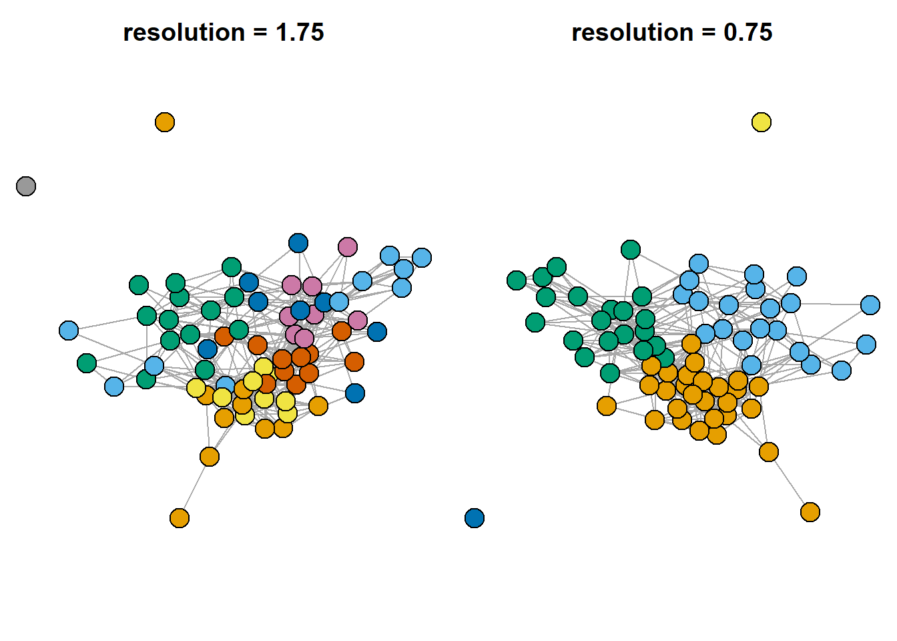


Also, we can search for overlapping communities. I decided not to cover this topic in depth, so, if you are interested, check the ["linkcomm" package documentation](https://alextkalinka.github.io/linkcomm/):


``` r
lc <- getLinkCommunities((asDF(g.friends))$edge[,1:2],
                         hcmethod = "single",
                         plot = TRUE, #...or false
                         verbose = F)
```


``` r

plotLinkCommGraph(lc,
                  verbose = FALSE,
                  vlabel = F)
#>    Getting node community edge density...1%
   Getting node community edge density...3%
   Getting node community edge density...5%
   Getting node community edge density...7%
   Getting node community edge density...9%
   Getting node community edge density...11%
   Getting node community edge density...12%
   Getting node community edge density...14%
   Getting node community edge density...16%
   Getting node community edge density...18%
   Getting node community edge density...20%
   Getting node community edge density...22%
   Getting node community edge density...24%
   Getting node community edge density...25%
   Getting node community edge density...27%
   Getting node community edge density...29%
   Getting node community edge density...31%
   Getting node community edge density...33%
   Getting node community edge density...35%
   Getting node community edge density...37%
   Getting node community edge density...38%
   Getting node community edge density...40%
   Getting node community edge density...42%
   Getting node community edge density...44%
   Getting node community edge density...46%
   Getting node community edge density...48%
   Getting node community edge density...50%
   Getting node community edge density...51%
   Getting node community edge density...53%
   Getting node community edge density...55%
   Getting node community edge density...57%
   Getting node community edge density...59%
   Getting node community edge density...61%
   Getting node community edge density...62%
   Getting node community edge density...64%
   Getting node community edge density...66%
   Getting node community edge density...68%
   Getting node community edge density...70%
   Getting node community edge density...72%
   Getting node community edge density...74%
   Getting node community edge density...75%
   Getting node community edge density...77%
   Getting node community edge density...79%
   Getting node community edge density...81%
   Getting node community edge density...83%
   Getting node community edge density...85%
   Getting node community edge density...87%
   Getting node community edge density...88%
   Getting node community edge density...90%
   Getting node community edge density...92%
   Getting node community edge density...94%
   Getting node community edge density...96%
   Getting node community edge density...98%
   Getting node community edge density...100%
#>    Getting node layout...
#>    Constructing node pies...1%
   Constructing node pies...3%
   Constructing node pies...5%
   Constructing node pies...7%
   Constructing node pies...9%
   Constructing node pies...11%
   Constructing node pies...12%
   Constructing node pies...14%
   Constructing node pies...16%
   Constructing node pies...18%
   Constructing node pies...20%
   Constructing node pies...22%
   Constructing node pies...24%
   Constructing node pies...25%
   Constructing node pies...27%
   Constructing node pies...29%
   Constructing node pies...31%
   Constructing node pies...33%
   Constructing node pies...35%
   Constructing node pies...37%
   Constructing node pies...38%
   Constructing node pies...40%
   Constructing node pies...42%
   Constructing node pies...44%
   Constructing node pies...46%
   Constructing node pies...48%
   Constructing node pies...50%
   Constructing node pies...51%
   Constructing node pies...53%
   Constructing node pies...55%
   Constructing node pies...57%
   Constructing node pies...59%
   Constructing node pies...61%
   Constructing node pies...62%
   Constructing node pies...64%
   Constructing node pies...66%
   Constructing node pies...68%
   Constructing node pies...70%
   Constructing node pies...72%
   Constructing node pies...74%
   Constructing node pies...75%
   Constructing node pies...77%
   Constructing node pies...79%
   Constructing node pies...81%
   Constructing node pies...83%
   Constructing node pies...85%
   Constructing node pies...87%
   Constructing node pies...88%
   Constructing node pies...90%
   Constructing node pies...92%
   Constructing node pies...94%
   Constructing node pies...96%
   Constructing node pies...98%
   Constructing node pies...100%
```


``` r

#plot(lc, type = "graph", layout = "spencer.circle")
## see package documentation for more details
```


Clean environment:


``` r
rm(list = ls())
```


Finally, let's try to reproduce an image with multiple clustering of karateka dataset ([here](https://network-science-data-and-models.github.io/phys7332_fa25/notebooks/class_08/class_08_communities1.html)) - this image is included in the slides, and is intended as an illustration of the idea that there are indeed many approaches to the problem of community detection:


``` r
## karateka graph
g <- ison_karateka

## list of basic functions from `igraph` package, without detailed specifications
functions <- list(
  edge_betweenness = function(graph) igraph::cluster_edge_betweenness(graph),
  fluid_comm = function(graph) igraph::cluster_fast_greedy(graph),
  fast_greedy = function(graph) igraph::cluster_fast_greedy(graph),
  
  infomap = function(graph) igraph::cluster_infomap(graph),
  label_prop = function(graph) igraph::cluster_label_prop(graph),
  ledaing_eigen = function(graph) igraph::cluster_leading_eigen(graph),
  leiden = function(graph) igraph::cluster_leiden(graph),
  louvain = function(graph) igraph::cluster_louvain(graph),
  optimal = function(graph) igraph::cluster_optimal(graph),
  spinglass = function(graph) igraph::cluster_spinglass(graph),
  walktrap = function(graph) igraph::cluster_walktrap(graph))


## plotting parameters:
par(mfrow = c(4,3))

## loop through the functions:
for(i in c(1:11)){
  
  V(g)$group = functions[[i]](g) %>% 
    membership()
  
  set.seed(1)
  par(mar=c(1,1,1,1))
  
  g %>% 
    plot(vertex.label = NA,
         vertex.size = 12,
         cex.main = 0.8,
         main = functions[i] %>%
           toString() %>%
           str_remove_all("function \\(graph\\) \\n|igraph\\:\\:|\\(graph\\)") %>%
           str_c("()"),
         vertex.color = V(g)$group)
}
#> Warning in igraph::cluster_edge_betweenness(graph): At
#> vendor/cigraph/src/community/edge_betweenness.c:503 :
#> Membership vector will be selected based on the highest
#> modularity score.
```


## **Case study: last week OpenAlex network**  {-}


Last week we have discussed bibliographic networks you can obtain using OpenAlex, an open science source of articles' metadata and citations' information. Below is a brief illustration of today's measures on this network:


``` r
library(openalexR)
#> Thank you for using openalexR!
#> To acknowledge our work, please cite the package by calling `citation("openalexR")`.
#> To suppress this message, add `openalexR.message = suppressed` to your .Renviron file.

oa_sustainable <- oa_fetch(entity = "works",
         output = "dataframe",
         display_name.search = 'Sustainable Business Models',
         cited_by_count = ">10",
         verbose = T) ## takes around 20 seconds with my internet connection
#> Requesting url: https://api.openalex.org/works?filter=display_name.search%3ASustainable%20Business%20Models%2Ccited_by_count%3A%3E10
#> Getting 5 pages of results with a total of 896 records...

oa_edges <- oa_sustainable %>% 
  select(id, referenced_works) %>% 
  unnest(referenced_works) %>% 
  mutate(referenced_works = str_squish(str_remove_all(referenced_works,
                                                      "https\\:\\/\\/openalex\\.org\\/"))) %>% 

  filter(referenced_works %in% str_squish(str_remove_all(oa_sustainable$id,
                                              "https\\:\\/\\/openalex\\.org\\/"))) %>% 
  
  mutate(id = str_squish(str_remove_all(id,
                                        "https\\:\\/\\/openalex\\.org\\/"))) %>% 
  `colnames<-`(c("from", "to"))

oa_g <- oa_edges %>% 
  graph_from_data_frame(directed = T,
                        vertices = oa_sustainable %>% 
                          mutate(id = str_remove_all(id,
                                                     "https\\:\\/\\/openalex\\.org\\/")) %>% 
                          select(id, title, publication_year, so, cited_by_count)) %>% 
  simplify()

## leave biggest component only

components <- igraph::clusters(oa_g, mode="weak")
#> Warning: `clusters()` was deprecated in igraph 2.0.0.
#> ℹ Please use `components()` instead.
#> This warning is displayed once every 8 hours.
#> Call `lifecycle::last_lifecycle_warnings()` to see where
#> this warning was generated.
biggest_cluster_id <- which.max(components$csize)

# subgraph
oa_g.biggest <- igraph::induced_subgraph(oa_g,
                                         V(oa_g)[components$membership == biggest_cluster_id])

par(mar=c(0,0,0,0))
set.seed(31)
oa_g.biggest %>% 
  plot(vertex.label = NA,
       vertex.size = 3,
       vertex.color = "coral1",
       edge.color = "black",
       edge.size = 1,
       edge.arrow.size = 0.5, edge.arrow.width = 0.8)
```

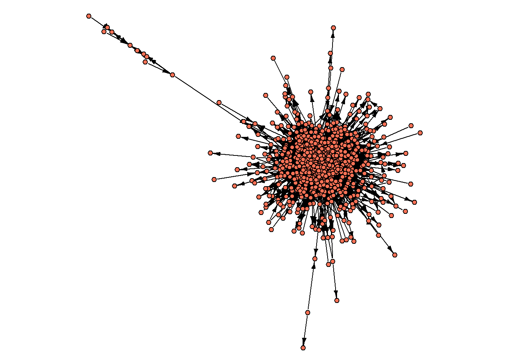


We start by computing the very basic indicators:


``` r
diameter(oa_g.biggest) ## 8
#> [1] 8
average.path.length(oa_g.biggest) ## 2.63
#> Warning: `average.path.length()` was deprecated in igraph 2.0.0.
#> ℹ Please use `mean_distance()` instead.
#> This warning is displayed once every 8 hours.
#> Call `lifecycle::last_lifecycle_warnings()` to see where
#> this warning was generated.
#> [1] 2.629412
edge_density(oa_g.biggest %>% 
               as_undirected()) ## 0.02
#> [1] 0.02245943
(centr_degree(oa_g.biggest, loops=F))$centralization ## 0.23
#> [1] 0.2329838
```


Let's further try to map core/periphery and find communities:


``` r
par(mar=c(0,0,0,0))
set.seed(31)
V(oa_g.biggest)$core = core_periphery(oa_g.biggest)$vec
oa_g.biggest %>% 
  plot(vertex.label = NA,
       vertex.color = ifelse(V(oa_g.biggest)$core == 1,
                             "coral1",
                             "grey70"),
       
       vertex.label = NA,
       vertex.size = 3,
       edge.color = "grey70",
       edge.size = 1,
       edge.arrow.size = 0.5,
       edge.arrow.width = 0.8)
```

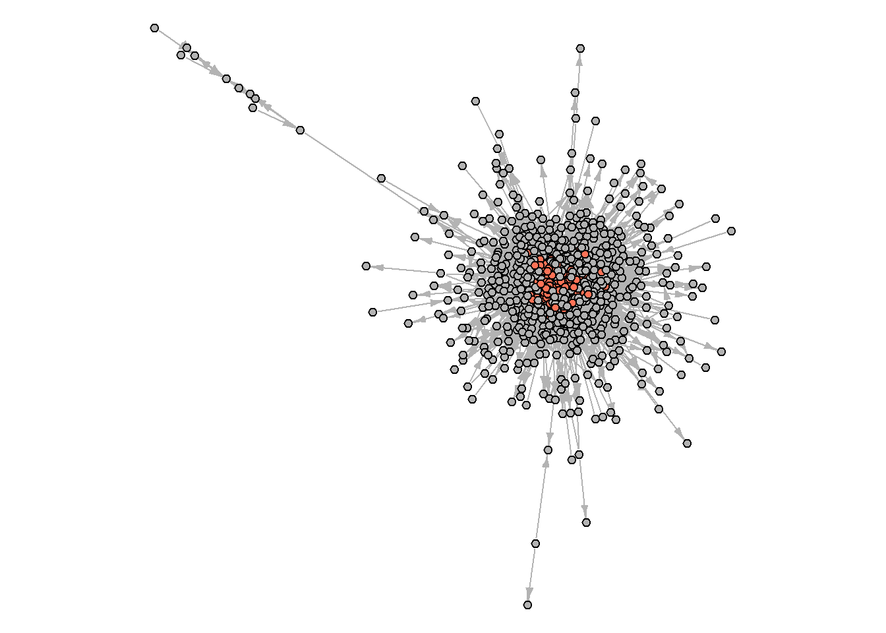


And what about the communities?


``` r
set.seed(31)
cl1 <- cluster_louvain(oa_g.biggest %>%
                            as_undirected(),
                          resolution = 0.8)

V(oa_g.biggest)$cl1 = membership(cl1)

par(mar=c(0,0,0,0))
set.seed(31)

plot(oa_g.biggest,
     vertex.label = NA,
     vertex.color = V(oa_g.biggest)$cl1,
            vertex.label = NA,
       vertex.size = 3,
       edge.color = "grey70",
       edge.size = 1,
       edge.arrow.size = 0.5,
       edge.arrow.width = 0.8)
```

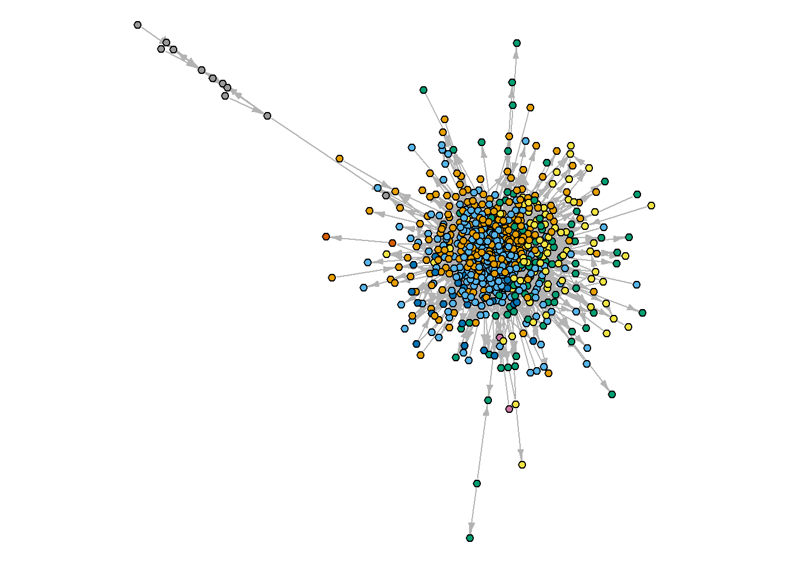


To dive into the obtained clusters, we can group some attributes of the articles to see what's hidden inside (note that we calculated the share of nodes associated with the "core" coming from each of the calculated communities. In some cases, it might be a good idea, if your communities coexist with the core/periphery structure, - we will cover one such example briefly next time):


``` r
(oa_g.biggest %>% 
  asDF())$vertex %>% 
  
  #count(cl1) %>% 
  
  group_by(cl1) %>% 
  summarise(n = n(),
            share.core = round(mean(core),2),
            mean.age = mean(publication_year, na.rm = T))
#> # A tibble: 8 × 4
#>   cl1            n share.core mean.age
#>   <membrshp> <int>      <dbl>    <dbl>
#> 1 1            231       0.16    2019.
#> 2 2            264       0.23    2018.
#> 3 3             87       0.06    2020.
#> 4 4             77       0.04    2020.
#> 5 5             25       0       2017.
#> 6 6              2       0       2018.
#> 7 7              2       0       2021 
#> 8 8             11       0       2014.

#(oa_g.biggest %>% 
#  asDF())$vertex %>% 
  
#  ggplot(aes(cited_by_count)) +
#  geom_histogram() +
#  facet_wrap(~as.factor(cl1), scales = "free")
```


Arguably, we need to adjust our searching query to obtain more meaningful communities, or to use different community detection techniques. At the end of the day, remember, *cohesion is easier to measure than to detect communities, and sometimes you do not need to do the latter*.


## **Networks to work in Gephi** {-}


Install Gephi: https://gephi.org/users/download/


In this short tutorial, we'll look at three datasets in Gephi (available via my github, see the code below, or the course folder) - all sent to you with this code in the archive. Below is a simple example of how to load them into R, analyze them, and save them back for analysis.


### **insna**  {-}

The first data set is `insna`, containing social scientists who studied networks in the 1970s. The data dates back to 1977 and includes information about who taught whom among the participants of the International Network for Social Network Analysis (INSNA). The data was collected by Barry Wellman, the founder of INSNA. Among the 60 participants in the network are Harrison White, Mark Granovetter, Ronald Burt, and Diane Crane.


This data can be obtained from the `networkdata` package (if you don't have 5-7 minutes to spare, it's best not to install this package - it's very large).


``` r
# list all datasets from `networkdata` (987 datasets containing 2260 networks)
## data(package = "networkdata")

# datasets from movies:
## crash <- networkdata::movie_184
## twilight <- networkdata::movie_721

insna <- networkdata::insna

V(insna)$outdegree = degree(insna, mode = "out")
V(insna)$totaldegree = degree(insna, mode = "total")

set.seed(42)
par(mar=c(0,0,0,0))
insna %>% 
  plot(vertex.label = NA,
       vertex.size = V(insna)$outdegree*1.5,
       vertex.color = "black",
       edge.arrow.width = 0.3)
```

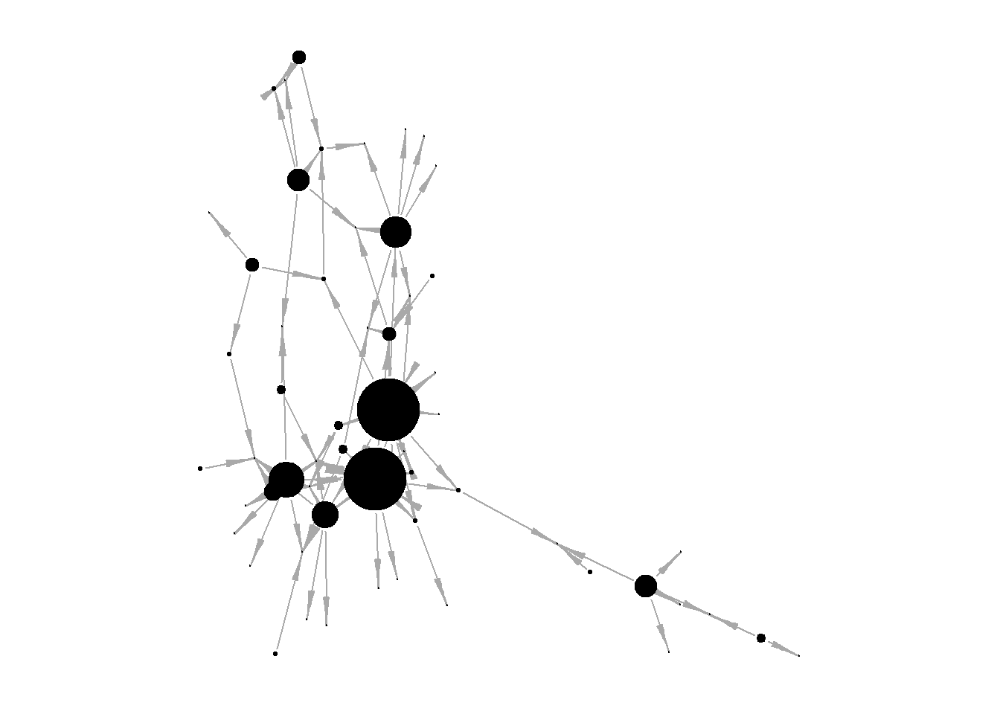


To load lists of edges and nodes, Gephi requires special names for variables:


1. *in the edgelist*, the first columns should be named "Source" and "Target",


2. *in the nodelist*, the first columns should be named "Id" and "Label"


This allows Gephi to mark up the data and load everything correctly. In the code below I get the edgelist and nodelist and rename the first columns in them.


``` r
insna.edgelist <- (insna %>% 
   asDF())$edge %>% 
  `colnames<-`(c("Source", "Target"))

insna.nodelist <- (insna %>% 
   asDF())$vertex %>% 
  rename(Id = intergraph_id,
         Label = name)
```


Save the data:


``` r
# do not forget to check the direction of data saving!
#getwd()

write.csv(insna.edgelist,
          "insna.edgelist.csv",
          row.names = F)
write.csv(insna.nodelist,
          "insna.nodelist.csv",
          row.names = F)
```


Clear environment:


``` r
rm(list = ls())
```


### **Twin Peaks (json)**  {-}


Our next dataset is about the character interactions in "Twin Peaks". We are interested in this dataset as:

  1. an example of data in an atypical format that can be converted into familiar lists of nodes and edges,

  2. from the point of view of the community search: the data already has clustering, but we will also search for communities in R and look at how to search for communities directly in Gephi.


Load data and look at the network (download json): https://moviegalaxies.com/movies/view/851/twin-peaks/#


Data in the json format is already in the archive.


``` r
## to read json-files:
# install.packages("jsonlite")


## data loading:
twinpeaks <- fromJSON("datasets/Moviegalaxies - Twin Peaks.json",
                      flatten=TRUE)

## look at the data structure:
#twinpeaks

## edgelist и nodelist:
twinpeaks.edges <- twinpeaks$network$edges
twinpeaks.nodes <- twinpeaks$network$nodes

## create igraph-object:
twinpeaks.g <- twinpeaks.edges %>% 
  graph_from_data_frame(vertices = twinpeaks.nodes,
                        directed = F)

## community detection:

set.seed(42)
clustering.louvain <- igraph::cluster_louvain(twinpeaks.g,
                                              resolution = 0.7)

V(twinpeaks.g)$our.louvain <- membership(clustering.louvain)

## create new nodelist:
twinpeaks.nodes2 <- (twinpeaks.g %>% 
    asDF())$vertex
```


What is the intersection of the community detection solutions?


``` r
#twinpeaks.nodes2 %>% 
#  count(group, our.louvain)

par(mfrow = c(1,2))

set.seed(31)
par(mar=c(1,1,1,1))
twinpeaks.g %>% 
  plot(vertex.label = NA,
       vertex.size = 7,
       main = "\noriginal mapping\n")

par(mar=c(1,1,1,1))
set.seed(31)
twinpeaks.g %>% 
  plot(vertex.label = NA,
       vertex.size = 7,
       main = "\nlouvain mapping,\nresolution = 0.7",
       vertex.color = ifelse(V(twinpeaks.g)$our.louvain == 1,
                             "coral1",
                             ifelse(V(twinpeaks.g)$our.louvain == 2,
                                    "green",
                                    ifelse(V(twinpeaks.g)$our.louvain == 3,
                                           "blue",
                                           "grey70"))))
```

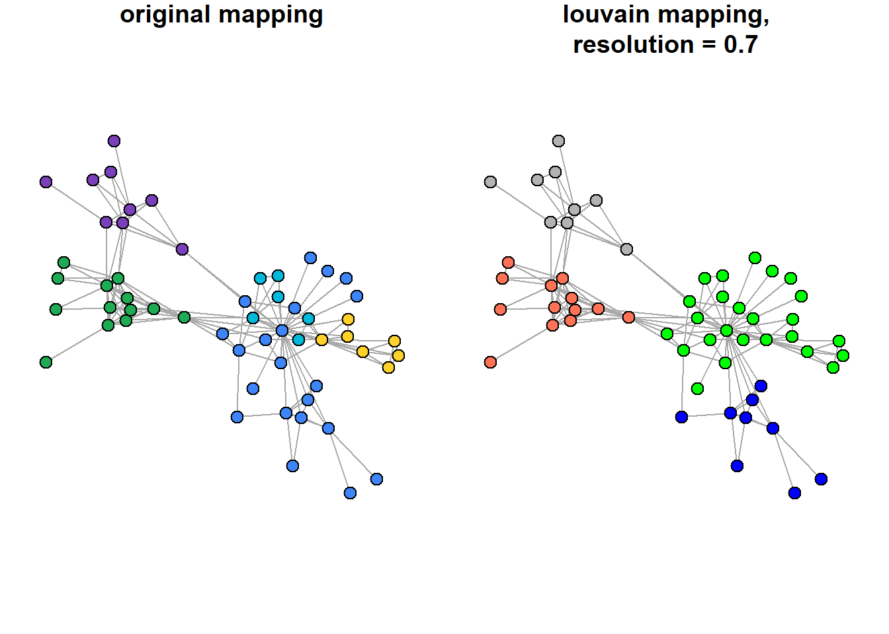


Save data for Gephi:


``` r
## note that in the first table the variables are already named correctly, but for the node list we rename and overwrite id:

write.csv(twinpeaks.edges %>% 
            rename(Source = source,
                   Target = target),
          "twinpeaks.edgelist.csv",
          row.names = F)
write.csv(twinpeaks.nodes2 %>% 
            rename(id = intergraph_id) %>% 
            mutate(id = name),
          "twinpeaks.nodelist.csv",
          row.names = F)
```


Clear the environment:


``` r
rm(list = ls())
```


### **Dictionary of Russian writers of the 18th century: a network of personalities**  {-}


Data source: https://dataverse.pushdom.ru/dataset.xhtml?persistentId=doi:10.31860/openlit-2022.1-B002


Although the authors of the dataset write that "data without preliminary processing can be loaded into programs for network analysis when solving educational problems", it is still better to firstly observe the files in R to get acquainted with their organization, convert them into a format familiar for work, and calculate the statistics of interest.


Following the authors' advice, however, we will immediately go to Gephi with this dataset and try to do the entire analysis there.


``` r
#list.files() - list files in the directory

writers <- read.table("datasets/Persons_EDGES.tab",
                      header = T)

writers %>% 
  head()
#>         Source         Target Weight     Type
#> 1 Н.И.Ахвердов П.И.Богданович      1 directed
#> 2 А.Д.Байбаков     А.А.Барсов      1 directed
#> 3 А.Д.Кантемир     А.К.Барсов      1 directed
#> 4 А.Д.Кантемир    С.С.Волчков      1 directed
#> 5 А.Д.Кантемир  И.И.Ильинский      1 directed
#> 6 А.Д.Кантемир       Ф.Кролик      1 directed
```

Re-write edges:


``` r
write.csv(writers,
          "russian.writers_18century.csv",
          row.names = F)
```


Data description:


> Датасет представляет собой осмысленные в терминах сетевого анализа междустатейные ссылки в Словаре русских писателей XVIII века (1988–2010. Вып. 1–3). Узлами сети выступают посвященные персоналиям статьи словаря, а ребрами -- ссылки на другие статьи в том же словаре. Такая сеть позволяет проследить ключевые тенденции в социальном и интеллектуальном взаимодействии литераторов XVIII века.

> По словам составителей: «В биографиях лиц, вошедших в историю гуманитарной культуры в качестве государственных деятелей, церковных и светских ораторов, ученых (экономистов, географов, правоведов, историков, лингвистов и пр.), издателей журналов и газет, публицистов, составителей сборников литературного содержания и вместе с тем попадающих в “Словарь”, выделяются и рассматриваются прежде всего сочинения, так или иначе повлиявшие на развитие художественной литературы» (Словарь русских писателей XVIII века. Принципы составления. Словник / сост. В. П. Степанов. Л.: Наука, 1975. С. 11). Таким образом, связи в построенной на данных Словаря сети отражают *взаимодействие агентов в поле русской литературы XVIII века.*


Data viz from the authors: https://nevmenandr.github.io/rus-dict18-persons/#


If you want, you can also look in Gephi at the second dataset from the same authors, `foreign_EDGES.csv`, and compare it with the previous data:


> Узлами сети выступают русские писатели XVIII века, ребрами — общность их обращения к одним и тем же европейским литераторам. <...> Такая сеть позволяет
проследить ключевые тенденции в литературной моде XVIII века. Данные организованы в виде ненаправленного взвешенного графа. Вес ребра означает число общих для данных литераторов упоминаний европейских писателей.


Link to the data (it contains the readme file): https://dataverse.pushdom.ru/dataset.xhtml?persistentId=doi:10.31860/openlit-2023.4-B003


## **Graph Commons data**  {-}


For this platform, we need to use different variable names than those required by Gephi. The required renaming is illustrated below with the familiar `insna` data and the Twin Peaks character network.


*For nodes' list:*
  
  
  - "Node Type" (to assign color; I do not use it below)
  
  
  - "Name"
  
  
  - optional: "Description" and "Image"
  
  
  - other columns: anything you want


*For edges' list:*


  - "From Type"


  - "From Name"


  - "Edge Type"


  - "To Type"


  - "To Name" ("column can have multiple names separated by semicolons for adding multiple connections to these nodes at once.")


  - optional: "Weight"


  - other columns: anything you want


INSNA network:


``` r
rm(list = ls())

## load:
insna <- networkdata::insna

## calculate centralities:
V(insna)$outdegree = degree(insna, mode = "out")
V(insna)$totaldegree = degree(insna, mode = "total")

## get edgelist and rename columns appropriately for graph commons:
insna.edgelist <- (insna %>% 
   asDF())$edge %>% 
  `colnames<-`(c("From Name", "To Name")) %>% 
  mutate(`From Type` = "person",
         `Edge Type` = "teaching",
         `To Type` = "person")

## get nodelist and rename columns appropriately for graph commons:
insna.nodelist <- (insna %>% 
   asDF())$vertex %>% 
  rename(Name = intergraph_id,
         displayed_name = name) %>%
  mutate(`Node Type` = "person")

# check directory:
#getwd()

# save:
write.csv(insna.edgelist,
          "GC.insna.edgelist.csv",
          row.names = F)
write.csv(insna.nodelist,
          "GC.insna.nodelist.csv",
          row.names = F)
```


"Twin peaks":


``` r
## to read json-files:
# install.packages("jsonlite")
library(jsonlite)

# clear env:
rm(list = ls())

## load data:
twinpeaks <- fromJSON("datasets/Moviegalaxies - Twin Peaks.json",
                      flatten=TRUE)

## edgelist и nodelist:
twinpeaks.edges <- twinpeaks$network$edges
twinpeaks.nodes <- twinpeaks$network$nodes

## re-naming:
twinpeaks.nodes <- twinpeaks.nodes %>% 
  select(-id, -color) %>% 
  rename(Name = name) %>% 
  mutate(`Node Type` = "character")

twinpeaks.edges <- twinpeaks.edges %>% 
  rename(`From Name` = source,
         `To Name` = target,
         Weight = weight) %>% 
  mutate(`From Type` = "character",
         `To Type` = "character",
         `Edge Type` = "plot connection")

# save:
write.csv(twinpeaks.edges,
          "GC.twinpeaks.edgelist.csv",
          row.names = F)
write.csv(twinpeaks.nodes,
          "GC.twinpeaks.nodelist.csv",
          row.names = F)
```


More about *graph commons*: https://docs.graphcommons.com/


## **Cosmograph** {-}


This is a free-to-use online tool from the Russian creators. Way more advanced than the previous tools.


  - [Tutorial](https://cosmograph.app/docs/cosmograph/How%20to%20Use/)
  
  
  - [Website](no need to register)(https://cosmograph.app/run/)
  
  
  - [tg-channel of one of the creators](https://t.me/dataviznews)
  
  
  - [Recent example of use](https://cosmograph.app/run/?data=https://data.newsgraph.xyz/4500a184-f5bb-4e7d-a646-bfadd2b0b1db.csv&meta=https://data.newsgraph.xyz/f94dcc4b-705b-46b2-bf14-dcec8dce17e1.csv&source=source&target=target&gravity=0.25&repulsion=1&repulsionTheta=0.75&linkSpring=0.4&linkDistance=10&friction=0.85&renderLabels=true&renderHoveredLabel=true&renderLinks=true&nodeSizeScale=0.7&linkWidthScale=1&linkArrowsSizeScale=1&nodeSize=size-sum-size&nodeColor=color-type&linkWidth=width-avg-size&linkColor=color-avg-size&)


The data format needs:

  - edgelist ("source", "target") - it is already enough to build the graph, though you can also add columns "time" and "value"


  - nodelist = metadata file ("id", "color", "size")


To put your hands on the program, you can load the files about the connections of Russian writers created above into the program: they are already in the appropriate format (source, target), and therefore no modifications are needed.


## **Home assignment 3** {-}


Choose a dataset you like ((check [**Available datasets**]) or find a network by yourself), format it appropriately (lists of nodes and edges), and draw the network in Gephi or other software (Graph Commons, Cosmograph). Think about the story you want to tell by showing your network (specific nodes’ positions, network structure, etc.). Feel free to edit the picture using other softwares (if you struggle with captions in Gephi, for example, you can annotate your picture somewhere else).


Insert your graph to pdf/word and write 5-6 sentences about your thought process and story behind the image. Refer to network properties we discussed in class (diameter, homophily, core/peripherical structure) to support your arguments.


If you want to practice more, you can accompany your work with a short report about the most central nodes in the network and/or the structure of the network, including your interpretation of these results.


Deadline: before next class		|	send to aapecherskikh@hse.ru


<!--chapter:end:chapter3.Rmd-->

# **4 - two-mode networks** {-}


Two-mode networks, or bipartite networks, or affiliation networks (these are used interchangeably sometimes), consist of **two distinct sets of nodes, where ties exist only between nodes of different sets** (e.g., people and events, authors and papers). This structure is particularly useful for representing affiliations, co-occurrences, or memberships, while preserving the relationships between these categories. Unlike one-mode networks, analyzing two-mode networks requires specialized workflows and metrics to account for their unique structure. In this session, we will walk through the steps of construction, vizualization, and analysis of a two-mode network.


If you want to consult the other sources, check:


  1. [this discussion of projections](https://toreopsahl.com/tnet/two-mode-networks/projection/),
  
  
  2. [this](https://rpubs.com/pjmurphy/317838) or [that](https://schochastics.github.io/R4SNA/two-mode-networks.html) pages with the workflow in R. Partially, we will take a look at the data from the first source below.
  


Today's lecture slides are available [here](https://docs.google.com/presentation/d/1a7bgijjxv3r3-VjLjCoCmrf1wtlbZZpM9b3xtZGFD58/edit?usp=sharing).

Libraries for this session:


``` r
library(tidyverse)    ## general workflow
library(ggplot2)      ## general for vizualizations 
library(igraph)       ## core package to work with networks
library(intergraph)   ## to convert graphs to data frames and back
library(manynet)      ## data package
library(netUtils)     ## to compute network statistics

# for `networkdata` package:
#install.packages("remotes")
#remotes::install_github("schochastics/networkdata")

library(networkdata)  ## exteremely large library! take time to install in once

#install.packages("oaqc")
#library(oaqc)         ## for more layouts
#library(graphlayouts) ## for more layouts

#install.packages("tnet")
library(tnet)         ## to analyze 2-mode networks without projections

library(data.table)
library(ggrepel)
library(kableExtra)
library(stringr)
```


***

## **Basic example** {-}


The data for the first part of today's session comes from the famous study conducted by Davis and his colleagues (1941). It represents attendance data from 14 social events hosted by 18 women in the American South during the 1930s. This bipartite network captures the *affiliations between women and events*, highlighting patterns of social interaction, group formation, and shared affiliations. It is a classical dataset to tell students about the two-mode network analysis.


This data is available via the `networkdata` package that you should already be aware of. Just in case, this same dataset is attached to the zip-folder I sent you, so, below I load it directly from this file.


``` r
# ?southern_women # - to know more aboout the data

## get data from `networkdata`:
data(southern_women)

## save data for it to be available to you
#save.image("southern_women.RData")

## load this same data back:
load("datasets/southern_women.RData")
southern_women %>% 
  str()
#> -----------------------------------------------------------
#> UNNAMED NETWORK (undirected, unweighted, two-mode network)
#> -----------------------------------------------------------
#> Nodes: 32, Edges: 89, Density: 0.1794, Components: 1,
#> Isolates: 0
#> -Vertex Attributes:
#>  type(l): FALSE, FALSE, FALSE, FALSE, FALSE, FALSE, ...
#>  name(c): EVELYN, LAURA, THERESA, BRENDA, CHARLOTTE, ...
#> ---
#> -Edges (first 10): 
#>  EVELYN--6/27 EVELYN--3/2 EVELYN--4/12 EVELYN--9/26
#> EVELYN--2/25 EVELYN--5/19 EVELYN--9/16 EVELYN--4/8
#> LAURA--6/27 LAURA--3/2
```

By looking at this data structure, you should note several things:


  1. types of nodes (women and events) are not differentiated when counting the number of nodes.
  
  
  2. However, there is a nodes' attribute "type" which specifies whether a node is an event or a women. When you create a graph with the two-mode organization by yourself, `igraph` would not recognize its special nature unless you provide this variable, "type", in the nodes' list.


Let's try to plot this graph to get a better sense of two-mode networks:


``` r
#asDF(southern_women) - run to see how people are distinguished from events

set.seed(42)
par(mar=c(0,0,0,0))
southern_women %>% 
  plot(vertex.label.cex = 0.5,
       vertex.label.color = "black",
       vertex.color = ifelse(V(southern_women)$type == FALSE,
                             "coral1",
                             "darkblue"),
       vertex.shape = ifelse(V(southern_women)$type == FALSE,
                             "square",
                             "circle"))
```

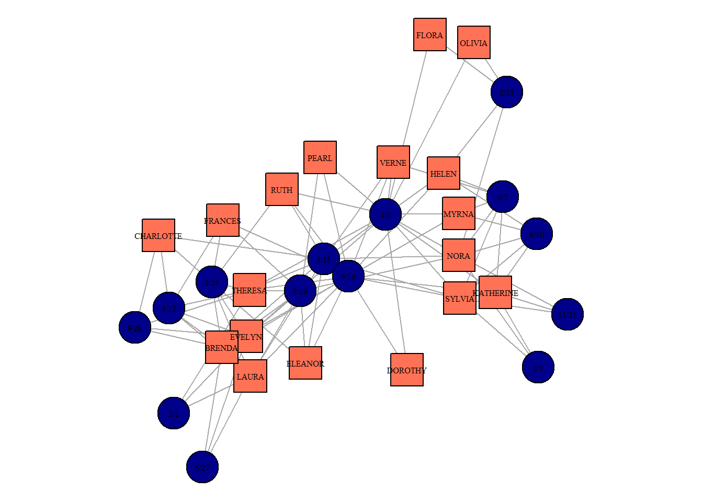


`igraph` includes some fancy network layouts which can look pretty when dealing with two-mode networks. These examples also show you how to excel at network visualizations in R:


  (1) we remove nodes' captions to simplify the picture,
  
  
  (2) we code the types of nodes using colors and shapes together,
  
  
  (3) we change layouts each time to see whether the network structure is presented intuitively clear,
  
  
  (4) finally, we add titles so that the layout applied is shown.


``` r
par(mfrow = c(2,2))
par(mar=c(2,2,2,2))
southern_women %>% 
  plot(vertex.label = NA,
       vertex.color = ifelse(V(southern_women)$type == FALSE,
                             "coral1",
                             "darkblue"),
       vertex.shape = ifelse(V(southern_women)$type == FALSE,
                             "square",
                             "circle"),
       layout = layout_as_bipartite(southern_women),
       main = "layout_as_bipartite()") 

par(mar=c(2,2,2,2))
southern_women %>% 
  plot(vertex.label = NA,
       vertex.color = ifelse(V(southern_women)$type == FALSE,
                             "coral1",
                             "darkblue"),
       vertex.shape = ifelse(V(southern_women)$type == FALSE,
                             "square",
                             "circle"),
       layout = layout_nicely(southern_women),
       main = "layout_nicely()") 

par(mar=c(2,2,2,2))
southern_women %>% 
  plot(vertex.label = NA,
       vertex.color = ifelse(V(southern_women)$type == FALSE,
                             "coral1",
                             "darkblue"),
       vertex.shape = ifelse(V(southern_women)$type == FALSE,
                             "square",
                             "circle"),
       layout = layout_in_circle(southern_women),
       main = "layout_in_circle()") 

par(mar=c(2,2,2,2))
southern_women %>% 
  plot(vertex.label = NA,
       vertex.color = ifelse(V(southern_women)$type == FALSE,
                             "coral1",
                             "darkblue"),
       vertex.shape = ifelse(V(southern_women)$type == FALSE,
                             "square",
                             "circle"),
       layout = layout_with_mds(southern_women),
       main = "layout_with_mds()") 
```


Probably, the core message in-scripted in these pictures is the presence of two types of nodes and the exclusive attachment of dissimilar nodes to each other. Again, these are the core features of the two-mode networks, and they bound the range of techniques we can apply to study this graph.


Theoretically, we have 3 options:
  
  
  1. proceed as usual, and apply typical one-mode measures to the two-mode network
  
  
  2. analyze each mode separately using two-mode metrics
  
  
  3. convert the two-Mode network into two projections (i.e., a network of women and a network of events, where the ties correspond to the omitted type of nodes) and analyze them both as the usual one-mode networks.


The first approach involves treating the two-mode network as-is and applying standard metrics like degree centrality, betweenness centrality, and closeness centrality directly to the bipartite structure. While familiar and straightforward, this strategy may overlook nuances specific to the two-mode context, as *many of these measures assume homogeneity among nodes*. For example, computing degree centrality can highlight which women attended the most events and which events had the highest participation, meanwhile writing these centrality values into a single column. This last obstacle can puzzle us once the networks get larger and some of the second-order nodes receive too many connections. To put shortly, the comparison of the centralities of these two types of nodes might be misleading. And *it gets worse with other measures*, and degree centrality, as the simpliest version of centrality, is an only real option to calculate (even with the difficulties just metioned).


``` r
V(southern_women)$degree = degree(southern_women,
                                  mode = "all") ## note that affiliation networks cannot be directed, in a sense, as well as its projections

(asDF(southern_women))$vertex %>% 
  select(-intergraph_id) %>% 
  mutate(type = ifelse(type == F,
                       "women",
                       "event")) %>% 
  group_by(type) %>% 
  slice_max(degree, n = 3) %>% 
  kable() %>% 
  kable_styling(full_width = F)
```

<table class="table" style="color: black; width: auto !important; margin-left: auto; margin-right: auto;">
 <thead>
  <tr>
   <th style="text-align:left;"> type </th>
   <th style="text-align:left;"> name </th>
   <th style="text-align:right;"> degree </th>
  </tr>
 </thead>
<tbody>
  <tr>
   <td style="text-align:left;"> event </td>
   <td style="text-align:left;"> 9/16 </td>
   <td style="text-align:right;"> 14 </td>
  </tr>
  <tr>
   <td style="text-align:left;"> event </td>
   <td style="text-align:left;"> 4/8 </td>
   <td style="text-align:right;"> 12 </td>
  </tr>
  <tr>
   <td style="text-align:left;"> event </td>
   <td style="text-align:left;"> 3/15 </td>
   <td style="text-align:right;"> 10 </td>
  </tr>
  <tr>
   <td style="text-align:left;"> women </td>
   <td style="text-align:left;"> EVELYN </td>
   <td style="text-align:right;"> 8 </td>
  </tr>
  <tr>
   <td style="text-align:left;"> women </td>
   <td style="text-align:left;"> THERESA </td>
   <td style="text-align:right;"> 8 </td>
  </tr>
  <tr>
   <td style="text-align:left;"> women </td>
   <td style="text-align:left;"> NORA </td>
   <td style="text-align:right;"> 8 </td>
  </tr>
</tbody>
</table>


The code from above computes the degree centrality scores (nothing new to you) and produce a table with the nodes of each class which possess the highest degree values. It should be interpreted as "Evelyn attended 8 events", or "event on 16th of September was attended by 14 women (all who are present in the data attended it)".


The second option we have is to apply metrics developed specifically for two-mode networks. They allow researchers to investigate each set of nodes individually while preserving their connections to the other set. For instance, bipartite density measures the proportion of possible ties in the network, while metrics like two-mode clustering coefficients examine how groups form across the sets. **Analyzing modes separately ensures that the unique nature of bipartite ties is not lost.**


Unfortunately for us, this line of the possible workflows is not currently well-developed for R. The only available reliable package we have at the moment is `tnet` developed by [Tore Opsahl](https://toreopsahl.com/). We would not cover it today (although, you can consult external sources on `tnet` or work in the other softwares, like Pajek, to work in this style).


The third option is the one we focus on below. It implies a common strategy to project the two-mode network onto one or both sets of nodes, resulting in one-mode networks. **In the projection, nodes from one set are connected if they share a common neighbor in the other set.** For example, women could be connected if they attended the same event, or events could be connected if they were attended by the same women. This approach facilitates the use of standard one-mode network analysis tools but **risks introducing bias, as projections often inflate edge weights and lose important bipartite context.** Careful interpretation is required to avoid overestimating connectivity.


The simplest way to get the projections is to multiply two-mode matrice to its transposed version (i.e., the matrix where rows become columns and columns become rows). This is a way to get one of the one-mode networks, or projections. Once we change the order of multiplication, we get the second desired one-mode network. The code below shows these steps in details:


``` r
## 1. get the matrix:

#(southern_women %>%
#  as_biadjacency_matrix())[1:6, 1:6] ## - to check if everything is correct

bimod.matrix <- southern_women %>%
  as_biadjacency_matrix()

## 2. get the projections by matrices multiplications:

women_matrix <- bimod.matrix %*% t(bimod.matrix)
event_matrix <- t(bimod.matrix) %*% bimod.matrix
## the order of multiplication is important!

## remove the artificial loops:
diag(women_matrix) <- 0
diag(event_matrix) <- 0

## 3. structure of the new one-mode women network:
women_matrix %>% 
  graph_from_adjacency_matrix(mode = "undirected")
#> IGRAPH 1c086d1 UN-- 18 322 -- 
#> + attr: name (v/c)
#> + edges from 1c086d1 (vertex names):
#>  [1] EVELYN--LAURA     EVELYN--LAURA     EVELYN--LAURA    
#>  [4] EVELYN--LAURA     EVELYN--LAURA     EVELYN--LAURA    
#>  [7] EVELYN--THERESA   EVELYN--THERESA   EVELYN--THERESA  
#> [10] EVELYN--THERESA   EVELYN--THERESA   EVELYN--THERESA  
#> [13] EVELYN--THERESA   EVELYN--BRENDA    EVELYN--BRENDA   
#> [16] EVELYN--BRENDA    EVELYN--BRENDA    EVELYN--BRENDA   
#> [19] EVELYN--BRENDA    EVELYN--CHARLOTTE EVELYN--CHARLOTTE
#> [22] EVELYN--CHARLOTTE EVELYN--FRANCES   EVELYN--FRANCES  
#> + ... omitted several edges
```

As seen from the structure of the women network (one-mode projection) given above, we indeed shifted to the networks with the simple and supposedly easy to work with structure (one-mode).


We can now plot these two networks:


``` r
## get igraph objects:
g.women <- women_matrix %>% 
  graph_from_adjacency_matrix(mode = "undirected",
                              weighted = T)
g.events <- event_matrix %>% 
  graph_from_adjacency_matrix(mode = "undirected",
                              weighted = T)

## calculate simple centralities:
V(g.women)$degree = degree(g.women, mode = "all")
V(g.events)$degree = degree(g.events, mode = "all")

## plotting:
par(mfrow = c(1,2))
par(mar=c(2,2,2,2))
g.women %>% 
  plot(vertex.label.cex = 0.5,
       vertex.label.color = "black",
       vertex.size = V(g.women)$degree,
       vertex.color = "coral1",
       vertex.shape = "square",
       layout = layout_with_dh(g.women),
       main = "women projection")

par(mar=c(2,2,2,2))
g.events %>% 
  plot(vertex.label.cex = 0.9,
       vertex.label.color = "black",
       vertex.size = V(g.events)$degree,
       vertex.color = "darkblue",
       vertex.shape = "circle",
       layout = layout_with_dh(g.events),
       main = "events projection")
```


We can compute centrality values for both sets of nodes (women and events):


``` r
V(g.women)$degree = degree(g.women, mode = "all")
V(g.women)$betweenness.score <- betweenness(g.women)
V(g.women)$closeness.score <- closeness(g.women)

(g.women %>% 
  asDF())$vertex %>% 
  select(name, degree, betweenness.score, closeness.score) %>% 
  mutate(betweenness.score = round(betweenness.score,2),
         closeness.score = round(closeness.score,2)) %>% 
  arrange(desc(betweenness.score)) %>% 
  kable() %>% 
  kable_styling(full_width = F)
```

<table class="table" style="color: black; width: auto !important; margin-left: auto; margin-right: auto;">
 <thead>
  <tr>
   <th style="text-align:left;"> name </th>
   <th style="text-align:right;"> degree </th>
   <th style="text-align:right;"> betweenness.score </th>
   <th style="text-align:right;"> closeness.score </th>
  </tr>
 </thead>
<tbody>
  <tr>
   <td style="text-align:left;"> OLIVIA </td>
   <td style="text-align:right;"> 12 </td>
   <td style="text-align:right;"> 18.53 </td>
   <td style="text-align:right;"> 0.04 </td>
  </tr>
  <tr>
   <td style="text-align:left;"> FLORA </td>
   <td style="text-align:right;"> 12 </td>
   <td style="text-align:right;"> 18.53 </td>
   <td style="text-align:right;"> 0.04 </td>
  </tr>
  <tr>
   <td style="text-align:left;"> DOROTHY </td>
   <td style="text-align:right;"> 16 </td>
   <td style="text-align:right;"> 13.02 </td>
   <td style="text-align:right;"> 0.04 </td>
  </tr>
  <tr>
   <td style="text-align:left;"> HELEN </td>
   <td style="text-align:right;"> 17 </td>
   <td style="text-align:right;"> 8.39 </td>
   <td style="text-align:right;"> 0.04 </td>
  </tr>
  <tr>
   <td style="text-align:left;"> FRANCES </td>
   <td style="text-align:right;"> 15 </td>
   <td style="text-align:right;"> 7.87 </td>
   <td style="text-align:right;"> 0.04 </td>
  </tr>
  <tr>
   <td style="text-align:left;"> MYRNA </td>
   <td style="text-align:right;"> 16 </td>
   <td style="text-align:right;"> 7.31 </td>
   <td style="text-align:right;"> 0.03 </td>
  </tr>
  <tr>
   <td style="text-align:left;"> KATHERINE </td>
   <td style="text-align:right;"> 16 </td>
   <td style="text-align:right;"> 7.31 </td>
   <td style="text-align:right;"> 0.03 </td>
  </tr>
  <tr>
   <td style="text-align:left;"> VERNE </td>
   <td style="text-align:right;"> 17 </td>
   <td style="text-align:right;"> 2.51 </td>
   <td style="text-align:right;"> 0.03 </td>
  </tr>
  <tr>
   <td style="text-align:left;"> SYLVIA </td>
   <td style="text-align:right;"> 17 </td>
   <td style="text-align:right;"> 2.51 </td>
   <td style="text-align:right;"> 0.03 </td>
  </tr>
  <tr>
   <td style="text-align:left;"> CHARLOTTE </td>
   <td style="text-align:right;"> 11 </td>
   <td style="text-align:right;"> 2.08 </td>
   <td style="text-align:right;"> 0.03 </td>
  </tr>
  <tr>
   <td style="text-align:left;"> NORA </td>
   <td style="text-align:right;"> 17 </td>
   <td style="text-align:right;"> 1.49 </td>
   <td style="text-align:right;"> 0.03 </td>
  </tr>
  <tr>
   <td style="text-align:left;"> ELEANOR </td>
   <td style="text-align:right;"> 15 </td>
   <td style="text-align:right;"> 0.62 </td>
   <td style="text-align:right;"> 0.03 </td>
  </tr>
  <tr>
   <td style="text-align:left;"> LAURA </td>
   <td style="text-align:right;"> 15 </td>
   <td style="text-align:right;"> 0.45 </td>
   <td style="text-align:right;"> 0.03 </td>
  </tr>
  <tr>
   <td style="text-align:left;"> BRENDA </td>
   <td style="text-align:right;"> 15 </td>
   <td style="text-align:right;"> 0.45 </td>
   <td style="text-align:right;"> 0.03 </td>
  </tr>
  <tr>
   <td style="text-align:left;"> EVELYN </td>
   <td style="text-align:right;"> 17 </td>
   <td style="text-align:right;"> 0.09 </td>
   <td style="text-align:right;"> 0.03 </td>
  </tr>
  <tr>
   <td style="text-align:left;"> THERESA </td>
   <td style="text-align:right;"> 17 </td>
   <td style="text-align:right;"> 0.09 </td>
   <td style="text-align:right;"> 0.03 </td>
  </tr>
  <tr>
   <td style="text-align:left;"> PEARL </td>
   <td style="text-align:right;"> 16 </td>
   <td style="text-align:right;"> 0.09 </td>
   <td style="text-align:right;"> 0.03 </td>
  </tr>
  <tr>
   <td style="text-align:left;"> RUTH </td>
   <td style="text-align:right;"> 17 </td>
   <td style="text-align:right;"> 0.09 </td>
   <td style="text-align:right;"> 0.03 </td>
  </tr>
</tbody>
</table>


By contrast, we can use `tnet` package to compute weighted centrality scores. To do that, we firstly need to convert our matrix to `tnet` format.


``` r
women_tnet <- as.tnet(women_matrix)

tnet_degree <- degree_w(women_tnet)
tnet_betweenness <- betweenness_w(women_tnet)
tnet_closeness <- closeness_w(women_tnet,
                              gconly = FALSE)

southern_women_compare <- data.frame(
  name = row.names(women_matrix),
  weighted_degree = tnet_degree[,2],
  weighted_betweenness = tnet_betweenness[,2],
  weighted_closeness = tnet_closeness[,3]) %>%
  
  left_join((asDF(g.women))$vertex %>%
              select(-intergraph_id))

head(southern_women_compare) %>%
  kable() %>% 
  kable_styling(full_width = F)
```

<table class="table" style="color: black; width: auto !important; margin-left: auto; margin-right: auto;">
 <thead>
  <tr>
   <th style="text-align:left;"> name </th>
   <th style="text-align:right;"> weighted_degree </th>
   <th style="text-align:right;"> weighted_betweenness </th>
   <th style="text-align:right;"> weighted_closeness </th>
   <th style="text-align:right;"> degree </th>
   <th style="text-align:right;"> betweenness.score </th>
   <th style="text-align:right;"> closeness.score </th>
  </tr>
 </thead>
<tbody>
  <tr>
   <td style="text-align:left;"> EVELYN </td>
   <td style="text-align:right;"> 17 </td>
   <td style="text-align:right;"> 4.5000000 </td>
   <td style="text-align:right;"> 1.2926019 </td>
   <td style="text-align:right;"> 17 </td>
   <td style="text-align:right;"> 0.0909091 </td>
   <td style="text-align:right;"> 0.0294118 </td>
  </tr>
  <tr>
   <td style="text-align:left;"> LAURA </td>
   <td style="text-align:right;"> 15 </td>
   <td style="text-align:right;"> 0.3333333 </td>
   <td style="text-align:right;"> 1.2315491 </td>
   <td style="text-align:right;"> 15 </td>
   <td style="text-align:right;"> 0.4523810 </td>
   <td style="text-align:right;"> 0.0285714 </td>
  </tr>
  <tr>
   <td style="text-align:left;"> THERESA </td>
   <td style="text-align:right;"> 17 </td>
   <td style="text-align:right;"> 34.3333333 </td>
   <td style="text-align:right;"> 1.4575448 </td>
   <td style="text-align:right;"> 17 </td>
   <td style="text-align:right;"> 0.0909091 </td>
   <td style="text-align:right;"> 0.0263158 </td>
  </tr>
  <tr>
   <td style="text-align:left;"> BRENDA </td>
   <td style="text-align:right;"> 15 </td>
   <td style="text-align:right;"> 1.5000000 </td>
   <td style="text-align:right;"> 1.2569419 </td>
   <td style="text-align:right;"> 15 </td>
   <td style="text-align:right;"> 0.4523810 </td>
   <td style="text-align:right;"> 0.0285714 </td>
  </tr>
  <tr>
   <td style="text-align:left;"> CHARLOTTE </td>
   <td style="text-align:right;"> 11 </td>
   <td style="text-align:right;"> 0.0000000 </td>
   <td style="text-align:right;"> 0.8642842 </td>
   <td style="text-align:right;"> 11 </td>
   <td style="text-align:right;"> 2.0833333 </td>
   <td style="text-align:right;"> 0.0285714 </td>
  </tr>
  <tr>
   <td style="text-align:left;"> FRANCES </td>
   <td style="text-align:right;"> 15 </td>
   <td style="text-align:right;"> 0.0000000 </td>
   <td style="text-align:right;"> 0.9477175 </td>
   <td style="text-align:right;"> 15 </td>
   <td style="text-align:right;"> 7.8690476 </td>
   <td style="text-align:right;"> 0.0357143 </td>
  </tr>
</tbody>
</table>


We can compare the values we got from two approaches. The values are different when plotting two types of betweenness against each other.


``` r
#southern_women_compare %>% 
#  ggplot(aes(degree, weighted_degree)) +
#  geom_point() ## values are similar

southern_women_compare %>% 
  ggplot(aes(betweenness.score, weighted_betweenness)) +
  geom_point() +
  geom_text_repel(aes(label = name), size = 2)
```


``` r

#southern_women_compare %>% 
#  ggplot(aes(closeness.score, weighted_closeness)) +
#  geom_point()
```


Actors with the highest scores:


``` r
par(mar=c(0,0,0,0))
g.women %>% 
  plot(vertex.label.cex = 0.5,
       vertex.label.color = "black",
       #vertex.size = V(g.women)$betweenness.score,
       vertex.color = ifelse(V(g.women)$name %in% c("OLIVIA", "FLORA"),
                             "coral1",
                             ifelse(V(g.women)$name %in% c("NORA", "THERESA"),
                                    
                                    "lightblue",
                                    "grey60")),
       vertex.size = V(g.women)$degree*1.5,
       vertex.shape = "square",
       layout = layout_nicely(g.women))
```


Communities in the women projection:


``` r
set.seed(42)
cl <- cluster_louvain(g.women)

V(g.women)$cl = membership(cl)

par(mar=c(0,0,0,0))
g.women %>% 
  plot(vertex.label.cex = 0.5,
       vertex.label.color = "black",
       #vertex.size = V(g.women)$betweenness.score,
       vertex.size = V(g.women)$degree*1.5,
       vertex.color = ifelse(V(g.women)$cl == 1,
                             "coral1",
                             "lightblue"),
       vertex.shape = "square",
       layout = layout_nicely(g.women))
```

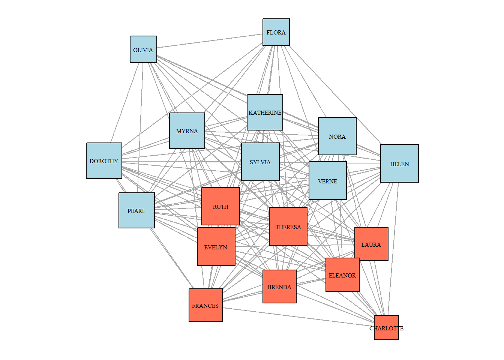


And in the matrix form (we will analyze next time):


``` r
library(blockmodeling)

class2 <- optRandomParC(M=women_matrix,
                        k = 2,
                        rep = 10,
                        approach="ss",
                        blocks="com",
                        printRep = F)
#> 
#> 
#> Optimization of all partitions completed
#> 1 solution(s) with minimal error = 392.3794 found.

plot(class2, main = NA)
```

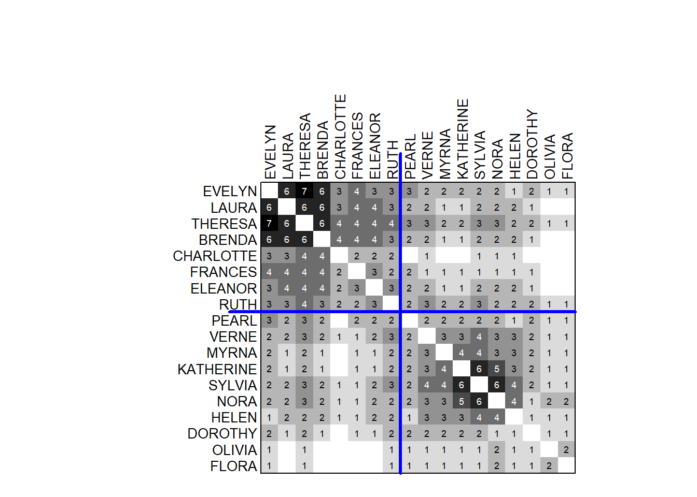


## **Dimensionality reduction** {-}


Dimensionality Reduction refers to the process of reducing the number of variables or dimensions in a dataset while retaining as much meaningful information as possible. This is particularly useful in exploratory data analysis, visualization, and machine learning when high-dimensional data becomes challenging to interpret or analyze.


Correspondence Analysis (CA) is a dimensionality reduction method designed for visualizing the relationships between rows and columns in a contingency table. By decomposing the chi-squared statistic of the table, it projects the data onto a lower-dimensional space, revealing patterns and associations. CA has a natural connection to the analysis of two-mode networks, as it provides a powerful framework for understanding relationships between two distinct sets of entities, much like bipartite networks.


Computation and the variation explained:


``` r
southern_women2 <- southern_women %>% 
  as_biadjacency_matrix() %>% 
  as.data.frame.matrix() ## 18 rows = women, 14 columns = events


library(ca)
library(factoextra)
## perform correspondence analysis
res.ca <- ca(southern_women2, graph = FALSE)

## plot with the variance explained by each dimension:
fviz_eig(res.ca)
```


Plotting:


``` r
women.profiles <- get_ca_row(res.ca)
events.profiles <- get_ca_col(res.ca) 

women.profiles$coord %>% 
  data.frame() %>%
  mutate(name = row.names(.),
         type = "people") %>%
  
  bind_rows(events.profiles$coord %>%
              data.frame() %>%
              mutate(name = row.names(.),
                     type = "events")) %>% 
  
  ggplot(aes(Dim.1, Dim.2, color = type)) +
  geom_point() +
  geom_text_repel(aes(label = name), size = 3) +
  
  scale_color_manual(values = c("darkblue", "coral1")) +
  theme(legend.position = "none")
```


## **Clustering a two-mode network on cultural tastes and leisure activities** {-}


This data was collected by the group of sociology students who attended the course on "Culture and Inequality" during the spring of 2025. The goal here was to map the respondents' perception of association between the jobs / professions and cultural preferences. The whole research strategy is inspired by:


> Boltanski, L., & Thévenot, L. (1983). Finding one's way in social space: a study based on games. Social science information, 22(4-5), 631-680.


This is an on-going project, so it is just the slice of the data. Apologies that it is in Russian.


``` r
cultural.choices <- fread("datasets/cultural.choices_table.csv")
```


First, we need to consturct a graph object:


``` r
g <- cultural.choices %>% 
  count(cultural_choice, occupation_card) %>% 
  rename(weight = n) %>% 
  graph_from_data_frame(directed = F)

nodelist <- asDF(g)$edge %>% 
  count(V1) %>% 
  select(-n) %>% 
  
  left_join(asDF(g)$vertex %>% 
  rename(V1 = intergraph_id)) %>% 
  
  mutate(type = "choice") %>% 
  
  rename(intergraph_id = V1) %>% 
  
  bind_rows(asDF(g)$edge %>% 
  count(V2) %>% 
  select(-n) %>% 
  
  left_join(asDF(g)$vertex %>%
              rename(V2 = intergraph_id)) %>% 
  
  mutate(type = "occupation") %>% 
    rename(intergraph_id = V2))

g <- cultural.choices %>% 
  count(cultural_choice, occupation_card) %>% 
  rename(weight = n) %>% 
  graph_from_data_frame(directed = F,
                        vertices = nodelist %>% 
                          select(-intergraph_id))

g %>% 
  plot(vertex.label = NA,
       vertex.color = ifelse(V(g)$type == "choice",
                             "coral1",
                             "lightblue"),
       vertex.shape = ifelse(V(g)$type == "choice",
                             "circle",
                             "square"))
```

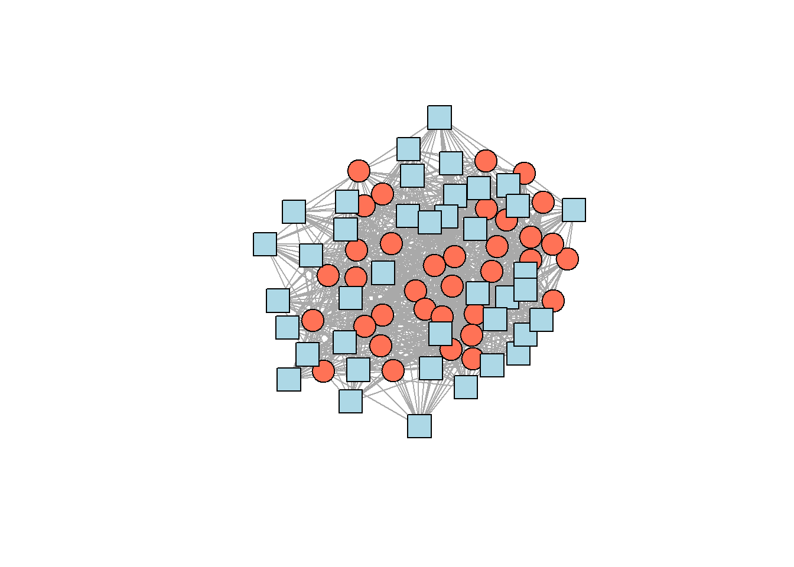


Community detection:


``` r
set.seed(42)
cl <- g %>% 
  cluster_fast_greedy(weights = E(g)$weight) 

  #membership() %>% 
  #sizes()
cl
#> IGRAPH clustering fast greedy, groups: 4, mod: 0.29
#> + groups:
#>   $`1`
#>    [1] "бывали на каникулах в италии"                      
#>    [2] "были в мариинском театре в прошлом месяце"         
#>    [3] "живут на петроградке"                              
#>    [4] "знают французский"                                 
#>    [5] "покупают в среднем две книги в месяц"              
#>    [6] "придерживаются оппозиционных политических взглядов"
#>    [7] "смотрят фестивальное кино"                         
#>    [8] "старше 60 лет"                                     
#>    [9] "артист оркестра"                                   
#>   + ... omitted several groups/vertices
```


Table with clusters:


``` r
V(g)$fast.greedy.cl = membership(cl)

asDF(g)$vertex %>% 
  group_by(type, fast.greedy.cl) %>% 
  summarise(members = toString(name)) %>% 
  ungroup() %>% 
  
  pivot_wider(names_from = "type",
              values_from = "members") %>%
  rename(`fast-greedy cluster` = fast.greedy.cl,
         choices = choice,
         occupations = occupation)
#> # A tibble: 4 × 3
#>   `fast-greedy cluster` choices                  occupations
#>   <membrshp>            <chr>                    <chr>      
#> 1 1                     бывали на каникулах в и… артист орк…
#> 2 2                     были на спортивном матч… повар, про…
#> 3 3                     носят натуральную дубле… агент по н…
#> 4 4                     вегетарианцы, ежедневно… администра…

#as_image(width = 8, height = 20) -- other option
#install.packages("webshot2")
#install.packages("magick")
```


Overview from Gephi:


## **Case study: interlocking editors in Russian sociology** {-}


``` r
rm(list = ls())
```


Read more about the data: https://github.com/artpech23/russian_sociology_abstracts.sequel


load data:


``` r
vertices <- read.csv("datasets/journals_nodes.csv")
edges <- read.csv("datasets/journals_edges.csv")

mode2 <- read.csv("datasets/2mode_journals.csv")

rm(edges)
```


Get projections:


``` r
##########################################
## get bimodal network and projections: ##
##########################################

two.mode <- graph_from_data_frame(mode2 %>%
                                    ## get unique journal-editor couples:
                                    count(journal_name, 
                                          unified_name),
                                  directed = F)

## assign bipartite mapping:
V(two.mode)$type <- bipartite_mapping(two.mode)$type

## extract projections:
bipartite_matrix <- as_biadjacency_matrix(two.mode)

journal_matrix <- bipartite_matrix %*% t(bipartite_matrix)
people_matrix <- t(bipartite_matrix) %*% bipartite_matrix

## create journals' projection:
diag(journal_matrix) <- 0
diag(people_matrix) <- 0

g_journals <- graph_from_adjacency_matrix(journal_matrix,
                                          mode = "undirected",
                                          weighted = TRUE)
g_people <- graph_from_adjacency_matrix(people_matrix,
                                          mode = "undirected",
                                          weighted = TRUE)

rm(bipartite_matrix, journal_matrix, two.mode)
```


Central editors:


``` r
V(g_people)$totaldegree = degree(g_people, mode = "all")
V(g_people)$betweenness.score = betweenness(g_people)

#(asDF(g_people))$vertex %>% 
#  arrange(desc(totaldegree))

## better way:
mode2 %>% 
  count(journal_name, unified_name) %>% 
  count(unified_name) %>% 
  arrange(desc(n)) %>% 
  top_n(7, n) %>% 
  kable() %>% 
  kable_styling(full_width = F)
```

<table class="table" style="color: black; width: auto !important; margin-left: auto; margin-right: auto;">
 <thead>
  <tr>
   <th style="text-align:left;"> unified_name </th>
   <th style="text-align:right;"> n </th>
  </tr>
 </thead>
<tbody>
  <tr>
   <td style="text-align:left;"> зубок юлия альбертовна </td>
   <td style="text-align:right;"> 9 </td>
  </tr>
  <tr>
   <td style="text-align:left;"> голенкова зинаида тихоновна </td>
   <td style="text-align:right;"> 8 </td>
  </tr>
  <tr>
   <td style="text-align:left;"> тощенко жан терентьевич </td>
   <td style="text-align:right;"> 8 </td>
  </tr>
  <tr>
   <td style="text-align:left;"> горшков михаил константинович </td>
   <td style="text-align:right;"> 7 </td>
  </tr>
  <tr>
   <td style="text-align:left;"> черныш михаил федорович </td>
   <td style="text-align:right;"> 6 </td>
  </tr>
  <tr>
   <td style="text-align:left;"> ивченков сергей григорьевич </td>
   <td style="text-align:right;"> 5 </td>
  </tr>
  <tr>
   <td style="text-align:left;"> каменева татьяна николаевна </td>
   <td style="text-align:right;"> 5 </td>
  </tr>
  <tr>
   <td style="text-align:left;"> омельченко елена леонидовна </td>
   <td style="text-align:right;"> 5 </td>
  </tr>
  <tr>
   <td style="text-align:left;"> погосян геворк арамович </td>
   <td style="text-align:right;"> 5 </td>
  </tr>
  <tr>
   <td style="text-align:left;"> скворцов николай генрихович </td>
   <td style="text-align:right;"> 5 </td>
  </tr>
  <tr>
   <td style="text-align:left;"> ярская-смирнова елена ростиславовна </td>
   <td style="text-align:right;"> 5 </td>
  </tr>
</tbody>
</table>


Central journals:


``` r
##############################
## get degree centralities: ## 
##############################

V(g_journals)$degree = degree(g_journals, mode = "total")

## preview the most central journals:
(g_journals %>% asDF())$vertexes %>% 
  select(-intergraph_id) %>% 
  arrange(desc(degree)) %>% 
  head() %>% 
  kable() %>% 
  kable_styling(full_width = F)
```

<table class="table" style="color: black; width: auto !important; margin-left: auto; margin-right: auto;">
 <thead>
  <tr>
   <th style="text-align:left;"> name </th>
   <th style="text-align:right;"> degree </th>
  </tr>
 </thead>
<tbody>
  <tr>
   <td style="text-align:left;"> социологические исследования </td>
   <td style="text-align:right;"> 40 </td>
  </tr>
  <tr>
   <td style="text-align:left;"> журнал социологии и социальной антропологии </td>
   <td style="text-align:right;"> 23 </td>
  </tr>
  <tr>
   <td style="text-align:left;"> научный результат. социология и управление </td>
   <td style="text-align:right;"> 23 </td>
  </tr>
  <tr>
   <td style="text-align:left;"> теория и практика общественного развития </td>
   <td style="text-align:right;"> 23 </td>
  </tr>
  <tr>
   <td style="text-align:left;"> поиск: политика. обществоведение. искусство. социология. культура </td>
   <td style="text-align:right;"> 22 </td>
  </tr>
  <tr>
   <td style="text-align:left;"> социология </td>
   <td style="text-align:right;"> 22 </td>
  </tr>
</tbody>
</table>


Journal communities:


``` r
##########################
## community detection: ##
##########################

set.seed(42)
cl3 <- cluster_louvain(g_journals,
                       resolution = 0.75)

V(g_journals)$cl3 = membership(cl3)

#asDF(g_journals)

## solution preview:
set.seed(42)
par(mar=c(0,0,0,0))
plot(g_journals,
     vertex.color = ifelse(V(g_journals)$cl3 == 1,
                           "#988F2A",
                           ifelse(V(g_journals)$cl3 == 2,
                                  "coral1",
                                  "#30638E")),
     vertex.label = NA,
     vertex.size = V(g_journals)$degree * 0.6)
```


``` r

rm(cl3)
```


Core/periphery:


``` r
#####################
## core/periphery: ##
#####################

core_peiphery <- netUtils::core_periphery(g_journals)
V(g_journals)$core_periphery = core_peiphery$vec


## solution preview:
set.seed(42)
par(mar=c(0,0,0,0))
plot(g_journals,
     vertex.color = ifelse(V(g_journals)$core_periphery == 1,
                           "lightgreen",
                           "coral1"),
     vertex.label = NA,
     vertex.size = V(g_journals)$degree * 0.6)
```


Table with partitions (core/periphery and communities):


``` r
##############################################
## table of core/periphery and communities: ##
##############################################

journals_positions <- (asDF(g_journals))$vertexes %>% 
  rename(journal_name = name) %>% 
  arrange(desc(degree)) %>% 
  select(-intergraph_id, -degree)

## table preview:
head(journals_positions) %>% 
  kable() %>% 
  kable_styling(full_width = F)
```

<table class="table" style="color: black; width: auto !important; margin-left: auto; margin-right: auto;">
 <thead>
  <tr>
   <th style="text-align:left;"> journal_name </th>
   <th style="text-align:right;"> cl3 </th>
   <th style="text-align:right;"> core_periphery </th>
  </tr>
 </thead>
<tbody>
  <tr>
   <td style="text-align:left;"> социологические исследования </td>
   <td style="text-align:right;"> 3 </td>
   <td style="text-align:right;"> 1 </td>
  </tr>
  <tr>
   <td style="text-align:left;"> журнал социологии и социальной антропологии </td>
   <td style="text-align:right;"> 1 </td>
   <td style="text-align:right;"> 1 </td>
  </tr>
  <tr>
   <td style="text-align:left;"> научный результат. социология и управление </td>
   <td style="text-align:right;"> 3 </td>
   <td style="text-align:right;"> 1 </td>
  </tr>
  <tr>
   <td style="text-align:left;"> теория и практика общественного развития </td>
   <td style="text-align:right;"> 2 </td>
   <td style="text-align:right;"> 1 </td>
  </tr>
  <tr>
   <td style="text-align:left;"> поиск: политика. обществоведение. искусство. социология. культура </td>
   <td style="text-align:right;"> 3 </td>
   <td style="text-align:right;"> 1 </td>
  </tr>
  <tr>
   <td style="text-align:left;"> социология </td>
   <td style="text-align:right;"> 3 </td>
   <td style="text-align:right;"> 1 </td>
  </tr>
</tbody>
</table>


Community properties:


``` r
###############################
## get community properties: ##
###############################

communities <- (asDF(g_journals))$vertexes %>% 
  select(-intergraph_id) %>% 
  rename(journal_name = name) %>% 
  
  left_join(vertices, by = "journal_name") %>%
  mutate(cl3 = ifelse(cl3 == 1,
                      "west",
                      ifelse(cl3 == 2,
                             "east",
                             "center"))) %>% 
  
  group_by(cl3) %>% 
  summarise(mean_reference_list = mean(mean_n_references2021),
            mean_publications = mean(total_publications2021),
            mean_citations = mean(total_citations2021),
            
            share_foreigners = mean(share_foreigners),
            share_RAS = mean(share_ras),
            share_moscowites = mean(share_moscowite)
            ## more attributes can be calculated here. I include those which are reported among the picture.
            )

## properties' preview:
communities[1:3,1:4] %>% 
  kable() %>% 
  kable_styling(full_width = F)
```

<table class="table" style="color: black; width: auto !important; margin-left: auto; margin-right: auto;">
 <thead>
  <tr>
   <th style="text-align:left;"> cl3 </th>
   <th style="text-align:right;"> mean_reference_list </th>
   <th style="text-align:right;"> mean_publications </th>
   <th style="text-align:right;"> mean_citations </th>
  </tr>
 </thead>
<tbody>
  <tr>
   <td style="text-align:left;"> center </td>
   <td style="text-align:right;"> 19.84167 </td>
   <td style="text-align:right;"> 72.66667 </td>
   <td style="text-align:right;"> 433.8333 </td>
  </tr>
  <tr>
   <td style="text-align:left;"> east </td>
   <td style="text-align:right;"> 18.92500 </td>
   <td style="text-align:right;"> 77.18750 </td>
   <td style="text-align:right;"> 303.8125 </td>
  </tr>
  <tr>
   <td style="text-align:left;"> west </td>
   <td style="text-align:right;"> 35.31923 </td>
   <td style="text-align:right;"> 44.84615 </td>
   <td style="text-align:right;"> 352.6154 </td>
  </tr>
</tbody>
</table>


Network slices, i.e. netwroks where only "strong" ties are retained:


``` r
#######################
## reduced networks: ##
#######################

## Here, you need to run par() and loop together. To get the reduced graphs on the same picture.
## You may also need to zoom to see them (this is due to RStusio default view properties).

par(mfrow = c(2,2))

for(i in c(0:3)){

g <- g_journals %>%
  as_data_frame() %>%
  filter(weight > i) %>%
  graph_from_data_frame(directed = F)
set.seed(31)
par(mar=c(2,2,2,2))
V(g)$color <-((asDF(g))$vertexes %>% 
                 
                 left_join(journals_positions %>% 
                             rename(name = journal_name)) %>%
                 mutate(cl_colors = ifelse(cl3 == 1,
                                          "#988F2A",
                                          ifelse(cl3 == 2,
                                                 "coral1",
                                                 "#30638E"))))$cl_colors
plot(g,
     vertex.label = NA,
     main = str_c("tie strength > ", i))
}
```

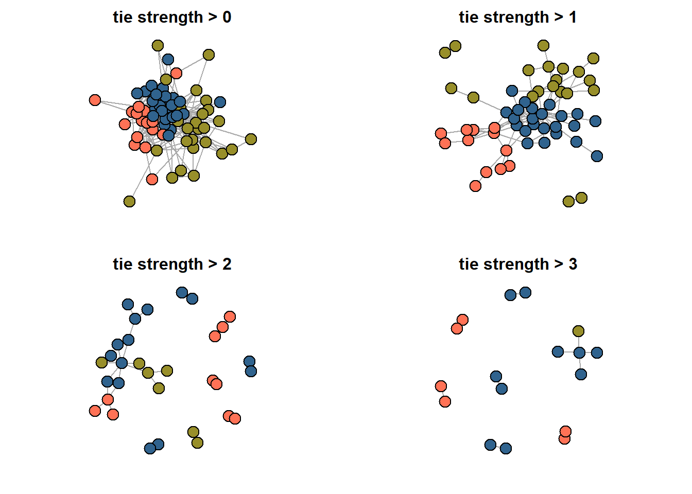


Save data to load in Gephi:


``` r
#mode2 %>% 
#  count(journal_name, unified_name) %>%
#  select(-n) %>% 
#  `colnames<-`(c("Source", "Target")) %>% 
#  write.csv("gephi_edges.csv",
#            row.names = F)

#mode2 %>% 
#  count(journal_name) %>% 
#  mutate(type = "journal") %>% 
#  rename(Id = journal_name) %>% 
  
#  bind_rows(mode2 %>% 
#              count(unified_name) %>%
#              mutate(type = "person") %>% 
#              rename(Id = unified_name)) %>%
#  select(-n) %>% 
#  mutate(name = Id) %>% 
#  write.csv("gephi_nodes.csv",
#            row.names = F)

```


Session info:


``` r
rm(list = ls())
sessionInfo()
#> R version 4.4.3 (2025-02-28 ucrt)
#> Platform: x86_64-w64-mingw32/x64
#> Running under: Windows 10 x64 (build 19045)
#> 
#> Matrix products: default
#> 
#> 
#> locale:
#> [1] LC_COLLATE=Russian_Russia.utf8 
#> [2] LC_CTYPE=Russian_Russia.utf8   
#> [3] LC_MONETARY=Russian_Russia.utf8
#> [4] LC_NUMERIC=C                   
#> [5] LC_TIME=Russian_Russia.utf8    
#> 
#> time zone: Europe/Moscow
#> tzcode source: internal
#> 
#> attached base packages:
#> [1] stats     graphics  grDevices utils     datasets 
#> [6] methods   base     
#> 
#> other attached packages:
#>  [1] data.table_1.17.8   factoextra_1.0.7   
#>  [3] ca_0.71.1           blockmodeling_1.1.8
#>  [5] kableExtra_1.4.0    ggrepel_0.9.6      
#>  [7] tnet_3.0.16         survival_3.8-3     
#>  [9] networkdata_0.2.2   netUtils_0.8.3     
#> [11] manynet_1.6.1       intergraph_2.0-4   
#> [13] igraph_2.1.4        lubridate_1.9.4    
#> [15] forcats_1.0.0       stringr_1.5.1      
#> [17] dplyr_1.1.4         purrr_1.0.4        
#> [19] readr_2.1.5         tidyr_1.3.1        
#> [21] tibble_3.2.1        ggplot2_4.0.0      
#> [23] tidyverse_2.0.0    
#> 
#> loaded via a namespace (and not attached):
#>  [1] gtable_0.3.6          xfun_0.51            
#>  [3] bslib_0.9.0           lattice_0.22-6       
#>  [5] tzdb_0.5.0            vctrs_0.6.5          
#>  [7] tools_4.4.3           generics_0.1.4       
#>  [9] parallel_4.4.3        pkgconfig_2.0.3      
#> [11] Matrix_1.7-2          RColorBrewer_1.1-3   
#> [13] S7_0.2.0              lifecycle_1.0.4      
#> [15] compiler_4.4.3        farver_2.1.2         
#> [17] codetools_0.2-20      htmltools_0.5.8.1    
#> [19] sass_0.4.10           yaml_2.3.10          
#> [21] pillar_1.11.1         jquerylib_0.1.4      
#> [23] cachem_1.1.0          network_1.19.0       
#> [25] tidyselect_1.2.1      digest_0.6.37        
#> [27] stringi_1.8.4         bookdown_0.45        
#> [29] splines_4.4.3         fastmap_1.2.0        
#> [31] grid_4.4.3            cli_3.6.4            
#> [33] magrittr_2.0.3        tidygraph_1.3.1      
#> [35] withr_3.0.2           scales_1.4.0         
#> [37] timechange_0.3.0      rmarkdown_2.30       
#> [39] hms_1.1.3             memoise_2.0.1        
#> [41] coda_0.19-4.1         evaluate_1.0.5       
#> [43] knitr_1.50            viridisLite_0.4.2    
#> [45] rlang_1.1.5           downlit_0.4.4        
#> [47] Rcpp_1.0.14           glue_1.8.0           
#> [49] xml2_1.5.0            svglite_2.1.3        
#> [51] rstudioapi_0.17.1     jsonlite_2.0.0       
#> [53] R6_2.6.1              statnet.common_4.11.0
#> [55] systemfonts_1.3.1     fs_1.6.6
```


## **Home assignment 4** {-}


The goal of this assignment is to analyze the structure and relationships within a two-mode network, understand its properties, and derive meaningful conclusions based on the patterns observed. Choose a dataset you like:


  - [Corporate interlocks in Scotland](https://sites.google.com/site/ucinetsoftware/datasets/corporate-interlocks-in-scotland-1904-5)
  
  
  - [Hollywood film music](https://sites.google.com/site/ucinetsoftware/datasets/hollywood-film-music)


  - data you find/construct by your own (github, google, etc.)


Describe the network: who/what are the nodes? Vizualize it the way you prefer (in R or in Gephi, do not forget about different layouts possible). Select the mode of analysis: choose to work with either two-mode network or one-mode projections. In the second scenario, provide vizualizations of both projections. Discuss whether you want to work with one specific projection or not. Do the analysis you consider relevant: compute centrality measures, search for communities, core/periphery, etc.


Format: word/pdf/html. If you construct your document from R, make sure it is formatted nicely (no long outputs printed, etc.)
Deadline - before your next class.


<!--chapter:end:chapter4.Rmd-->

# (PART\*) **Appendices** {-}


# **Available datasets** {-}


Throughout the course I will do my best to illustrate network-related ideas using various sources of data, e.g. from organizational domains to pupils’ interactions and from well-known and “modal” (typically used in tutorials) to those found in recent academic and non-academic publications and collected by me. Still, for the exam project and 3 out of 4 home assignments which involve programming, you will need to pick a dataset to work with. The list below provides some basic sources of data which you can use for your investigations:


Other highly recommended platforms include GitHub and similar data-sharing sites (see the list below). Many enthusiasts collect and upload network data there, and sometimes these authors also provide accompanying learning materials.


  -	R packages, like ["manynet"](https://cran.r-project.org/web/packages/manynet/manynet.pdf){style="color: #0000EE;"} and, especially, ["networkdata"](https://schochastics.github.io/networkdata/){style="color: #0000EE;"}, assemble many network datasets and provide easy access to them. Be aware that the “networkdata” package can take a while to install, as it includes nearly a thousand datasets. I recommend installing both, as I will sometimes use data from these libraries during practical sessions.


  -	[The UCI Network Data Repository](https://networkdata.ics.uci.edu/index.html){style="color: #0000EE;"} is another wonderful source, where datasets are tagged by their subject and the phenomena they represent. Please note that some files may be in atypical formats, so you might need to convert them into an R-suitable format for your work.


  -	[Datasets](https://sites.google.com/site/ucinetsoftware/datasets){style="color: #0000EE;"} provided by UCINET software developers are in Pajek format (these can be used in R with some manipulation), but you will likely find most of these networks in aforementioned “networkdata” package.


  -	Other highly recommended platforms include github and similar data-sharing sites (see some more in the next list). Many enthusiasts collect and upload network data there, and sometimes these authors also provide accompanying learning materials, e.g. [here](https://github.com/JeffreyAlanSmith/Integrated_Network_Science/tree/master/data){style="color: #0000EE;"}.


Obviously, these sources do not cover the full variety of networks available. Here are some examples of datasets that previous generation of students has found on their own:

  -	[Networks of *Deezer* users in three countries](https://www.kaggle.com/datasets/andreagarritano/deezer-social-networks){style="color: #0000EE;"}, available at kaggle.com
  
  
  -	A [collection](https://dracor.org/rus){style="color: #0000EE;"} of networks based on character interactions in Russian drama literature (similar collections are also available for other languages and literatures).


  -	[Russian-European literature connections of 18 century](https://dataverse.pushdom.ru/dataset.xhtml?persistentId=doi:10.31860/openlit-2023.4-B003){style="color: #0000EE;"}, another literature-related source.


Finally, remember that you can collect data yourself. During the course, I will show you examples of not-too-large datasets collected in seconds using the web-scraping techniques.


<!--chapter:end:appendix-datasets.Rmd-->

# **Intro to web-scraping** {-}


> *<font color="red">work-in-progress*

<!--chapter:end:appendix-scraping.Rmd-->

# **Recommended literature** {-}


Although we have too little time to dive into the literature, you might want (or need) to consult some of the sources from below during the module. First, here are the technical guides which cover the basic concepts:


  -	Rawlings, C. M., Smith, J. A., Moody, J., & McFarland, D. A. (2023). Network analysis: integrating social network theory, method, and application with R. Cambridge University Press.
(on-line supplementary material is available [here](https://inarwhal.github.io/NetworkAnalysisR-book/){style="color: #0000EE;"})


  -	Hanneman R. & Riddle M. (2005) Introduction to Social Network Methods
(on-line book, available [here](https://faculty.ucr.edu/~hanneman/nettext/index.html){style="color: #0000EE;"})


  -	Wasserman, S. & Faust K. (1994) Social network analysis: Methods and applications. The Press Syndicate of the University of Cambridge.


Additionally, the following list is a mixture of theoretical writings and empirical papers primarily from the field of sociology. It is also with some incline towards the sociology of science, as (1) the data on scientific activities is easily available for researchers and (2) I am interested in this subfield personally. When selecting from this list, consider both (1) the domain of inquiry (topics) that interests you and (2) the methods applied. The most exciting works (in my opinion) are marked in **bold**.


The visualization below captures all of these references and citations among them. In the end of the day, we are having a network science course, so why not thinking about the literature from bibliometric perspective. The data comes from [OpenAlex](https://openalex.org/){style="color: #0000EE;"}, and may be biased to some extent. The color of the nodes correspond to the literature sections on this page, and the nodes' size is a number of incoming links ("indegree centrality") as derived for this set of nodes (*81*). There are some isolated nodes, which you may see after zooming out.


```{=html}
<div class="forceNetwork html-widget html-fill-item" id="htmlwidget-30e4409849e39179307f" style="width:672px;height:480px;"></div>
<script type="application/json" data-for="htmlwidget-30e4409849e39179307f">{"x":{"links":{"source":[20,32,34,48,23,38,30,63,26,42,38,31,47,23,37,31,6,71,48,50,34,48,32,8,21,30,2,17,20,58,64,32,27,43,30,48,44,74,26,43,34,48,20,2,48,15,2,48,48,37,30,63,13,18,8,57,45,26,61,2,27,26,19,31,48,43,18,55,37,48,64,32,55,30,4,23,8,2,27,63,51,73,77,48,37,32,48,5,11,31,54,60,6,55,56,37,70,69,70,69,48,18,22,8,31,48,42,26,22,17,74,56,31,55,15,30,6,63,33,8,37,32,48,13,47,42,74,38,77,7,27,18,11,63,23,44,48,58,20,2,5,3,34,8,57,25,48,44,72,38,44,69,32,57,70,68,30,5,23,66,48,28,31,36,75,67,26,18,29,19,48,34,37,43,8,8,43,63,60,46,19,43,31,10,44,48,27,80,8,38,27,3,44,6,30,10,74,48,25,23,80,40,74,22],"target":[64,64,64,64,64,59,59,59,59,59,14,14,14,14,52,52,52,52,52,52,57,57,57,57,57,57,57,57,57,57,4,4,4,4,4,4,4,4,67,67,67,58,58,58,70,11,11,11,2,2,2,2,2,2,2,9,9,9,9,9,9,75,60,60,60,60,60,71,29,5,5,5,5,5,5,5,5,5,5,5,53,53,20,20,20,20,50,50,50,50,50,50,50,50,50,50,28,28,68,68,56,56,56,56,56,25,34,34,54,54,54,54,54,54,54,3,3,3,15,15,26,26,26,0,0,0,0,0,0,0,0,0,0,0,0,0,0,0,0,0,0,0,0,0,0,0,27,27,51,51,7,7,7,7,7,7,7,7,7,7,7,7,7,10,76,76,76,8,8,8,23,23,23,17,17,13,18,6,61,61,61,61,61,62,46,12,12,40,1,1,1,1,1,1,1,1,1,1,1,1,36,36,66,66],"colour":["#666","#666","#666","#666","#666","#666","#666","#666","#666","#666","#666","#666","#666","#666","#666","#666","#666","#666","#666","#666","#666","#666","#666","#666","#666","#666","#666","#666","#666","#666","#666","#666","#666","#666","#666","#666","#666","#666","#666","#666","#666","#666","#666","#666","#666","#666","#666","#666","#666","#666","#666","#666","#666","#666","#666","#666","#666","#666","#666","#666","#666","#666","#666","#666","#666","#666","#666","#666","#666","#666","#666","#666","#666","#666","#666","#666","#666","#666","#666","#666","#666","#666","#666","#666","#666","#666","#666","#666","#666","#666","#666","#666","#666","#666","#666","#666","#666","#666","#666","#666","#666","#666","#666","#666","#666","#666","#666","#666","#666","#666","#666","#666","#666","#666","#666","#666","#666","#666","#666","#666","#666","#666","#666","#666","#666","#666","#666","#666","#666","#666","#666","#666","#666","#666","#666","#666","#666","#666","#666","#666","#666","#666","#666","#666","#666","#666","#666","#666","#666","#666","#666","#666","#666","#666","#666","#666","#666","#666","#666","#666","#666","#666","#666","#666","#666","#666","#666","#666","#666","#666","#666","#666","#666","#666","#666","#666","#666","#666","#666","#666","#666","#666","#666","#666","#666","#666","#666","#666","#666","#666","#666","#666","#666","#666","#666","#666","#666","#666","#666","#666","#666","#666","#666","#666"]},"nodes":{"name":["The Strength of Weak Ties (1973, Mark Granovetter)","Economic Action and Social Structure: The Problem of Embeddedness (1985, Mark Granovetter)","Structural Holes and Good Ideas (2004, Ronald S. Burt)","Collaboration Networks, Structural Holes, and Innovation: A Longitudinal Study (2000, Gautam Ahuja)","Manifesto for a Relational Sociology (1997, Mustafa Emirbayer)","Robust Action and the Rise of the Medici, 1400-1434 (1993, John F. Padgett, Christopher Ansell)","Knowledge Networks as Channels and Conduits: The Effects of Spillovers in the Boston Biotechnology Community (2004, Jason Owen‐Smith, Walter W. Powell)","Social Structure from Multiple Networks. I. Blockmodels of Roles and Positions (1976, Harrison C. White, Scott A. Boorman, Ronald L. Breiger)","Collaboration and Creativity: The Small World Problem (2005, Brian Uzzi, Jarrett Spiro)","Conflict and the Web of Group-Affiliations (1955, Hans A. Illing, Georg Simmel)","What Do Interlocks Do? An Analysis, Critique, and Assessment of Research on Interlocking Directorates (1996, Mark S. Mizruchi)","Networks, Dynamics, and the Small‐World Phenomenon (1999, Duncan J. Watts)","The Diffusion of an Innovation Among Physicians (1957, J. J. Coleman, Elihu Katz, Herbert Menzel)","Team Assembly Mechanisms Determine Collaboration Network Structure and Team Performance (2005, Roger Guimerà, Brian Uzzi, Jarrett Spiro, Luı́s A. Nunes Amaral)","The Development of Social Network Analysis: A Study in the Sociology of Science (2004, Linton C. Freeman)","The Structure of a Social Science Collaboration Network: Disciplinary Cohesion from 1963 to 1999 (2004, James Moody)","A General Theory of Network Governance: Exchange Conditions and Social Mechanisms (1997, Candace Jones, William S. Hesterly, Stephen P. Borgatti)","Chains of Affection: The Structure of Adolescent Romantic and Sexual Networks (2004, Peter Bearman, James Moody, Katherine Stovel)","A Core/Periphery Perspective on Individual Creative Performance: Social Networks and Cinematic Achievements in the Hollywood Film Industry (2008, Gino Cattani, Simone Ferriani)","Basic notions for the analysis of large two-mode networks (2008, Matthieu Latapy, Clémence Magnien, Nathalie Del Vecchio)","How Cultural Tastes Shape Personal Networks (2006, Omar Ližardo)","Why Your Friends Have More Friends Than You Do (1991, Scott L. Feld)","The Academic Caste System: Prestige Hierarchies in PhD Exchange Networks (2004, Val Burris)","Social networks and the study of relations: networks as method, metaphor and form (2006, Hannah Knox, Mike Savage, Penny Harvey)","Why rumors spread so quickly in social networks (2012, Benjamin Doerr, Mahmoud Fouz, Tobias Friedrich)","Weak Ties, Information, and Influence: How Workers Find Jobs in a Local Russian Labor Market (2005, Valery Yakubovich)","Worlds, Fields and Networks: Becker, Bourdieu and the Structures of Social Relations (2011, Wendy Bottero, Nick Crossley)","Formalist and Relationalist Theory in Social Network Analysis (2013, Emily Erikson)","Structural equivalence: Meaning and definition, computation and application (1978, Lee Sailer)","I’d Like to Thank the Academy, Team Spillovers, and Network Centrality (2010, Gabriel Rossman, Nicole Esparza, Phillip Bonacich)","Bringing Agency Back into Network Research: Constrained Agency and Network Action (2014, Ranjay Gulati, Sameer B. Srivastava)","The Development of Social Network Analysis – with an Emphasis on Recent Events (2011, Linton C. Freeman)","Theorizing social networks: the relational sociology of and around Harrison White (2015, Jan Fuhse)","A view from above: The evolving sociological landscape (2006, James Moody, Ryan Light)","The man whose web expanded: Network dynamics in Manchester's post/punk music scene 1976–1980 (2009, Nick Crossley)","An Institutional Approach to Donor Control: From Dyadic Ties to a Field‐Level Analysis (2007, Emily Barman)","Interlocking editorship. A network analysis of the links between economic journals (2010, Alberto Baccini, Lucio Barabesi)","Music as Collective Invention: A Social Network Analysis of Composers (2015, Siobhan McAndrew, Martin G. Everett)","Disconnected, fragmented, or united? a trans-disciplinary review of network science (2016, César A. Hidalgo)","Social Networks can Resolve Actor Paradoxes in Economics and in Psychology (1995, Harrison C. White)","Academic influence and invisible colleges through editorial board interlocking in communication sciences: a social network analysis of leading journals (2020, Manuel Goyanes, Luis de‐Marcos)","Sociometry in the Classroom (1943, J. L. Moreno, Helen Jennings, Richard Stockton)","Networks and Complexity: Directions for Interactionist Research? (2010, Nick Crossley)","Culture, structure, and the market interface: Exploring the networks of stylistic elements and houses in fashion (2018, Frédéric Godart)","The Influence of Simmel on American Sociology Since 1975 (2021, Miloš Broćić, Daniel Silver)","The first web theorist? Georg Simmel and the legacy of ‘The web of group-affiliations’ (2015, Mary Chayko)","Intersectional Individuality: Georg Simmel's Concept of “The Intersection of Social Circles” and the Emancipation of Women (2016, Marcel Stoetzler)","Network Analysis, History of (2015, Philipp Korom)","Georg Simmel’s Contribution to Social Network Research (2021, Betina Hollstein)","Conjugal Roles and Social Networks (1955, Robert M. Milardo)","Centrality in social networks conceptual clarification (1978, Linton C. Freeman)","Fast unfolding of communities in large networks (2008, Vincent D. Blondel, Jean‐Loup Guillaume, Renaud Lambiotte, Etienne Lefebvre)","A Set of Measures of Centrality Based on Betweenness (1977, Linton C. Freeman)","Finding community structure in very large networks (2004, Aaron Clauset, M. E. J. Newman, Cristopher Moore)","Power and Centrality: A Family of Measures (1987, Phillip Bonacich)","Centrality and network flow (2005, Stephen P. Borgatti)","Models of core/periphery structures (2000, Stephen P. Borgatti, Martin G. Everett)","The Focused Organization of Social Ties (1981, Scott L. Feld)","Core Discussion Networks of Americans (1987, Peter V. Marsden)","Brokerage and Closure: An Introduction to Social Capital (2005, Ronald S. Burt)","Network analysis of 2-mode data (1997, Stephen P. Borgatti, Martin G. Everett)","The Duality of Persons and Groups (1974, Ronald L. Breiger)","A Longitudinal Study of the Formation of Interlocking Directorates (1988, Mark S. Mizruchi, Linda Brewster Stearns)","Brokerage as a Process: Decoupling Third Party Action from Social Network Structure (2014, David Obstfeld, Stephen P. Borgatti, Jason Davis)","Between Conversation and Situation: Public Switching Dynamics Across Network-Domains (1998, Ann Mische, Harrison C. White)","Uncloaking Terrorist Networks (2002, Valdis Krebs)","Generalized Exchange (1997, Peter Bearman)","Fields and networks: correspondence analysis and social network analysis in the framework of field theory (2003, Wouter de Nooy)","Roles and Positions: A Critique and Extension of the Blockmodeling Approach (1983, Christopher Winship, Michael Mandel)","Blockmodels: Interpretation and evaluation (1992, Katherine Faust, Stanley Wasserman)","Detecting role equivalence (1990, Ronald S. Burt)","The medieval river trade network of Russia revisited (1978, Forrest R. Pitts)","A Guide for Choosing Community Detection Algorithms in Social Network Studies: The Question Alignment Approach (2020, Natalie Smith, Paul N. Zivich, Leah Frerichs, James Moody, Allison E. Aiello)","Fast unfolding of communities in large networks: 15 years later (2024, Vincent D. Blondel, Jean‐Loup Guillaume, Renaud Lambiotte)","Tribal regimes in academia: a comparative analysis of market structure across disciplines (2003, Shin‐Kap Han)","A literary playground: Literary criticism and balance theory (1999, Wouter de Nooy)","Social networks and classification in literature (1991, Wouter de Nooy)","How Organizational Theory can Help Network Theorizing: Linking Structure and Dynamics via Cross-Level Analogies (2014, Omar Ližardo, Melissa Fletcher Pirkey)","THE WEAKNESS OF STRONG TIES: COLLECTIVE ACTION FAILURE IN A HIGHLY COHESIVE GROUP (1996, Patrick Doreian, Roman Kapuściński, David Krackhardt, Janusz Szczypula)","The Global Network of Liberty: Toward a New Framework for Understanding the History of Political Concepts (2024, Shoufu Yin)","El networking de los editores de las revistas científicas. Análisis de redes entre las 100 principales revistas de sociología / Networking among Scientific Journal Editors. A Network Analysis among the Top 100 Sociology Journals (2021, Julián Cárdenas)"],"group":["network theory & super-influential papers","network theory & super-influential papers","network positions, centrality measures, and its consequences","network positions, centrality measures, and its consequences","network theory & super-influential papers","network theory & super-influential papers","applications of network analysis to various domains & intriguing articles","blockmodeling","topology","history of the field and predecessors","two-mode networks and interlocking","topology","history of the field and predecessors","topology","history of the field and predecessors","applications of network analysis to various domains & intriguing articles","network theory & super-influential papers","applications of network analysis to various domains & intriguing articles","topology","two-mode networks and interlocking","applications of network analysis to various domains & intriguing articles","applications of network analysis to various domains & intriguing articles","applications of network analysis to various domains & intriguing articles","network theory & super-influential papers","applications of network analysis to various domains & intriguing articles","applications of network analysis to various domains & intriguing articles","network theory & super-influential papers","network theory & super-influential papers","blockmodeling","network positions, centrality measures, and its consequences","network theory & super-influential papers","history of the field and predecessors","network theory & super-influential papers","applications of network analysis to various domains & intriguing articles","applications of network analysis to various domains & intriguing articles","applications of network analysis to various domains & intriguing articles","two-mode networks and interlocking","applications of network analysis to various domains & intriguing articles","history of the field and predecessors","network theory & super-influential papers","two-mode networks and interlocking","history of the field and predecessors","network theory & super-influential papers","two-mode networks and interlocking","history of the field and predecessors","history of the field and predecessors","history of the field and predecessors","history of the field and predecessors","history of the field and predecessors","history of the field and predecessors","network positions, centrality measures, and its consequences","topology","network positions, centrality measures, and its consequences","topology","network positions, centrality measures, and its consequences","network positions, centrality measures, and its consequences","topology","network theory & super-influential papers","applications of network analysis to various domains & intriguing articles","network positions, centrality measures, and its consequences","two-mode networks and interlocking","two-mode networks and interlocking","two-mode networks and interlocking","network positions, centrality measures, and its consequences","network theory & super-influential papers","applications of network analysis to various domains & intriguing articles","blockmodeling","two-mode networks and interlocking","blockmodeling","blockmodeling","blockmodeling","applications of network analysis to various domains & intriguing articles","network positions, centrality measures, and its consequences","topology","applications of network analysis to various domains & intriguing articles","applications of network analysis to various domains & intriguing articles","applications of network analysis to various domains & intriguing articles","network theory & super-influential papers","applications of network analysis to various domains & intriguing articles","applications of network analysis to various domains & intriguing articles","two-mode networks and interlocking"],"nodesize":[20,12.82608695652174,9.565217391304348,6.956521739130435,10.21739130434783,12.17391304347826,5.652173913043478,13.47826086956522,6.956521739130435,8.913043478260869,5.652173913043478,6.956521739130435,6.304347826086957,5.652173913043478,7.608695652173913,6.304347826086957,5,6.304347826086957,5.652173913043478,5,7.608695652173913,5,5,6.956521739130435,5,5.652173913043478,6.956521739130435,6.304347826086957,6.304347826086957,5.652173913043478,5,5,5,5,6.304347826086957,5,6.304347826086957,5,5,5,5.652173913043478,5,5,5,5,5,5.652173913043478,5,5,5,11.52173913043478,6.304347826086957,8.913043478260869,6.304347826086957,9.565217391304348,5,8.260869565217391,11.52173913043478,6.956521739130435,8.260869565217391,8.260869565217391,8.260869565217391,5.652173913043478,5,8.260869565217391,5,6.304347826086957,6.956521739130435,6.304347826086957,5,5.652173913043478,5.652173913043478,5,5,5,5.652173913043478,6.956521739130435,5,5,5,5]},"options":{"NodeID":"tooltip","Group":"group","colourScale":"d3.scaleOrdinal(d3.schemeCategory20);","fontSize":16,"fontFamily":"serif","clickTextSize":40,"linkDistance":50,"linkWidth":"1","charge":-15,"opacity":0.8,"zoom":true,"legend":false,"arrows":false,"nodesize":true,"radiusCalculation":"d.nodesize","bounded":false,"opacityNoHover":0,"clickAction":null}},"evals":[],"jsHooks":[]}</script>
```


Social network analysis is widely used in other social sciences. If you need recommendations on literature for your specific interests, feel free to reach out to me during class or via email, and I will do my best to provide you with relevant and essential papers for your research.


## **History of the field and predecessors** {-}


  -	Freeman, L. (2004). The development of social network analysis. A Study in the Sociology of Science, 1(687), 159–167.


  -	Freeman, L. C. (2011). The development of social network analysis–with an emphasis on recent events. The Sage handbook of social network analysis, 21(3), 26-39.


  -	Hidalgo, C. A. (2016). Disconnected, fragmented, or united? A trans-disciplinary review of network science. Applied Network Science, 1(1), 6.


  -	Korom, P. (2015). Network analysis, history of. In International encyclopedia of the social & behavioral sciences (pp. 524-531). Elsevier.


  -	Simmel, G. (1955). Conflict and The web of group-affiliations.


  -	Chayko, M. (2015). The first web theorist? Georg Simmel and the legacy of ‘The web of group-affiliations.’ Information, Communication & Society, 18(12), 1419–1422.
  
  
  - Broćić, M., & Silver, D. (2021). The influence of simmel on American sociology since 1975. Annual Review of Sociology, 47(1), 87-108.
  
  
  -	Hollstein, B. (2021). Georg simmel’s contribution to social network research. Personal networks: Classic readings and New directions in egocentric analysis, 44-59.
  
  
  -	**Stoetzler, M. (2016). Intersectional Individuality: Georg Simmel’s Concept of “The Intersection of Social Circles” and the Emancipation of Women. Sociological Inquiry, 86(2), 216–240.**


  -	Bott, E. (1955). Urban families: Conjugal roles and social networks. Human relations, 8(4), 345-384.


  -	Moreno, J. L., Jennings, H. H., & Stockton, R. (1943). Sociometry in the classroom. Sociometry, 6(4), 425-428.


  -	Coleman, J., Katz, E., & Menzel, H. (1957). The diffusion of an innovation among physicians. Sociometry, 20(4), 253–270.


## **Network theory & super-influential papers** {-}


  -	**Granovetter, M. (1985). Economic Action and Social Structure: The Problem of Embeddedness. American Journal of Sociology, 91(3), 481–510.**


  -	**Granovetter, M. S. (1973). The Strength of Weak Ties. American Journal of Sociology, 78(6), 1360–1380.**


  -	Bottero, W., & Crossley, N. (2011). Worlds, Fields and Networks: Becker, Bourdieu and the Structures of Social Relations. Cultural Sociology, 5(1), 99–119.


  -	Emirbayer, M. (1997). Manifesto for a Relational Sociology. American Journal of Sociology, 103(2), 281–317.


  -	**Erikson, E. (2013). Formalist and Relationalist Theory in Social Network Analysis. Sociological Theory, 31(3), 219–242.**


  -	Fuhse, J. A. (2015). Theorizing social networks: The relational sociology of and around Harrison White. International Review of Sociology, 25(1), 15–44.


  -	Ranjay Gulati, Sameer B. Srivastava, (2014),"Bringing Agency Back into Network Research: Constrained Agency and Network Action", Research in the Sociology of Organizations, Vol. 40 pp. 73-93.


  -	**Knox, H., Savage, M., & Harvey, P. (2006). Social networks and the study of relations: Networks as method, metaphor and form. Economy and Society, 35(1), 113–140.**


  -	**Omar Lizardo, Melissa Fletcher Pirkey, (2014),"How Organizational Theory can Help Network Theorizing: Linking Structure and Dynamics via Cross-Level Analogies", Research in the Sociology of Organizations, Vol. 40 pp. 33-56.**


  -	White, H. C. (1995). Social networks can resolve actor paradoxes in economics and in psychology. Journal of Institutional and Theoretical Economics (JITE)/Zeitschrift Für Die Gesamte Staatswissenschaft, 58–74.
  
  
  - Feld, S. L. (1981). The focused organization of social ties. American journal of sociology, 86(5), 1015-1035.


  -	Mische, A., & White, H. (1998). Between conversation and situation: Public switching dynamics across network domains. Social Research, 695–724.


  -	Crossley, N. (2010). Networks and Complexity: Directions for Interactionist Research? Symbolic Interaction, 33(3), 341–363.


  -	Jones, C., Hesterly, W. S., & Borgatti, S. P. (1997). A General Theory of Network Governance: Exchange Conditions and Social Mechanisms. The Academy of Management Review, 22(4), 911.


-	**Padgett, J. F., & Ansell, C. K. (1993). Robust Action and the Rise of the Medici, 1400-1434. American Journal of Sociology, 98(6), 1259–1319.**


## **Topology** {-}


  -	**Cattani, G., & Ferriani, S. (2008). A Core/Periphery Perspective on Individual Creative Performance: Social Networks and Cinematic Achievements in the Hollywood Film Industry. Organization Science, 19(6), 824–844.**


  -	**Uzzi, B., & Spiro, J. (2005). Collaboration and Creativity: The Small World Problem. American Journal of Sociology, 111(2), 447–504.**


  -	Watts, D. J. (1999). Networks, Dynamics, and the Small‐World Phenomenon. American Journal of Sociology, 105(2), 493–527.


  - Blondel, V. D., Guillaume, J.-L., Lambiotte, R., & Lefebvre, E. (2008). Fast unfolding of communities in large networks. Journal of Statistical Mechanics: Theory and Experiment, 2008(10), P10008.
  

  -	Blondel, V., Guillaume, J. L., & Lambiotte, R. (2024). Fast unfolding of communities in large networks: 15 years later. Journal of Statistical Mechanics: Theory and Experiment, 2024(10), 10R001.


  -	Borgatti, S. P., & Everett, M. G. (2000). Models of core/periphery structures. Social Networks, 21(4), 375–395.


  -	**Guimerà, R., Uzzi, B., Spiro, J., & Amaral, L. A. N. (2005). Team Assembly Mechanisms Determine Collaboration Network Structure and Team Performance. Science, 308(5722), 697–702.**


## **Network positions, centrality measures, and its consequences** {-}


  -	Freeman, L. C. (1977). A set of measures of centrality based on betweenness. Sociometry, 35-41.
  
  
  -	Freeman, L. C. (1978). Centrality in social networks conceptual clarification. Social networks, 1(3), 215-239.
  
  
  -	Bonacich, P. (1987). Power and centrality: A family of measures. American journal of sociology, 92(5), 1170-1182.
  
  
  -	Borgatti, S. P. (2005). Centrality and network flow. Social networks, 27(1), 55-71.


  -	Ahuja, G. (2000). Collaboration Networks, Structural Holes, and Innovation: A Longitudinal Study. Administrative Science Quarterly, 45(3), 425–455.


  -	**Burt, R. S. (2004). Structural Holes and Good Ideas. American Journal of Sociology, 110(2), 349–399.**


  -	Burt, R. S. (2005). Brokerage and closure: An introduction to social capital. Oxford university press.


  -	Rossman, G., Esparza, N., & Bonacich, P. (2010). I’d Like to Thank the Academy, Team Spillovers, and Network Centrality. American Sociological Review, 75(1), 31–51.


  -	David Obstfeld, Stephen P. Borgatti, Jason Davis, (2014),"Brokerage as a Process: Decoupling Third Party Action from Social Network Structure", Research in the Sociology of Organizations, Vol. 40 pp. 135-159
  
  
  -	Smith, N. R., Zivich, P. N., Frerichs, L. M., Moody, J., & Aiello, A. E. (2020). A guide for choosing community detection algorithms in social network studies: The question alignment approach. American journal of preventive medicine, 59(4), 597-605.


## **Two-mode networks and interlocking** {-}


  -	Breiger, R. L. (1974). The duality of persons and groups. Social Forces, 53(2), 181–190.


  -	Baccini, A., & Barabesi, L. (2010). Interlocking editorship. A network analysis of the links between economic journals. Scientometrics, 82(2), 365–389.


  -	Cárdenas, J. (2021). Networking among scientific journal editors. A network analysis among the top 100 sociology journals. Revista Española de Investigaciones Sociológicas (REIS), 175(175), 27–63.


  -	Goyanes, M., & de-Marcos, L. (2020). Academic influence and invisible colleges through editorial board interlocking in communication sciences: A social network analysis of leading journals. Scientometrics, 123(2), 791–811.


  -	**Mizruchi, M. S. (1996). What Do Interlocks Do? An Analysis, Critique, and Assessment of Research on Interlocking Directorates. Annual Review of Sociology, 22(1), 271–298.**


  -	Mizruchi, M. S., & Stearns, L. B. (1988). A longitudinal study of the formation of interlocking directorates. Administrative Science Quarterly, 194–210.


  -	Borgatti, S. P., & Everett, M. G. (1997). Network analysis of 2-mode data. Social networks, 19(3), 243-269.
  
  
  -	Latapy, M., Magnien, C., & Del Vecchio, N. (2008). Basic notions for the analysis of large two-mode networks. Social networks, 30(1), 31-48. 
  
  
  -	De Nooy, W. (2003). Fields and networks: correspondence analysis and social network analysis in the framework of field theory. Poetics, 31(5-6), 305-327. 
  
  
  -	Godart, F. C. (2018). Culture, structure, and the market interface: Exploring the networks of stylistic elements and houses in fashion. Poetics, 68, 72-88.


## **Blockmodeling** {-}

  
  -	White, H. C., Boorman, S. A., & Breiger, R. L. (1976). Social Structure from Multiple Networks. I. Blockmodels of Roles and Positions. American Journal of Sociology, 81(4), 730–780.
  
  
  -	Sailer, L. D. (1978). Structural equivalence: Meaning and definition, computation and application. Social networks, 1(1), 73-90.
  
  
  -	Winship, C., & Mandel, M. (1983). Roles and positions: A critique and extension of the blockmodeling approach. Sociological methodology, 14, 314-344.
  
  
  -	**Burt, R. S. (1990). Detecting role equivalence. Social networks, 12(1), 83-97.**
  
  
  -	Faust, K., & Wasserman, S. (1992). Blockmodels: Interpretation and evaluation. Social networks, 14(1-2), 5-61.
  
  
  -	**Bearman, P. (1997). Generalized exchange. American journal of sociology, 102(5), 1383-1415.**


## **Applications of network analysis to various domains & intriguing articles** {-}


  -	**Burris, V. (2004). The Academic Caste System: Prestige Hierarchies in PhD Exchange Networks. American Sociological Review, 69(2), 239–264.**


  -	Han, S.-K. (2003). Tribal regimes in academia: A comparative analysis of market structure across disciplines. Social Networks, 25(3), 251–280.


  -	**Moody, J. (2004). The Structure of a Social Science Collaboration Network: Disciplinary Cohesion from 1963 to 1999. American Sociological Review, 69(2), 213–238.**


  -	Moody, J., & Light, R. (2006). A view from above: The evolving sociological landscape. The American Sociologist, 37(2), 67–86.


  -	Barman, E. (2007). An Institutional Approach to Donor Control: From Dyadic Ties to a Field‐Level Analysis. American Journal of Sociology, 112(5), 1416–1457.


  -	**Bearman, P. S., Moody, J., & Stovel, K. (2004). Chains of Affection: The Structure of Adolescent Romantic and Sexual Networks. American Journal of Sociology, 110(1), 44–91.**


  -	Crossley, N. (2009). The man whose web expanded: Network dynamics in Manchester’s post/punk music scene 1976–1980. Poetics, 37(1), 24–49.


  -	De Nooy, W. (1991). Social networks and classification in literature. Poetics, 20(5–6), 507–537.
  
  
  -	De Nooy, W. (1999). A literary playground: Literary criticism and balance theory. Poetics, 26(5–6), 385–404.


  -	Doerr, B., Fouz, M., & Friedrich, T. (2012). Why rumors spread so quickly in social networks. Communications of the ACM, 55(6), 70–75.


  -	**Feld, S. L. (1991). Why Your Friends Have More Friends Than You Do. American Journal of Sociology, 96(6), 1464–1477.**


  -	Krebs, V. (2002). Uncloaking terrorist networks. First Monday.


  -	Lizardo, O. (2006). How Cultural Tastes Shape Personal Networks. American Sociological Review, 71(5), 778–807.
  
  
  -	Marsden, P. V. (1987). Core discussion networks of Americans. American Sociological Review, 122–131.
  
  
  -	Pitts, F. R. (1978). The medieval river trade network of Russia revisited. Social Networks, 1(3), 285–292.
  
  
  -	**Yakubovich, V. (2005). Weak Ties, Information, and Influence: How Workers Find Jobs in a Local Russian Labor Market. American Sociological Review, 70(3), 408–421.**


  -	Yin S. (2024). The Global Network of Liberty: Toward a New Framework for Understanding the History of Political Concepts. American Political Science Review. 1-15.


  -	**Owen-Smith, J., & Powell, W. W. (2004). Knowledge Networks as Channels and Conduits: The Effects of Spillovers in the Boston Biotechnology Community. Organization Science, 15(1), 5–21.**
  
  
  -	**McAndrew, S., & Everett, M. (2015). Music as Collective Invention: A Social Network Analysis of Composers. Cultural Sociology, 9(1), 56–80.**


  -	Flache, A., & Macy, M. W. (1996). The weakness of strong ties: Collective action failure in a highly cohesive group. Journal of Mathematical Sociology, 21(1-2), 3-28.


<!--chapter:end:appendix-literature.Rmd-->

